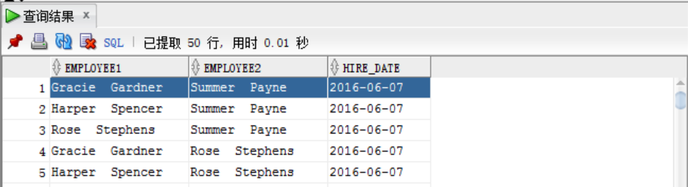

# Oracle

## Oracle准备工作

### 导入Oracle示例数据库

> 需要注意的地方

1、通过sql plus创建用户时，用户名要使用`C##`或`c##`开头，登录连接数据的时候也是，这一点不要忘！


## Oracle表的操作

### 创建表

#### 方式一

在`c##ot`用户中创建一个名称为`persons`的新表

1、创建用户

右键`其它用户`==>创建新用户

2、指定用户创建persons表

```sql
-- oracle 12c写法
CREATE TABLE C##OT.persons(
	-- GENERATED BY DEFAULT AS IDENTITY用于主键自增
    person_id NUMBER GENERATED BY DEFAULT AS IDENTITY,
    first_name VARCHAR2(50) NOT NULL,
    last_name VARCHAR2(50) NOT NULL,
    -- 主键
    PRIMARY KEY(person_id)
);
```


#### 方式二

> 在OT用户下创建newCustomers表，要求该表复制customers表

```sql
-- oracle 12c写法
create table C##OT.newCustomers as (SELECT *  FROM customers);
```


> 在OT用户下创建newCustomers2表，要求该表复制customers表的第1、3列

```sql
create table C##OT.newCustomers2 as (SELECT customer_id, address  FROM customers);
```

 


> 在OT用户下创建newCustomers3表，要求该表复制newCustomers表与persons表中的列

```sql
-- oracle 12c写法
create table C##OT.newcustomers3 as (
    SELECT newcustomers.customer_id, newcustomers.address,
           persons.person_id,persons.last_name
    FROM   C##OT.newcustomers,C##OT.persons
);
```


### 修改表

> 将新列birthdate添加到persons表

```sql
alter table C##OT.persons add brithday DATE not null;
```


> 一次性向persons表中添加多列

```sql
alter table C##OT.persons add
(
    phone varchar(20),
    email varchar(100)
);
```


> 修改birthday属性可以为null

```sql
alter table C##OT.persons MODIFY brithday DATE null;
```


> 同时修改phone、email属性


> 删除persons表中的birthday列

```sql
alter table C##OT.persons drop column brithday;
```


> 删除persons表中的phone、email列

```sql
alter table C##OT.persons drop 
(
    phone,
    email
);
```


> 将persons表first_name重命名为forename

```sql
alter table C##OT.persons rename COLUMN first_name to forename;
```


> 将persons表重命名为people

```sql
alter table C##OT.persons rename to people;
```


### 删除表

> 删除newcustomers3表

```sql
drop table C##OT.newcustomers3;
```


> 级联删除

1、创建表brands

```sql
CREATE TABLE C##OT.brands(
    brand_id NUMBER PRIMARY KEY,
    brand_name varchar2(50)
);
```

2、创建表cars

```sql
CREATE TABLE C##OT.cars(
    car_id NUMBER PRIMARY KEY,
    make VARCHAR(50) NOT NULL,
    model VARCHAR(50) NOT NULL,
    year NUMBER NOT NULL,
    plate_number VARCHAR(25),
    brand_id NUMBER NOT NULL,

    CONSTRAINT fk_brand 
    FOREIGN KEY (brand_id)
    -- 级联删除，如果brands表中删除一行记录，那么cars表中也会删除一条记录
    REFERENCES C##OT.brands(brand_id) ON DELETE CASCADE
);
```

3、查看cars表的所有外键约束

```sql
SELECT
    a.table_name,
    a.column_name,
    a.constraint_name,
    c.owner,
    c.r_owner,
    c_pk.table_name r_table_name,
    c_pk.constraint_name r_pk
FROM
    all_cons_columns a
JOIN all_constraints c ON
    a.owner = c.owner
    AND a.constraint_name = c.constraint_name
JOIN all_constraints c_pk ON
    c.r_owner = c_pk.owner
    AND c.r_constraint_name = c_pk.constraint_name
WHERE
    c.constraint_type = 'R'
    AND a.table_name = 'CARS';
```


4、删除brands表

```sql
-- 不仅删除了brands表，而且还删除了cars表中的外键约束fk_brand
drop table C##OT.brands CASCADE CONSTRAINTS;
```


> purge删除

purge删除表格并且一次释放与之关联的空间，不会将表及其依赖对象放入回收站，不允许回滚或恢复删除的表。

1、使用purge删除cars表

```sql
drop table C##OT.cars PURGE;
```


> 一次性删除多个表

1、创建三个测试表

```sql
CREATE TABLE C##OT.test_1(
    brand_id NUMBER PRIMARY KEY,
    brand_name varchar2(50)
);
CREATE TABLE C##OT.test_2(
    brand_id NUMBER PRIMARY KEY,
    brand_name varchar2(50)
);
CREATE TABLE C##OT.test_3(
    brand_id NUMBER PRIMARY KEY,
    brand_name varchar2(50)
);
```

2、删除以`test_`为开头的表格

```sql
SELECT 'DROP table '||table_name||';'  
FROM all_tables 
WHERE owner='C##OT' and table_name LIKE 'TEST_%';
```


3、复制查询结果，粘贴到查询器后执行

```sql
DROP table C##OT.TEST_1;
DROP table C##OT.TEST_2;
DROP table C##OT.TEST_3;
```


### 删除列

> 准备工作

1、创建表suppliers

```sql
CREATE TABLE C##OT.suppliers (
    supplier_id NUMBER GENERATED BY DEFAULT AS IDENTITY,
    contact_name VARCHAR2(255) NOT NULL,
    company_name VARCHAR2(255),
    phone VARCHAR2(100) NOT NULL,
    email VARCHAR2(255) NOT NULL,
    fax VARCHAR2(100) NOT NULL,
    PRIMARY KEY(supplier_id)
);
```

2、向表中添加几条数据

```sql
INSERT INTO C##OT.suppliers (contact_name,company_name,phone,email,fax)
VALUES ('Solomon F. Zamora',
        'Elit LLP',
        '1-245-616-6781',
        'enim.condimentum@pellentesqueeget.org',
        '1-593-653-6421');


INSERT INTO C##OT.suppliers (contact_name,company_name,phone,email,fax)
VALUES ('Haley Franco',
        'Ante Vivamus Limited',
        '1-754-597-2827',
        'Nunc@ac.com',
        '1-167-362-9592');


INSERT INTO C##OT.suppliers (contact_name,company_name,phone,email,fax)
VALUES ('Gail X. Tyson',
        'Vulputate Velit Eu Inc.',
        '1-331-448-8406',
        'sem@gravidasit.edu',
        '1-886-556-8494');
```


> 逻辑删除表格中的fax列

```sql
alter table C##OT.suppliers set unused column fax;
```

无法再访问fax列


> 物理删除表中所有未使用的列

1、查询未使用的列

```sql
SELECT * FROM DBA_UNUSED_COL_TABS;
```


2、删除所有未使用的列

```sql
alter table C##OT.suppliers drop unused columns;
```


> 使用DROP COLUMN子句删除列

这个在修改表的时候已经记录了！


### 修改列

> 准备工作

1、创建表格accounts

```sql
CREATE TABLE C##OT.accounts (
    account_id NUMBER GENERATED BY DEFAULT AS IDENTITY,
    first_name VARCHAR2(25) NOT NULL,
    last_name VARCHAR2(25) NOT NULL,
    email VARCHAR2(100),
    phone VARCHAR2(12) ,
    -- ||用来连接字符串，GENERATED ALWAYS AS表示创建虚拟列
    full_name VARCHAR2(51) GENERATED ALWAYS AS( 
            first_name || ' ' || last_name
    ),
    PRIMARY KEY(account_id)
);
```

2、插入几条数据

```sql
INSERT INTO C##OT.accounts(first_name,last_name,phone)
VALUES('Trinity',
       'Knox',
       '410-555-0197');


INSERT INTO C##OT.accounts(first_name,last_name,phone)
VALUES('Mellissa',
       'Porter',
       '410-555-0198');


INSERT INTO C##OT.accounts(first_name,last_name,phone)
VALUES('Leeanna',
       'Bowman',
       '410-555-0199');
```

3、查询结果


> 设置full_name列不可见

```sql
alter table C##OT.accounts MODIFY full_name INVISIBLE;
```

查询后发现full_name列不可见，可以通过显示指定查询，也可以恢复可见


> 设置null或not null

```sql
ALTER TABLE accounts MODIFY email VARCHAR2(100) NOT NULL;
```

如果一开始某一行email处为null，但你想设置为not null，那么会报错！


> 扩大或缩短列的大小

```sql
-- 扩大
ALTER TABLE accounts MODIFY phone VARCHAR2(24);
-- 缩小
ALTER TABLE accounts MODIFY phone VARCHAR2(12);
```


> 修改虚拟列

```sql
ALTER TABLE accounts MODIFY full_name VARCHAR2(52) 
GENERATED ALWAYS AS (last_name || ', ' || first_name);
```


> 修改列的默认值

```sql
ALTER TABLE accounts MODIFY status DEFAULT 0;
```

设置后，每次添加数据默认值均为0


### 截断表

#### 单表截断

> 准备工作

1、创建一个名为`customers_copy`的表，并从示例数据库中的`customers`表复制数据

```sql
create table C##OT.customers_copy as (SELECT *  FROM customers);
```


> 删除customers_copy的所有行

```sql
-- 如果表中行数较少，delete效率高
delete table C##OT.customers_copy
-- 使用TRUNCATE TABLE
TRUNCATE TABLE customers_copy;
```


#### 级联截断

> 准备工作

1、创建两个表

```sql
-- 父项
CREATE TABLE C##OT.quotations (
    quotation_no NUMERIC GENERATED BY DEFAULT AS IDENTITY,
    customer_id NUMERIC NOT NULL,
    valid_from DATE NOT NULL,
    valid_to DATE NOT NULL,
    PRIMARY KEY(quotation_no)
);
-- 子项
CREATE TABLE C##OT.quotation_items (
    quotation_no NUMERIC,
    item_no NUMERIC ,
    product_id NUMERIC NOT NULL,
    qty NUMERIC NOT NULL,
    price NUMERIC(9 , 2 ) NOT NULL,
    PRIMARY KEY (quotation_no , item_no),
    CONSTRAINT fk_quotation FOREIGN KEY (quotation_no)
        REFERENCES C##OT.quotations
        ON DELETE CASCADE
);
```

2、插入几条数据

```sql
INSERT INTO C##OT.quotations(customer_id, valid_from, valid_to)
VALUES(100, DATE '2017-09-01', DATE '2017-12-01');

INSERT INTO C##OT.quotation_items(quotation_no, item_no, product_id, qty, price)
VALUES(1,1,1001,10,90.5);

INSERT INTO C##OT.quotation_items(quotation_no, item_no, product_id, qty, price)
VALUES(1,2,1002,20,200.5);

INSERT INTO C##OT.quotation_items(quotation_no, item_no, product_id, qty, price)
VALUES(1,3,1003,30, 150.5);
```


> 级联截断演示

```sql
-- 截断的目标是父项
TRUNCATE table C##OT.quotations CASCADE;
```


### 重命名表

```sql
RENAME table_name TO new_name;
```

当重命名表时，Oracle自动将旧表上的索引，约束和授权转移到新表上。 另外，它使依赖重命名表(原表)的所有对象失效，如视图，存储过程，函数和同义词。


## Oracle数据类型

### NUMBER类型

> 基本语法

```sql
NUMBER[(precision [, scale])]
```

precision精度，表示总位数，范围1~38

scale尺度，表示小数点后的位数，范围-84~127

例如数字1234.56，精度为6，尺度为2，定义为NUMBER(6,2)


> NUMBER类型的别名

| ANSI数据类型 | Oracle NUMBER数据类型 |
| ------------ | --------------------- |
| INT          | NUMBER(38)            |
| SMALLINT     | NUMBER(38)            |
| NUMERIC(p,s) | NUMBER(p,s)           |
| DECIMAL(p,s) | NUMBER(p,s)           |


### FLOAT类型

> 基本语法

```sql
FLOAT(p)
```

p表示FLOAT类型的精度，它是二进制精度，范围1~126，与十进制精度的换算关系为：P(d) = 0.30103 * P(b)

比如float(2)对应的十进制精度为(int)(0.30103*2)=0，即小数点后的精度为0，即去掉小数点后的所有数字

输入93.2，先转成浮点数9.32*10^1，根据float(2)，得到90

输入0.333，先转成浮点数3.33*10^-1，根据float(2)，得到0.3


> FLOAT别名


### CHAR类型

> CHAR类型简介

Oracle `CHAR`数据类型用于存储固定长度的字符串，可以存储`1`到`2000`字节的字符串


> CHAR类型的使用

1、创建一个由`CHAR`列(`x`)和`VARCHAR2`列(`y`)组成的新表`t`。 每列的长度是`10`个字节

```sql
CREATE TABLE t (
    x CHAR(10),
    y VARCHAR2(10)
);
```

2、插入数据

```sql
INSERT INTO t(x, y ) VALUES('Oracle', 'Oracle');
```

3、查看字符串长度

```sql
SELECT LENGTHB(x), LENGTHB(y) FROM t;
```

结果返回 10 和 6 ，这说明使用CHAR类型指定了字节数后，插入字符串后剩余空间会用空格填充，而varchar2是可变长度字符串类型


### NCHAR类型

> NCHAR类型简介

Oracle `NCHAR`数据类型用于存储固定长度的Unicode字符数据。`NCHAR`的字符集只能是`AL16UTF16`或`UTF8`，在数据库创建时指定为国家字符集。


> NCHAR类型语法

```sql
CREATE TABLE nchar_demo (
    description NCHAR(10)
);
```

description列的最大长度是`10`个字符。 对于`NCHAR`列的最大大小，不能使用字节长度！`NCHAR`列的最大字节长度取决于当前的国家字符集，它是当前列最大字符长度和每个字符的最大字节数的乘积。

查询当前的国家字符集

```sql
SELECT
    *
FROM
    nls_database_parameters
WHERE
    PARAMETER = 'NLS_NCHAR_CHARACTERSET';
```

假设是AL16UTF16字符集，那么一个字符占用2个字节，而NCHAR列可以容纳10个字符，因此当前NCHAR列的最大字节长度为20

Oracle将`NCHAR`列的最大长度限制为`2000`字节。


> NCHAR与CHAR的区别

1、`NCHAR`的最大长度只在字符长度语义上，而`CHAR`的最大长度可以是字符长度或字节长度语义
2、`NCHAR`将字符存储在国家默认字符集中，而`CHAR`将字符存储在默认字符集中


### VARCHAR2类型

> VARCHAR2类型简介

`VARCHAR2`列存储可变长度的字符串，创建表时必须指定最大长度，若不显示指定字节/字符，那么默认为字节

Oracle 12c开始，可以为`VARCHAR2`数据类型最大长度为：`32767`。如果`MAX_STRING_SIZE`是`STANDARD`，则`VARCHAR2`的最大大小是`4000`字节。 如果`MAX_STRING_SIZE`为`EXTENDED`，则`VARCHAR2`的大小限制为`32767`。t 

查询`MAX_STRING_SIZE`

```sql
SELECT
    name,
    value
FROM
    v$parameter
WHERE
    name = 'max_string_size';
```


### NVARCHAR2类型

> NVARCHAR2类型简介

`NVARCHAR2`是可以存储Unicode字符的Unicode数据类型，`NVARCHAR2`的字符集是在数据库创建时指定的国家字符集

使用`NVARCHAR2`列创建表时，最大长度始终为字符长度语义

Unicode的作用是给每个字符提供一个统一的编码，每个字符的本质就是二进制，如果不统一，那么可能一个二进制会被解析成多个符号而影响交流！


查找`NVARCHAR2`的字符集

```sql
SELECT
    *
FROM
    nls_database_parameters
WHERE
    PARAMETER = 'NLS_NCHAR_CHARACTERSET';
```


> NVARCHAR2与VARCHAR2的区别

1、`VARCHAR2`的最大大小可以是字节或字符，而`NVARCHAR2`的最大大小只能是字符

2、`NVARCHAR2`的最大字节长度取决于配置的国家字符集

3、`VARCHAR2`列只能将字符存储在默认字符集中，而`NVARCHAR2`则可以存储几乎任何字符


### DATE类型

> DATE类型简介

`DATE`数据类型使用`7`个字节的固定长度的字段，存储世纪，年份，月份，日期，小时数，分钟数和秒数。


> Oracle的日期格式

输入和输出的标准日期格式是`DD-MON-YY`，即日-月-年

显示了`NLS_DATE_FORMAT`参数的当前值：

```sql
SELECT
  value
FROM
  V$NLS_PARAMETERS
WHERE
  parameter = 'NLS_DATE_FORMAT';
```

修改标准日期格式为`YYYY-MM-DD`

```sql
ALTER SESSION SET NLS_DATE_FORMAT = 'YYYY-MM-DD';
```

显示当前系统日期

```sql
SELECT sysdate FROM dual;
```


> TO_CHAR()函数格式化日期

将日期格式化为MM/DD/YYYY的形式

```sql
-- SYSDATE是DATE型变量
SELECT TO_CHAR( SYSDATE, 'MM/DD/YYYY' ) FROM dual;
```

修改表示月份的语言

```sql
ALTER SESSION SET NLS_DATE_LANGUAGE = 'FRENCH';
-- alter session set nls_language='SIMPLIFIED CHINESE';
```


> 将字符串转换为日期

1、查询当前的日期格式，保证与字符串的格式化格式一致

2、将字符串转换为日期

```sql
TO_DATE('2018-10-21', 'YYYY-MM-DD' )
```


> 日期文字

```sql
DATE '2017-08-01'
```


### TIMESTAMP类型

> TIMESTAMP类型简介

`TIMESTAMP`数据类型用于存储日期和时间数据，包括年，月，日，时，分和秒，另外，它存储小数秒。


> TIMESTAMP语法

```sql
column_name TIMESTAMP[(fractional_seconds_precision)]
```

`fractional_seconds_precision`指定`SECOND`字段小数部分的位数。它的范围从`0`到`9`，这意味着可以使用`TIMESTAMP`数据类型来存储到纳秒的精度。如果省略`fractional_seconds_precision`，则默认为`6`。

比如`started_at TMESTAMP(2)`可以精确到毫秒


> TIMESTAMP文字

```txt
TIMESTAMP 'YYYY-MM-DD HH24:MI:SS.FF'
```


> 格式化TIMESTAMP

使用`TO_CHAR()`函数，将`TIMESTAMP`值或列的名称作为第一个参数，将格式字符串作为第二个参数。

```sql
SELECT message,
    TO_CHAR(logged_at, 'MONTH DD, YYYY "at" HH24:MI')
FROM logs;
```


> 提取TIMESTAMP组件

```sql
-- 语法
EXTRACT( component FROM timestamp);
-- 提取年份
EXTRACT(year FROM logged_at);
```


> 默认的TIMESTAMP格式

1、查询当前数据库默认的时间戳格式

```sql
SELECT
  value
FROM
  V$NLS_PARAMETERS
WHERE
  parameter = 'NLS_TIMESTAMP_FORMAT';
```


> 字符串转换为TIMESTAMP值

```sql
INSERT INTO logs(message,logged_at)
VALUES ('Test default Oracle timestamp format',TO_TIMESTAMP('03-AUG-17 11:20:30.45 AM'));
```

时间戳值 - `'03-AUG-17 11:20:30.45 AM'`遵循标准时间戳格式。


### INTERVAL类型

> INTERVAL类型简介

`INTERVAL`数据类型用于存储一段时间。

有两种类型的`INTERVAL`：

- *INTERVAL YEAR TO MONTH* - 间隔使用年份和月份。
- *INTERVAL DAY TO SECOND* - 使用包括小数秒在内的天，小时，分钟和秒存储间隔。

这个用到的时候再仔细看吧。


## Oracle修改数据

### 插入数据

> 语法

```sql
INSERT INTO table_name (column_1, column_2, column_3, ... column_n)
VALUES( value_1, value_2, value_3, ..., value_n);
```


### 选择插入数据

> 语法

```sql
INSERT INTO target_table (col1, col2, col3)
SELECT col1,
       col2,
       col3
FROM source_table
WHERE condition;
```


### 插入多行到多表

> 无条件的Oracle INSERT ALL语句

```sql
INSERT ALL
    INTO table_name1(col1,col2,col3) VALUES(val1,val2, val3)
    INTO table_name2(col1,col2,col3) VALUES(val4,val5, val6)
    INTO table_name3(col1,col2,col3) VALUES(val7,val8, val9)
Subquery;
```

`val1`，`val2`或`val3`必须引用由子查询的选择列表返回的列对应的值。

如果要使用文字值而不是子查询返回的值，请使用以下子查询：

```sql
SELECT * FROM dual;
```


> 有条件的Oracle INSERT ALL语句

```sql
INSERT [ ALL | FIRST ]
    WHEN condition1 THEN
        INTO table_1 (column_list ) VALUES (value_list)
    WHEN condition2 THEN 
        INTO table_2(column_list ) VALUES (value_list)
    ELSE
        INTO table_3(column_list ) VALUES (value_list)
Subquery
```


### 更新表数据

> 语法

```sql
UPDATE
    table_name
SET
    column1 = value1,
    column2 = value2,
    column3 = value3,
    ...
WHERE
    condition;
```


### 删除表数据

> 语法

```sql
DELETE
FROM
    table_name
WHERE
    condition;
```


### 合并数据

> MERGE语句简介

Oracle `MERGE`语句从一个或多个源表中[选择数据](http://www.yiibai.com/oracle/oracle-select.html)并[更新](http://www.yiibai.com/oracle/oracle-update.html)或将其[插入](http://www.yiibai.com/oracle/oracle-insert.html)到目标表中。


> 语法

```sql
MERGE INTO target_table 
USING source_table 
ON search_condition
    WHEN MATCHED THEN
        UPDATE SET col1 = value1, col2 = value2,...
        WHERE <update_condition>
        [DELETE WHERE <delete_condition>]
    WHEN NOT MATCHED THEN
        INSERT (col1,col2,...)
        values(value1,value2,...)
        WHERE <insert_condition>;
```

对于目标表中的每一行，Oracle都会评估搜索条件：

- 如果结果为`true`，则Oracle使用源表(`source_table`)中的相应数据更新该行。
- 如果任何行的结果为`false`，则Oracle将源表(`source_table`)中相应的行插入到目标表(`target_table`)中。


## Oracle查询数据

### SELECT语句

> 语法

```sql
SELECT
  column_1, 
  column_2, 
  ...
FROM
  table_name;
```


### ORDER BY子句

> 语法

```sql
SELECT
    column_1,
    column_2,
    column_3,
    ...
FROM
    table_name
ORDER BY
    column_1 [ASC | DESC] [NULLS FIRST | NULLS LAST],
    column_1 [ASC | DESC] [NULLS FIRST | NULLS LAST],
```

`NULLS FIRST`表示null值在前，非null值在后，`NULLS LAST`也同理！


### Distinct子句

> 基本介绍

在[SELECT](http://www.yiibai.com/oracle/oracle-select.html)语句中使用`DISTINCT`子句来过滤结果集中的重复行。使用`DISTINCT`而不使用`UNIQUE`是一个好的习惯。


> 语法

```sql
SELECT
    DISTINCT column_1,
    column_2,
        ...
FROM
    table_name;
```


### Where子句

> 语法

```sql
SELECT
    column_1,
    column_2,
    ...
FROM
    table_name
WHERE
    search_condition
ORDER BY
    column_1,
    column_2;
```


> 运算符


### And子句

> 语法

`AND`运算符是一个逻辑运算符，它组合了布尔表达式，如果两个表达式都为真，则返回`true`。 如果其中一个表达式为假，则`AND`运算符返回`false`。

```sql
expression_1 AND expression_2
```


### Or子句

> 语法

`OR`运算符是一个逻辑运算符，它组合了布尔表达式，如果其中一个表达式为真(`true`)，则返回`true`。

```sql
expression_1 AND expression_2
```


### Fetch子句

> 简介

Oracle数据库标准中没有`LIMIT`子句。 然而，自`12c`发布以来，它提供了一个类似但更灵活的子句，即行限制子句。


> 语法

```sql
[ OFFSET offset ROWS]
 FETCH  NEXT [  row_count | percent PERCENT  ] ROWS  [ ONLY | WITH TIES ]
```

具体看文档，文档很详细！


### IN字句

> 语法

```sql
-- 匹配值列表
expression [NOT] IN (v1,v2,...)
-- 匹配子查询的返回结果
expression [NOT] IN (subquery)
```


### Between子句

> 语法

```sql
expression [ NOT ] BETWEEN low AND high
```


### Like子句

> 语法

```sql
expresion [NOT] LIKE pattern [ ESCAPE escape_characters ]
```

`ESCAPE`子句允许查找包含一个或多个通配符的字符串。

```sql
-- !%指定%为常规字符，而不是通配符
-- 模糊查询含有子串"25%"的字符串
LIKE '%25!%%' ESCAPE '!'
```


### Group By子句

> 语法

```sql
SELECT
    column_list
FROM
    T
GROUP BY
    c1,
    c2, 
    c3;
```

`GROUP BY`子句出现在`FROM`子句之后。


> GROUP BY带有ROLLUP

```sql
SELECT
    column_list
FROM
    T
GROUP BY
    ROLLUP(c1,c2,c3);
```

官方解释真能害死人，什么叫做一次计算多个分组级别？？？


**下面举个例子理解带有ROLLUP与没有ROLLUP的区别**

1、表格

部门     员工     工资

A       ZHANG   100
A       LI       200
A       WANG   300
A       ZHAO   400
A       DUAN   500
B       DUAN   600
B       DUAN   700

2、查询各个部门中各个员工的工资

SELECT 部门,员工,SUM(工资)AS TOTAL
FROM DEPART
GROUP BY 部门,员工

结果：

A       DUAN   500
B       DUAN   1300
A       LI    200
A       WANG   300
A       ZHANG   100
A       ZHAO   400

3、查询各个部门中各个员工的工资带ROLLUP

SELECT 部门,员工,SUM(工资)AS TOTAL
FROM DEPART
GROUP BY 部门,员工 WITH ROLLUP

结果如下：

A       DUAN    500
A       LI       200
A       WANG   300
A       ZHANG   100
A       ZHAO    400
<font color='red'>A       NULL    1500</font>
B       DUAN    1300
<font color='red'>B       NULL    1300</font>
<font color='red'>NULL    NULL    2800</font>

ROLLUP结果集中多了三条汇总信息：即部门A的合计，部门B的合计以及总合计。其中将部门B中的DUAN合计。

区别计算多了各个部门的合计以及所有部门的合计！


**趁热打铁看看CUBE和它们的区别**

SELECT 部门,员工,SUM(工资)AS TOTAL
FROM DEPART
GROUP BY 部门,员工 WITH CUBE

结果：

A       DUAN   500
A       LI      200
A       WANG   300
A       ZHANG   100
A       ZHAO   400
A       NULL   1500
B       DUAN   1300
B       NULL   1300
NULL  NULL     2800
NULL  DUAN    1800
NULL  LI        200
NULL  WANG    300
NULL  ZHANG    100
NULL  ZHAO     400

CUBE的结果集是在 ROLLUP结果集的基础上多了5行，这5行相当于在ROLLUP结果集上在union 上以员工 为 GROUP BY的结果。


### Having子句

> 语法

```sql
SELECT
    column_list
FROM
    T
GROUP BY
    c1
HAVING
    group_condition;
```

`HAVING`子句过滤分组的行，而`WHERE`子句过滤行。这是`HAVING`和`WHERE`子句之间的主要区别。


### 子查询

> 什么是子查询？

子查询是嵌套在另一个语句(如[SELECT](http://www.yiibai.com/oracle/oracle-select/)，[INSERT](http://www.yiibai.com/oracle/oracle-insert/)，[UPDATE](http://www.yiibai.com/oracle/oracle-update/)或[DELETE](http://www.yiibai.com/oracle/oracle-delete/))中的`SELECT`语句，它提供了一种替代方法来构建更具可读性的查询，而无需使用复杂的联接或联合。

对于Oracle，嵌套在`SELECT`语句的`FROM`子句中的子查询称为[内联视图](http://www.yiibai.com/oracle/inline-view-in-oracle.html)

嵌套在[SELECT](http://www.yiibai.com/oracle/oracle-where.html)语句的`WHERE`子句中的子查询称为嵌套子查询


> 子查询的使用

1、查询最贵产品的详细信息

```sql
SELECT
    product_id,  product_name, list_price
FROM
    products
WHERE
    list_price = (
        SELECT
            MAX( list_price )
        FROM
            products
    );
```

要求子查询必须在括号内部！


### Exists运算符

> 什么是Exists运算符？

Oracle `Exists`运算符是返回`true`或`false`的布尔运算符，`EXISTS`运算符通常与子查询一起使用来测试行的存在

```sql
-- 如果子查询返回一条或多条记录，exists()将返回true，否则返回false
SELECT
    *
FROM
    table_name
    WHERE
        EXISTS(subquery);
```


> Exists运算符的使用

1、查找所有订单的客户

```sql
SELECT
    name
FROM
    customers c
WHERE
    EXISTS (
        SELECT
            1
        FROM
            orders o
        WHERE
            o.customer_id = c.customer_id
    )
ORDER BY
    name;
```

我不明白的是当子查询至少有一条记录时，exists返回true，那么整个sql语句不就变成了

select name from cusomer c where true order by name，这不就是查询所有的客户名称吗？

**先这样记：使用exists后，查找的内容从已存在的行里获取！**


### Not Exists运算符

`NOT EXISTS`运算符与[EXISTS](http://www.yiibai.com/oracle/oracle-exists.html)运算符相反。

```sql
SELECT
    *
FROM
    table_name
WHERE
    NOT EXISTS (subquery);
```


### Any/Some运算符

> 什么是Any/Some运算符？

`ANY`运算符用于将值与子查询返回的值或结果集列表进行比较。

```sql
operator ANY ( v1, v2, v3)
operator ANY ( subquery)
```

在Oracle中，`SOME`和`ANY`的行为完全相同，因此它们完全可以互换。


> Any/Some运算符的使用

```sql
SELECT
    product_name,
    list_price
FROM
    products
WHERE
    list_price = ANY(
        2200,
        2259.99,
        2269.99
    )
    AND category_id = 1;
```


## Oracle连接表

### 内连接

> 什么是内连接？

要从两个或多个相关表中查询数据，使用`INNER JOIN`子句，为了保证查询语句的效率，超过三个表连接慎用。

```sql
-- T1主表，T2从表
SELECT
  *
FROM
  T1
INNER JOIN T2 ON join_condition;
```

它将表`T1`的每一行与表`T2`的行进行比较，以查找满足连接谓词的所有行记录。只要通过匹配非`NULL`值来满足连接谓词，则`T1`和`T2`表的每对匹配行的列值就会被合并到结果集中的一行中。


> 内连接的使用

1、查询所有订单项的订单信息

```sql
SELECT
    *
FROM
    orders
INNER JOIN order_items ON
    order_items.order_id = orders.order_id
ORDER BY
    order_date DESC;
```

2、使用using子句代替on

```sql
SELECT
  *
FROM
  orders
INNER JOIN order_items USING( order_id )
ORDER BY
  order_date DESC;
```


### 左连接

> 什么是左连接？

```sql
SELECT
    column_list
FROM
    T1
LEFT JOIN T2 ON
    join_predicate;
```

在这个查询中，`T1`是左表，`T2`是右表。查询将`T1`表中的每一行与`T2`表中的行进行比较。如果`T1`和`T2`表中的一对行满足连接谓词，查询将组合两个表中行的列值，并将结果行记录包含在结果集中。

如果`T1`表中的行在`T2`表中没有找到匹配的行，则查询将会将[SELECT](http://www.yiibai.com/oracle/oracle-select.html)子句中出现在`T2`表的每个列的值设置为`NULL`并与`T1`表的行记录组合作为结果集输出。

**换句话说，左连接(Left join)返回左表中的所有行，并从右表中返回匹配的行。**


> 左连接的使用

```sql
SELECT
  order_id, 
  status, 
  first_name, 
  last_name
FROM
  orders
LEFT JOIN employees ON employee_id = salesman_id
ORDER BY
  order_date DESC;
```


> 左连接使用using

```sql
SELECT
    column_list
FROM
    T1
LEFT JOIN T2 USING(c1,c2,c3, ...);
```


### 右连接

> 什么是右连接？

```sql
SELECT
    column_list
FROM
    T1
RIGHT OUTER JOIN T2 ON
    join_predicate;
```

`OUTER`关键字是可选的，因此`RIGHT OUTER JOIN`和`RIGHT JOIN`效果是相同的。

`T1`表中的每行都与`T2`表中的行进行比较：

- 如果一对行满足连接谓词，则将两行的列值合并，以生成结果行，然后将其包含在结果集中。
- 如果`T2`表中的一行与`T1`表中的任何一行不匹配，则`T2`表中的行的列值将与`T1`表中的每行的每一列使用`NULL`值组合生成在结果集中。

**换句话说，右外连接返回右表中的所有行，以及左表中的匹配行。**


> 右连接的使用

```sql
SELECT
    first_name,
    last_name,
    order_id,
    status
FROM
    orders
RIGHT JOIN employees ON
    employee_id = salesman_id
WHERE
    job_title = 'Sales Representative'
ORDER BY
    first_name,
    last_name;
```


### 笛卡尔连接

> 什么是笛卡尔连接？

表1有m行n列，表2有p行q列，若表1与表2进行笛卡尔连接将得到一个mp*nq的表，当您想要生成大量的行进行测试时，交叉连接非常有用。


> 笛卡尔连接的使用


生成用于插入`inventories`表的测试数据

```sql
SELECT
    product_id,
    warehouse_id,
    ROUND( dbms_random.value( 10, 100 )) quantity
FROM
    products 
CROSS JOIN warehouses;
```


在此示例中，交叉联接从`products`表和`warehouses`表中创建了`product_id`和`warehouse_id`的笛卡尔乘积。`products`表有`288`行和`warehouses`表有`9`行，因此这些表的交叉连接后返回`2592`行(`288×9`)记录。


### 自连接

> 什么是自连接？

自连接是连接表与自身的连接，它包括内连接和左连接，自连接对比较表中的行或[查询](http://www.yiibai.com/oracle/oracle-select.html)分层数据非常有用。

```sql
-- 内连接也可换成左连接
SELECT
    column_list
FROM
    T t1
INNER JOIN T t2 ON
    join_predicate;
```


> 自连接的使用

1、从`employees`表中检索员工和经理数据


```sql
SELECT
    (e.first_name || '  ' || e.last_name) employee,
    e.job_title,
    (m.first_name || '  ' || m.last_name) manager    
FROM
    employees e
LEFT JOIN employees m ON
    m.employee_id = e.manager_id
ORDER BY
    manager;
```


2、查找所有雇用日期相同(同一天入职)的员工

```sql
SELECT
  (e1.first_name || '  ' || e1.last_name) employee1,
  (e2.first_name || '  ' || e2.last_name) employee2,
  to_char(e1.hire_date, 'YYYY-MM-DD') AS hire_date
FROM
    employees e1
INNER JOIN employees e2 ON
    e1.employee_id <> e2.employee_id
    AND e1.hire_date = e2.hire_date;
```




## Oracle运算符

### All运算符

> 什么是All运算符

Oracle `ALL`操作符用于将值与[子查询](http://www.yiibai.com/oracle/oracle-subquery.html)返回的值列表或结果集进行比较。

```sql
operator ALL ( v1, v2, v3)
operator ALL ( subquery)
```


> All运算符的使用

查找标价大于平均价格列表最大价格的产品

```sql
SELECT
    product_name,
    list_price
FROM
    products
WHERE
    list_price > ALL(
        SELECT
            AVG( list_price )
        FROM
            products
        GROUP BY
            category_id
    )
ORDER BY
    list_price ASC;
```


### Union运算符

> 什么是Union运算符？

`UNION`运算符是一个集合运算符，它将两个或多个[SELECT](http://www.yiibai.com/oracle/oracle-select.html)语句的**无重复结果**到存入结果集，而`UNION ALL`将两个或多个[SELECT](http://www.yiibai.com/oracle/oracle-select.html)语句的**可重复结果**存入结果集。

```sql
SELECT
    column_list_1
FROM
    T1
UNION 
SELECT
    column_list_2
FROM
    T2;
```

`column_list_1`和`column_list_2`必须具有相同顺序的相同列数，对应列的[数据类型](http://www.yiibai.com/oracle/oracle-data-types.html)必须是相同的！


> Union运算符的使用

构建员工和联系人表中的联系人列表

```sql
SELECT
    first_name,
    last_name,
    email,
    'contact'
FROM
    contacts
UNION SELECT
    first_name,
    last_name,
    email,
    'employee'
FROM
    employees;
```

 

查找出所有员工的信息、 查找出所有联系人的信息，然后合并到一张表中！


> Union All运算符的使用

查询所有员工和联系人的姓氏

```sql
SELECT
    last_name
FROM
    employees
UNION ALL SELECT
    last_name
FROM
    contacts
ORDER BY
    last_name;
```


> Union与Join的区别


### Intersect运算符

> 什么是Intersect运算符？

Oracle `INTERSECT`运算符比较两个[查询](http://www.yiibai.com/oracle/oracle-select.html)的结果，并返回两个查询的交集。

```sql
SELECT
    column_list_1
FROM
    T1
INTERSECT 
SELECT
    column_list_2
FROM
    T2;
```

与[UNION](http://www.yiibai.com/oracle/oracle-union.html)运算符相似，使用`INTERSECT`运算符时必须遵循以下规则：

- 两个查询中列的数量和顺序必须相同。
- 相应列的[数据类型](http://www.yiibai.com/oracle/oracle-data-types.html)必须处于相同的数据类型组中，例如数字或字符。


> Intersect运算符的使用

获取在`contacts`和`employees`表中都存在人员的姓氏

```sql
SELECT
    last_name
FROM
    contacts
INTERSECT 
SELECT
    last_name
FROM
    employees
ORDER BY
    last_name;
```


### Minus运算符

> 什么是Minus运算符？

Oracle `MINUS`运算符比较两个查询，并返回第一个查询中但不是第二个查询输出的行， 换句话说，`MINUS`运算符从一个结果集中减去另一个结果集。

```sql
SELECT
    column_list_1
FROM
    T1
MINUS 
SELECT
    column_list_2
FROM
    T2;
```

与[UNION](http://www.yiibai.com/oracle/oracle-union.html)和[INTERSECT](http://www.yiibai.com/oracle/oracle-intersect.html)操作符类似，上面的查询必须符合以下规则：

- 列数和它们的顺序必须匹配一致。
- 相应列的[数据类型](http://www.yiibai.com/oracle/oracle-data-types.html)必须处于相同的数据类型组中，例如数字或字符。


> Minus运算符的使用

从`products`表中返回产品ID的列表，但不存在于`inventories`表中

```sql
SELECT
  product_id
FROM
  products
MINUS
SELECT
  product_id
FROM
  inventories;
```


## Oracle约束

### 主键约束

> 创建由一列组成的主键

1、创建表时指定主键（内联约束）

```sql
CREATE TABLE purchase_orders (
    po_nr NUMBER PRIMARY KEY,
    vendor_id NUMBER NOT NULL,
    po_status NUMBER(1,0) NOT NULL,
    created_at TIMESTAMP WITH TIME ZONE NOT NULL 
);
```

2、创建表时指定主键（表约束）

```sql
CREATE TABLE purchase_orders (
    po_nr NUMBER,
    vendor_id NUMBER NOT NULL,
    po_status NUMBER(1,0) NOT NULL,
    created_at TIMESTAMP WITH TIME ZONE NOT NULL,
    CONSTRAINT pk_purchase_orders PRIMARY KEY(po_nr)
);
```


> 创建由多个列组成的主键

```sql
CREATE TABLE purchase_order_items (
    po_nr NUMBER NOT NULL,
    item_nr NUMBER NOT NULL,
    product_id NUMBER NOT NULL,  
    quantity NUMBER NOT NULL,
    purchase_unit NUMBER NOT NULL,
    buy_price NUMBER (9,2) NOT NULL,
    delivery_date DATE,
    PRIMARY KEY (po_nr, item_nr)
);
```


> 将主键添加到表中

```sql
CREATE TABLE vendors (
    vendor_id NUMBER,
    vendor_name VARCHAR2(255) NOT NULL,
    address VARCHAR2(255) NOT NULL
);

ALTER TABLE vendors 
ADD CONSTRAINT pk_vendors PRIMARY KEY (vendor_id);
```


> 删除主键约束

```sql
-- 方式一
ALTER TABLE vendors
DROP CONSTRAINT pk_vendors;
-- 方式二
ALTER TABLE vendors
DROP PRIMARY KEY;
```


> 禁用主键约束

```sql
-- 方式一
ALTER TABLE purchase_orders
DISABLE CONSTRAINT pk_purchase_orders;
-- 方式二
ALTER TABLE purchase_orders
DISABLE PRIMARY KEY;
```


> 启用主键约束

```sql
-- 方式一
ALTER TABLE purchase_orders
ENABLE CONSTRAINT pk_purchase_orders;
-- 方式二
ALTER TABLE purchase_orders
ENABLE PRIMARY KEY;
```


### 外键约束

> 基本语法

```sql
CREATE TABLE child_table (
    ...
    -- 指定外键名称，可省略
    CONSTRAINT fk_name
    -- 指定外键关联列
    FOREIGN KEY(col1, col2,...) REFERENCES parent_table(col1,col2) 
    ON DELETE [ CASCADE | SET NULL ]
);
```

*ON DELETE CASCADE*：如果父项中的一行被删除，那么子表中所有引用该行的行都将被删除。

*ON DELETE SET NULL*：如果父项中的一行被删除，那么对该外键列的引用该行的子表中的所有行将被设置为`NULL`。


> 外键约束的使用

```sql
-- 创建供应商组
CREATE TABLE supplier_groups(
    group_id NUMBER GENERATED BY DEFAULT AS IDENTITY,
    group_name VARCHAR2(255) NOT NULL,
    PRIMARY KEY (group_id)  
);
-- 创建供应商
CREATE TABLE suppliers (
    supplier_id NUMBER GENERATED BY DEFAULT AS IDENTITY,
    supplier_name VARCHAR2(255) NOT NULL,
    group_id NUMBER NOT NULL,
    PRIMARY KEY(supplier_id),
    FOREIGN KEY(group_id) REFERENCES supplier_groups(group_id)
);
```

供应商组与供应商是一对多的关系，供应商组作为父项，供应商作为子项，在供应商中添加外键约束！


> 将外键约束添加到表中

```sql
ALTER TABLE child_table 
ADD CONSTRAINT fk_name
FOREIGN KEY (col1,col2) REFERENCES child_table (col1,col2);
```


> 删除外键约束

```sql
ALTER TABLE child_table
DROP CONSTRAINT fk_name;
```


> 禁用外键约束

```sql
ALTER TABLE child_table
DISABLE CONSTRAINT fk_name;
```


> 启用外键约束

```sql
ALTER TABLE child_table
ENABLE CONSTRAINT fk_name;
```


### Not Null约束

> 语法

```sql
CREATE TABLE table_name (
    ...
    column_name data_type NOT NULL
    ...
);
```


> 添加Not Null约束

```sql
ALTER TABLE table_name MODIFY ( column_name NOT NULL);
```


> 删除Not Null约束

```sql
ALTER TABLE table_name MODIFY ( column_name NULL);
```


### 唯一约束

> 基本概念

一个唯一的约束是一个完整性约束，它确保存储在一列或一组列中的数据在表中的行之间是唯一的。

```sql
-- 内联约束指定
CREATE TABLE table_name (
    ...
    column_name data_type UNIQUE
    ...
);
-- 外线约束指定
CREATE TABLE table_name (
    ...,
    UNIQUE(column_name)
);
-- constraint指定
CREATE TABLE table_name (
    ...
    column_name data_type CONSTRAINT unique_constraint_name UNIQUE
    ...
);
-- constraint线外约束
CREATE TABLE table_name (
    ...
    column_name data_type,
    ...,
    CONSTRAINT unique_constraint_name UNIQUE(column_name)
);
```


> 指定一组列为唯一约束

```sql
-- constraint线外约束法
CREATE TABLE table_name (
    ...
    column_name1 data_type,
    column_name2 data_type,
    ...,
    CONSTRAINT unique_constraint_name UNIQUE(column_name1, column_name2)
);
```


> 添加唯一约束

```sql
ALTER TABLE table_name
ADD CONSTRAINT unique_constraint_name UNIQUE(column_name1, column_nam2);
```


> 禁用唯一约束

```sql
ALTER TABLE table_name
DISABLE CONSTRAINT unique_constraint_name;
```


> 启用唯一约束

```sql
ALTER TABLE table_name
ENABLE CONSTRAINT unique_constraint_name;
```


> 删除唯一约束

```sql
ALTER TABLE table_name
DROP CONSTRAINT unique_constraint_name;
```


### 检查约束

> 基本概念

要创建一个检查约束，可以定义一个返回`true`或`false`的逻辑表达式。 Oracle使用此表达式来验证正在插入或更新的数据。 如果表达式的计算结果为`true`，则Oracle接受数据并进行插入或更新。 否则，Oracle将拒绝这些数据，新数据根本不会插入或更新。

```sql
-- 行内约束
CREATE TABLE table_name (
    ...
    column_name data_type CHECK (expression),
    ...
);
-- 外联约束
CREATE TABLE table_name (
    ...,
    CONSTRAINT check_constraint_name CHECK (expresssion)
);
```


> 检查约束的使用

```sql
CREATE TABLE parts (
    part_id NUMBER GENERATED BY DEFAULT AS IDENTITY,
    part_name VARCHAR2(255) NOT NULL,
    buy_price NUMBER(9,2) CONSTRAINT check_positive_buy_price CHECK(buy_price > 0),
    PRIMARY KEY(part_id)
);
```


> 添加检查约束

```sql
ALTER TABLE table_name
ADD CONSTRAINT check_constraint_name CHECK(expression);
```


> 删除检查约束

```sql
ALTER TABLE table_name
DROP CONSTRAINT check_constraint_name;
```


> 禁用/启用检查约束

```sql
ALTER TABLE table_name
DISABLE CONSTRAINT check_constraint_name;

ALTER TABLE table_name
ENABLE CONSTRAINT check_constraint_name;
```


