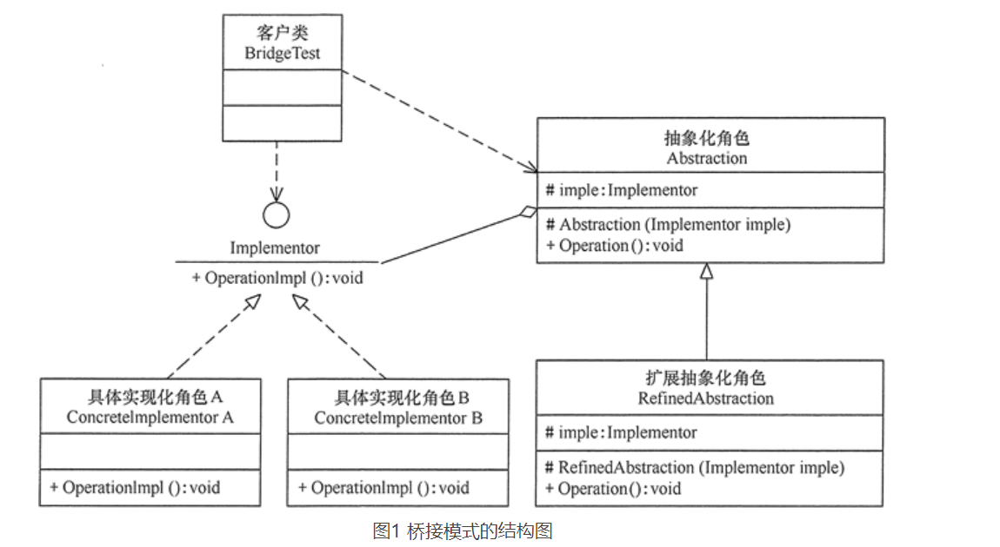
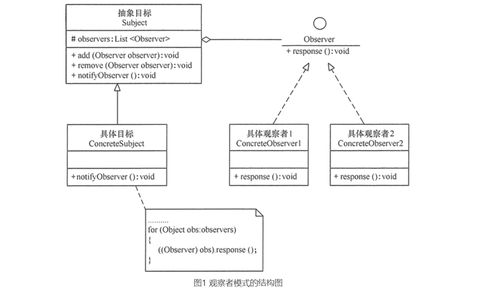

# 设计模式

## 设计模式概述

> 什么是设计模式

软件设计模式（Software Design Pattern），又称设计模式，是一套被反复使用代码设计经验的总结，它是解决特定问题的一系列套路。


> 学习设计模式的意义

1、可以提高程序员的思维能力、编程能力和设计能力。

2、使程序设计更加标准化、代码编制更加工程化，使软件开发效率大大提高，从而**缩短软件的开发周期**。

3、使设计的代码可重用性高、可读性强、可靠性高、灵活性好、可维护性强。


> 设计模式的基本要素

1、**模式名称**：可以根据模式的问题、特点、解决方案、功能和效果来命名。

2、**问题**：描述了该模式的应用环境，即何时使用该模式

3、**解决方案**：包括设计的组成成分、它们之间的相互关系及各自的职责和协作方式。

4、**效果**：描述了模式的应用效果以及使用该模式应该权衡的问题，即模式的优缺点。


> 设计模式的分类


## UML统一建模语言

> UML是什么？

1997 年 UML（Unified Modeling Language） 被国际对象管理组织（OMG）采纳为面向对象的建模语言的国际标准。它的特点是简单、统一、图形化、能表达软件设计中的动态与静态信息。

UML 能为软件开发的所有阶段提供模型化和可视化支持。而且融入了软件工程领域的新思想、新方法和新技术，使软件设计人员沟通更简明，进一步缩短了设计时间，减少开发成本。


> UML的基本构件

对于各个构件的含义，用到的时候再仔细探究，这里只给出宏观结构！

网址：http://c.biancheng.net/view/8373.html


> 应用场景

UML 具有很宽的应用领域。其中最常用的是建立软件系统的模型，但它同样可以用于描述非软件领域的系统，如机械系统、企业机构或业务过程，以及处理复杂数据的信息系统、具有实时要求的工业系统或工业过程等。总之，UML 可以对任何具有静态结构和动态行为的系统进行建模，而且使用于从需求规格描述直至系统完成后的测试和维护等系统开发的各个阶段。


## 面向对象设计原则

### 开闭原则

> 什么是开闭原则？

软件实体应当对扩展开放，对修改关闭，软件实体指的是模块、类与接口或方法，从而提高代码的复用性和可维护性！


> 开闭原则的应用


对于Windows主题，用户可以根据需要选择或者增加新的主题，而不需要修改原代码，所以它是满足开闭原则的。


### 里氏替换原则

> 什么是里氏替换原则？

里氏替换原则通俗来讲就是：子类可以扩展父类的功能，但不能改变父类原有的功能。


> 里氏替换演示

```java
package cn.pikaqiang;

public class LSPtest {
    
    public static void main(String[] args) {
        Bird bird1 = new Swallow();
        Bird bird2 = new BrownKiwi();
        bird1.setSpeed(120);
        bird2.setSpeed(120);
        System.out.println("如果飞行300公里：");
        try {
            System.out.println("燕子将飞行" + bird1.getFlyTime(300) + "小时.");
            System.out.println("几维鸟将飞行" + bird2.getFlyTime(300) + "小时。");
        } catch (Exception err) {
            System.out.println("发生错误了!");
        }
    }
}
//鸟类
class Bird {
    double flySpeed;
    public void setSpeed(double speed) {
        flySpeed = speed;
    }
    public double getFlyTime(double distance) {
        return (distance / flySpeed);
    }
}
//燕子类
class Swallow extends Bird {
}
//几维鸟类
class BrownKiwi extends Bird {
    public void setSpeed(double speed) {
        flySpeed = 0;
    }
}
```


因为BrownKiwi重写了父类的方法，从而违背了LSP原则，导致父类不可用！

解决办法是取消原来的继承关系，定义更加一般的父类，本来几维鸟就不能飞行，但是它可以奔跑，因此可以用动物类作为抽象基类。


### 依赖倒置原则

> 什么是依赖倒置原则？

依赖倒置原则（DIP）的核心思想是：要面向接口编程，降低类间的耦合性，是实现开闭原则的重要途径之一。


> 依赖倒置原则演示

1、顾客购物UML图


2、具体demo

```java
package cn.pikaqiang;

public class DIPtest {
    public static void main(String[] args) {
        Customer wang = new Customer();
        System.out.println("顾客购买以下商品：");
        wang.shopping(new ShaoguanShop());
        wang.shopping(new WuyuanShop());
    }
}
//商店
interface Shop {
    public String sell(); //卖
}
//韶关网店
class ShaoguanShop implements Shop {
    public String sell() {
        return "韶关土特产：香菇、木耳……";
    }
}
//婺源网店
class WuyuanShop implements Shop {
    public String sell() {
        return "婺源土特产：绿茶、酒糟鱼……";
    }
}
//顾客
class Customer {
    public void shopping(Shop shop) {
        //购物
        System.out.println(shop.sell());
    }
}
```


上面代码体现了DIP原则，即面向接口编程，避免了每次都要传入实体类，提高了代码的复用性！


### 单一职责原则

> 什么是单一职责原则？

单一职责原则（Single Responsibility Principle，SRP）又称单一功能原则，规定一个类应该有且仅有一个引起它变化的原因，否则类应该被拆分，通俗来说就是一个类只负责一项职责！


> 单一职责原则的应用


学生工作有这么多，不可能交给一位老师来管理，而是要将工作分类后交个不同的老师，这体现了单一职责原则。

UML分析：完成生活辅导，需要辅导员来完成，因此学生工作与辅导员是依赖关系！


### 接口隔离原则

> 什么是接口隔离原则？

接口隔离原则（Interface Segregation Principle，ISP），要为各个类建立它们需要的专用接口，而不要试图去建立一个很庞大的接口供所有依赖它的类去调用。


> 接口管理原则（ISP）的演示

学生成绩管理程序一般包含插入成绩、删除成绩、修改成绩、计算总分、计算均分、打印成绩信息、査询成绩信息等功能，如果将这些功能全部放到一个接口中显然不太合理，正确的做法是将它们分别放在输入模块、统计模块和打印模块等 3 个模块中，其类图如图 1 所示。


```java
package cn.pikaqiang;

public class ISPtest {
    public static void main(String[] args) {
        InputModule input = StuScoreList.getInputModule();
        CountModule count = StuScoreList.getCountModule();
        PrintModule print = StuScoreList.getPrintModule();
        input.insert();
        count.countTotalScore();
        print.printStuInfo();
        //print.delete();
    }
}
//输入模块接口
interface InputModule {
    void insert();
    void delete();
    void modify();
}
//统计模块接口
interface CountModule {
    void countTotalScore();
    void countAverage();
}
//打印模块接口
interface PrintModule {
    void printStuInfo();
    void queryStuInfo();
}
//实现类
class StuScoreList implements InputModule, CountModule, PrintModule {
    private StuScoreList() {
    }
    public static InputModule getInputModule() {
        return (InputModule) new StuScoreList();
    }
    public static CountModule getCountModule() {
        return (CountModule) new StuScoreList();
    }
    public static PrintModule getPrintModule() {
        return (PrintModule) new StuScoreList();
    }
    public void insert() {
        System.out.println("输入模块的insert()方法被调用！");
    }
    public void delete() {
        System.out.println("输入模块的delete()方法被调用！");
    }
    public void modify() {
        System.out.println("输入模块的modify()方法被调用！");
    }
    public void countTotalScore() {
        System.out.println("统计模块的countTotalScore()方法被调用！");
    }
    public void countAverage() {
        System.out.println("统计模块的countAverage()方法被调用！");
    }
    public void printStuInfo() {
        System.out.println("打印模块的printStuInfo()方法被调用！");
    }
    public void queryStuInfo() {
        System.out.println("打印模块的queryStuInfo()方法被调用！");
    }
}

```


不同的接口负责不同的功能，在实现类中实现所有接口方法，并定义返回接口类的方法，在主方法中直接调用即可！


> ISP与SDP的区别

1、单一职责原则注重的是职责，而接口隔离原则注重的是对接口依赖的隔离。

2、单一职责原则主要是约束类，它针对的是程序中的实现和细节；接口隔离原则主要约束接口，主要针对抽象和程序整体框架的构建。


### 迪米特原则

> 什么是迪米特原则？

迪米特法则（Law of Demeter，LoD）又叫作最少知识原则（Least Knowledge Principle，LKP)，迪米特法则的定义是：只与你的直接朋友交谈，不跟“陌生人”说话（Talk only to your immediate friends and not to strangers）。其含义是：如果两个软件实体无须直接通信，那么就不应当发生直接的相互调用，可以通过第三方转发该调用。其目的是降低类之间的耦合度，提高模块的相对独立性。

迪米特法则中的“朋友”是指：当前对象本身、当前对象的成员对象、当前对象所创建的对象、当前对象的方法参数等，这些对象同当前对象**存在关联、聚合或组合关系**，可以直接访问这些对象的方法。


> 明星与经纪人的实例

分析：明星由于全身心投入艺术，所以许多日常事务由经纪人负责处理，如与粉丝的见面会，与媒体公司的业务洽淡等。这里的经纪人是明星的朋友，而粉丝和媒体公司是陌生人，所以适合使用迪米特法则，其类图如图 1 所示。


```java
package cn.pikaqiang;

public class LoDtest {
    public static void main(String[] args) {
        Agent agent = new Agent();
        agent.setStar(new Star("周杰伦"));
        agent.setFans(new Fans("粉丝1"));
        agent.setCompany(new Company("中国传媒有限公司"));
        agent.meeting();
        agent.business();
    }
}
//经纪人
class Agent {
    private Star myStar;
    private Fans myFans;
    private Company myCompany;
    public void setStar(Star myStar) {
        this.myStar = myStar;
    }
    public void setFans(Fans myFans) {
        this.myFans = myFans;
    }
    public void setCompany(Company myCompany) {
        this.myCompany = myCompany;
    }
    public void meeting() {
        System.out.println(myFans.getName() + "与明星" + myStar.getName() + "见面了。");
    }
    public void business() {
        System.out.println(myCompany.getName() + "与明星" + myStar.getName() + "洽淡业务。");
    }
}
//明星
class Star {
    private String name;
    Star(String name) {
        this.name = name;
    }
    public String getName() {
        return name;
    }
}
//粉丝
class Fans {
    private String name;
    Fans(String name) {
        this.name = name;
    }
    public String getName() {
        return name;
    }
}
//媒体公司
class Company {
    private String name;
    Company(String name) {
        this.name = name;
    }
    public String getName() {
        return name;
    }
}
```


> 迪米特原则的优缺点

优点

1. 降低了类之间的耦合度，提高了模块的相对独立性。
2. 由于亲合度降低，从而提高了类的可复用率和系统的扩展性。

缺点

1. 过度使用迪米特法则会使系统产生大量的中介类，从而增加系统的复杂性，使模块之间的通信效率降低。


### 合成复用原则

> 什么是合成复用原则？

合成复用原则（Composite Reuse Principle，CRP）又叫组合/聚合复用原则（Composition/Aggregate Reuse Principle，CARP），它要求在软件复用时，要尽量先使用组合或者聚合等关联关系来实现，其次才考虑使用继承关系来实现。


> 合成复用原则的实现方法

通过将已有的对象纳入新对象中，作为新对象的成员对象来实现的，新对象可以调用已有对象的功能，从而达到复用。


> 汽车分类管理程序

汽车按“动力源”划分可分为汽油汽车、电动汽车等；按“颜色”划分可分为白色汽车、黑色汽车和红色汽车等。如果同时考虑这两种分类，其组合就很多。图 1 所示是用继承关系实现的汽车分类的类图。


从图 1 可以看出用继承关系实现会产生很多子类，而且增加新的“动力源”或者增加新的“颜色”都要修改源代码，这违背了开闭原则，显然不可取。但如果改用组合关系实现就能很好地解决以上问题，其类图如图 2 所示。


这样如果想增加新能源，那么和汽车的演示无关，若要增加颜色，也不会影响到汽车！


> 继承复用与合成复用的区别

1、继承复用破坏了类的封装性，父类对于子类是透明的，而合成复用没有破坏类的封装性


### 七大设计原则总结

| 设计原则     | 一句话归纳                                                   | 目的                                       |
| ------------ | ------------------------------------------------------------ | ------------------------------------------ |
| 开闭原则     | 对扩展开放，对修改关闭                                       | 降低维护带来的新风险                       |
| 依赖倒置原则 | 高层不应该依赖低层，要面向接口编程                           | 更利于代码结构的升级扩展                   |
| 单一职责原则 | 一个类只干一件事，实现类要单一                               | 便于理解，提高代码的可读性                 |
| 接口隔离原则 | 一个接口只干一件事，接口要精简单一                           | 功能解耦，高聚合、低耦合                   |
| 迪米特法则   | 不该知道的不要知道，一个类应该保持对其它对象最少的了解，降低耦合度 | 只和朋友交流，不和陌生人说话，减少代码臃肿 |
| 里氏替换原则 | 不要破坏继承体系，子类重写方法功能发生改变，不应该影响父类方法的含义 | 防止继承泛滥                               |
| 合成复用原则 | 尽量使用组合或者聚合关系实现代码复用，少使用继承             | 降低代码耦合                               |


## 设计模式

### 创建型模式

> 什么是创建型模式？

创建型模式的主要关注点是“怎样创建对象？”，它的主要特点是“将对象的创建与使用分离”。


#### 单例模式

> 什么是单例模式？

指一个类只有一个实例，且该类能自行创建这个实例的一种模式。


> 单例模式演示

1、单例模式结构图


2、单例模式的实现

> 懒汉式单例演示

```java
public class LazySingleton {
    private static volatile LazySingleton instance = null;    //保证 instance 在所有线程中同步
    private LazySingleton() {
    }    //private 避免类在外部被实例化
    public static synchronized LazySingleton getInstance() {
        //getInstance 方法前加同步
        if (instance == null) {
            instance = new LazySingleton();
        }
        return instance;
    }
}
```

类加载时没有生成单例，只有当第一次调用 getlnstance 方法时才去创建这个单例。

> 饿汉式单例演示

```java
public class HungrySingleton {
    private static final HungrySingleton instance = new HungrySingleton();
    private HungrySingleton() {
    }
    public static HungrySingleton getInstance() {
        return instance;
    }
}
```

类一旦加载就创建一个单例，保证在调用 getInstance 方法之前单例已经存在了，是线程安全的！


> 单例模式的应用

计算机系统中：

Windows 的回收站、操作系统中的文件系统、多线程中的线程池、显卡的驱动程序对象、打印机的后台处理服务、应用程序的日志对象、数据库的连接池、网站的计数器、Web 应用的配置对象、应用程序中的对话框、系统中的缓存等常常被设计成单例。

现实生活中：

公司 CEO、部门经理等都属于单例模型


> 单例模式的扩展

单例模式可扩展为有限的多例（Multitcm）模式，这种模式可生成有限个实例并保存在 ArrayList 中，客户需要时可随机获取，其结构图如图 5 所示。


#### 原型模式

> 什么是原型模式？

用一个已经创建的实例作为原型，通过复制该原型对象来创建一个和原型相同或相似的新对象。


> 原型模式的结构

原型模式包含以下主要角色。

1、抽象原型类：规定了具体原型对象必须实现的接口。

2、具体原型类：实现抽象原型类的 clone() 方法，它是可被复制的对象。

3、访问类：使用具体原型类中的 clone() 方法来复制新的对象。


> 原型模式的实现

**浅克隆**：复制对象时仅仅复制对象本身，包括基本属性，但该对象的属性引用其他对象时，该引用对象不会被复制，即拷贝出来的对象与被拷贝出来的对象中的属性引用的对象是同一个。

**深克隆**：复制对象本身的同时，也复制对象包含的引用指向的对象，即修改被克隆对象的任何属性都不会影响到克隆出来的对象，要求每一层的类都有克隆方法。

**浅克隆实现**

```java
package cn.pikaqiang;

//具体原型类
class Realizetype implements Cloneable {
    Realizetype() {
        System.out.println("具体原型创建成功！");
    }
    public Object clone() throws CloneNotSupportedException {
        System.out.println("具体原型复制成功！");
        return (Realizetype) super.clone();
    }
}

//原型模式的测试类
public class PrototypeTest {
    public static void main(String[] args) throws CloneNotSupportedException {
        Realizetype obj1 = new Realizetype();
        Realizetype obj2 = (Realizetype) obj1.clone();
        Realizetype obj3 = (Realizetype) obj1.clone();
        System.out.println("obj1==obj2?" + (obj1 == obj2));
    }
}
```

 

**深克隆实现**

```java
package cn.pikaqiang;

class Student implements Cloneable{
    private String name;
    private Achievement achievement; //成绩

    public Student(String name, Achievement achievement) {
        this.name = name;
        this.achievement = achievement;
    }

    public void setName(String name) {
        this.name = name;
    }

    public void setAchievement(Achievement achievement) {
        this.achievement = achievement;
    }

    public Achievement getAchievement() {
        return achievement;
    }

    @Override
    public String toString() {
        return "Student{" +
                "name='" + name + '\'' +
                ", achievement=" + achievement +
                '}';
    }
	// 深克隆的关键！
    @Override
    protected Student clone() throws CloneNotSupportedException {
        Student student = (Student) super.clone();
        Achievement achievement = student.getAchievement().clone();
        student.setAchievement(achievement);
        return student;
    }
}

/**
 * 成绩类
 */
class Achievement implements Cloneable{
    private float Chinese;
    private float math;
    private float English;

    public Achievement(float chinese, float math, float english) {
        Chinese = chinese;
        this.math = math;
        English = english;
    }

    public void setChinese(float chinese) {
        Chinese = chinese;
    }

    public void setMath(float math) {
        this.math = math;
    }

    public void setEnglish(float english) {
        English = english;
    }

    @Override
    public String toString() {
        return "Achievement{" +
                "Chinese=" + Chinese +
                ", math=" + math +
                ", English=" + English +
                '}';
    }

    @Override
    protected Achievement clone() throws CloneNotSupportedException {
        return (Achievement) super.clone();
    }
}


public class PrototypeTest {

    public static void main(String[] args) throws CloneNotSupportedException {
        Achievement achievement = new Achievement(100,100,100);
        Student student = new Student("LiLei",achievement);
        // 克隆出一个对象
        Student newStudent = student.clone();

        // 修改原有对象的属性
        student.setName("HanMeimei");
        student.getAchievement().setChinese(90);
        student.getAchievement().setEnglish(90);
        student.getAchievement().setMath(90);

        System.out.println(newStudent);
        System.out.println(student);
    }
}
```


可以发现，要想实现深克隆，有两点需要注意

1、待克隆的类及该类中的**属性引用类**都需要实现clone方法！

2、待克隆类的clone方法中实际上还是多次浅克隆，将克隆后的结果合并到一个对象中！


> 使用原型模式生成相似的对象

用原型模式生成“三好学生”奖状，同一学校，对于奖状，只有名字不同


```java
package cn.pikaqiang;

public class PrototypeTest {
    public static void main(String[] args) throws CloneNotSupportedException {
        citation obj1 = new citation("张三", "同学：在2016学年第一学期中表现优秀，被评为三好学生。", "韶关学院");
        obj1.display();
        citation obj2 = (citation) obj1.clone();
        obj2.setName("李四");
        obj2.display();
    }
}
//奖状类
class citation implements Cloneable {
    String name;
    String info;
    String college;
    citation(String name, String info, String college) {
        this.name = name;
        this.info = info;
        this.college = college;
        System.out.println("奖状创建成功！");
    }
    void setName(String name) {
        this.name = name;
    }
    String getName() {
        return (this.name);
    }
    void display() {
        System.out.println(name + info + college);
    }
    public Object clone() throws CloneNotSupportedException {
        System.out.println("奖状拷贝成功！");
        return (citation) super.clone();
    }
}
```


这样可以根据学校的不同、信息的不同以及名字的不同来设计不同的奖状，从而增强了程序的健壮性！


> 浅克隆与深克隆的区别

浅克隆不会复制对象中引用其它对象的属性，只会复制当前引用对象对应的地址值，因此修改原对象引用对象属性，导致克隆的对象也会跟着变，而深克隆不会，它和原对象是完全独立的！


> 原型模式的扩展

原型模式可扩展为带原型管理器的原型模式，它在原型模式的基础上增加了一个原型管理器 PrototypeManager 类。


> 原型管理器演示

用带原型管理器的原型模式来生成包含“圆”和“正方形”等图形的原型，并计算其面积。


```java
package cn.pikaqiang;

import java.util.*;

interface Shape extends Cloneable {
    public Object clone();    //拷贝
    public void countArea();    //计算面积
}
class Circle implements Shape {
    public Object clone() {
        Circle w = null;
        try {
            w = (Circle) super.clone();
        } catch (CloneNotSupportedException e) {
            System.out.println("拷贝圆失败!");
        }
        return w;
    }
    public void countArea() {
        int r = 0;
        System.out.print("这是一个圆，请输入圆的半径：");
        Scanner input = new Scanner(System.in);
        r = input.nextInt();
        System.out.println("该圆的面积=" + 3.1415 * r * r + "\n");
    }
}
class Square implements Shape {
    public Object clone() {
        Square b = null;
        try {
            b = (Square) super.clone();
        } catch (CloneNotSupportedException e) {
            System.out.println("拷贝正方形失败!");
        }
        return b;
    }
    public void countArea() {
        int a = 0;
        System.out.print("这是一个正方形，请输入它的边长：");
        Scanner input = new Scanner(System.in);
        a = input.nextInt();
        System.out.println("该正方形的面积=" + a * a + "\n");
    }
}
class ProtoTypeManager {
    private HashMap<String, Shape> ht = new HashMap<String, Shape>();
    public ProtoTypeManager() {
        ht.put("Circle", new Circle());
        ht.put("Square", new Square());
    }
    public void addshape(String key, Shape obj) {
        ht.put(key, obj);
    }
    public Shape getShape(String key) {
        Shape temp = ht.get(key);
        return (Shape) temp.clone();
    }
}
public class PrototypeTest {
    public static void main(String[] args) {
        ProtoTypeManager pm = new ProtoTypeManager();
        Shape obj1 = (Circle) pm.getShape("Circle");
        obj1.countArea();
        Shape obj2 = (Shape) pm.getShape("Square");
        obj2.countArea();
    }
}
```


#### 简单工厂模式

> 什么是简单工厂模式？

简单工厂模式（Simple Factory Pattern）又叫作静态工厂方法模式（Static Factory Method Pattern），它有一个具体的工厂类，可以生成多个不同的产品，每增加一个产品就要去修改代码，违背了开闭原则！


> 简单工厂模式的结构与实现


```java
public class Client {
    public static void main(String[] args) {
    }

    //抽象产品
    public interface Product {
        void show();
    }

    //具体产品：ProductA
    static class ConcreteProduct1 implements Product {
        public void show() {
            System.out.println("具体产品1显示...");
        }
    }

    //具体产品：ProductB
    static class ConcreteProduct2 implements Product {
        public void show() {
            System.out.println("具体产品2显示...");
        }
    }

    final class Const {
        static final int PRODUCT_A = 0;
        static final int PRODUCT_B = 1;
        static final int PRODUCT_C = 2;
    }

    static class SimpleFactory {
        public static Product makeProduct(int kind) {
            switch (kind) {
                case Const.PRODUCT_A:
                    return new ConcreteProduct1();
                case Const.PRODUCT_B:
                    return new ConcreteProduct2();
            }
            return null;
        }
    }
}
```

简单工厂模式中创建实例的方法通常为静态（static）方法！


> 应用场景

对于产品种类相对较少的情况，考虑使用简单工厂模式！


#### 工厂方法模式

> 什么是工厂方法模式？

工厂方法模式是对简单工厂模式的进一步抽象化，其好处是可以使系统在不修改原来代码的情况下引进新的产品，即满足开闭原则，一个工厂对应一个产品。


> 工厂方法模式的结构与实现


```java
package cn.pikaqiang;

import java.lang.reflect.Constructor;

public class PrototypeTest {
    public static void main(String[] args) throws Exception{
        // 这里练练反射
        Constructor constructor = BaomaFactory.class.getConstructor();
        constructor.setAccessible(true);
        BaomaFactory baomaFactory = (BaomaFactory) constructor.newInstance(null);
        baomaFactory.createCar().run();
    }
}
// 抽象产品
interface Car {
    void run();
}

// 具体产品1
class Baoma implements Car{

    @Override
    public void run() {
        System.out.println("宝马在奔跑");
    }
}
// 具体产品2
class Benci implements Car{

    @Override
    public void run() {
        System.out.println("奔驰在奔跑");
    }
}

// 抽象工厂
interface AbstractFactory {
    public Car createCar();
}

// 具体工厂1
class BaomaFactory implements AbstractFactory {

    public BaomaFactory(){}

    @Override
    public Car createCar() {
        return new Baoma();
    }
}

// 具体工厂2
class BenciFactory implements AbstractFactory {

    @Override
    public Car createCar() {
        return new Benci();
    }
}
```


> 应用场景

1、客户只知道创建产品的工厂名，而不知道具体的产品名。如 TCL 电视工厂、海信电视工厂等。


#### 抽象工厂模式

> 什么是抽象工厂模式？

抽象工厂模式是工厂方法模式的升级版本，工厂方法模式只生产一个等级的产品，而抽象工厂模式可生产多个等级的产品。比如下图


> 抽象工厂模式的结构与实现


```java
// 抽象工厂
interface AbstractFactory {
    public Product1 newProduct1();
    public Product2 newProduct2();
}
// 具体工厂
class ConcreteFactory1 implements AbstractFactory {
    public Product1 newProduct1() {
        System.out.println("具体工厂 1 生成-->具体产品 11...");
        return new ConcreteProduct11();
    }
    public Product2 newProduct2() {
        System.out.println("具体工厂 1 生成-->具体产品 21...");
        return new ConcreteProduct21();
    }
}
```


> 什么时候使用抽象工厂模式？

1、系统中有多个产品族，每个具体工厂创建同一族但属于不同等级结构的产品。

2、系统一次只可能消费其中某一族产品，即同族的产品一起使用。


> 应用场景

1、当需要创建的对象是一系列相互关联或相互依赖的产品族时，如电器工厂中的电视机、洗衣机、空调等。


#### 构建者模式

> 什么是构建者模式？

建造者（Builder）模式，它将一个复杂的对象分解为多个简单的对象，然后一步一步构建而成，比如计算机可以由cpu、内存、主板、硬盘、显卡、显示器等等组装而成。


> 模式的结构与实现


(1) 产品角色：包含多个组成部件的复杂对象。

```java
class Product {
    private String partA;
    private String partB;
    private String partC;
    public void setPartA(String partA) {
        this.partA = partA;
    }
    public void setPartB(String partB) {
        this.partB = partB;
    }
    public void setPartC(String partC) {
        this.partC = partC;
    }
    public void show() {
        //显示产品的特性
    }
}
```

(2) 抽象建造者：包含创建产品各个子部件的抽象方法。

```java
abstract class Builder {
    //创建产品对象
    protected Product product = new Product();
    public abstract void buildPartA();
    public abstract void buildPartB();
    public abstract void buildPartC();
    //返回产品对象
    public Product getResult() {
        return product;
    }
}
```

(3) 具体建造者：实现了抽象建造者接口。

```java
public class ConcreteBuilder extends Builder {
    public void buildPartA() {
        product.setPartA("建造 PartA");
    }
    public void buildPartB() {
        product.setPartB("建造 PartB");
    }
    public void buildPartC() {
        product.setPartC("建造 PartC");
    }
}
```

(4) 指挥者：调用建造者中的方法完成复杂对象的创建。

```java
class Director {
    private Builder builder;
    public Director(Builder builder) {
        this.builder = builder;
    }
    //产品构建与组装方法
    public Product construct() {
        builder.buildPartA();
        builder.buildPartB();
        builder.buildPartC();
        return builder.getResult();
    }
}
```

(5) 客户类。

```java
public class Client {
    public static void main(String[] args) {
        Builder builder = new ConcreteBuilder();
        Director director = new Director(builder);
        Product product = director.construct();
        product.show();
    }
}
```


> 构建者模式与工厂模式

1、建造者模式注重零部件的组装过程，而[工厂方法模式](http://c.biancheng.net/view/1348.html)更注重零部件的创建过程，但两者可以结合使用。

2、建造者模式更加注重方法的调用顺序，工厂模式注重创建对象。


### 结构型模式

> 什么是结构型模式？

结构型模式描述如何将类或对象按某种布局组成更大的结构。它分为类结构型模式和对象结构型模式，前者采用继承机制来组织接口和类，后者釆用组合或聚合来组合对象。


#### 代理模式

> 什么是代理模式？

在有些情况下，一个客户不能或者不想直接访问另一个对象，这时需要找一个中介帮忙完成某项任务，这个中介就是代理对象。


> 代理模式的结构与实现？


```java
// 静态代理实现
package proxy;

public class ProxyTest {
    public static void
        main(String[] args) {
        Proxy proxy = new Proxy();
        proxy.Request();
    }
}
//抽象主题
interface Subject {
    void Request();
}
//真实主题
class RealSubject implements Subject {
    public void Request() {
        System.out.println("访问真实主题方法...");
    }
}
//代理
class Proxy implements Subject {
    private RealSubject realSubject;
    public void Request() {
        if (realSubject == null) {
            realSubject = new RealSubject();
        }
        preRequest();
        realSubject.Request();
        postRequest();
    }
    public void preRequest() {
        System.out.println("访问真实主题之前的预处理。");
    }
    public void postRequest() {
        System.out.println("访问真实主题之后的后续处理。");
    }
}
```


> 应用场景

1、代理服务器，它是个人网络与Internet服务商的中间代理

2、明星与经纪人的活动安排

3、Spring AOP的实现


#### 适配器模式

> 什么是适配器模式？

适配器模式（Adapter）将一个类的接口转换成客户希望的另外一个接口，使得原本由于接口不兼容而不能一起工作的那些类能一起工作。例如，讲中文的人同讲英文的人对话时需要一个翻译。


> 模式的结构与实现


```java
package adapter;
//目标接口
interface Target
{
    public void request();
}
//适配者接口
class Adaptee
{
    public void specificRequest()
    {       
        System.out.println("适配者中的业务代码被调用！");
    }
}
//类适配器类
class ClassAdapter extends Adaptee implements Target
{
    public void request()
    {
        specificRequest();
    }
}
//客户端代码
public class ClassAdapterTest
{
    public static void main(String[] args)
    {
        System.out.println("类适配器模式测试：");
        Target target = new ClassAdapter();
        target.request();
    }
}
```


```java
package adapter;
//对象适配器类
class ObjectAdapter implements Target
{
    private Adaptee adaptee;
    public ObjectAdapter(Adaptee adaptee)
    {
        this.adaptee=adaptee;
    }
    public void request()
    {
        adaptee.specificRequest();
    }
}
//客户端代码
public class ObjectAdapterTest
{
    public static void main(String[] args)
    {
        System.out.println("对象适配器模式测试：");
        Adaptee adaptee = new Adaptee();
        Target target = new ObjectAdapter(adaptee);
        target.request();
    }
}
```


> 双向适配器


```java
package adapter;
//目标接口
interface TwoWayTarget
{
    public void request();
}
//适配者接口
interface TwoWayAdaptee
{
    public void specificRequest();
}
//目标实现
class TargetRealize implements TwoWayTarget
{
    public void request()
    {       
        System.out.println("目标代码被调用！");
    }
}
//适配者实现
class AdapteeRealize implements TwoWayAdaptee
{
    public void specificRequest()
    {       
        System.out.println("适配者代码被调用！");
    }
}
//双向适配器
class TwoWayAdapter  implements TwoWayTarget,TwoWayAdaptee
{
    private TwoWayTarget target;
    private TwoWayAdaptee adaptee;
    public TwoWayAdapter(TwoWayTarget target)
    {
        this.target=target;
    }
    public TwoWayAdapter(TwoWayAdaptee adaptee)
    {
        this.adaptee=adaptee;
    }
    public void request()
    {
        adaptee.specificRequest();
    }
    public void specificRequest()
    {       
        target.request();
    }
}
//客户端代码
public class TwoWayAdapterTest
{
    public static void main(String[] args)
    {
        System.out.println("目标通过双向适配器访问适配者：");
        TwoWayAdaptee adaptee=new AdapteeRealize();
        TwoWayTarget target=new TwoWayAdapter(adaptee);
        target.request();
        System.out.println("-------------------");
        System.out.println("适配者通过双向适配器访问目标：");
        target=new TargetRealize();
        adaptee=new TwoWayAdapter(target);
        adaptee.specificRequest();
    }
}
```

对于双向适配器，它实现了目标接口和适配器接口，构造器根据参数类型可以构造目标对象或适配者对象，对应的由适配者或目标对象接收，从而实现了目标对象访问适配者、适配者访问目标对象！


> 应用场景

1、以前开发的系统存在满足新系统功能需求的类，但其接口同新系统的接口不一致。

2、使用第三方提供的组件，但组件接口定义和自己要求的接口定义不同。


#### 桥接模式

> 什么是桥接模式？

桥接（Bridge）模式的定义如下：将抽象与实现分离，使它们可以独立变化。它是用组合关系代替继承关系来实现，从而降低了抽象和实现这两个可变维度的耦合度。


> 桥接模式的结构与实现



将抽象与实现分离，比如抽象化角色表示面板，接口表示颜色，我可以定义不同的具体颜色类，而面板中只需有一个颜色接口就能使用所有的颜色，这就是抽象与接口分离！

```java
package bridge;
public class BridgeTest {
    public static void main(String[] args) {
        Implementor imple = new ConcreteImplementorA();
        Abstraction abs = new RefinedAbstraction(imple);
        abs.Operation();
    }
}
//实现化角色
interface Implementor {
    public void OperationImpl();
}
//具体实现化角色
class ConcreteImplementorA implements Implementor {
    public void OperationImpl() {
        System.out.println("具体实现化(Concrete Implementor)角色被访问");
    }
}
//抽象化角色
abstract class Abstraction {
    protected Implementor imple;
    protected Abstraction(Implementor imple) {
        this.imple = imple;
    }
    public abstract void Operation();
}
//扩展抽象化角色
class RefinedAbstraction extends Abstraction {
    protected RefinedAbstraction(Implementor imple) {
        super(imple);
    }
    public void Operation() {
        System.out.println("扩展抽象化(Refined Abstraction)角色被访问");
        imple.OperationImpl();
    }
}
```


> 应用场景

当一个类内部具备两种或多种变化维度时，使用桥接模式可以解耦这些变化的维度，如不同颜色和字体的文字、不同品牌和功率的汽车、不同性别和职业的男女、支持不同平台和不同文件格式的媒体播放器等。


> 桥接模式的扩展

当桥接（Bridge）模式的实现化角色的接口与现有类的接口不一致时，可以在二者中间定义一个适配器将二者连接起来


在客户端可以通过imple来接收适配器对象，既可以访问具体的实现化角色，也可以访问适配者！


#### 装饰器模式

> 什么是装饰器模式？

指在不改变现有对象结构的情况下，动态地给该对象增加一些额外功能的模式。


> 装饰器模式结果与实现


```java
package decorator;
public class DecoratorPattern {
    public static void main(String[] args) {
        Component p = new ConcreteComponent();
        p.operation();
        System.out.println("---------------------------------");
        Component d = new ConcreteDecorator(p);
        d.operation();
    }
}
//抽象构件角色
interface Component {
    public void operation();
}
//具体构件角色
class ConcreteComponent implements Component {
    public ConcreteComponent() {
        System.out.println("创建具体构件角色");
    }
    public void operation() {
        System.out.println("调用具体构件角色的方法operation()");
    }
}
//抽象装饰角色
class Decorator implements Component {
    private Component component;
    public Decorator(Component component) {
        this.component = component;
    }
    public void operation() {
        component.operation();
    }
}
//具体装饰角色
class ConcreteDecorator extends Decorator {
    public ConcreteDecorator(Component component) {
        super(component);
    }
    public void operation() {
        super.operation();
        addedFunction();
    }
    public void addedFunction() {
        System.out.println("为具体构件角色增加额外的功能addedFunction()");
    }
}
```

```java
创建具体构件角色
调用具体构件角色的方法operation()
---------------------------------
调用具体构件角色的方法operation()
为具体构件角色增加额外的功能addedFunction()
```

使用聚合/组合关系来创建一个包装对象（即装饰对象）来包裹真实对象，并在保持真实对象的类结构不变的前提下，为其提供额外的功能，这就是装饰器模式的目标。


> 应用场景

装饰器模式在 [Java](http://c.biancheng.net/java/) 语言中的最著名的应用莫过于 Java I/O 标准库的设计了。例如，InputStream 的子类 FilterInputStream，OutputStream 的子类 FilterOutputStream，Reader 的子类 BufferedReader 以及 FilterReader，还有 Writer 的子类 BufferedWriter、FilterWriter 以及 PrintWriter 等，它们都是抽象装饰类。


> 装饰器与代理模式的区别

1、仅仅从字面上理解，装饰器就是为了增强对象的行为，而代理模式是为了代理对象，帮助对象完成一些功能。比如经纪人是明星的代理，帮助明星安排演唱会、公司谈判等，但我们不能说经纪人是明星的装饰。

2、装饰之后，依然是原来接口来接收具体类，从而执行增强后的行为，但是代理之后，是有代理对象来执行行为。


#### 外观模式

> 什么是外观模式？

外观（Facade）模式又叫作门面模式，是一种通过为多个复杂的子系统提供一个一致的接口，而使这些子系统更加容易被访问的模式。

它是迪米特法则的典型应用，你可以将这个统一接口看作''经纪人''，这些子系统与"经纪人"是朋友关系，而调用子系统的任何客户只和''经纪人''打交道！


> 外观模式的结构与实现


```java
package facade;
public class FacadePattern {
    public static void main(String[] args) {
        Facade f = new Facade();
        f.method();
    }
}
//外观角色
class Facade {
    private SubSystem01 obj1 = new SubSystem01();
    private SubSystem02 obj2 = new SubSystem02();
    private SubSystem03 obj3 = new SubSystem03();
    public void method() {
        obj1.method1();
        obj2.method2();
        obj3.method3();
    }
}
//子系统角色
class SubSystem01 {
    public void method1() {
        System.out.println("子系统01的method1()被调用！");
    }
}
//子系统角色
class SubSystem02 {
    public void method2() {
        System.out.println("子系统02的method2()被调用！");
    }
}
//子系统角色
class SubSystem03 {
    public void method3() {
        System.out.println("子系统03的method3()被调用！");
    }
}
```

程序运行结果如下：

```txt
子系统01的method1()被调用！
子系统02的method2()被调用！
子系统03的method3()被调用！
```


> 应用场景

当客户端与多个子系统之间存在很大的联系时，引入外观模式将这多个子系统整合到一起，让后对客户端只提供接口。


> 外观模式扩展

在外观模式中，当增加或移除子系统时需要修改外观类，这违背了“开闭原则”。如果引入抽象外观类，则在一定程度上解决了该问题，如下图所示：


#### 享元模式

> 什么是享元模式？

享元（Flyweight）模式的定义：运用**共享技术**来有效地支持大量**细粒度对象**的复用。它通过共享已经存在的对象来大幅度减少需要创建的对象数量、避免大量相似类的开销，从而提高系统资源的利用率。

细粒度对象意思就是将业务模型对象进行合适的划分，划分后的对象数量多且功能相近。


> 享元模式的内部结构与实现

享元模式的内部状态和外部状态。

- 内部状态指对象共享出来的信息，存储在享元信息内部，并且不回随环境的改变而改变；
- 外部状态指对象得以依赖的一个标记，随环境的改变而改变，不可共享。

比如，连接池中的连接对象，保存在连接对象中的用户名、密码、连接URL等信息，在创建对象的时候就设置好了，不会随环境的改变而改变，这些为内部状态。而当每个连接要被回收利用时，我们需要将它标记为可用状态，这些为外部状态。


```java
public class FlyweightPattern {
    public static void main(String[] args) {
        FlyweightFactory factory = new FlyweightFactory();
        Flyweight f01 = factory.getFlyweight("a");
        Flyweight f02 = factory.getFlyweight("a");
        Flyweight f03 = factory.getFlyweight("a");
        Flyweight f11 = factory.getFlyweight("b");
        Flyweight f12 = factory.getFlyweight("b");
        f01.operation(new UnsharedConcreteFlyweight("第1次调用a。"));
        f02.operation(new UnsharedConcreteFlyweight("第2次调用a。"));
        f03.operation(new UnsharedConcreteFlyweight("第3次调用a。"));
        f11.operation(new UnsharedConcreteFlyweight("第1次调用b。"));
        f12.operation(new UnsharedConcreteFlyweight("第2次调用b。"));
    }
}
//非享元角色
class UnsharedConcreteFlyweight {
    private String info;
    UnsharedConcreteFlyweight(String info) {
        this.info = info;
    }
    public String getInfo() {
        return info;
    }
    public void setInfo(String info) {
        this.info = info;
    }
}
//抽象享元角色
interface Flyweight {
    public void operation(UnsharedConcreteFlyweight state);
}
//具体享元角色
class ConcreteFlyweight implements Flyweight {
    private String key;
    ConcreteFlyweight(String key) {
        this.key = key;
        System.out.println("具体享元" + key + "被创建！");
    }
    public void operation(UnsharedConcreteFlyweight outState) {
        System.out.print("具体享元" + key + "被调用，");
        System.out.println("非享元信息是:" + outState.getInfo());
    }
}
//享元工厂角色
class FlyweightFactory {
    private HashMap<String, Flyweight> flyweights = new HashMap<String, Flyweight>();
    public Flyweight getFlyweight(String key) {
        Flyweight flyweight = (Flyweight) flyweights.get(key);
        if (flyweight != null) {
            System.out.println("具体享元" + key + "已经存在，被成功获取！");
        } else {
            flyweight = new ConcreteFlyweight(key);
            flyweights.put(key, flyweight);
        }
        return flyweight;
    }
}
```

程序运行结果如下：

```
具体享元a被创建！
具体享元a已经存在，被成功获取！
具体享元a已经存在，被成功获取！
具体享元b被创建！
具体享元b已经存在，被成功获取！
具体享元a被调用，非享元信息是:第1次调用a。
具体享元a被调用，非享元信息是:第2次调用a。
具体享元a被调用，非享元信息是:第3次调用a。
具体享元b被调用，非享元信息是:第1次调用b。
具体享元b被调用，非享元信息是:第2次调用b。
```

将非享元部分抽取成一个类，将它作为参数传递到共享的部分中，比如上面代码中，你可以在具体享元角色的operation方法参数传入不同的非享元类，从而实现不同的功能！


> 享元模式与工厂模式

享元模式其实是[工厂方法模式](http://c.biancheng.net/view/1348.html)的一个改进机制，享元模式同样要求创建一个或一组对象，并且就是通过工厂方法模式生成对象的，只不过享元模式为工厂方法模式增加了缓存这一功能。


#### 组合模式

> 什么是组合模式？

组合（Composite Pattern）模式，又叫作整体-部分（Part-Whole）模式，它是一种将对象组合成树状的层次结构的模式


> 组合模式的结构

1、透明方式

抽象构件声明了所有子类中的全部方法，树叶构件和数字构件需要实现全部的方法，这样对客户端来说是透明的，但是树叶构件不需要add、remove、getChild方法，但是要必须实现，这样就带来了一些安全性问题。


2、安全方式

在该方式中，将管理子构件的方法移到树枝构件中，树叶构件与树枝构件分别实现不同的接口，客户端调用时要知道树叶对象与树枝对象，这样就失去了透明性


> 组合模式的实现

假如要访问集合 c0={leaf1,{leaf2,leaf3}} 中的元素，其对应的树状图如图 3 所示。


**透明方式实现**

```java
public class CompositePattern {
    public static void main(String[] args) {
        Component c0 = new Composite();
        Component c1 = new Composite();
        Component leaf1 = new Leaf("1");
        Component leaf2 = new Leaf("2");
        Component leaf3 = new Leaf("3");
        c0.add(leaf1);
        c0.add(c1);
        c1.add(leaf2);
        c1.add(leaf3);
        c0.operation();
    }
}
//抽象构件
interface Component {
    public void add(Component c);
    public void remove(Component c);
    public Component getChild(int i);
    public void operation();
}
//树叶构件
class Leaf implements Component {
    private String name;
    public Leaf(String name) {
        this.name = name;
    }
    public void add(Component c) {
    }
    public void remove(Component c) {
    }
    public Component getChild(int i) {
        return null;
    }
    public void operation() {
        System.out.println("树叶" + name + "：被访问！");
    }
}
//树枝构件
class Composite implements Component {
    private ArrayList<Component> children = new ArrayList<Component>();
    public void add(Component c) {
        children.add(c);
    }
    public void remove(Component c) {
        children.remove(c);
    }
    public Component getChild(int i) {
        return children.get(i);
    }
    public void operation() {
        for (Object obj : children) {
            ((Component) obj).operation();
        }
}
```

程序运行结果如下：

```txt
树叶1：被访问！
树叶2：被访问！
树叶3：被访问！
```


**安全模式实现**

首先修改 Component 代码，只保留层次的公共行为。

```java
interface Component {
    public void operation();
}
```

然后修改客户端代码，将树枝构件类型更改为 Composite 类型，以便获取管理子类操作的方法。

```java
public class CompositePattern {
    public static void main(String[] args) {
        Composite c0 = new Composite();
        Composite c1 = new Composite();
        Component leaf1 = new Leaf("1");
        Component leaf2 = new Leaf("2");
        Component leaf3 = new Leaf("3");
        c0.add(leaf1);
        c0.add(c1);
        c1.add(leaf2);
        c1.add(leaf3);
        c0.operation();
    }
}
```


> 应用场景

1、在需要表示一个**对象整体与部分的层次结构**的场合。

2、要求对用户隐藏组合对象与单个对象的不同，用户可以用统一的接口使用组合结构中的所有对象的场合。


### 行为型模式

> 什么是行为型模式？

行为型模式就是来描述多个类或对象之间是如何相互协作来完成单个对象无法完成的任务的。它分为类行为模式和对象行为模式，前者依赖于继承，后者依赖于聚合或组合关系，满足合成复用原则。


#### 模板方法模式

> 什么是模板方法模式？

模板方法（Template Method）模式就是把不变部分的算法封装到父类中实现，把可变部分算法由子类继承实现，它是一种类行为模式。


> 模板方法模式的使用


```java
public class TemplateMethodPattern {
    public static void main(String[] args) {
        AbstractClass tm = new ConcreteClass();
        tm.TemplateMethod();
    }
}
//抽象类
abstract class AbstractClass {
    //模板方法
    public void TemplateMethod() {
        SpecificMethod();
        abstractMethod1();
        abstractMethod2();
    }
    //具体方法
    public void SpecificMethod() {
        System.out.println("抽象类中的具体方法被调用...");
    }
    //抽象方法1
    public abstract void abstractMethod1();
    //抽象方法2
    public abstract void abstractMethod2();
}
//具体子类
class ConcreteClass extends AbstractClass {
    public void abstractMethod1() {
        System.out.println("抽象方法1的实现被调用...");
    }
    public void abstractMethod2() {
        System.out.println("抽象方法2的实现被调用...");
    }
}
```

程序的运行结果如下：

```txt
抽象类中的具体方法被调用...
抽象方法1的实现被调用...
抽象方法2的实现被调用...
```


> 扩展

模板方法模式中，基本方法包含：抽象方法、具体方法和钩子方法，正确使用“钩子方法”可以使得子类控制父类的行为。


```java
public class HookTemplateMethod {
    public static void main(String[] args) {
        HookAbstractClass tm = new HookConcreteClass();
        tm.TemplateMethod();
    }
}
//含钩子方法的抽象类
abstract class HookAbstractClass {
    //模板方法
    public void TemplateMethod() {
        abstractMethod1();
        HookMethod1();
        if (HookMethod2()) {
            SpecificMethod();
        }
        abstractMethod2();
    }
    //具体方法
    public void SpecificMethod() {
        System.out.println("抽象类中的具体方法被调用...");
    }
    //钩子方法1---空方法
    public void HookMethod1() {
    }
    //钩子方法2---逻辑判断
    public boolean HookMethod2() {
        return true;
    }
    //抽象方法1
    public abstract void abstractMethod1();
    //抽象方法2
    public abstract void abstractMethod2();
}
//含钩子方法的具体子类
class HookConcreteClass extends HookAbstractClass {
    public void abstractMethod1() {
        System.out.println("抽象方法1的实现被调用...");
    }
    public void abstractMethod2() {
        System.out.println("抽象方法2的实现被调用...");
    }
    public void HookMethod1() {
        System.out.println("钩子方法1被重写...");
    }
    public boolean HookMethod2() {
        return false;
    }
}
```

程序的运行结果如下：

```txt
抽象方法1的实现被调用...
钩子方法1被重写...
抽象方法2的实现被调用...
```


> 应用场景

算法的整体步骤很固定，但其中个别部分易变时，使用模板方法模式，将容易变的部分抽象出来，供子类实现。


#### 策略模式

> 什么是策略模式？

策略模式（Strategy）属于对象行为模式，它通过对算法进行封装，根据客户端的需求可以相互替换。


> 策略模式的使用


```java
public class StrategyPattern {
    public static void main(String[] args) {
        Context c = new Context();
        Strategy s = new ConcreteStrategyA();
        c.setStrategy(s);
        c.strategyMethod();
        System.out.println("-----------------");
        s = new ConcreteStrategyB();
        c.setStrategy(s);
        c.strategyMethod();
    }
}
//抽象策略类
interface Strategy {
    public void strategyMethod();    //策略方法
}
//具体策略类A
class ConcreteStrategyA implements Strategy {
    public void strategyMethod() {
        System.out.println("具体策略A的策略方法被访问！");
    }
}
//具体策略类B
class ConcreteStrategyB implements Strategy {
    public void strategyMethod() {
        System.out.println("具体策略B的策略方法被访问！");
    }
}
//环境类
class Context {
    private Strategy strategy;
    public Strategy getStrategy() {
        return strategy;
    }
    public void setStrategy(Strategy strategy) {
        this.strategy = strategy;
    }
    public void strategyMethod() {
        strategy.strategyMethod();
    }
}
```

程序运行结果如下：

```txt
具体策略A的策略方法被访问！
-----------------
具体策略B的策略方法被访问！
```


> 应用场景

1、java se的容器布局管理


> 扩展

当存在的策略很多时，在环境类中使用策略工厂模式来管理这些策略类


#### 命令模式

> 什么是命令模式？

命令（Command）模式将方法的请求者与实现者解耦，比如遥控器发起切换频道的请求，电视机处理换台功能。遥控器相当于命令发送者，按钮是具体命令，电视机是命令接收者。


> 命令模式的使用


```java
package command;
public class CommandPattern {
    public static void main(String[] args) {
        Command cmd = new ConcreteCommand();
        Invoker ir = new Invoker(cmd);
        System.out.println("客户访问调用者的call()方法...");
        ir.call();
    }
}
//调用者
class Invoker {
    private Command command;
    public Invoker(Command command) {
        this.command = command;
    }
    public void setCommand(Command command) {
        this.command = command;
    }
    public void call() {
        System.out.println("调用者执行命令command...");
        command.execute();
    }
}
//抽象命令
interface Command {
    public abstract void execute();
}
//具体命令
class ConcreteCommand implements Command {
    private Receiver receiver;
    ConcreteCommand() {
        receiver = new Receiver();
    }
    public void execute() {
        receiver.action();
    }
}
//接收者
class Receiver {
    public void action() {
        System.out.println("接收者的action()方法被调用...");
    }
}
```

程序的运行结果如下：

```txt
客户访问调用者的call()方法...
调用者执行命令command...
接收者的action()方法被调用...
```


> 应用场景

1、请求调用者需要与请求接收者解耦时，命令模式可以使调用者和接收者不直接交互。


> 扩展

将命令模式与前面学的组合模式联合使用，这就构成了宏命令模式，执行它时将递归调用它所包含的所有命令。


```java
package command;
import java.util.ArrayList;
public class CompositeCommandPattern {
    public static void main(String[] args) {
        AbstractCommand cmd1 = new ConcreteCommand1();
        AbstractCommand cmd2 = new ConcreteCommand2();
        CompositeInvoker ir = new CompositeInvoker();
        ir.add(cmd1);
        ir.add(cmd2);
        System.out.println("客户访问调用者的execute()方法...");
        ir.execute();
    }
}
//抽象命令
interface AbstractCommand {
    public abstract void execute();
}
//树叶构件: 具体命令1
class ConcreteCommand1 implements AbstractCommand {
    private CompositeReceiver receiver;
    ConcreteCommand1() {
        receiver = new CompositeReceiver();
    }
    public void execute() {
        receiver.action1();
    }
}
//树叶构件: 具体命令2
class ConcreteCommand2 implements AbstractCommand {
    private CompositeReceiver receiver;
    ConcreteCommand2() {
        receiver = new CompositeReceiver();
    }
    public void execute() {
        receiver.action2();
    }
}
//树枝构件: 调用者
class CompositeInvoker implements AbstractCommand {
    private ArrayList<AbstractCommand> children = new ArrayList<AbstractCommand>();
    public void add(AbstractCommand c) {
        children.add(c);
    }
    public void remove(AbstractCommand c) {
        children.remove(c);
    }
    public AbstractCommand getChild(int i) {
        return children.get(i);
    }
    public void execute() {
        for (Object obj : children) {
            ((AbstractCommand) obj).execute();
        }
    }
}
//接收者
class CompositeReceiver {
    public void action1() {
        System.out.println("接收者的action1()方法被调用...");
    }
    public void action2() {
        System.out.println("接收者的action2()方法被调用...");
    }
}
```

程序的运行结果如下：

```txt
客户访问调用者的execute()方法...
接收者的action1()方法被调用...
接收者的action2()方法被调用...
```


#### 责任链模式

> 什么是责任链模式？

责任链（Chain of Responsibility）模式指的是客户只需要将请求发送到责任链上即可，请求会自动进行传递，从而实现请求的发送者和请求的处理者解耦。


> 责任链模式的使用


```java
package chainOfResponsibility;
public class ChainOfResponsibilityPattern {
    public static void main(String[] args) {
        //组装责任链
        Handler handler1 = new ConcreteHandler1();
        Handler handler2 = new ConcreteHandler2();
        handler1.setNext(handler2);
        //提交请求
        handler1.handleRequest("two");
    }
}
//抽象处理者角色
abstract class Handler {
    private Handler next;
    public void setNext(Handler next) {
        this.next = next;
    }
    public Handler getNext() {
        return next;
    }
    //处理请求的方法
    public abstract void handleRequest(String request);
}
//具体处理者角色1
class ConcreteHandler1 extends Handler {
    public void handleRequest(String request) {
        if (request.equals("one")) {
            System.out.println("具体处理者1负责处理该请求！");
        } else {
            if (getNext() != null) {
                getNext().handleRequest(request);
            } else {
                System.out.println("没有人处理该请求！");
            }
        }
    }
}
//具体处理者角色2
class ConcreteHandler2 extends Handler {
    public void handleRequest(String request) {
        if (request.equals("two")) {
            System.out.println("具体处理者2负责处理该请求！");
        } else {
            if (getNext() != null) {
                getNext().handleRequest(request);
            } else {
                System.out.println("没有人处理该请求！");
            }
        }
    }
}
```

程序运行结果如下：

```txt
具体处理者2负责处理该请求！
```


> 应用场景

1、需要在不明确指定请求处理者的情况下，向多个处理者中的一个提交请求。


#### 状态模式

> 什么是状态模式？

状态（State）模式：对有状态的对象，把复杂的“判断逻辑”提取到不同的状态对象中，允许状态对象在其内部状态发生改变时改变其行为。


> 状态模式的使用


```java
public class StatePatternClient {
    public static void main(String[] args) {
        Context context = new Context();    //创建环境      
        context.Handle();    //处理请求
        context.Handle();
        context.Handle();
        context.Handle();
    }
}
//环境类
class Context {
    private State state;
    //定义环境类的初始状态
    public Context() {
        this.state = new ConcreteStateA();
    }
    //设置新状态
    public void setState(State state) {
        this.state = state;
    }
    //读取状态
    public State getState() {
        return (state);
    }
    //对请求做处理
    public void Handle() {
        state.Handle(this);
    }
}
//抽象状态类
abstract class State {
    public abstract void Handle(Context context);
}
//具体状态A类
class ConcreteStateA extends State {
    public void Handle(Context context) {
        System.out.println("当前状态是 A.");
        context.setState(new ConcreteStateB());
    }
}
//具体状态B类
class ConcreteStateB extends State {
    public void Handle(Context context) {
        System.out.println("当前状态是 B.");
        context.setState(new ConcreteStateA());
    }
}
```

程序运行结果如下：

```txt
当前状态是 A.
当前状态是 B.
当前状态是 A.
当前状态是 B.
```


> 应用场景

1、当一个对象的行为取决于它的状态，并且它必须在运行时根据状态改变它的行为时，就可以考虑使用状态模式


> 扩展

在有些情况下，可能有多个环境对象需要共享一组状态，这时需要引入享元模式


```java
package state;
import java.util.HashMap;
public class FlyweightStatePattern {
    public static void main(String[] args) {
        ShareContext context = new ShareContext(); //创建环境      
        context.Handle(); //处理请求
        context.Handle();
        context.Handle();
        context.Handle();
    }
}
//环境类
class ShareContext {
    private ShareState state;
    private HashMap<String, ShareState> stateSet = new HashMap<String, ShareState>();
    public ShareContext() {
        state = new ConcreteState1();
        stateSet.put("1", state);
        state = new ConcreteState2();
        stateSet.put("2", state);
        state = getState("1");
    }
    //设置新状态
    public void setState(ShareState state) {
        this.state = state;
    }
    //读取状态
    public ShareState getState(String key) {
        ShareState s = (ShareState) stateSet.get(key);
        return s;
    }
    //对请求做处理
    public void Handle() {
        state.Handle(this);
    }
}
//抽象状态类
abstract class ShareState {
    public abstract void Handle(ShareContext context);
}
//具体状态1类
class ConcreteState1 extends ShareState {
    public void Handle(ShareContext context) {
        System.out.println("当前状态是： 状态1");
        context.setState(context.getState("2"));
    }
}
//具体状态2类
class ConcreteState2 extends ShareState {
    public void Handle(ShareContext context) {
        System.out.println("当前状态是： 状态2");
        context.setState(context.getState("1"));
    }
}
```

程序运行结果如下：

```txt
当前状态是： 状态1
当前状态是： 状态2
当前状态是： 状态1
当前状态是： 状态2
```


#### 观察者模式

> 什么是观察者模式？

观察者（Observer）模式的定义：指多个对象间存在一对多的依赖关系，当一个对象的状态发生改变时，所有依赖于它的对象都得到通知并被自动更新。这种模式有时又称作发布-订阅模式、模型-视图模式，它是对象行为型模式。

比如微信公众号与微信用户、股票价格与股民


> 观察者模式的使用



```java
package net.biancheng.c.observer;
import java.util.*;
public class ObserverPattern {
    public static void main(String[] args) {
        Subject subject = new ConcreteSubject();
        Observer obs1 = new ConcreteObserver1();
        Observer obs2 = new ConcreteObserver2();
        subject.add(obs1);
        subject.add(obs2);
        subject.notifyObserver();
    }
}
//抽象目标
abstract class Subject {
    protected List<Observer> observers = new ArrayList<Observer>();
    //增加观察者方法
    public void add(Observer observer) {
        observers.add(observer);
    }
    //删除观察者方法
    public void remove(Observer observer) {
        observers.remove(observer);
    }
    public abstract void notifyObserver(); //通知观察者方法
}
//具体目标
class ConcreteSubject extends Subject {
    public void notifyObserver() {
        System.out.println("具体目标发生改变...");
        System.out.println("--------------");
        for (Object obs : observers) {
            ((Observer) obs).response();
        }
    }
}
//抽象观察者
interface Observer {
    void response(); //反应
}
//具体观察者1
class ConcreteObserver1 implements Observer {
    public void response() {
        System.out.println("具体观察者1作出反应！");
    }
}
//具体观察者1
class ConcreteObserver2 implements Observer {
    public void response() {
        System.out.println("具体观察者2作出反应！");
    }
}
```

程序运行结果如下：

```txt
具体目标发生改变...
--------------
具体观察者1作出反应！
具体观察者2作出反应！
```


> 应用场景

对象间存在一对多关系，一个对象的状态发生改变会影响其他对象


> 扩展

 java.util.Observable 类和 java.util.Observer 接口定义了观察者模式，只要实现它们的子类就可以编写观察者模式实例。


#### 中介者模式

> 什么是中介者模式？

中介者（Mediator）模式的定义：定义一个中介对象来封装一系列对象之间的交互，使原有对象之间的耦合松散，且可以独立地改变它们之间的交互。中介者模式又叫调停模式，它是迪米特法则的典型应用。

比如租房可以找中介，找工作可以找人才交流中心


> 中介者模式的使用


```java
package net.biancheng.c.mediator;
import java.util.*;
public class MediatorPattern {
    public static void main(String[] args) {
        Mediator md = new ConcreteMediator();
        Colleague c1, c2;
        c1 = new ConcreteColleague1();
        c2 = new ConcreteColleague2();
        md.register(c1);
        md.register(c2);
        c1.send();
        System.out.println("-------------");
        c2.send();
    }
}
//抽象中介者
abstract class Mediator {
    public abstract void register(Colleague colleague);
    public abstract void relay(Colleague cl); //转发
}
//具体中介者
class ConcreteMediator extends Mediator {
    private List<Colleague> colleagues = new ArrayList<Colleague>();
    public void register(Colleague colleague) {
        if (!colleagues.contains(colleague)) {
            colleagues.add(colleague);
            colleague.setMedium(this);
        }
    }
    public void relay(Colleague cl) {
        for (Colleague ob : colleagues) {
            if (!ob.equals(cl)) {
                ((Colleague) ob).receive();
            }
        }
    }
}
//抽象同事类
abstract class Colleague {
    protected Mediator mediator;
    public void setMedium(Mediator mediator) {
        this.mediator = mediator;
    }
    public abstract void receive();
    public abstract void send();
}
//具体同事类
class ConcreteColleague1 extends Colleague {
    public void receive() {
        System.out.println("具体同事类1收到请求。");
    }
    public void send() {
        System.out.println("具体同事类1发出请求。");
        mediator.relay(this); //请中介者转发
    }
}
//具体同事类
class ConcreteColleague2 extends Colleague {
    public void receive() {
        System.out.println("具体同事类2收到请求。");
    }
    public void send() {
        System.out.println("具体同事类2发出请求。");
        mediator.relay(this); //请中介者转发
    }
}
```

```txt
具体同事类1发出请求。
具体同事类2收到请求。
-------------
具体同事类2发出请求。
具体同事类1收到请求。
```


> 应用场景

当对象之间存在复杂的网状结构关系而导致依赖关系混乱且难以复用时。


> 扩展

在实际开发中，通常采用以下两种方法来简化中介者模式，使开发变得更简单。

1. 不定义中介者接口，把具体中介者对象实现成为单例。
2. 同事对象不持有中介者，而是在需要的时候直接获取中介者对象并调用。


```java
package net.biancheng.c.mediator;
import java.util.*;
public class SimpleMediatorPattern {
    public static void main(String[] args) {
        SimpleColleague c1, c2;
        c1 = new SimpleConcreteColleague1();
        c2 = new SimpleConcreteColleague2();
        c1.send();
        System.out.println("-----------------");
        c2.send();
    }
}
//简单单例中介者
class SimpleMediator {
    private static SimpleMediator smd = new SimpleMediator();
    private List<SimpleColleague> colleagues = new ArrayList<SimpleColleague>();
    private SimpleMediator() {
    }
    public static SimpleMediator getMedium() {
        return (smd);
    }
    public void register(SimpleColleague colleague) {
        if (!colleagues.contains(colleague)) {
            colleagues.add(colleague);
        }
    }
    public void relay(SimpleColleague scl) {
        for (SimpleColleague ob : colleagues) {
            if (!ob.equals(scl)) {
                ((SimpleColleague) ob).receive();
            }
        }
    }
}
//抽象同事类
interface SimpleColleague {
    void receive();
    void send();
}
//具体同事类
class SimpleConcreteColleague1 implements SimpleColleague {
    SimpleConcreteColleague1() {
        SimpleMediator smd = SimpleMediator.getMedium();
        smd.register(this);
    }
    public void receive() {
        System.out.println("具体同事类1：收到请求。");
    }
    public void send() {
        SimpleMediator smd = SimpleMediator.getMedium();
        System.out.println("具体同事类1：发出请求...");
        smd.relay(this); //请中介者转发
    }
}
//具体同事类
class SimpleConcreteColleague2 implements SimpleColleague {
    SimpleConcreteColleague2() {
        SimpleMediator smd = SimpleMediator.getMedium();
        smd.register(this);
    }
    public void receive() {
        System.out.println("具体同事类2：收到请求。");
    }
    public void send() {
        SimpleMediator smd = SimpleMediator.getMedium();
        System.out.println("具体同事类2：发出请求...");
        smd.relay(this); //请中介者转发
    }
}
```

程序运行结果如下：

```txt
具体同事类1：发出请求...
具体同事类2：收到请求。
-----------------
具体同事类2：发出请求...
具体同事类1：收到请求。
```


#### 迭代器模式

> 什么是迭代器模式？

迭代器（Iterator）模式的定义：提供一个对象来顺序访问聚合对象中的一系列数据，而不暴露聚合对象的内部表示，迭代器模式是一种对象行为型模式。

在日常开发中，我们几乎不会自己写迭代器。除非需要定制一个自己实现的数据结构对应的迭代器，否则，开源框架提供的 API 完全够用。


> 迭代器模式的使用


```java
package net.biancheng.c.iterator;
import java.util.*;
public class IteratorPattern {
    public static void main(String[] args) {
        Aggregate ag = new ConcreteAggregate();
        ag.add("中山大学");
        ag.add("华南理工");
        ag.add("韶关学院");
        System.out.print("聚合的内容有：");
        Iterator it = ag.getIterator();
        while (it.hasNext()) {
            Object ob = it.next();
            System.out.print(ob.toString() + "\t");
        }
        Object ob = it.first();
        System.out.println("\nFirst：" + ob.toString());
    }
}
//抽象聚合
interface Aggregate {
    public void add(Object obj);
    public void remove(Object obj);
    public Iterator getIterator();
}
//具体聚合
class ConcreteAggregate implements Aggregate {
    private List<Object> list = new ArrayList<Object>();
    public void add(Object obj) {
        list.add(obj);
    }
    public void remove(Object obj) {
        list.remove(obj);
    }
    public Iterator getIterator() {
        return (new ConcreteIterator(list));
    }
}
//抽象迭代器
interface Iterator {
    Object first();
    Object next();
    boolean hasNext();
}
//具体迭代器
class ConcreteIterator implements Iterator {
    private List<Object> list = null;
    private int index = -1;
    public ConcreteIterator(List<Object> list) {
        this.list = list;
    }
    public boolean hasNext() {
        if (index < list.size() - 1) {
            return true;
        } else {
            return false;
        }
    }
    public Object first() {
        index = 0;
        Object obj = list.get(index);
        ;
        return obj;
    }
    public Object next() {
        Object obj = null;
        if (this.hasNext()) {
            obj = list.get(++index);
        }
        return obj;
    }
}
```

```txt
聚合的内容有：中山大学    华南理工    韶关学院   
First：中山大学
```

上面的程序对外暴露迭代器，隐藏具体的聚合对象，如果想要增加不同的遍历方法，在迭代器中即可实现，而无须修改聚合对象的源代码，符合开闭原则！


> 应用场景

1. 当需要为聚合对象提供多种遍历方式时。
2. 当需要为遍历不同的聚合结构提供一个统一的接口时。
3. 当访问一个聚合对象的内容而无须暴露其内部细节的表示时。


> 扩展

迭代器模式常常与[组合模式](http://c.biancheng.net/view/1373.html)结合起来使用，在对组合模式中的容器构件进行访问时，经常将迭代器潜藏在组合模式的容器构成类中。当然，也可以构造一个外部迭代器来对容器构件进行访问


#### 访问者模式

> 什么是访问者模式？

访问者（Visitor）模式的定义：将作用于某种数据结构中的各元素的操作分离出来封装成独立的类，使其在不改变数据结构的前提下可以添加作用于这些元素的新的操作，为数据结构中的每个元素提供多种访问方式。

比如公园里有多处景点，也有多个游客，不同的游客对不同景点的评价不一样，我们把公园比作集合对象，多处景点比作公园中的不同元素，游客比作不同的访问者，游客的评价比作访问方式！


> 访问者模式的使用


```java
package net.biancheng.c.visitor;
import java.util.*;
public class VisitorPattern {
    public static void main(String[] args) {
        ObjectStructure os = new ObjectStructure();
        os.add(new ConcreteElementA());
        os.add(new ConcreteElementB());
        Visitor visitor = new ConcreteVisitorA();
        os.accept(visitor);
        System.out.println("------------------------");
        visitor = new ConcreteVisitorB();
        os.accept(visitor);
    }
}
//抽象访问者
interface Visitor {
    void visit(ConcreteElementA element);
    void visit(ConcreteElementB element);
}
//具体访问者A类
class ConcreteVisitorA implements Visitor {
    public void visit(ConcreteElementA element) {
        System.out.println("具体访问者A访问-->" + element.operationA());
    }
    public void visit(ConcreteElementB element) {
        System.out.println("具体访问者A访问-->" + element.operationB());
    }
}
//具体访问者B类
class ConcreteVisitorB implements Visitor {
    public void visit(ConcreteElementA element) {
        System.out.println("具体访问者B访问-->" + element.operationA());
    }
    public void visit(ConcreteElementB element) {
        System.out.println("具体访问者B访问-->" + element.operationB());
    }
}
//抽象元素类
interface Element {
    void accept(Visitor visitor);
}
//具体元素A类
class ConcreteElementA implements Element {
    public void accept(Visitor visitor) {
        visitor.visit(this);
    }
    public String operationA() {
        return "具体元素A的操作。";
    }
}
//具体元素B类
class ConcreteElementB implements Element {
    public void accept(Visitor visitor) {
        visitor.visit(this);
    }
    public String operationB() {
        return "具体元素B的操作。";
    }
}
//对象结构角色
class ObjectStructure {
    private List<Element> list = new ArrayList<Element>();
    public void accept(Visitor visitor) {
        Iterator<Element> i = list.iterator();
        while (i.hasNext()) {
            ((Element) i.next()).accept(visitor);
        }
    }
    public void add(Element element) {
        list.add(element);
    }
    public void remove(Element element) {
        list.remove(element);
    }
}
```

程序的运行结果如下：

```txt
具体访问者A访问-->具体元素A的操作。
具体访问者A访问-->具体元素B的操作。
------------------------
具体访问者B访问-->具体元素A的操作。
具体访问者B访问-->具体元素B的操作。
```


> 应用场景

当对集合中的不同类型数据（类型数量稳定）进行多种操作时，使用访问者模式。


> 扩展

1、与“[迭代器模式](http://c.biancheng.net/view/1395.html)”联用。因为访问者模式中的“对象结构”是一个包含元素角色的容器，当访问者遍历容器中的所有元素时，常常要用迭代器。

2、访问者（Visitor）模式同“[组合模式](http://c.biancheng.net/view/1373.html)”联用。因为访问者（Visitor）模式中的“元素对象”可能是叶子对象或者是容器对象，如果元素对象包含容器对象，就必须用到[组合模式]


#### 备忘录模式

> 什么是备忘录模式？

备忘录（Memento）模式的定义：在不破坏封装性的前提下，捕获一个对象的内部状态，并在该对象之外保存这个状态，以便以后当需要时能将该对象恢复到原先保存的状态，该模式又叫快照模式。

比如word的撤销、数据库事务的回滚、游戏存档等等。


> 备忘录模式的使用

备忘录模式的核心是设计备忘录类以及用于管理备忘录的管理者类


```java
package net.biancheng.c.memento;
public class MementoPattern {
    public static void main(String[] args) {
        Originator or = new Originator();
        Caretaker cr = new Caretaker();
        or.setState("S0");
        System.out.println("初始状态:" + or.getState());
        cr.setMemento(or.createMemento()); //保存状态
        or.setState("S1");
        System.out.println("新的状态:" + or.getState());
        or.restoreMemento(cr.getMemento()); //恢复状态
        System.out.println("恢复状态:" + or.getState());
    }
}
//备忘录
class Memento {
    private String state;
    public Memento(String state) {
        this.state = state;
    }
    public void setState(String state) {
        this.state = state;
    }
    public String getState() {
        return state;
    }
}
//发起人
class Originator {
    private String state;
    public void setState(String state) {
        this.state = state;
    }
    public String getState() {
        return state;
    }
    public Memento createMemento() {
        return new Memento(state);
    }
    public void restoreMemento(Memento m) {
        this.setState(m.getState());
    }
}
//管理者
class Caretaker {
    private Memento memento;
    public void setMemento(Memento m) {
        memento = m;
    }
    public Memento getMemento() {
        return memento;
    }
}
```

程序运行的结果如下：

```txt
初始状态:S0
新的状态:S1
恢复状态:S0
```

管理者类就是相当于一个保存快照的类，它保存当前的备忘录状态，需要恢复的时候发起人从这里拿就行了。


> 模式的扩展


```java
package net.biancheng.c.memento;
public class PrototypeMemento {
    public static void main(String[] args) {
        OriginatorPrototype or = new OriginatorPrototype();
        PrototypeCaretaker cr = new PrototypeCaretaker();
        or.setState("S0");
        System.out.println("初始状态:" + or.getState());
        cr.setMemento(or.createMemento()); //保存状态
        or.setState("S1");
        System.out.println("新的状态:" + or.getState());
        or.restoreMemento(cr.getMemento()); //恢复状态
        System.out.println("恢复状态:" + or.getState());
    }
}
//发起人原型
class OriginatorPrototype implements Cloneable {
    private String state;
    public void setState(String state) {
        this.state = state;
    }
    public String getState() {
        return state;
    }
    public OriginatorPrototype createMemento() {
        return this.clone();
    }
    public void restoreMemento(OriginatorPrototype opt) {
        this.setState(opt.getState());
    }
    public OriginatorPrototype clone() {
        try {
            return (OriginatorPrototype) super.clone();
        } catch (CloneNotSupportedException e) {
            e.printStackTrace();
        }
        return null;
    }
}
//原型管理者
class PrototypeCaretaker {
    private OriginatorPrototype opt;
    public void setMemento(OriginatorPrototype opt) {
        this.opt = opt;
    }
    public OriginatorPrototype getMemento() {
        return opt;
    }
}
```

程序的运行结果如下：

```txt
初始状态:S0
新的状态:S1
恢复状态:S0
```


#### 解释器模式

> 什么是解释器模式？

解释器（Interpreter）模式的定义：给分析对象定义一个语言，并定义该语言的文法表示，再设计一个解析器来解释语言中的句子。也就是说，用编译语言的方式来分析应用中的实例。这种模式实现了文法表达式处理的接口，该接口解释一个特定的上下文。

“文法”指语言的语法规则，而“句子”是语言集中的元素。

这个应用场景比较少，一开始也不太好理解，先放着。


