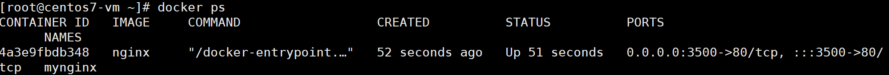
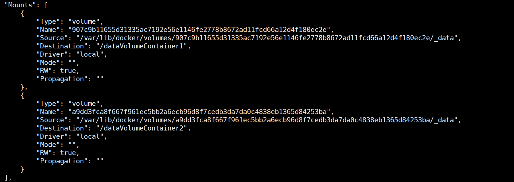
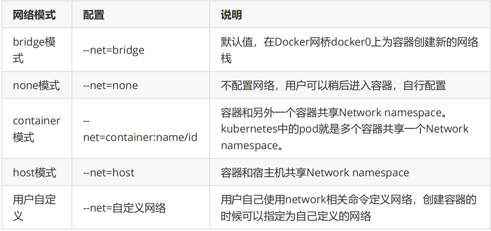
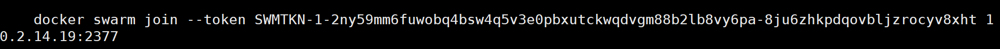

# Docker基础

## 概述

> Docker是什么？

*Docker*是支持创建和使用Linux容器的容器化技术，它充当容器的运行载体。


> Docker的架构图


> 什么是镜像(image)？

应用程序和配置依赖打包好形成一个可交付的运行环境，这个打包好的运行环境就是 image镜像文件。只有通过这个镜像文件才能生成 Docker 容器。image 文件可以看作是容器的模板。Docker 根据 image 文件生成容器的实例。同一个 image 文件，可以生成多个同时运行的容器实例。


> 什么是容器(container)？

容器是用镜像创建的运行实例，它可以被启动、开始、停止、删除。每个容器都是相互隔离的，保证安全的平台，可以把容器看作一个简易的操作系统。


> 什么是仓库(repository)？

仓库分为公开仓库（Public）和私有仓库（Private），最大的公开仓库是Docker Hub，国内公开仓库包括阿里云、网易云。

仓库是集中存放镜像文件的地方！


## Docker安装

1、环境要求

To install Docker Engine, you need a maintained version of CentOS 7 or 8. Archived versions aren’t supported or tested.

**保证虚拟机联网！！！！！！！**

2、yum安装gcc环境，保证虚拟机可以上外网

```bash
yum -y install gcc 
yum -y install gcc-c++
```

3、安装yum工具包

```bash
sudo yum install -y yum-utils
```

4、卸载旧版本Docker

```bash
[root@centos7-vm etc]# sudo yum remove docker \
>                   docker-client \
>                   docker-client-latest \
>                   docker-common \
>                   docker-latest \
>                   docker-latest-logrotate \
>                   docker-logrotate \
>                   docker-engine
```

5、设置docker仓库

```bash
# 这里使用国内的阿里云镜像
sudo yum-config-manager --add-repo http://mirrors.aliyun.com/docker-ce/linux/centos/docker-ce.repo
```

注意，当你配置成功后，它会提示已保存！我要提醒你，**每当你复制粘贴的时候，粘贴完检查一遍**！！！


6、更新yum软件包索引

```bash
sudo yum makecache fast
```

7、安装docker引擎

```bash
sudo yum install docker-ce docker-ce-cli containerd.io
```

8、启动docker

```bash
sudo systemctl start docker
```

9、测试docker

```bash
docker version
docker run hello-world
docker images
```


## Docker卸载

```bash
systemctl stop docker
sudo yum remove docker-ce docker-ce-cli containerd.io
sudo rm -rf /var/lib/docker
sudo rm -rf /var/lib/containerd
```


## Docker常用命令

### 帮助命令

```bash
# 显示docker版本信息
[root@centos7-vm ~]# docker version

# 显示docker系统信息，包括镜像数和容器数
[root@centos7-vm ~]# docker info

# 帮助
[root@centos7-vm ~]# docker --help
```


### 镜像命令

> 查看镜像

1、列出本地主机上的镜像

```bash
[root@centos7-vm ~]# docker images
```


TAG代表镜像的版本信息

2、可选项

```bash
# 列出本地所有镜像，同1
[root@centos7-vm ~]# docker images -a

# 只显示镜像id
[root@centos7-vm ~]# docker images -q

# 显示镜像的摘要信息
[root@centos7-vm ~]# docker images --digests
```


> 搜索镜像

1、在Docker Hub搜索mysql镜像

```bash
[root@centos7-vm ~]# docker search mysql
```


2、在Docker Hub搜索收藏数大于10000的镜像

```bash
[root@centos7-vm ~]# docker search mysql --filter=stars=10000
```


> 下载镜像

1、下载最新版mysql镜像

```bash
[root@centos7-vm ~]# docker pull mysql
```


以下两种命令是等价的

```bash
[root@centos7-vm ~]# docker pull mysql
[root@centos7-vm ~]# docker pull docker.io/library/mysql:latest
```

2、指定mysql版本下载

```bash
[root@centos7-vm ~]# docker pull mysql:5.7
```


> 删除镜像

```bash
# 删除镜像 
docker rmi -f 镜像id # 删除单个 
docker rmi -f 镜像名:tag 镜像名:tag # 删除多个 
docker rmi -f $(docker images -qa) # 删除全部
```


### 容器命令

> 启动容器语法

```bash
docker run [options] IMAGE [COMMAND][ARG...]
```


> 启动centos容器

1、下载centos镜像

```bash
[root@centos7-vm ~]# docker pull centos
```

2、查看centos镜像


3、以交互模式启动容器，在容器内执行`/bin/bash`命令，执行`ls`命令

```bash
[root@centos7-vm ~]# docker run -it centos /bin/bash
```


4、退出容器

```bash
[root@2d01f50ff154 /]# exit
```


> 查看容器

```bash
# 查看所有运行的容器
docker ps [options]
```


> 退出容器

```bash
# 停止容器并退出
exit
# 退出，但不停止容器
ctrl+P+Q
```


> 启动停止容器

```bash
# 启动容器
docker start (容器id or 容器名)
# 重启容器
docker restart (容器id or 容器名)
# 停止容器
docker stop (容器id or 容器名)
# 强制停止容器
docker kill (容器id or 容器名)
```


> 删除容器

```bash
# 删除指定容器
docker rm 容器id
# 删除所有容器
docker rm $(docker ps -aq)
# 删除所有容器
docker ps -a -q|xargs docker rm
```


> start与run的区别

run是创建并启动容器，操作的是镜像，而start是启动已停止的容器，操作的是容器id。


### 其它命令

> 后台启动容器

```bash
docker run -d 容器名
```

注意，docker容器后台启动，就必须有一个前台进程，如果没有前台进程来容器获取服务，那么容器自动停止！


> 查看日志

```bash
# -t 显示时间戳
# -f 打印最新日志
# --tail 数字 显示多少条
docker logs -tf --tail 容器id
```

比如我想打印容器id为c8530dbbe3b4的10条日志

```bash
docker logs -tf --tail 10 c8530dbbe3b4
```


> 查看容器中运行的进程信息

```bash
docker top 容器id
```


> 查看容器/镜像的元数据

```bash
docker inspect 容器id
```


> 进入正在运行的容器

**方式一**

```bash
# 语法
docker exec -it 容器id bashShell
```

比如进入centos容器

1、确保centos容器在运行

```bash
docker ps
```

2、进入centos容器

```bash
[root@centos7-vm ~]# docker exec -it 2d01f50ff154 /bin/bash
```

3、查看容器内的进程

```bash
[root@2d01f50ff154 /]# ps -ef
```


**方式二**

```bash
# 语法
docker attach 容器id
```

进入centos容器

```bash
[root@centos7-vm ~]# docker attach 2d01f50ff154
```

查看进程


**exec 与 attach的区别**

exec：是在容器中打开新的终端，并且可以启动新的进程，当前容器的终端不会被占用。

attach：直接进入容器启动命令的终端，不会启动新的进程，即当前容器的终端会被占用。


> 拷贝容器内的文件到主机

```bash
# 语法
docker cp 容器id:容器内路径 主机目的路径
```

比如拷贝容器`/home/f1`至主机的`home`下

```bash
docker cp c8530dbbe3b4:/home/f1 /home
```


## Nginx

> Nginx安装

1、搜索nginx镜像

```bash
[root@centos7-vm ~]# docker search nginx
```


2、下载最新版的nginx镜像

```bash
[root@centos7-vm ~]# docker pull nginx
```

3、确认镜像已下载

```bash
[root@centos7-vm ~]# docker images
```


4、以后台方式启动nginx容器，指定名称为mynginx，指定端口映射：3500:80

```bash
[root@centos7-vm ~]# docker run -d --name mynginx -p 3500:80 nginx
```


5、查看正在运行的容器



6、测试访问

```bash
[root@centos7-vm ~]# curl localhost:3500
```


> Nginx在容器中的位置

1、进入容器

```bash
[root@centos7-vm ~]# docker exec -it mynginx /bin/bash
```

2、查看nginx位置

```bash
root@4a3e9fbdb348:/# whereis nginx
```


3、进入`/usr/share/nginx`

```bash
root@4a3e9fbdb348:/# cd /usr/share/nginx/
```


4、进入html文件夹，查看index.html内容

```bash
root@4a3e9fbdb348:/usr/share/nginx/html# cat index.html
```


## Tomcat

> tomcat的安装

1、下载tomcat镜像

```bash
[root@centos7-vm ~]# docker pull tomcat
```

2、查看tomcat镜像


3、后台启动，指定端口映射：3600:8080，启动tomcat容器

```bash
# 正常情况下启动tomcat
[root@centos7-vm ~]# docker run -d --name tomcat9 -p 3600:8080 tomcat

# 测试情况下启动tomcat，容器退出后自动移除
docker run -it --rm tomcat:9.0
```

4、进入tomcat容器

```bash
[root@centos7-vm ~]# docker exec -it tomcat9 /bin/bash
```


发现webapps目录下什么也没有，因此访问时会报404！

5、将webapps.dist目录下的内容复制到webapps中，再次访问：localhost:3600


## Es+Kibana

注意事项

1、端口暴露问题 9200、9300

2、数据卷的挂载问题 data、plugins、conf

3、吃内存

> 部署es

1、直接启动es容器，没有es也没关系，它会去Hub里下载

```bash
docker run -d --name elasticsearch -p 9200:9200 -p 9300:9300 -e "discovery.type=single-node" elasticsearch:7.6.2
```

2、启动后查看es容器对cpu的占用率

```bash
docker stats cddec9025c39
```


占了一半多的内存

3、访问9200端口

```bash
curl localhost:9200
```


可以成功访问！

4、增加上内存限制启动

```bash
docker run -d --name elasticsearch -p 9200:9200 -p 9300:9300 -e "discovery.type=single-node" -e ES_JAVA_OPTS="-Xms64m -Xmx512m" elasticsearch:7.6.2
```

5、再次查看容器es的cpu占用率


发现占用率明显低了很多

6、再次访问es主页，可正常访问！


## 可视化

> 什么是Portainer？

Portainer是Docker的图形化管理工具，用来管理容器。


> Protainer的使用

1、运行Protainer单机版

```bash
[root@centos7-vm ~]# docker run -d -p 8088:9000 \
> --restart=always -v /var/run/docker.sock:/var/run/docker.sock --privileged=true portainer/portainer
```

2、访问：localhost:8088


3、注册后，连接本地docker即可


## Docker镜像

### 镜像加载原理

> 联合文件系统是什么？

UnionFS（联合文件系统）：它是一种分层、轻量级并且高性能的文件系统，它是 Docker 镜像的基础，镜像可以通过分层来进行继承，基于基础镜像（没有父镜像），可以制作各种具体的应用镜像。

特点：一次性加载多个文件系统，虽然我们看起来只有一个，实际上它是由多个文件系统叠加起来的，比如说一个文件夹下有两个文件可能是由三个文件系统叠加起来的。


> 镜像加载原理


bootfs(boot file system)：包括bootloader和kernel，bootloader就是用来加载内核的，位于最底层

rootfs(root file system)：root文件系统，比如Centos、Ubuntu等

Image：最后就是加载对应的镜像了


### 镜像分层

> 为什么镜像要分层？

所有的 Docker 镜像都起始于一个基础镜像层，当进行修改或增加新的内容时，就会在当前镜像层之上，创建新的镜像层，说白了，就是复用资源。


Docker 通过存储引擎（新版本采用快照机制）的方式来实现镜像层堆栈，并保证多镜像层对外展示为统一的文件系统。


### 镜像创建

```bash
# 语法
docker commit -m="提交的描述信息" -a="作者" 容器id 要创建的目标镜像名:[标签名]
```

提交容器副本使之成为一个新的镜像！

比如要创建一个tomcat镜像(确保webapps没有东西！)

```bash
docker commit -a="naruto" -m="no tomcat docs" 1e98a2f815b0 tomcat02:1.1
```


## 容器数据卷

### 概述

> 什么是容器数据卷？

容器数据卷就是存储数据的目录或文件，它完全独立于容器的生存周期，不会在容器删除时删除其挂载的数据卷，它会一直持续到没有容器使用它为止。


### 数据卷的使用

> 容器中使用命令添加数据卷

```bash
# 语法
docker run -it -v 宿主机绝对路径目录:容器内目录 镜像
```

1、将数据卷挂载到主机`/home/ceshi`下

```bash
[root@centos7-vm home]# docker run -it -v /home/ceshi:/home centos /bin/bash
```

2、新建会话，查看数据是否挂载成功

```bash
[root@centos7-vm /]# docker inspect d838db0eee1e
```


Destination表示docker的容器地址，Source是主机上目录地址，挂载的意思就是这两个目录，仿佛就是一个目录，我在docker容器下添加内容，对应的主机目录中也会出现添加的内容。

3、测试主机与容器数据共享

```bash
[root@d838db0eee1e home]# touch test.java
```


停止容器后，如果在主机上修改`test.java`，然后再启动刚刚的容器，此时容器内对应的文件内容依然与主机上保持一致


### 挂载MySQL数据库

1、拉取mysql镜像

```bash
docker pull mysql:5.7
```

2、启动mysql容器，将部分目录挂载到本地

```bash
docker run -d -p 3310:3306 -v /home/mysql/conf:/etc/mysql/conf.d -v /home/mysql/data:/var/lib/mysql -e MYSQL_ROOT_PASSWORD=123456 --name mysql01 mysql:5.7
```


3、本地使用navicat测试连接


密码为步骤2中设置的密码

4、查看本地目录


数据已成功挂载到本地

如果删除创建的mysql容器，那么数据仍然在本地存在！


### DockerFile挂载

> 什么是DockerFile？

*Dockerfile 是*一个用来构建镜像的文本文件，文本内容包含了一条条构建镜像所需的指令和说明。


> DockerFile添加数据卷

```bash
# 说明：在编写DockerFile文件中使用 VOLUME 指令来给镜像添加一个或多个数据卷
VOLUME["/dataVolumeContainer1","/dataVolumeContainer2","/dataVolumeContainer 3"]
```


> DockerFile挂载数据卷

1、/home 目录下新建一个 docker-test-volume文件夹 

```bash
mkdir docker-test-volume
```

2、编写DockerFile文件 

```bash
[root@centos7-vm docker-test-volume]# vim dockerfile1
```

填入以下内容

```bash
FROM centos
VOLUME ["/dataVolumeContainer1","/dataVolumeContainer2"]
CMD echo "-------end------"
CMD /bin/bash
```

3、生成一个新镜像

```bash
[root@centos7-vm docker-test-volume]# docker build -f /home/docker-test-volume/dockerfile1 -t pikaqiang/centos .
```


4、根据生成的镜像，启动并进入容器

```bash
# 09e77204bffd是一个镜像id
[root@centos7-vm docker-test-volume]# docker run -it 09e77204bffd /bin/bash
```

5、查看数据卷已创建


6、在数据卷中新建一个文件


7、查看容器的信息

```bash
[root@centos7-vm volumes]# docker ps
[root@centos7-vm ~]# docker inspect b578b4377ceb
```



上面的source目录表示的是数据卷在主机上的地址


### 匿名和具名挂载

> 什么是匿名挂载？

所谓匿名挂载（匿名卷），即在进行数据卷挂载的时候不指定宿主机的数据卷目录

```bash
# -d 后台运行
# -P 随机端口
# -- name 容器名称
# -v 后跟容器内的数据卷路径
docker run -d -P --name nginx01 -v /etc/nginx nginx
```


> 什么是具名挂载？

所谓具名挂载（具名卷），即在进行数据卷挂载的时候指定宿主机的数据卷目录

```bash
# nginxconfig为卷名
docker run -d -P --name nginx02 -v nginxconfig:/etc/nginx nginx 
```

查看挂载路径

```bash
docker volume inspect nginxconfig
```


指定容器对挂载的读写权限

```bash
# 只读
docker run -d -P --name nginx02 -v nginxconfig:/etc/nginx:ro nginx
# 读写
docker run -d -P --name nginx02 -v nginxconfig:/etc/nginx:rw nginx
```


### 数据卷容器

> 什么是数据卷容器？

命名的容器挂载数据卷，其他容器通过挂载这个（父容器）实现数据共享，成为挂载数据卷的容器


> 语法

```bash
# 子容器使用--volumes-from来挂载父容器挂载的数据卷
# pikaqiang/centos是我们之前通过DockerFile创建的具有数据卷的镜像
docker run -it --name docker02 --volumes-from docker01 pikaqiang/centos
```

**容器之间配置信息的传递，数据卷的生命周期一直持续到没有容器使用它为止。**


## DockerFile实战

> 自定义镜像Centos

目的：登陆后的默认路径、vim编辑器、查看网络配置ifconfig支持


1、编写DockerFile文件`dockerfile-centos`

```bash
# 基础镜像为centos
FROM centos
# 镜像的创建者
MAINTAINER pikaqiang<2529299417@qq.com>
# 配置环境变量路径和工作目录
ENV MYPATH /usr/local
WORKDIR $MYPATH
# 安装vim、网络工具包
RUN yum -y install vim
RUN yum -y install net-tools
# 指定端口
EXPOSE 80
# 使用echo输出下mypath
CMD echo $MYPATH
# 输出end表示构建完毕
CMD echo "----------end--------"
# 启动一个bash终端
CMD /bin/bash
```

2、根据DockerFile构建镜像

```bash
# -f后跟dockerfile文件名 -t后跟自定义镜像名 :后加当前镜像版本号 .表示当前目录
[root@centos7-vm dockerfile-test]# docker build -f /home/dockerfile-test/dockerfile-centos -t mycentos:0.1 .
```


3、运行自定义的镜像`mycentos:0.1`

```bash
# 通过镜像名
[root@centos7-vm dockerfile-test]# docker run -it mycentos:0.1
# 通过镜像id
[root@centos7-vm dockerfile-test]# docker run -it ba7d62c0e137
```

然后，我们惊喜的发现，我们再centos镜像的基础上成功扩展了vim及ifconfig指令！

突然想起来`/bin/bash`的命令，上面容器启动后，通过`/bin/bash`直接进入了容器内部，这就是它的作用


> CMD 和 ENTRYPOINT 的区别

**CMD** 

Dockerfifile 中可以有多个CMD 指令，但只有最后一个生效。

CMD 会被 docker run 之后的参数替换，无法追加命令！

**ENTRYPOINT**

docker run 之后的参数会被当做参数传递给 ENTRYPOINT，可以追加命令！


> 发布镜像

1、登录docker_hub

```bash
[root@centos7-vm dockerfile-test]# docker login -u 2529299417
```


2、规范镜像的tag

```bash
[root@centos7-vm home]# docker tag ba7d62c0e137 2529299417/mycentos:1.0
```


3、发布镜像

```bash
# 2529299417表示dockerhub的用户名 mycentos:1.0表示镜像名及版本
[root@centos7-vm home]# docker push 2529299417/mycentos:1.0
```


4、登录docker-hub


> 总结


## Docker网络

### 概述

> 查看本机的网络地址


通过上面的docker0虚拟网卡，docker会给每个容器分配一个ip地址，当容器运行时，我们可以在linux本地ping通容器，而且不同容器之间也是相通的


> Docker0网卡原理

veth-pair 就是一对的虚拟设备接口，它充当着一个桥梁，连接虚拟网络设备!


> 通信流程

Docker使用Linux桥接，在宿主机虚拟一个Docker容器网桥(docker0)，Docker启动一个容器时会根据Docker网桥的网段分配给容器一个IP地址，称为Container-IP，同时Docker网桥是每个容器的默认网关。因为在同一宿主机内的容器都接入同一个网桥，这样容器之间就能够通过容器的Container-IP直接通信。


### Link

1、启动一个tomcat03，但是启动的时候连接tomcat02

```bash
docker run -d -P --name tomcat03 --link tomcat02 tomcat
```

2、进入tomcat03，即可ping通tomcat02

```bash
docker exec -it tomcat03 ping tomcat02
```

3、对于ping通的原理，查看tomcat03的host文件，发现将tomcat02的ip地址作为域名映射


### 自定义网络

> 基本命令

1、查看帮助命令

```bash
[root@centos7-vm ~]# docker network --help
```


2、查看具体网络的信息

```bash
[root@centos7-vm ~]# docker inspect 9df8524f92d7
```


3、所有网络模式




> 自定义网卡

1、自定义网络命令

```bash
[root@centos7-vm ~]# docker network create --help

Usage:  docker network create [OPTIONS] NETWORK

Create a network

Options:
      --attachable           Enable manual container attachment
      --aux-address map      Auxiliary IPv4 or IPv6 addresses used by Network driver (default
                             map[])
      --config-from string   The network from which to copy the configuration
      --config-only          Create a configuration only network
  -d, --driver string        Driver to manage the Network (default "bridge")
      --gateway strings      IPv4 or IPv6 Gateway for the master subnet
      --ingress              Create swarm routing-mesh network
      --internal             Restrict external access to the network
      --ip-range strings     Allocate container ip from a sub-range
      --ipam-driver string   IP Address Management Driver (default "default")
      --ipam-opt map         Set IPAM driver specific options (default map[])
      --ipv6                 Enable IPv6 networking
      --label list           Set metadata on a network
  -o, --opt map              Set driver specific options (default map[])
      --scope string         Control the network's scope
      --subnet strings       Subnet in CIDR format that represents a network segment
```

2、自定义`mynet`网络

```bash
docker network create --driver bridge --subnet 192.168.0.0/16 --gateway 192.168.0.1 mynet
```

3、确认自定义网络生效


4、启动两个tomcat容器，指定网络为`mynet`

```bash
docker run -d -P --name tomcat-net-01 --net mynet tomcat
docker run -d -P --name tomcat-net-02 --net mynet tomcat
```

5、查看`mynet`的详细信息


发现多了两个容器的网络信息

经过测试，两个容器的网络是互通的，不管是ping域名还是ip地址，都能ping通！


> 网络互通


如果想让tomcat1访问tomcat-net-01该如何处理？

```bash
# 语法
docker network connect [OPTIONS] NETWORK CONTAINER
# 方案
docker network connect mynet tomcat01
```


## IDEA整合Docker

这个直接在原教程操作一遍，这里不记录了。


# Dcoker进阶

## Docker Compose

### 概述

> 什么是Docker Compose？

官方：Compose is a tool for defifining and running multi-container Docker applications. 

定义和运行多个docker容器的工具，即批量容器编排


### 安装

1、下载docker compose，要注意版本问题

```bash
curl -L https://get.daocloud.io/docker/compose/releases/download/1.29.2/docker-compose-`uname -s`-`uname -m` > /usr/local/bin/docker-compose
```

2、授权

```bash
sudo chmod +x /usr/local/bin/docker-compose
```


### 使用

> 运行一个简单的python web应用

1、创建`composetest`目录

```bash
mkdir composetest
```

2、创建`app.py`文件，内容如下

```python
import time

import redis
from flask import Flask

app = Flask(__name__)
cache = redis.Redis(host='redis', port=6379)

def get_hit_count():
    retries = 5
    while True:
        try:
            return cache.incr('hits')
        except redis.exceptions.ConnectionError as exc:
            if retries == 0:
                raise exc
            retries -= 1
            time.sleep(0.5)

@app.route('/')
def hello():
    count = get_hit_count()
    return 'Hello World! I have been seen {} times.\n'.format(count)
```

3、创建文件夹`requirements.txt`

```txt
flask
redis
```

4、创建`Dockerfile`，内容如下

```bash
FROM python:3.7-alpine
WORKDIR /code
ENV FLASK_APP=app.py
ENV FLASK_RUN_HOST=0.0.0.0
RUN apk add --no-cache gcc musl-dev linux-headers
COPY requirements.txt requirements.txt
RUN pip install -r requirements.txt
EXPOSE 5000
COPY . .
CMD ["flask", "run"]
```

5、创建文件`docker-compose.yml`

```bash
version: "3.9"
services:
  web:
    build: .
    ports:
      - "5000:5000"
  redis:
    image: "redis:alpine"
```

6、Compose运行容器

```bash
docker-compose up
```

7、在浏览器访问5000端口


这是个计数器，统计你访问该页面的次数，每访问一次，次数加一


> 备注

1、查看下启动的服务


这些名字的服务名称的生成规则还不清楚，比如`t_redis_`表示什么？

2、通过compose启动起来的服务，它们是网络互通的，比如上面的redis和web

3、停止docker-compose

```bash
# 方式一
docker-compose down
# 方式二
ctrl + c
```


### yaml规则

> yaml内容格式

```yaml
version: '' # 版本
services: # 服务
  服务1: web
    # 服务配置
    images
    build
    network
    .....
  服务2: redis
    .....
  服务3: redis
# 其他配置 网络/卷、全局规则
volumes:
networks:
configs:
```


> yaml详解

网址：https://docs.docker.com/compose/compose-file/compose-file-v3/

1、根据docker版本确定version


2、services，根据需要去查

 

3、服务的启动顺序


先启动db，然后启动redis，最后再启动web服务


### 部署开源项目

地址：https://docs.docker.com/samples/wordpress/

1、创建一个空的项目目录

```bash
[root@centos7-vm home]# mkdir my_wordpress
```

2、编写`docker-compose.yml`

```yml
version: "3.9"
    
services:
  db:
    image: mysql:5.7
    volumes:
      - db_data:/var/lib/mysql
    restart: always
    environment:
      MYSQL_ROOT_PASSWORD: somewordpress
      MYSQL_DATABASE: wordpress
      MYSQL_USER: wordpress
      MYSQL_PASSWORD: wordpress
    
  wordpress:
    depends_on:
      - db
    image: wordpress:latest
    volumes:
      - wordpress_data:/var/www/html
    ports:
      - "8000:80"
    restart: always
    environment:
      WORDPRESS_DB_HOST: db:3306
      WORDPRESS_DB_USER: wordpress
      WORDPRESS_DB_PASSWORD: wordpress
      WORDPRESS_DB_NAME: wordpress
volumes:
  db_data: {}
  wordpress_data: {}
```

3、在项目目录下运行docker-compose

```bash
# 分离模式下运行
docker-compose up -d
```

4、访问：http://localhost:8000


5、关闭服务

```bash
# 移除容器和网络配置，但保留数据库
docker-compose down
# 移除容器、网络配置、数据库
docker-compose down --volumes
```


### 自定义微服务

> 新建一个springboot项目

1、引入依赖

```xml
<dependency>
    <groupId>org.springframework.boot</groupId>
    <artifactId>spring-boot-starter-web</artifactId>
</dependency>
<dependency>
    <groupId>org.springframework.boot</groupId>
    <artifactId>spring-boot-starter-data-redis</artifactId>
</dependency>
```

2、编写controller

```java
package cn.pikaqiang.controller;

import org.springframework.beans.factory.annotation.Autowired;
import org.springframework.data.redis.core.StringRedisTemplate;
import org.springframework.web.bind.annotation.GetMapping;
import org.springframework.web.bind.annotation.RestController;

@RestController
public class HelloController {

    @Autowired
    StringRedisTemplate redisTemplate;

    @GetMapping("/hello")
    public String hello() {
        // increment将存储为字符串的整数值加一
        Long views = redisTemplate.opsForValue().increment("views");
        return "hello naruto: "+views;
    }
}
```

3、编写`application.properties`

```properties
server.port=8080
spring.redis.host=redis
```

4、编写Dockerfile

```bash
FROM java:8

COPY *.jar /app.jar

CMD ["--server.port=8080"]

EXPOSE 8080

ENTRYPOINT ["java","-jar","/app.jar"]
```

5、编写docker-compose.yml

```yml
version: '3.8'  # 根据你的docker版本来指定
services:
  pikaapp:      # 自定义服务pikaapp
    build: .    # .表示在该目录下，即Dockerfile在项目目录下
    image: pikaapp # 自定义镜像名称
    depends_on: # 该自定义服务需要依赖的服务
      - redis
    ports:
      - "8080:8080" #指定端口映射 
  redis:        # 定义redis服务
    image: "library/redis:alpine" # 使用仓库中的redis镜像
```

6、将项目打jar包

 

7、上传jar包、Dockerfile、docker-compose.yml


8、执行compose命令

```bash
# 部署项目
docker-compose up
# 重新部署项目
docker-compose up --build
```

9、启动成功


10、访问：8080端口


## Dcoker Swarm

### 集群搭建

> 准备工作

1、搭建4台虚拟机

2、4台虚拟机安装docker


> 集群工作模式


> 搭建集群

1、配置centos1中的容器为主节点

```bash
[root@localhost ~]# docker swarm init --advertise-addr 10.2.14.19
```


2、将centos2中的容器加入到centos1的集群中

```bash
# 在centos2执行如下命令
docker swarm join --token SWMTKN-1-2ny59mm6fuwobq4bsw4q5v3e0pbxutckwqdvgm88b2lb8vy6pa-8ju6zhkpdqovbljzrocyv8xht 10.2.14.19:2377
```


3、在主节点查看集群信息

```bash
[root@localhost ~]# docker node ls
```


4、将centos3中的容器加入集群

```bash
# 步骤2中是方式一，在主节点生成一个worker
[root@localhost ~]# docker swarm join-token worker
```



5、复制生成的命令在centos3中执行


6、再次在主节点处查看所有节点


7、同样的方式，让centos4中的容器以主节点的身份加入集群

```bash
# 生成令牌方式
[root@localhost ~]# docker swarm join-token manager
```


8、查看所有节点


9、将节点移除集群

```bash
# 移除节点
[root@localhost ~]# docker swarm leave
# 强制解散集群
[root@localhost ~]# docker swarm leave --force
```


### Raft协议

> 什么是Raft协议？

raft协议就是一种leader-based的共识算法，确保集群内的任意节点在某种状态转换上保持一致，至少3个主节点+至少1个管理节点。


### 动态扩缩容

> Nginx服务演示

1、在主节点创建nginx服务

```bash
[root@localhost ~]# docker service create -p 8888:80 --name my-nginx nginx
```

2、查看nginx服务


3、增加3个nginx服务副本

```bash
# 方式一
[root@localhost ~]# docker service update --replicas 3 my-nginx
# 方式二
[root@localhost ~]# docker service scale my-nginx=3
```


4、查看nginx服务


5、访问测试http://10.2.14.19:8888/


注意上面的演示只是在一个主节点中进行，如果集群中有多个节点，那么创建的副本会动态的分布在不同的节点上！


> 其它命令

1、移除创建的nginx服务

```bash
[root@localhost ~]# docker service rm my-nginx
```

2、调整service的运行模式

```bash
# 以副本方式运行服务
docker service create --mode replicated --name mytom tomcat:7 默认的
# 以全局方式运行服务
docker service create --mode global --name haha alpine ping baidu.com
```

3、replicated与global的区别

replicated：节点上运行的副本数量有多有少

global：强制在每个 节点上都运行一个且最多一个副本，比如要收集所有容器的日志，那就让收集日志的服务运行在每个节点上


## Docker Stack

> 什么是Docker Stack？

docker-compose 更像是被定义为单机容器编排工具，docker stack 可认为是单机上的负载均衡部署，可认为是多节点集群部署（docker swarm）的特例


> 部署集群

1、编写yml文件，和之前的compose的文件一致

2、执行如下命令

```bash
docker stack deploy wordpress.yaml
```


## Docker Secret


## Docker Config


# CICD

> 什么是CICD？

在软件工程中，CI/CD或CICD通常指的是持续集成和持续交付或持续部署的组合实践。


> CICDl流程

下面是一条生产线


当我们提交修改后的代码后，项目会自动化部署


