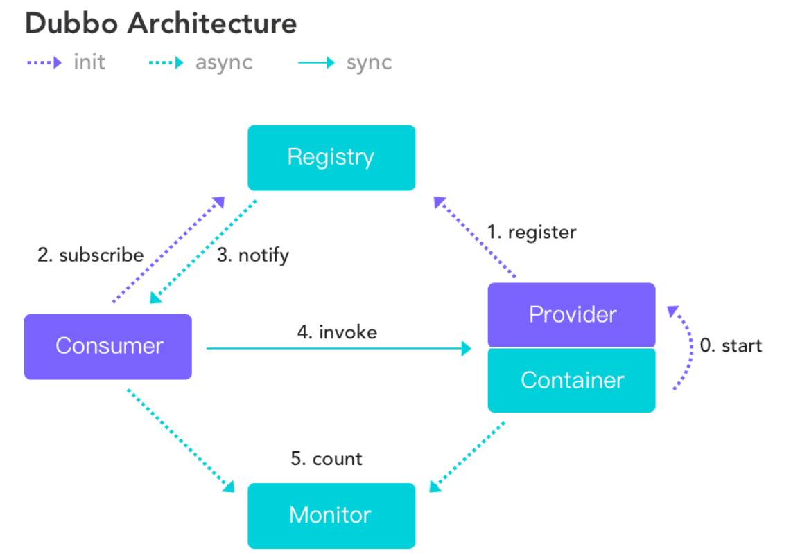

# 分布式

## 概述

> 什么是分布式系统？

分布式系统是若干独立计算机（服务器）的集合，它们可以使用不同的操作系统运行不同的程序，目的是为了提供服务


> 什么是RPC？

RPC 【Remote Procedure Call】是指远程过程调用，是一种进程间通信方式，它允许程序调用另一个地址空间（网络的另一台机器上）的过程或函数，而不用开发人员显式编码这个调用的细节。


> RPC基本原理


## Dubbo

### 概述

> 什么是Dubbo？

Apache Dubbo 是一款高性能、轻量级的开源 **Java RPC 框架**，它提供了三大核心能力：面向接口的远程方法调用，智能容错和负载均衡，以及服务自动注册和发现。


> 基本架构



**服务提供者（Provider）：**暴露服务的服务提供方，服务提供者在启动时，向注册中心注

册自己提供的服务。

**服务消费者（Consumer）:** 调用远程服务的服务消费方，服务消费者在启动时，向注册

中心订阅自己所需的服务，服务消费者，从提供者地址列表中，基于软负载均衡算法，选一

台提供者进行调用，如果调用失败，再选另一台调用。

**注册中心（Registry）：**注册中心返回服务提供者地址列表给消费者，如果有变更，注册

中心将基于长连接推送变更数据给消费者

**监控中心（Monitor）：**服务消费者和提供者，在内存中累计调用次数和调用时间，定时

每分钟发送一次统计数据到监控中心


**调用关系说明**

- 服务容器负责启动，加载，运行服务提供者。

- 服务提供者在启动时，向注册中心注册自己提供的服务。

- 服务消费者在启动时，向注册中心订阅自己所需的服务。

- 注册中心返回服务提供者地址列表给消费者，如果有变更，注册中心将基于长连接推

​      送变更数据给消费者。

- 服务消费者，从提供者地址列表中，基于软负载均衡算法，选一台提供者进行调用，

​      如果调用失败，再选另一台调用


### 安装

> Windows下安装

地址：https://mp.weixin.qq.com/s?__biz=Mzg2NTAzMTExNg%3D%3D&chksm=ce610488f9168d9eee180472c9e225c737ed56075370c1174eb29ae214326a5f8e49147c2d65&idx=1&mid=2247483947&scene=21&sn=0c8efabbaf9b8ca835d862e6e0a2254f

这里需要注意的是zookeeper版本为3.4.14，而dubbo版本为master主分支，版本兼容问题真的很要命！！！


> 应用场景

某电商平台系统需求，用户浏览商品；选择商品下订单，订单系统需要获取用户信息中的送货地址；向支付系统请求完成付款。


## Zookeeper

### 概述

ZooKeeper是一个分布式协调服务来管理大量的主机，相当于前面Dubbo的注册中心。


### 安装

> Windows下安装

1、去官网下载：https://zookeeper.apache.org/releases.html，新版本往往不稳定


2、解压后进入conf文件夹，修改`zoo_sample.cfg`为`zoo.cfg`，修改内容如下：

```bash
# The number of milliseconds of each tick
tickTime=2000
# The number of ticks that the initial 
# synchronization phase can take
initLimit=10
# The number of ticks that can pass between 
# sending a request and getting an acknowledgement
syncLimit=5
# the directory where the snapshot is stored.
# do not use /tmp for storage, /tmp here is just 
# example sakes.
dataDir=D:\\learning\\program\\software\\zookeeper\\data
dataLogDir=D:\\learning\\program\\software\\zookeeper\\log
# the port at which the clients will connect
clientPort=2181
# the maximum number of client connections.
# increase this if you need to handle more clients
#maxClientCnxns=60
#
# Be sure to read the maintenance section of the 
# administrator guide before turning on autopurge.
#
# http://zookeeper.apache.org/doc/current/zookeeperAdmin.html#sc_maintenance
#
# The number of snapshots to retain in dataDir
#autopurge.snapRetainCount=3
# Purge task interval in hours
# Set to "0" to disable auto purge feature
#autopurge.purgeInterval=1

## Metrics Providers
#
# https://prometheus.io Metrics Exporter
#metricsProvider.className=org.apache.zookeeper.metrics.prometheus.PrometheusMetricsProvider
#metricsProvider.httpPort=7000
#metricsProvider.exportJvmInfo=true
```

3、记事本打开bin下的zkEnv.com，检查java环境是否正确，一般不用动

```bash
@echo off
REM Licensed to the Apache Software Foundation (ASF) under one or more
REM contributor license agreements.  See the NOTICE file distributed with
REM this work for additional information regarding copyright ownership.
REM The ASF licenses this file to You under the Apache License, Version 2.0
REM (the "License"); you may not use this file except in compliance with
REM the License.  You may obtain a copy of the License at
REM
REM     http://www.apache.org/licenses/LICENSE-2.0
REM
REM Unless required by applicable law or agreed to in writing, software
REM distributed under the License is distributed on an "AS IS" BASIS,
REM WITHOUT WARRANTIES OR CONDITIONS OF ANY KIND, either express or implied.
REM See the License for the specific language governing permissions and
REM limitations under the License.

set ZOOCFGDIR=%~dp0%..\conf
set ZOO_LOG_DIR=%~dp0%..\logs
set ZOO_LOG4J_PROP=INFO,CONSOLE

REM for sanity sake assume Java 1.6
REM see: http://java.sun.com/javase/6/docs/technotes/tools/windows/java.html

REM add the zoocfg dir to classpath
set CLASSPATH=%ZOOCFGDIR%

REM make it work in the release
SET CLASSPATH=%~dp0..\*;%~dp0..\lib\*;%CLASSPATH%

REM make it work for developers
SET CLASSPATH=%~dp0..\build\classes;%~dp0..\build\lib\*;%CLASSPATH%

set ZOOCFG=%ZOOCFGDIR%\zoo.cfg

@REM setup java environment variables

if not defined JAVA_HOME (
  echo Error: JAVA_HOME is not set.
  goto :eof
)

set JAVA_HOME=%JAVA_HOME:"=%

if not exist "%JAVA_HOME%"\bin\java.exe (
  echo Error: JAVA_HOME is incorrectly set.
  goto :eof
)

REM strip off trailing \ from JAVA_HOME or java does not start
if "%JAVA_HOME:~-1%" EQU "\" set "JAVA_HOME=%JAVA_HOME:~0,-1%"
 
set JAVA="%JAVA_HOME%"\bin\java
```

4、查看本地java环境变量配置


Path：

 


我试了一下，只有这样zookeeper才能找到java.exe，有几种情况，路径正确也找不到，这里是个坑。


5、配置Zookeeper的环境变量，测试一下


6、启动客户端，并测试连接


显示zookeeper，表示安装成功！


## SpringBoot整合

#### 搭建一个空项目

> 新建模块`provider-server`表示服务提供者

**TicketService**

```java
package cn.pikaqiang.service;

public interface TicketService {

    public String getTicket();

}
```

**TicketServiceImpl**

```java
package cn.pikaqiang.service;

import org.apache.dubbo.config.annotation.Service;
import org.springframework.stereotype.Component;

@Component//使用dubbo尽量不要用spring的Service
@Service
public class TicketServiceImpl implements TicketService {
    @Override
    public String getTicket() {
        return "《狂神说Java》";
    }
}
```

**配置文件**

```properties
# 应用名称
spring.application.name=provider-server
# 应用服务 WEB 访问端口
server.port=8001

#当前应用名字
dubbo.application.name=provider-server
#注册中心地址
dubbo.registry.address=zookeeper://127.0.0.1:2181
#哪些服务被注册，注册后会以接口命名，如cn.pikaqiang.service.TicketService
dubbo.scan.base-packages=cn.pikaqiang.service
```

**pom文件**

```xml
<?xml version="1.0" encoding="UTF-8"?>
<project xmlns="http://maven.apache.org/POM/4.0.0" xmlns:xsi="http://www.w3.org/2001/XMLSchema-instance"
         xsi:schemaLocation="http://maven.apache.org/POM/4.0.0 https://maven.apache.org/xsd/maven-4.0.0.xsd">
    <modelVersion>4.0.0</modelVersion>
    <groupId>cn.pikaqiang</groupId>
    <artifactId>provider-server</artifactId>
    <version>0.0.1-SNAPSHOT</version>
    <name>provider-server</name>
    <description>Demo project for Spring Boot</description>

    <properties>
        <java.version>1.8</java.version>
        <project.build.sourceEncoding>UTF-8</project.build.sourceEncoding>
        <project.reporting.outputEncoding>UTF-8</project.reporting.outputEncoding>
        <spring-boot.version>2.3.7.RELEASE</spring-boot.version>
    </properties>

    <dependencies>
        <dependency>
            <groupId>org.springframework.boot</groupId>
            <artifactId>spring-boot-starter-web</artifactId>
        </dependency>

        <dependency>
            <groupId>org.springframework.boot</groupId>
            <artifactId>spring-boot-starter-test</artifactId>
            <scope>test</scope>
            <exclusions>
                <exclusion>
                    <groupId>org.junit.vintage</groupId>
                    <artifactId>junit-vintage-engine</artifactId>
                </exclusion>
            </exclusions>
        </dependency>

        <!-- Dubbo Spring Boot Starter -->
        <dependency>
            <groupId>org.apache.dubbo</groupId>
            <artifactId>dubbo-spring-boot-starter</artifactId>
            <version>2.7.3</version>
        </dependency>

        <!-- https://mvnrepository.com/artifact/com.github.sgroschupf/zkclient -->
        <dependency>
            <groupId>com.github.sgroschupf</groupId>
            <artifactId>zkclient</artifactId>
            <version>0.1</version>
        </dependency>

        <!--解决日志冲突问题-->
        <!-- 引入zookeeper -->
        <dependency>
            <groupId>org.apache.curator</groupId>
            <artifactId>curator-framework</artifactId>
            <version>2.12.0</version>
        </dependency>
        <dependency>
            <groupId>org.apache.curator</groupId>
            <artifactId>curator-recipes</artifactId>
            <version>2.12.0</version>
        </dependency>
        <dependency>
            <groupId>org.apache.zookeeper</groupId>
            <artifactId>zookeeper</artifactId>
            <version>3.4.14</version>
            <!--排除这个slf4j-log4j12-->
            <exclusions>
                <exclusion>
                    <groupId>org.slf4j</groupId>
                    <artifactId>slf4j-log4j12</artifactId>
                </exclusion>
            </exclusions>
        </dependency>
        
    </dependencies>

    <dependencyManagement>
        <dependencies>
            <dependency>
                <groupId>org.springframework.boot</groupId>
                <artifactId>spring-boot-dependencies</artifactId>
                <version>${spring-boot.version}</version>
                <type>pom</type>
                <scope>import</scope>
            </dependency>

        </dependencies>
    </dependencyManagement>

    <build>
        <plugins>
            <plugin>
                <groupId>org.apache.maven.plugins</groupId>
                <artifactId>maven-compiler-plugin</artifactId>
                <version>3.8.1</version>
                <configuration>
                    <source>1.8</source>
                    <target>1.8</target>
                    <encoding>UTF-8</encoding>
                </configuration>
            </plugin>
            <plugin>
                <groupId>org.springframework.boot</groupId>
                <artifactId>spring-boot-maven-plugin</artifactId>
                <version>2.3.7.RELEASE</version>
                <configuration>
                    <mainClass>cn.pikaqiang.ProvideerServerApplication</mainClass>
                </configuration>
                <executions>
                    <execution>
                        <id>repackage</id>
                        <goals>
                            <goal>repackage</goal>
                        </goals>
                    </execution>
                </executions>
            </plugin>
        </plugins>
    </build>

</project>

```

3、启动zookeeper和dubbo，打开可视化注册中心，启动项目


发现服务已注册！

> 新建模块`consumer-client`表示消费者

**TicketService**

```java
package cn.pikaqiang.service;

/**
 * 该接口在模块client的路径与server中的TicketService路径一致，
 * 目的是在客户端的实现类中引用该服务
 */
public interface TicketService {

    public String getTicket();

}
```

**UserService**

```java
package cn.pikaqiang.service;

import org.apache.dubbo.config.annotation.Reference;
import org.springframework.stereotype.Service;

@Service
public class UserService {
    // 引用注册中心中的服务
    @Reference
    TicketService ticketService;

    public void bugTicket(){
        String ticket = ticketService.getTicket();
        System.out.println("在注册中心买到"+ticket);
    }

}

```

**配置文件**

```properties
# 应用名称
spring.application.name=consumer-client
# 应用服务 WEB 访问端口
server.port=8002

#消费者名称
dubbo.application.name=consumer-client
#注册中心地址
dubbo.registry.address=zookeeper://127.0.0.1:2181
```

**pom文件**

```xml
<?xml version="1.0" encoding="UTF-8"?>
<project xmlns="http://maven.apache.org/POM/4.0.0" xmlns:xsi="http://www.w3.org/2001/XMLSchema-instance"
         xsi:schemaLocation="http://maven.apache.org/POM/4.0.0 https://maven.apache.org/xsd/maven-4.0.0.xsd">
    <modelVersion>4.0.0</modelVersion>
    <groupId>cn.pikaqiang</groupId>
    <artifactId>consumer-client</artifactId>
    <version>0.0.1-SNAPSHOT</version>
    <name>consumer-client</name>
    <description>Demo project for Spring Boot</description>

    <properties>
        <java.version>1.8</java.version>
        <project.build.sourceEncoding>UTF-8</project.build.sourceEncoding>
        <project.reporting.outputEncoding>UTF-8</project.reporting.outputEncoding>
        <spring-boot.version>2.3.7.RELEASE</spring-boot.version>
    </properties>

    <dependencies>
        <dependency>
            <groupId>org.springframework.boot</groupId>
            <artifactId>spring-boot-starter-web</artifactId>
        </dependency>

        <dependency>
            <groupId>org.springframework.boot</groupId>
            <artifactId>spring-boot-starter-test</artifactId>
            <scope>test</scope>
            <exclusions>
                <exclusion>
                    <groupId>org.junit.vintage</groupId>
                    <artifactId>junit-vintage-engine</artifactId>
                </exclusion>
            </exclusions>
        </dependency>

        <!--导入相关依赖-->
        <!-- Dubbo Spring Boot Starter -->
        <dependency>
            <groupId>org.apache.dubbo</groupId>
            <artifactId>dubbo-spring-boot-starter</artifactId>
            <version>2.7.3</version>
        </dependency>

        <!-- https://mvnrepository.com/artifact/com.github.sgroschupf/zkclient -->
        <dependency>
            <groupId>com.github.sgroschupf</groupId>
            <artifactId>zkclient</artifactId>
            <version>0.1</version>
        </dependency>

        <!--解决日志冲突问题-->
        <!-- 引入zookeeper -->
        <dependency>
            <groupId>org.apache.curator</groupId>
            <artifactId>curator-framework</artifactId>
            <version>2.12.0</version>
        </dependency>
        <dependency>
            <groupId>org.apache.curator</groupId>
            <artifactId>curator-recipes</artifactId>
            <version>2.12.0</version>
        </dependency>
        <dependency>
            <groupId>org.apache.zookeeper</groupId>
            <artifactId>zookeeper</artifactId>
            <version>3.4.14</version>
            <!--排除这个slf4j-log4j12-->
            <exclusions>
                <exclusion>
                    <groupId>org.slf4j</groupId>
                    <artifactId>slf4j-log4j12</artifactId>
                </exclusion>
            </exclusions>
        </dependency>

    </dependencies>

    <dependencyManagement>
        <dependencies>
            <dependency>
                <groupId>org.springframework.boot</groupId>
                <artifactId>spring-boot-dependencies</artifactId>
                <version>${spring-boot.version}</version>
                <type>pom</type>
                <scope>import</scope>
            </dependency>
            <!--dubbo相关-->
            <!-- Dubbo Spring Boot Starter -->
            <dependency>
                <groupId>org.apache.dubbo</groupId>
                <artifactId>dubbo-spring-boot-starter</artifactId>
                <version>2.7.3</version>
            </dependency>


        </dependencies>
    </dependencyManagement>

    <build>
        <plugins>
            <plugin>
                <groupId>org.apache.maven.plugins</groupId>
                <artifactId>maven-compiler-plugin</artifactId>
                <version>3.8.1</version>
                <configuration>
                    <source>1.8</source>
                    <target>1.8</target>
                    <encoding>UTF-8</encoding>
                </configuration>
            </plugin>
            <plugin>
                <groupId>org.springframework.boot</groupId>
                <artifactId>spring-boot-maven-plugin</artifactId>
                <version>2.3.7.RELEASE</version>
                <configuration>
                    <mainClass>cn.pikaqiang.ConsumerClientApplication</mainClass>
                </configuration>
                <executions>
                    <execution>
                        <id>repackage</id>
                        <goals>
                            <goal>repackage</goal>
                        </goals>
                    </execution>
                </executions>
            </plugin>
        </plugins>
    </build>

</project>
```


> 测试

1、启动服务模块`provider-server`

2、运行测试类

```java
package cn.pikaqiang;

import cn.pikaqiang.service.UserService;
import org.junit.jupiter.api.Test;
import org.springframework.beans.factory.annotation.Autowired;
import org.springframework.boot.test.context.SpringBootTest;

@SpringBootTest
class ConsumerClientApplicationTests {

    @Autowired
    UserService userService;

    @Test
    void contextLoads() {

        userService.bugTicket();

    }
}
```


> 测试注意事项

1、先不管项目，把zkServer.cmd和dubbo的jar包启动起来，访问7001端口，这是第一步，保证这一步先成功！

2、然后检查项目的代码、注解、配置文件、路径是否正确

3、启动服务器模块

4、测试的时候注意，需要在zkServer.cmd中按enter，这样客户端才能从注册中心使用服务，不然会报异常，连接不到测试中心等问题


