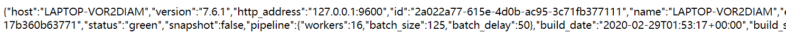

# Elasticsearch

## 项目实战

> 创建springboot项目es-jd-project

1、pom文件配置

```xml
<?xml version="1.0" encoding="UTF-8"?>
<project xmlns="http://maven.apache.org/POM/4.0.0" xmlns:xsi="http://www.w3.org/2001/XMLSchema-instance"
         xsi:schemaLocation="http://maven.apache.org/POM/4.0.0 https://maven.apache.org/xsd/maven-4.0.0.xsd">
    <modelVersion>4.0.0</modelVersion>
    <groupId>cn.pikaqiang</groupId>
    <artifactId>es-jd-project</artifactId>
    <version>0.0.1-SNAPSHOT</version>
    <name>es-jd-project</name>
    <description>Demo project for Spring Boot</description>

    <properties>
        <java.version>1.8</java.version>
        <project.build.sourceEncoding>UTF-8</project.build.sourceEncoding>
        <project.reporting.outputEncoding>UTF-8</project.reporting.outputEncoding>
        <spring-boot.version>2.2.5.RELEASE</spring-boot.version>
        <elasticsearch.version>7.6.1</elasticsearch.version>
    </properties>

    <dependencies>
        <!--lombok-->
        <dependency>
            <groupId>org.projectlombok</groupId>
            <artifactId>lombok</artifactId>
        </dependency>
        <!--解析网页-->
        <dependency>
            <groupId>org.jsoup</groupId>
            <artifactId>jsoup</artifactId>
            <version>1.10.2</version>
        </dependency>
        <dependency>
            <groupId>org.springframework.boot</groupId>
            <artifactId>spring-boot-starter-data-elasticsearch</artifactId>
        </dependency>
        <dependency>
            <groupId>org.springframework.boot</groupId>
            <artifactId>spring-boot-starter-thymeleaf</artifactId>
        </dependency>
        <dependency>
            <groupId>org.springframework.boot</groupId>
            <artifactId>spring-boot-starter-web</artifactId>
        </dependency>
        <dependency>
            <groupId>com.alibaba</groupId>
            <artifactId>fastjson</artifactId>
            <version>1.2.76</version>
        </dependency>

        <dependency>
            <groupId>org.springframework.boot</groupId>
            <artifactId>spring-boot-starter-test</artifactId>
            <scope>test</scope>
            <exclusions>
                <exclusion>
                    <groupId>org.junit.vintage</groupId>
                    <artifactId>junit-vintage-engine</artifactId>
                </exclusion>
            </exclusions>
        </dependency>
    </dependencies>

    <dependencyManagement>
        <dependencies>
            <dependency>
                <groupId>org.springframework.boot</groupId>
                <artifactId>spring-boot-dependencies</artifactId>
                <version>${spring-boot.version}</version>
                <type>pom</type>
                <scope>import</scope>
            </dependency>
        </dependencies>
    </dependencyManagement>

    <build>
        <plugins>
            <plugin>
                <groupId>org.apache.maven.plugins</groupId>
                <artifactId>maven-compiler-plugin</artifactId>
                <version>3.8.1</version>
                <configuration>
                    <source>1.8</source>
                    <target>1.8</target>
                    <encoding>UTF-8</encoding>
                </configuration>
            </plugin>
            <plugin>
                <groupId>org.springframework.boot</groupId>
                <artifactId>spring-boot-maven-plugin</artifactId>
                <version>2.3.7.RELEASE</version>
                <configuration>
                    <mainClass>cn.pikaqiang.EsJdProjectApplication</mainClass>
                </configuration>
                <executions>
                    <execution>
                        <id>repackage</id>
                        <goals>
                            <goal>repackage</goal>
                        </goals>
                    </execution>
                </executions>
            </plugin>
        </plugins>
    </build>

</project>
```

2、application.properties配置

```properties
# 应用名称
spring.application.name=es-jd-project
# 应用服务 WEB 访问端口
server.port=9090
# THYMELEAF (ThymeleafAutoConfiguration)
# 开启模板缓存（默认值： true ）
spring.thymeleaf.cache=false
```

3、编写controller访问前端页面

```java
package cn.pikaqiang.controller;

import org.springframework.stereotype.Controller;
import org.springframework.web.bind.annotation.GetMapping;
import org.springframework.web.bind.annotation.RequestMapping;

@Controller
public class IndexController {

    @GetMapping({"/","/index"})
    public String toIndex() {
        return "index";
    }
}
```

4、启动项目访问：http://localhost:9090/

 

可以正常访问！


> 爬虫技术

1、导入jsoup依赖

```xml
<!--解析网页-->
<dependency>
    <groupId>org.jsoup</groupId>
    <artifactId>jsoup</artifactId>
    <version>1.10.2</version>
</dependency>
```

2、爬虫类编写

```java
package cn.pikaqiang.utils;

import org.jsoup.Jsoup;
import org.jsoup.nodes.Document;
import org.jsoup.nodes.Element;
import org.jsoup.select.Elements;

import java.io.IOException;
import java.net.MalformedURLException;
import java.net.URL;

public class HtmlParseUtil {

    public static void main(String[] args) throws IOException {
        // 获得请求 https://search.jd.com/search.php?keyword=java
        String url = "https://search.jd.com/search.php?keyword=java";
        Document document = Jsoup.parse(new URL(url), 30000);
        //获取id，所有在js里面使用的方法在这里都可以使用
        Element element = document.getElementById("J_goodsList");
        //获取所有的li元素
        Elements elements = element.getElementsByTag("li");
        //用来计数
        int c = 0;
        //获取元素中的内容  ，这里的el就是每一个li标签
        for (Element el : elements) {
            c++;
            //这里有一点要注意，直接attr使用src是爬不出来的，因为京东使用了img懒加载
            String img = el.getElementsByTag("img").eq(0).attr("data-lazy-img");
            //获取商品的价格，并且只获取第一个text文本内容
            String price = el.getElementsByClass("p-price").eq(0).text();
            String title = el.getElementsByClass("p-name").eq(0).text();
            String shopName = el.getElementsByClass("p-shop").eq(0).text();

            System.out.println("========================================");
            System.out.println(img);
            System.out.println(price);
            System.out.println(title);
            System.out.println(shopName);
        }
        System.out.println(c);
    }
}
```

3、创建实体类

```java
package cn.pikaqiang.pojo;

import lombok.AllArgsConstructor;
import lombok.Data;
import lombok.NoArgsConstructor;

@Data
@AllArgsConstructor
@NoArgsConstructor
public class Content {

    private String title;
    private String img;
    private String price;
    //可以自行添加属性
}
```

3、将爬虫封装为工具类

```java
package cn.pikaqiang.utils;

import cn.pikaqiang.pojo.Content;
import org.jsoup.Jsoup;
import org.jsoup.nodes.Document;
import org.jsoup.nodes.Element;
import org.jsoup.select.Elements;

import java.io.IOException;
import java.net.MalformedURLException;
import java.net.URL;
import java.util.ArrayList;
import java.util.List;
@Component
public class HtmlParseUtil {

    public static List<Content> parseJD(String keywords) throws IOException {
        // 获得请求 https://search.jd.com/search.php?keyword=java
        String url = "https://search.jd.com/search.php?keyword="+keywords+"&enc=utf-8";
        Document document = Jsoup.parse(new URL(url), 30000);
        //获取id，所有在js里面使用的方法在这里都可以使用
        Element element = document.getElementById("J_goodsList");
        //获取所有的li元素
        Elements elements = element.getElementsByTag("li");
        //用来计数
        int c = 0;
        //获取元素中的内容  ，这里的el就是每一个li标签
        List<Content> goodsList = new ArrayList<>();
        for (Element el : elements) {
            c++;
            //这里有一点要注意，直接attr使用src是爬不出来的，因为京东使用了img懒加载
            String img = el.getElementsByTag("img").eq(0).attr("data-lazy-img");
            //获取商品的价格，并且只获取第一个text文本内容
            String price = el.getElementsByClass("p-price").eq(0).text();
            String title = el.getElementsByClass("p-name").eq(0).text();
            String shopName = el.getElementsByClass("p-shop").eq(0).text();

            goodsList.add(new Content(title,img,price));
        }
        return goodsList;
    }
}
```

这个爬虫有bug呀，一会儿提示空指针异常，一会又行了，这是爬虫的问题还是京东的问题？？？

4、编写配置类

```java
package cn.pikaqiang.config;

import org.apache.http.HttpHost;
import org.elasticsearch.client.RestClient;
import org.elasticsearch.client.RestHighLevelClient;
import org.springframework.context.annotation.Bean;
import org.springframework.context.annotation.Configuration;

@Configuration
public class ElasticSearchClientConfig {
    @Bean
    public RestHighLevelClient restHighLevelClient(){
        RestHighLevelClient client = new RestHighLevelClient(
                RestClient.builder(new HttpHost("127.0.0.1",9200,"http"))
        );
        return client;
    }
}
```

5、编写业务类

```java
package cn.pikaqiang.service;

import cn.pikaqiang.pojo.Content;
import cn.pikaqiang.utils.HtmlParseUtil;
import com.alibaba.fastjson.JSON;
import org.elasticsearch.action.bulk.BulkRequest;
import org.elasticsearch.action.bulk.BulkResponse;
import org.elasticsearch.action.index.IndexRequest;
import org.elasticsearch.client.RequestOptions;
import org.elasticsearch.client.RestHighLevelClient;
import org.elasticsearch.common.xcontent.XContentType;
import org.springframework.beans.factory.annotation.Autowired;
import org.springframework.beans.factory.annotation.Qualifier;
import org.springframework.stereotype.Service;

import java.io.IOException;
import java.util.List;

@Service
public class ContentService {

    @Autowired
    @Qualifier("restHighLevelClient")
    private RestHighLevelClient client;

    //1、解析数据放到 es 中
    public boolean parseContent(String keyword) throws IOException {

        List<Content> contents = new HtmlParseUtil().parseJD(keyword);
        //把查询的数据放入 es 中
        BulkRequest request = new BulkRequest();
        request.timeout("2m");
        // 将数据封装成为json对象
        for (int i = 0; i < contents.size(); i++) {
            request.add(new IndexRequest("jd_goods")
                   .source(JSON.toJSONString(contents.get(i)), XContentType.JSON));
        }
        // 执行请求
        BulkResponse bulk = client.bulk(request, RequestOptions.DEFAULT);
        return !bulk.hasFailures();
    }

}
```

6、编写controller

```java
package cn.pikaqiang.controller;

import cn.pikaqiang.service.ContentService;
import org.springframework.beans.factory.annotation.Autowired;
import org.springframework.stereotype.Controller;
import org.springframework.web.bind.annotation.GetMapping;
import org.springframework.web.bind.annotation.PathVariable;
import org.springframework.web.bind.annotation.RestController;

import java.io.IOException;

@RestController
public class ContentController {


    @Autowired
    private ContentService contentService;

    @GetMapping("/parse/{keyword}")
    public Boolean parse(@PathVariable("keyword") String keyword) throws IOException {
        return contentService.parseContent(keyword);
    }
}
```

这里有个大坑，技术springboot版本与es版本也是要对应的，不然控制器返回的数据，es无法解析


> 测试一下

1、因为京东的反爬虫比较厉害，这里我直接不爬虫了，我就自己返回一条数据试一试

```java
List<Content> goodsList = new ArrayList<>();
goodsList.add(new Content("naruto","naruto.jpg","123"));
return goodsList;
```

2、启动es、es-head，访问：http://localhost:9100/，在这里新建索引`jdgoods`

3、启动springboot工程，访问controller接口：http://localhost:9090/parse/java

4、这里不好测试，因为我拿不到jd的数据了，我想自己返回数据，但是批量添加文档时，会有无法解析response data的异常，也就是说我自定义的对象Content("123","123","123")，在执行如下代码时，会报错

```java
BulkResponse bulk = client.bulk(request, RequestOptions.DEFAULT);
```

针对这个问题，我自己做了一下测试

```java
public boolean parseContent(String keyword) throws IOException {

        List<Content> contents = new HtmlParseUtil().parseJD(keyword);
        //把查询的数据放入 es 中
        BulkRequest request = new BulkRequest();
        request.timeout("2m");
        request.add(new IndexRequest("jd_goods").source(JSON.toJSONString("object1"),XContentType.JSON));
        request.add(new IndexRequest("jd_goods").source(JSON.toJSONString("object2"),XContentType.JSON));
        // 将数据封装成为json对象
        /*for (int i = 0; i < contents.size(); i++) {
            request.add(new IndexRequest("jd_goods")
                    .source(JSON.toJSONString(contents.get(i)), XContentType.JSON));
        }*/
        // 执行请求
        BulkResponse bulk = client.bulk(request, RequestOptions.DEFAULT);
        return !bulk.hasFailures();
}
```

按照我的理解，任何对象都可以加到索引当中，但是又报错了

```txt
org.elasticsearch.common.compress.NotXContentException: Compressor detection can only be called on some xcontent bytes or compressed xcontent bytes
```

从网络上查到就是插入数据的格式不对，没有转成json格式，那么就传入一个json格式的对象

```java
public boolean parseContent(String keyword) throws IOException {

        List<Content> contents = new HtmlParseUtil().parseJD(keyword);
        //把查询的数据放入 es 中
        BulkRequest request = new BulkRequest();
        request.timeout("2m");
        String object1 = JSON.toJSONString(new Content("111","123","123"));
        String object2 = JSON.toJSONString(new Content("112","121","123"));
        request.add(new IndexRequest("jd_goods").source(object1,XContentType.JSON));
        request.add(new IndexRequest("jd_goods").source(object2,XContentType.JSON));
        // 将数据封装成为json对象
        /*for (int i = 0; i < contents.size(); i++) {
            request.add(new IndexRequest("jd_goods")
                    .source(JSON.toJSONString(contents.get(i)), XContentType.JSON));
        }*/
        // 执行请求
        BulkResponse bulk = client.bulk(request, RequestOptions.DEFAULT);
        return !bulk.hasFailures();
}
```

还有特么有异常

```txt
nested exception is ElasticsearchStatusException[Unable to parse response body]; 
nested: ResponseException[method [POST], host [http://127.0.0.1:9090], URI [/_bulk?timeout=2m]
nested exception is ElasticsearchStatusException[Unable to parse response body]; 
nested: ResponseException[method [POST], host [http://127.0.0.1:9090], URI [/_bulk?timeout=2m]
```

从网络上看，可能的原因

1、springboot与es版本不兼容

springboot的2.2.5与2.3.7都试过了，无法解决这个问题

2、批量提交请求实体超过了限制

从表面上看，我就提交了一个对象，肯定不会超过限制

妈的，算了，问题先放着


## Logstash

因为之前的es教程里有关于es和kibana的安装，这里装一下logstash

### 安装

1、下载地址：https://www.elastic.co/cn/downloads/past-releases/logstash-7-6-1

2、在bin目录下新建文件`logstash.conf`，内容如下：

```txt
input {
stdin{
}
}
output {
stdout{
}
}
```

3、在bin目录下启动logstash

```bash
D:\learning\program\software\elasticsearch\logstash-7.6.1\bin>logstash.bat -f logstash.conf
```

4、访问9600端口测试




## Beats

> Beats是什么？

在集中式日志记录中，数据管道包括三个主要阶段：聚合，处理和存储。 前两个阶段是Logstash负责，但是在复杂的管道需要大量处理的情况下，为了减轻logstash的压力，开始将**数据提取**任务转移到其他工具上，于是就有了Beats。


> Beads的分类


