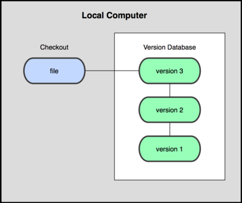
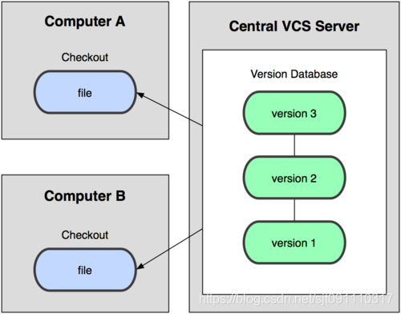
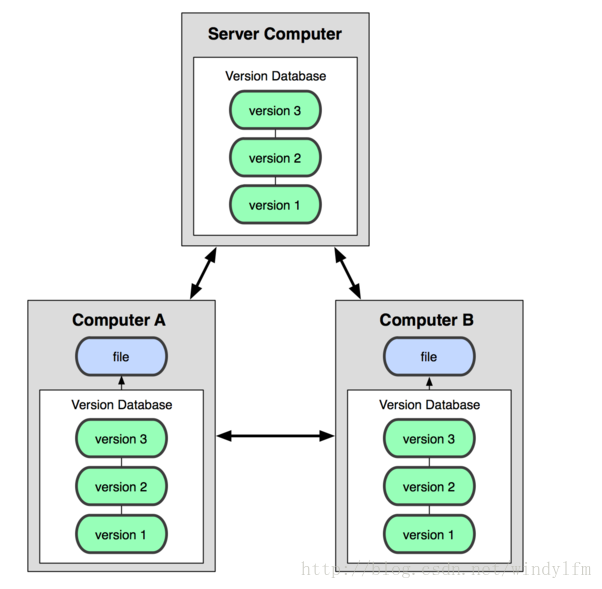
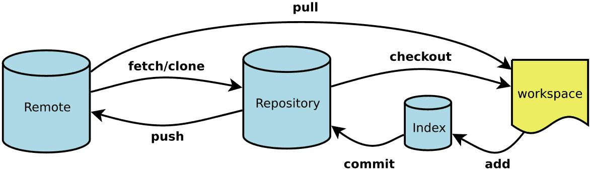
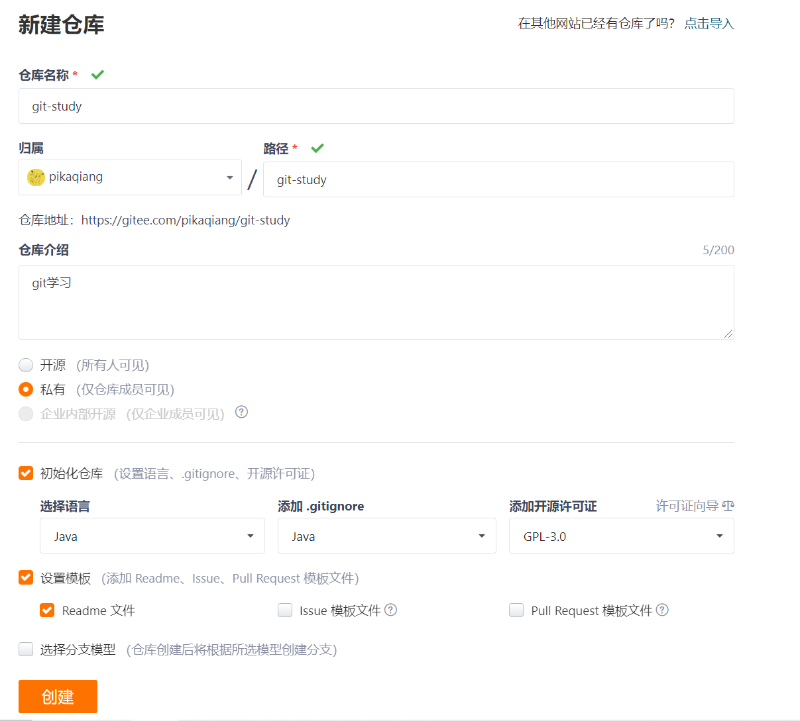

# Git

## 版本控制

> 什么是版本控制

版本控制是一种记录文件内容变化，以便将来查阅特定版本修订情况的系统。版本控制其实最重要的是可以记录文件修改历史记录，从而让用户能够查看历史版本，方便版本切换。

> 为什么需要版本控制

个人开发过渡到团队协作。

> 常见的版本控制工具

- **Git**
- SVN ( Subversion )
- CVS ( Concurrent Versions System )
- VSS ( Microsoft Visual SourceSafe )
- TFS ( Team Foundation Server )
- Visual Studio Online

> 版本控制分类

**1、本地版本控制**

记录文件每次更新，可以对每个版本做一个快照，适合个人用



**2、集中版本控制**

所有的版本数据保存在服务器上，协同开发者从服务器上同步更新或上传自己的修改



所有版本数据都存在服务器上，一旦服务器损坏，就会丢失所有数据，解决方案是定期备份，代表产品：SVN、

CVS、VSS

**3、分布式版本控制**

所有版本信息仓库全部同步到本地用户，这样本地就可以查看历史版本，可以离线本地提交，只需在联网时Push到相应的服务器或其他用户。就算服务器损坏，只要有一个用户的设备没有问题就可以恢复所有的数据，但这增加了本地存储空间的占用，增加了安全隐患，代表产品：Git



> Git与SVN最主要区别

SVN：集中式版本控制是集中存放在中央服务器的，而干活的时候，用的都是自己的电脑，所以要先从中央服务器取得最新的版本，然后开始干活，干完活了，再把自己的活推送给中央服务器。集中式版本控制系统最大的毛病就是必须联网才能工作。

Git：分布式版本控制系统根本没有“中央服务器”，每个人的电脑上都是一个完整的版本库，这样，你工作的时候，就不需要联网了，因为版本库就在你自己的电脑上。比方说你在自己电脑上改了文件A，你的同事也在他的电脑上改了文件A，这时，你们俩之间只需把各自的修改推送给对方，就可以互相看到对方的修改了。


## Git环境配置

> 软件下载

Git官网：https://git-scm.com/

所有东西下载慢的话就去找镜像！

淘宝镜像：https://npm.taobao.org/mirrors/git-for-windows/

安装：无脑下一步即可！

> 软件卸载

1、删除Git的环境变量

2、卸载Git程序

> Git软件介绍

安装成功后开始菜单项中会有Git项，下面解释一下：

**Git Bash**：Unix与Linux风格的命令行，使用最多，推荐最多

**Git CMD**：Windows风格的命令行

**Git GUI**：图形界面的Git，不建议初学者使用，尽量先熟悉命令

> Git配置

1、查看配置`git config -l`

2、查看系统配置`git config --system --list`

3、查看用户自定义配置`git config --global --list`

> 设置用户名与邮箱(**必须**)

当你安装Git后首先要做的就是设置用户名称和e-mail地址。因为每次Git提交都会使用该信息，它被永远的嵌入到了你的提交当中：

```bash
git config --global user.name "pikaqiang"
git config --global user.email a2529299417@126.com
```


## Git基本理论(核心)

> 工作区域

Git本地有三个工作区域：工作目录(Working Directory)、暂存区(Stage/Index)、资源库(Repository/Git Directory)。如果再加上远程的git仓库(Remote Directory)就可以分为四五个区域。文件在这四个区域之间的转换关系如下：

 

- **Workspace：工作区**，就是你平时存放项目代码的地方，比如你的项目目录
- **Index / Stage：暂存区**，用于临时存放你的改动，事实上它只是一个文件，保存即将提交到文件列表信息
- **Repository：仓库区（或本地仓库）**，就是安全存放数据的位置，这里面有你提交到所有版本的数据。其中HEAD指向最新放入仓库的版本
- **Remote：远程仓库**，托管代码的服务器，可以简单的认为是你项目组中的一台电脑用于远程数据交换


> 工作流程

git的工作流程一般是这样的：

1、在工作目录添加、修改文件

2、将需要进行版本管理的文件放入暂存区域

3、将暂存区域的文件提交到git仓库

因此，git管理的文件有三种状态：已修改(Modified)，已暂存(staged)，已提交(committed)

 


## Git项目搭建

> 创建工作目录与常用指令

工作目录(WorkSpace)可以是你项目的目录，也可以是一个空目录，日常只要记住下图6个命令：



> 本地仓库创建

1、在一个目录下初始化

```bash
$ git init
```

2、执行后，该目录会生成一个.git目录，这个目录就是作为本地仓库


> 克隆远程仓库

1、将远程服务器上的仓库克隆到本地

```bash
$ git clone [url]
```

2、执行后，项目克隆到当前目录


## Git文件操作

> 文件4种状态

版本控制就是对文件的版本控制，要对文件进行修改、提交操作，首先要知道文件当前在什么状态

- **Untracked**: 未跟踪, 此文件在文件夹中, 但并没有加入到git库, 不参与版本控制. 通过`git add` 状态变为Staged.

- **Unmodify**: 文件已经入库, 未修改, 即版本库中的文件快照内容与文件夹中完全一致. 这种类型的文件有两种去处, 如果它被修改, 而变为Modified. 如果使用`git rm`移出版本库, 则成为Untracked文件

- **Modified**: 文件已修改, 仅仅是修改, 并没有进行其他的操作. 这个文件也有两个去处, 通过`git add`可进入暂存staged状态, 使用`git checkout` 则丢弃修改过, 返回到unmodify状态, 这个`git checkout`即从库中取出文件, 覆盖当前修改 !

- **Staged**: 暂存状态. 执行`git commit`则将修改同步到库中, 这时库中的文件和本地文件又变为一致, 文件为Unmodify状态. 执行`git reset HEAD filename`取消暂存, 文件状态为Modified


> 文件相关操作

1、设置当前文件夹为git目录

```bash
$ git init
```

2、新建hello.txt文件

```bash
$ touch hello.txt
```

3、查看所有文件状态

```bash
$ git status
```

发现hello.txt处于Untracked状态

4、将所有文件提交到暂存区

```bash
$ git add .
```

执行步骤3后发现，文件处于待提交状态

5、将所有文件提交到本地仓库

```bash
$ git commit -m "message"
```

查看文件状态，发现已全部提交

6、将项目提交到远程仓库

```bash
git remote add origin 你的远程库地址  // 把本地库与远程库关联
git push -u origin master    // 第一次推送时
git push origin master  // 第一次推送后，直接使用该命令即可推送修改
```

把本地库的内容推送到远程。使用 git push命令，实际上是把当前分支master推送到远程

7、配置SSH

https://blog.csdn.net/u013778905/article/details/83501204


> 忽略文件

在工程中，并不是所有文件都需要保存到版本库中的，例如“target”目录及目录下的文件就可以忽略。在Git工作区的根目录下创建一个特殊的.gitignore文件，然后把要忽略的文件名填进去，Git就会自动忽略这些文件或目录。

1、在主目录建立`.gitignore`文件，此文件有如下规则：

```txt
#               表示此为注释,将被Git忽略
*.a             表示忽略所有 .a 结尾的文件
!lib.a          表示但lib.a除外
/TODO           表示仅仅忽略项目根目录下的 TODO 文件，不包括 subdir/TODO
build/          表示忽略 build/目录下的所有文件，过滤整个build文件夹；
doc/*.txt       表示会忽略doc/notes.txt但不包括 doc/server/arch.txt
 
bin/:           表示忽略当前路径下的bin文件夹，该文件夹下的所有内容都会被忽略，不忽略 bin 文件
/bin:           表示忽略根目录下的bin文件
/*.c:           表示忽略cat.c，不忽略 build/cat.c
debug/*.obj:    表示忽略debug/io.obj，不忽略 debug/common/io.obj和tools/debug/io.obj
**/foo:         表示忽略/foo,a/foo,a/b/foo等
a/**/b:         表示忽略a/b, a/x/b,a/x/y/b等
!/bin/run.sh    表示不忽略bin目录下的run.sh文件
*.log:          表示忽略所有 .log 文件
config.php:     表示忽略当前路径的 config.php 文件
 
/mtk/           表示过滤整个文件夹
*.zip           表示过滤所有.zip文件
/mtk/do.c       表示过滤某个具体文件
 
被过滤掉的文件就不会出现在git仓库中（gitlab或github）了，当然本地库中还有，只是push的时候不会上传。
 
需要注意的是，gitignore还可以指定要将哪些文件添加到版本管理中，如下：
!*.zip
!/mtk/one.txt
 
唯一的区别就是规则开头多了一个感叹号，Git会将满足这类规则的文件添加到版本管理中。为什么要有两种规则呢？
想象一个场景：假如我们只需要管理/mtk/目录中的one.txt文件，这个目录中的其他文件都不需要管理，那么.gitignore规则应写为：：
/mtk/*
!/mtk/one.txt
 
假设我们只有过滤规则，而没有添加规则，那么我们就需要把/mtk/目录下除了one.txt以外的所有文件都写出来！
注意上面的/mtk/*不能写为/mtk/，否则父目录被前面的规则排除掉了，one.txt文件虽然加了!过滤规则，也不会生效！
 
----------------------------------------------------------------------------------
还有一些规则如下：
fd1/*
说明：忽略目录 fd1 下的全部内容；注意，不管是根目录下的 /fd1/ 目录，还是某个子目录 /child/fd1/ 目录，都会被忽略；
 
/fd1/*
说明：忽略根目录下的 /fd1/ 目录的全部内容；
 
/*
!.gitignore
!/fw/ 
/fw/*
!/fw/bin/
!/fw/sf/
说明：忽略全部内容，但是不忽略 .gitignore 文件、根目录下的 /fw/bin/ 和 /fw/sf/ 目录；注意要先对bin/的父目录使用!规则，使其不被排除。
```

> java项目常用的忽略文件

```txt
# Compiled class file
*.class

# Eclipse
.project
.classpath
.settings/

# Intellij
*.ipr
*.iml
*.iws
.idea/

# Maven
target/

# Gradle
build
.gradle

# Log file
*.log
log/

# out
**/out/

# Mac
.DS_Store

# others
*.jar
*.war
*.zip
*.tar
*.tar.gz
*.pid
*.orig
*.lock
*.ear
temp/
```


## 使用码云

> 尝试一下：使用Gitlab搭建自己的git服务器

1、注册、登录码云，完善基本信息

2、设置本机绑定SSH公钥，实现免密登录

```bash
#生成加密公钥
ssh-keygen -t rsa
```

3、将生成的公钥`id_rsa.pub`内容粘贴到码云的SSH公钥，位置在你点击git bash的目录

4、添加成功


> 创建仓库




> 如何寻找开源项目

1、打开码云，选择开源软件，克隆感兴趣的项目到本地即可！

2、关注开源项目的版权信息，商用收费


## IDEA集成Git操作

1、创建一个`springboot项目`，项目位置在工作区

2、绑定`git`，将从远程clone下来的项目内容，复制到新建项目中即可，此时idea右上角会有Git操作的快捷键

3、修改项目后，在`terminal`执行相关的操作命令即可


## Git分支

> Git分支常用命令

```bash
# 列出所有本地分支
$ git branch
# 列出所有远程分支
$ git branch -r
# 列出所有本地分支和远程分支
$ git branch -a
# 新建一个分支，但依然停留在当前分支
$ git branch [branch-name]
# 新建一个分支，并切换到该分支
$ git checkout -b [branch]
# 新建一个分支，指向指定commit
$ git branch [branch] [commit]
# 新建一个分支，与指定的远程分支建立追踪关系
$ git branch --track [branch] [remote-branch]
# 切换到指定分支，并更新工作区
$ git checkout [branch-name]
# 切换到上一个分支
$ git checkout -
# 建立追踪关系，在现有分支与指定的远程分支之间
$ git branch --set-upstream [branch] [remote-branch]
# 合并指定分支到当前分支
$ git merge [branch]
# 选择一个commit，合并进当前分支
$ git cherry-pick [commit]
# 删除分支
$ git branch -d [branch-name]
# 删除远程分支
$ git push origin --delete [branch-name]
$ git branch -dr [remote/branch]
# 检出版本v2.0
$ git checkout v2.0
# 从远程分支develop创建新本地分支devel并检出
$ git checkout -b devel origin/develop
# 检出head版本的README文件（可用于修改错误回退）
git checkout -- README 
```

> 对分支的理解

假设现在A、B、C三个分支并行开发，其中B需要调用A的代码，B将A的代码修改了，当A组进行开发时，首先将A分支clone下来，然后合并分支，此时会产生冲突，这时候就需要A、B协商解决


## Git协同开发流程


