# JPA

## 概述

> 什么是ORM规范？

ORM的全称是Object Relational Mapping，即对象关系映射。其核心思想是将关系数据库中表的数据映射成为对象，方便开发人员以面向对象的思想来实现对数据库的操作。


> 什么是JPA？

JPA全称Java persistence api，即java持久层应用接口，是一种ORM规范，实现该规范的框架有Hibernate、TopLink、iBatis等。

你可以这样理解：一开始不同的厂商对于javabean与数据库的交互有着不同的方法，而jpa统一了这些crud方法，即对所有厂商暴露crud接口，因此称它为一种规范，而hibernate等orm框架在该规范的基础上又增加了自己的一些功能，也就是该规范的实现。而Spring Data Jpa为了能够统一应用不同orm框架的功能，又将这些框架的功能统一成接口。

这样设计利用的是依赖倒置原则和外观模式！


> JPA与Hibernate的关系

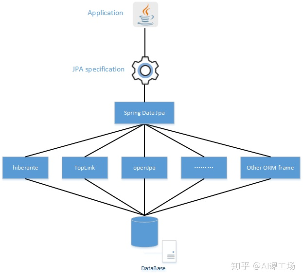


## JPA实体

### 创建实体

> 导入jpa相关依赖

```xml
<?xml version="1.0" encoding="UTF-8"?>
<project xmlns="http://maven.apache.org/POM/4.0.0"
         xmlns:xsi="http://www.w3.org/2001/XMLSchema-instance"
         xsi:schemaLocation="http://maven.apache.org/POM/4.0.0 http://maven.apache.org/xsd/maven-4.0.0.xsd">
    <modelVersion>4.0.0</modelVersion>

    <groupId>cn.pikaqiang</groupId>
    <artifactId>jpa-learning</artifactId>
    <version>1.0-SNAPSHOT</version>

    <properties>
        <hibernate.version>5.2.17.Final</hibernate.version>
        <mysql.version>8.0.11</mysql.version>
        <goda.time.version>2.9.9</goda.time.version>
        <lombok.version>1.18.20</lombok.version>
    </properties>

    <dependencies>
        <!-- jpa相关 -->
        <dependency>
            <groupId>org.hibernate</groupId>
            <artifactId>hibernate-core</artifactId>
            <version>${hibernate.version}</version>
        </dependency>

        <dependency>
            <groupId>org.hibernate</groupId>
            <artifactId>hibernate-entitymanager</artifactId>
            <version>${hibernate.version}</version>
        </dependency>

        <dependency>
            <groupId>mysql</groupId>
            <artifactId>mysql-connector-java</artifactId>
            <version>${mysql.version}</version>
        </dependency>
        <dependency>
            <groupId>joda-time</groupId>
            <artifactId>joda-time</artifactId>
            <version>${goda.time.version}</version>
        </dependency>

        <dependency>
            <groupId>org.jadira.usertype</groupId>
            <artifactId>usertype.core</artifactId>
            <version>6.0.1.GA</version>
        </dependency>

        <!--lombok-->
        <dependency>
            <groupId>org.projectlombok</groupId>
            <artifactId>lombok</artifactId>
            <version>${lombok.version}</version>
        </dependency>

    </dependencies>


</project>
```


> 创建实体对象

```java
package cn.pikaqiang.entity;

import lombok.AllArgsConstructor;
import lombok.Data;
import lombok.NoArgsConstructor;

import javax.persistence.*;


@NoArgsConstructor
@AllArgsConstructor
@Data
@Entity
@Table(name = "student")
public class Student {

    @Id
    private int s_id;

    private String s_name;

    private int s_age;

}
```


> xml配置ORM映射关系----persistence.xml

```xml
<?xml version="1.0" encoding="UTF-8"?>
<persistence version="2.1"
             xmlns="http://xmlns.jcp.org/xml/ns/persistence"
             xmlns:xsi="http://www.w3.org/2001/XMLSchema-instance"
             xsi:schemaLocation="http://xmlns.jcp.org/xml/ns/persistence http://xmlns.jcp.org/xml/ns/persistence/persistence_2_1.xsd">
    <persistence-unit name="Student_details">
        <class>cn.pikaqiang.entity.Student</class>
        <properties>
            <property name="javax.persistence.jdbc.driver"
                      value="com.mysql.cj.jdbc.Driver" />
            <property name="javax.persistence.jdbc.url"
                      value="jdbc:mysql://localhost:3306/schema?useUnicode=true&amp;characterEncoding=utf8&amp;useSSL=false&amp;serverTimezone=Asia/Shanghai&amp;allowPublicKeyRetrieval=true" />
            <property name="javax.persistence.jdbc.user" value="root" />
            <property name="javax.persistence.jdbc.password" value="root" />
        </properties>
    </persistence-unit>

</persistence>
```


> 测试插入数据

```x
package cn.pikaqiang.jpatest;

import cn.pikaqiang.entity.Student;

import javax.persistence.EntityManager;
import javax.persistence.EntityManagerFactory;
import javax.persistence.Persistence;

public class StudentTest {

    public static void main(String args[]) {
        // 读取xml文件创建工厂
        EntityManagerFactory emf = Persistence.createEntityManagerFactory("Student_details");
        // 创建实体管理器
        EntityManager em = emf.createEntityManager();
        // 实体管理器开启事务
        em.getTransaction().begin();

        Student s1 = new Student();
        s1.setS_id(1001);
        s1.setS_name("Maxsu");
        s1.setS_age(26);

        Student s2 = new Student();
        s2.setS_id(1102);
        s2.setS_name("Yiibai");
        s2.setS_age(23);

        Student s3 = new Student();
        s3.setS_id(1003);
        s3.setS_name("James");
        s3.setS_age(28);
        // 插入数据
        em.persist(s1);
        em.persist(s2);
        em.persist(s3);
        // 提交事务
        em.getTransaction().commit();

        // 关闭实体管理器和实体工厂
        em.close();
        emf.close();

        System.out.println("All job done.");

    }

}
```

执行后出现异常，暂时解决不了

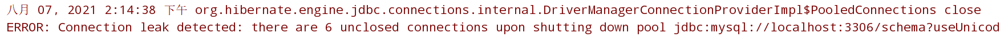

能够成功插入数据库

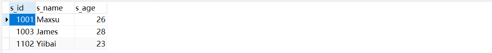


### 查找实体

测试查找实体

```java
package cn.pikaqiang.entity;

import javax.persistence.*;

public class FindStudent {

    public static void main(String args[]) {
        // 读取xml文件创建实体管理工厂
        EntityManagerFactory emf = Persistence.createEntityManagerFactory("Student_details");
        // 创建一个实体管理器
        EntityManager em = emf.createEntityManager();
        // 根据id查找学生
        Student s = em.find(Student.class, 1001);
        // 打印该学生的信息
        System.out.println("Student id = " + s.getS_id());
        System.out.println("Student Name = " + s.getS_name());
        System.out.println("Student Age = " + s.getS_age());

    }
}
```


### 更新实体

修改学生的年龄

```java
package cn.pikaqiang.entity;

import javax.persistence.*;


public class UpdateStudent {

    public static void main(String args[]) {
        EntityManagerFactory emf = Persistence.createEntityManagerFactory("Student_details");
        EntityManager em = emf.createEntityManager();

        Student s = em.find(Student.class, 1001);
        System.out.println("Before Updation");
        System.out.println("Student id = " + s.getS_id());
        System.out.println("Student Name = " + s.getS_name());
        System.out.println("Student Age = " + s.getS_age());

        s.setS_age(30);

        System.out.println("After Updation");
        System.out.println("Student id = " + s.getS_id());
        System.out.println("Student Name = " + s.getS_name());
        System.out.println("Student Age = " + s.getS_age());

    }

}
```

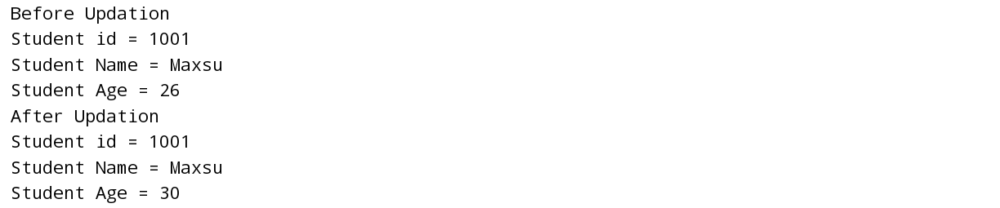


### 删除实体

删除编号为1001的学生

```java
package cn.pikaqiang.entity;

import javax.persistence.EntityManager;
import javax.persistence.EntityManagerFactory;
import javax.persistence.Persistence;

public class DeleteStudent {

    public static void main(String args[]) {
        EntityManagerFactory emf = Persistence.createEntityManagerFactory("Student_details");
        EntityManager em = emf.createEntityManager();
        // 开启事务
        em.getTransaction().begin();

        Student s = em.find(Student.class, 1001);
        em.remove(s);
        // 事务提交
        em.getTransaction().commit();
        // 关闭实体管理和实体管理工厂
        em.close();
        emf.close();
    }
}
```

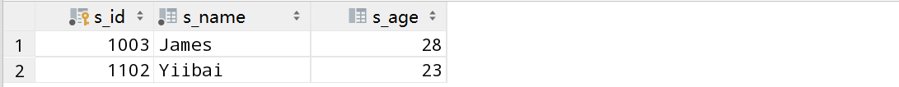


## 集合映射

### 集合类型

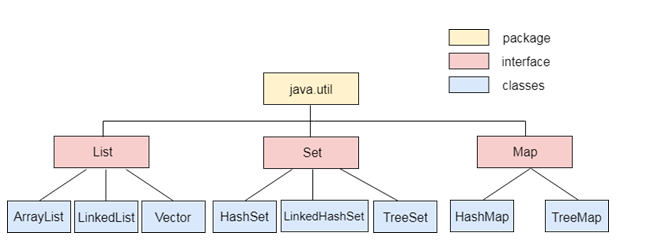

`java.util`包中包含集合框架的所有类和接口。


### 列表映射

> 什么是列表映射？

列表(List)是一个用于基于索引插入和删除元素的接口


> 列表映射的使用

1、创建Address类，作为列表的嵌入式对象

```java
package cn.pikaqiang.entity.employee;

import javax.persistence.Embeddable;

@Embeddable
public class Address {

    private int e_pincode;
    private String e_city;
    private String e_state;

    public int getE_pincode() {
        return e_pincode;
    }

    public void setE_pincode(int e_pincode) {
        this.e_pincode = e_pincode;
    }

    public String getE_city() {
        return e_city;
    }

    public void setE_city(String e_city) {
        this.e_city = e_city;
    }

    public String getE_state() {
        return e_state;
    }

    public void setE_state(String e_state) {
        this.e_state = e_state;
    }

}
```

2、创建员工类，包含列表，其中列表嵌入了Address

```java
package cn.pikaqiang.entity.employee;

import javax.persistence.*;
import java.util.ArrayList;
import java.util.List;

@Entity
@Table(name = "employee")
public class Employee {

    @Id
    private int e_id;
    private String e_name;

    @ElementCollection
    private List<Address> address = new ArrayList<Address>();

    public int getE_id() {
        return e_id;
    }

    public void setE_id(int e_id) {
        this.e_id = e_id;
    }

    public String getE_name() {
        return e_name;
    }

    public void setE_name(String e_name) {
        this.e_name = e_name;
    }

    public List<Address> getAddress() {
        return address;
    }

    public void setAddress(List<Address> address) {
        this.address = address;
    }
}

```

3、将实体类映射到`persistence.xml`

```xml
<?xml version="1.0" encoding="UTF-8"?>
<persistence version="2.1"
             xmlns="http://xmlns.jcp.org/xml/ns/persistence"
             xmlns:xsi="http://www.w3.org/2001/XMLSchema-instance"
             xsi:schemaLocation="http://xmlns.jcp.org/xml/ns/persistence http://xmlns.jcp.org/xml/ns/persistence/persistence_2_1.xsd">
    <persistence-unit name="Collection_Type">
        <class>cn.pikaqiang.entity.employee.Employee</class>
        <class>cn.pikaqiang.entity.employee.Address</class>
        <properties>
            <property name="javax.persistence.jdbc.driver"
                      value="com.mysql.cj.jdbc.Driver" />
            <property name="javax.persistence.jdbc.url"
                      value="jdbc:mysql://localhost:3306/schema?useUnicode=true&amp;characterEncoding=utf8&amp;
                      useSSL=false&amp;serverTimezone=Asia/Shanghai&amp;allowPublicKeyRetrieval=true" />
            <property name="javax.persistence.jdbc.user" value="root" />
            <property name="javax.persistence.jdbc.password" value="root" />
            <!--配置自动创建表格-->
            <property name="hibernate.hbm2ddl.auto" value="update" />
        </properties>
    </persistence-unit>

</persistence>
```

4、测试类

```java
package cn.pikaqiang.testEmployee;

import cn.pikaqiang.entity.employee.Address;
import cn.pikaqiang.entity.employee.Employee;

import javax.persistence.EntityManager;
import javax.persistence.EntityManagerFactory;
import javax.persistence.Persistence;

public class ListMapping {

    public static void main(String[] args) {

        EntityManagerFactory emf = Persistence.createEntityManagerFactory("Collection_Type");
        EntityManager em = emf.createEntityManager();

        System.out.println("Start work...");
        em.getTransaction().begin();

        Address a1 = new Address();
        a1.setE_pincode(201301);
        a1.setE_city("Guangzhou");
        a1.setE_state("GuangDong");

        Address a2 = new Address();
        a2.setE_pincode(302001);
        a2.setE_city("Haikou");
        a2.setE_state("Hainan");

        Employee e1 = new Employee();
        e1.setE_id(1);
        e1.setE_name("Maxsu");
        e1.getAddress().add(a1);

        Employee e2 = new Employee();
        e2.setE_id(2);
        e2.setE_name("John");
        e2.getAddress().add(a2);

        // 保存数据至数据库
        em.persist(e1);
        em.persist(e2);

        em.getTransaction().commit();

        em.close();
        emf.close();
        System.out.println("End work...");

    }

}
```

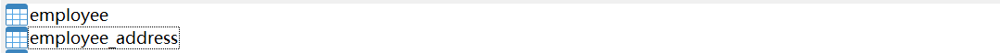

发现数据库中生成了员工表和员工与嵌入式对象关系表

 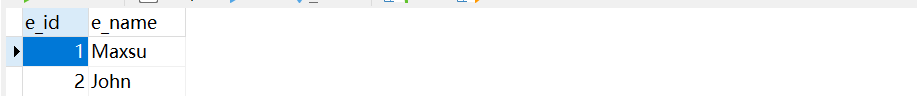

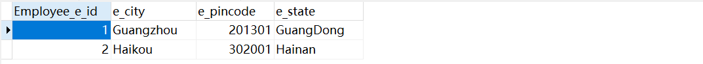

每个员工对象与嵌入式对象的关系由一张表来描述，或者说这张表就是List集合中的内容


### Set映射

集合(Set)是一个包含唯一元素的接口。 这些元素不保留任何顺序。当需要以无序方式检索唯一元素时，可以使用`Set`。

Set映射的使用与List一致，它们只是特性不同。


### Map映射

同上


## 映射类型

### 一对一映射

> 什么是一对一映射？

一对一映射映射表示一个单值关联，其中一个实体的实例与另一个实体的实例相关联。


> 一对一映射的使用

场景：创建一个学生和图书库之间的一对一关系，这样一个学生只能发放一种类型的图书。

1、创建学生类

```java
package cn.pikaqiang.entity.student;

import lombok.AllArgsConstructor;
import lombok.Data;
import lombok.NoArgsConstructor;

import javax.persistence.*;


@NoArgsConstructor
@AllArgsConstructor
@Data
@Entity
@Table(name = "student")
public class Student {

    @Id
    private int s_id;

    private String s_name;

}
```

2、创建图书馆类

```java
package cn.pikaqiang.entity.student;

import lombok.AllArgsConstructor;
import lombok.Data;
import lombok.NoArgsConstructor;

import javax.persistence.Entity;
import javax.persistence.GenerationType;
import javax.persistence.Id;
import javax.persistence.OneToOne;

@NoArgsConstructor
@AllArgsConstructor
@Data
@Entity
public class Library {

    @Id
    private int b_id;
    private String b_name;

    @OneToOne
    private Student stud;
}
```

3、persistence.xml配置

```xml
<?xml version="1.0" encoding="UTF-8"?>
<persistence version="2.1"
             xmlns="http://xmlns.jcp.org/xml/ns/persistence"
             xmlns:xsi="http://www.w3.org/2001/XMLSchema-instance"
             xsi:schemaLocation="http://xmlns.jcp.org/xml/ns/persistence http://xmlns.jcp.org/xml/ns/persistence/persistence_2_1.xsd">
    <persistence-unit name="Book_issued">
        <class>cn.pikaqiang.entity.student.Student</class>
        <class>cn.pikaqiang.entity.student.Library</class>
        <properties>
            <property name="javax.persistence.jdbc.driver"
                      value="com.mysql.cj.jdbc.Driver" />
            <property name="javax.persistence.jdbc.url"
                      value="jdbc:mysql://localhost:3306/schema?useUnicode=true&amp;characterEncoding=utf8&amp;
                      useSSL=false&amp;serverTimezone=Asia/Shanghai&amp;allowPublicKeyRetrieval=true" />
            <property name="javax.persistence.jdbc.user" value="root" />
            <property name="javax.persistence.jdbc.password" value="root" />
            <!--配置自动创建表格-->
            <property name="hibernate.hbm2ddl.auto" value="update" />
        </properties>
    </persistence-unit>
</persistence>
```

4、测试类

```java
package cn.pikaqiang.testStudent;

import cn.pikaqiang.entity.student.Library;
import cn.pikaqiang.entity.student.Student;

import javax.persistence.EntityManager;
import javax.persistence.EntityManagerFactory;
import javax.persistence.Persistence;

public class StudentTest {

    public static void main(String args[]) {
        EntityManagerFactory emf = Persistence.createEntityManagerFactory("Book_issued");
        EntityManager em = emf.createEntityManager();
        em.getTransaction().begin();

        Student st1 = new Student();
        st1.setS_id(1);
        st1.setS_name("Maxsu");

        Student st2 = new Student();
        st2.setS_id(2);
        st2.setS_name("James");

        em.persist(st1);
        em.persist(st2);

        Library lib1 = new Library();
        lib1.setB_id(101);
        lib1.setB_name("Data Structure");
        lib1.setStud(st1);

        Library lib2 = new Library();
        lib2.setB_id(102);
        lib2.setB_name("DBMS");
        lib2.setStud(st2);

        em.persist(lib1);
        em.persist(lib2);

        em.getTransaction().commit();

        em.close();
        emf.close();

    }
}
```


### 一对多映射

场景：创建一个学生和图书库之间的一对多系，这样一个学生能发放多种类型的图书。

类似于之前的一对一映射，这里使用的注解为`@OneToMany(targetEntity = Entity.class) `

即一个学生对应多种类型的图书，在一的一方维护数据关系。


### 多对一映射

场景：创建一个学生和图书库之间的多对一关系，多个学生可以发同一本书。

使用的注解为：`@ManyToOne`

这里是在多的一方维护数据关系


### 多对多映射

场景：创建学生和图书馆之间的多对多关系，以便可以为任何数量的学生发放任何类型的书籍。

学生和图书馆均需要维护各自信息

```java
// 学生类
@ManyToMany(targetEntity = Library.class)
private List lib;

// 图书馆
@ManyToMany(targetEntity = Student.class)
private List stud;
```


## 级联操作

### 概述

> 什么是级联操作？

在JPA中，如果对实体应用了任何操作，那么它只会在该特定实体上执行。 这些操作不适用于与其相关的其他实体。

为了建立相关实体之间的依赖关系，JPA提供了定义级联操作的`javax.persistence.CascadeType`枚举类型。 这些级联操作可以用任何类型的映射来定义，即一对一，一对多，多对一，多对多。


> 级联枚举

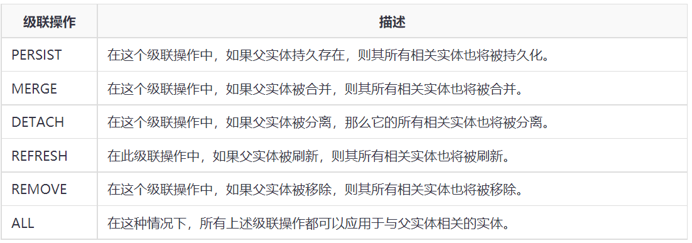


### 级联持久化

> 什么是级联持久化？

级联持久化用于指定如果实体持久化，则其所有关联的子实体也将被持久化。而持久化是将程序数据在[持久](https://baike.baidu.com/item/持久/5702771)状态和[瞬时](https://baike.baidu.com/item/瞬时/3471916)状态间转换的**一种机制**。


> 级联持久化的使用

场景：学生类与其课程类作级联操作

1、建立课程类

```java
package cn.pikaqiang.entity.student;

import lombok.AllArgsConstructor;
import lombok.Data;
import lombok.NoArgsConstructor;

import javax.persistence.Entity;
import javax.persistence.Id;
import javax.persistence.Table;

@NoArgsConstructor
@AllArgsConstructor
@Data
@Entity
@Table(name = "subject")
public class Subject {

    @Id
    private int s_id;
    private String name;
    private int marks;

}
```

2、建立学生类，设置级联操作

```java
package cn.pikaqiang.entity.student;

import lombok.AllArgsConstructor;
import lombok.Data;
import lombok.NoArgsConstructor;

import javax.persistence.*;

@NoArgsConstructor
@AllArgsConstructor
@Data
@Entity
@Table(name = "student")
public class Student {

    @Id
    private int s_id;
    private String s_name;
    private int s_age;

    @OneToOne(cascade = CascadeType.PERSIST)
    private Subject sub;
}
```

3、persistence.xml配置

```xml
<?xml version="1.0" encoding="UTF-8"?>
<persistence version="2.1"
             xmlns="http://xmlns.jcp.org/xml/ns/persistence"
             xmlns:xsi="http://www.w3.org/2001/XMLSchema-instance"
             xsi:schemaLocation="http://xmlns.jcp.org/xml/ns/persistence http://xmlns.jcp.org/xml/ns/persistence/persistence_2_1.xsd">
    <persistence-unit name="Student_details">
        <class>cn.pikaqiang.entity.student.Student</class>
        <class>cn.pikaqiang.entity.student.Subject</class>
        <properties>
            <property name="javax.persistence.jdbc.driver"
                      value="com.mysql.cj.jdbc.Driver" />
            <property name="javax.persistence.jdbc.url"
                      value="jdbc:mysql://localhost:3306/schema?useUnicode=true&amp;characterEncoding=utf8&amp;
                      useSSL=false&amp;serverTimezone=Asia/Shanghai&amp;allowPublicKeyRetrieval=true" />
            <property name="javax.persistence.jdbc.user" value="root" />
            <property name="javax.persistence.jdbc.password" value="root" />
            <!--配置自动创建表格-->
            <property name="hibernate.hbm2ddl.auto" value="update" />
        </properties>
    </persistence-unit>

</persistence>
```

4、测试类

```java
package cn.pikaqiang.testStudent;

import cn.pikaqiang.entity.student.Library;
import cn.pikaqiang.entity.student.Student;
import cn.pikaqiang.entity.student.Subject;

import javax.persistence.EntityManager;
import javax.persistence.EntityManagerFactory;
import javax.persistence.Persistence;

public class StudentTest {

    public static void main(String args[]) {
        EntityManagerFactory emf = Persistence.createEntityManagerFactory("Student_details");

        EntityManager em = emf.createEntityManager();
        em.getTransaction().begin();

        Student s1 = new Student();
        s1.setS_id(101);
        s1.setS_name("Maxsu");
        s1.setS_age(20);

        Student s2 = new Student();
        s2.setS_id(102);
        s2.setS_name("James");
        s2.setS_age(22);

        Subject sb1 = new Subject();
        sb1.setName("ENGLISH");
        sb1.setMarks(80);
        sb1.setS_id(s1.getS_id());

        Subject sb2 = new Subject();
        sb2.setName("Maths");
        sb2.setMarks(75);
        sb2.setS_id(s2.getS_id());

        s1.setSub(sb1);
        s2.setSub(sb2);

        em.persist(s1);
        em.persist(s2);

        em.getTransaction().commit();

        em.close();
        emf.close();
    }

}
```

 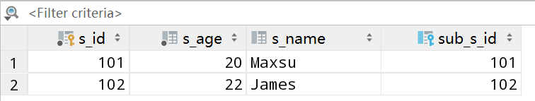

 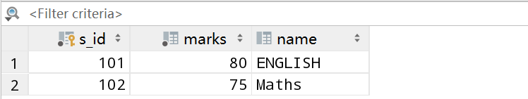

可以发现，当学生类被持久化后，其课程类Subject因为级联持久化也被持久化了。


### 级联删除

> 什么是级联删除？

级联移除用于指定如果父实体被移除，则其所有相关实体也将被移除。


> 语法

```sql
@OneToOne(cascade=CascadeType.REMOVE)
```


## JPQL

### 概述

> 什么是JPQL？

JPQL(Java持久性查询语言)是一种面向对象的查询语言，JPQL不使用数据库表，而是使用实体对象模型来操作SQL查询。 这里，JPA的作用是将JPQL转换为SQL。


### 查询

> 动态查询

所谓动态查询是sql并未明确指出，通常将sql封装为string放到方法里去执行。

1、学生类

```java
package cn.pikaqiang.entity.student;

import lombok.AllArgsConstructor;
import lombok.Data;
import lombok.NoArgsConstructor;

import javax.persistence.*;


@NoArgsConstructor
@AllArgsConstructor
@Data
@Entity
@Table(name = "student")
public class Student {

    @Id
    private int s_id;
    private String s_name;
    private int s_age;

}
```

2、persistence.xml配置文件

```xml
<?xml version="1.0" encoding="UTF-8"?>
<persistence version="2.1"
             xmlns="http://xmlns.jcp.org/xml/ns/persistence"
             xmlns:xsi="http://www.w3.org/2001/XMLSchema-instance"
             xsi:schemaLocation="http://xmlns.jcp.org/xml/ns/persistence http://xmlns.jcp.org/xml/ns/persistence/persistence_2_1.xsd">
    <persistence-unit name="Student_details">
        <class>cn.pikaqiang.entity.student.Student</class>
        <properties>
            <property name="javax.persistence.jdbc.driver"
                      value="com.mysql.cj.jdbc.Driver" />
            <property name="javax.persistence.jdbc.url"
                      value="jdbc:mysql://localhost:3306/schema?useUnicode=true&amp;characterEncoding=utf8&amp;
                      useSSL=false&amp;serverTimezone=Asia/Shanghai&amp;allowPublicKeyRetrieval=true" />
            <property name="javax.persistence.jdbc.user" value="root" />
            <property name="javax.persistence.jdbc.password" value="root" />
            <!--配置自动创建表格-->
            <property name="hibernate.hbm2ddl.auto" value="update" />
        </properties>
    </persistence-unit>

</persistence>
```

3、测试类

```java
package cn.pikaqiang.testStudent;

import cn.pikaqiang.entity.student.Student;

import javax.persistence.EntityManager;
import javax.persistence.EntityManagerFactory;
import javax.persistence.Persistence;
import javax.persistence.Query;
import java.util.List;

public class StudentTest {

    public static void main(String args[]) {

        EntityManagerFactory emf = Persistence.createEntityManagerFactory("Student_details");
        EntityManager em = emf.createEntityManager();
        em.getTransaction().begin();
        String sql = "Select s.s_name from Student s";
        // 执行sql
        Query query = em.createQuery(sql);
        // 获取所有结果，@SuppressWarnings表示：告诉编译器被批注的代码元素内部的某些警告保持静默。
        @SuppressWarnings("unchecked")
        List<String> list = query.getResultList();
        System.out.println("Student Name :");
        for (String s : list) {
            System.out.println(s);

        }
        em.close();
        emf.close();
    }
}
```

结果可以查询出所有的学生名字！


> 静态查询

静态查询就是在实体类上指定要执行的sql，这条sql在查询时是无法被更改的

在学生类上添加

```java
@NamedQuery(name = "find name", query = "Select s from StudentEntity s")
```

执行语句

```java
Query query = em.createNamedQuery("find name");
```


### 批量数据操作

> 准备工作

1、学生类

```java
package cn.pikaqiang.entity.student;

import lombok.AllArgsConstructor;
import lombok.Data;
import lombok.NoArgsConstructor;

import javax.persistence.*;


@NoArgsConstructor
@AllArgsConstructor
@Data
@Entity
@Table(name = "student")
public class Student {

    @Id
    private int s_id;
    private String s_name;
    private int s_age;

}
```

2、persistence.xml配置

```xml
<?xml version="1.0" encoding="UTF-8"?>
<persistence version="2.1"
             xmlns="http://xmlns.jcp.org/xml/ns/persistence"
             xmlns:xsi="http://www.w3.org/2001/XMLSchema-instance"
             xsi:schemaLocation="http://xmlns.jcp.org/xml/ns/persistence http://xmlns.jcp.org/xml/ns/persistence/persistence_2_1.xsd">
    <persistence-unit name="Student_details">
        <class>cn.pikaqiang.entity.student.Student</class>
        <properties>
            <property name="javax.persistence.jdbc.driver"
                      value="com.mysql.cj.jdbc.Driver" />
            <property name="javax.persistence.jdbc.url"
                      value="jdbc:mysql://localhost:3306/schema?useUnicode=true&amp;characterEncoding=utf8&amp;
                      useSSL=false&amp;serverTimezone=Asia/Shanghai&amp;allowPublicKeyRetrieval=true" />
            <property name="javax.persistence.jdbc.user" value="root" />
            <property name="javax.persistence.jdbc.password" value="root" />
            <!--配置自动创建表格-->
            <property name="hibernate.hbm2ddl.auto" value="update" />
        </properties>
    </persistence-unit>

</persistence>
```


> 查询所有的记录

```java
package cn.pikaqiang.testStudent;

import cn.pikaqiang.entity.student.Student;

import javax.persistence.EntityManager;
import javax.persistence.EntityManagerFactory;
import javax.persistence.Persistence;
import javax.persistence.Query;
import java.util.List;

public class StudentTest {

    public static void main(String args[]) {

        EntityManagerFactory emf = Persistence.createEntityManagerFactory("Student_details");
        EntityManager em = emf.createEntityManager();
        em.getTransaction().begin();

        Query query = em.createQuery("Select s from Student s ");

        @SuppressWarnings("unchecked")
        List<Student> list = (List<Student>) query.getResultList();

        System.out.print("s_id");
        System.out.print("\t s_name");
        System.out.println("\t s_age");

        for (Student s : list) {
            System.out.print(s.getS_id());
            System.out.print("\t" + s.getS_name());
            System.out.print("\t" + s.getS_age());
            System.out.println();
        }
        em.getTransaction().commit();
        em.close();
        emf.close();
    }
}
```


> 更新记录

```java
package cn.pikaqiang.testStudent;

import cn.pikaqiang.entity.student.Student;

import javax.persistence.EntityManager;
import javax.persistence.EntityManagerFactory;
import javax.persistence.Persistence;
import javax.persistence.Query;
import java.util.List;

public class StudentTest {

    public static void main(String args[]) {

        EntityManagerFactory emf = Persistence.createEntityManagerFactory("Student_details");
        EntityManager em = emf.createEntityManager();
        em.getTransaction().begin();

        Query query = em.createQuery("update Student SET s_age=25 where s_id>1");
        query.executeUpdate();

        em.getTransaction().commit();
        em.close();
        emf.close();

    }
}
```


> 删除记录

```java
package cn.pikaqiang.testStudent;

import cn.pikaqiang.entity.student.Student;

import javax.persistence.EntityManager;
import javax.persistence.EntityManagerFactory;
import javax.persistence.Persistence;
import javax.persistence.Query;
import java.util.List;

public class StudentTest {

    public static void main(String args[]) {

        EntityManagerFactory emf = Persistence.createEntityManagerFactory("Student_details");
        EntityManager em = emf.createEntityManager();
        em.getTransaction().begin();

        Query query = em.createQuery("delete from Student where s_id=102");

        query.executeUpdate();

        em.getTransaction().commit();
        em.close();
        emf.close();

    }
}
```


### JSQL高级

> 准备工作

1、sql语句

```sql
DROP TABLE IF EXISTS `student`;
CREATE TABLE `student` (
  `S_ID` int(11) NOT NULL,
  `S_NAME` varchar(255) DEFAULT NULL,
  `S_AGE` int(11) DEFAULT NULL,
  PRIMARY KEY (`S_ID`)
) ENGINE=MyISAM DEFAULT CHARSET=utf8;

-- ----------------------------
-- Records of student
-- ----------------------------
INSERT INTO `student` VALUES ('101', 'Gaurav', '24');
INSERT INTO `student` VALUES ('102', 'Rahul', '22');
INSERT INTO `student` VALUES ('103', 'Chris', '20');
INSERT INTO `student` VALUES ('104', 'Ronit', '26');
INSERT INTO `student` VALUES ('105', 'Roy', '21');
```

2、学生类

```java
package cn.pikaqiang.entity.student;

import lombok.AllArgsConstructor;
import lombok.Data;
import lombok.NoArgsConstructor;

import javax.persistence.*;


@NoArgsConstructor
@AllArgsConstructor
@Data
@Entity
@Table(name = "student")
public class Student {

    @Id
    private int s_id;
    private String s_name;
    private int s_age;

}
```

3、persistence.xml配置

```xml
<?xml version="1.0" encoding="UTF-8"?>
<persistence version="2.1"
             xmlns="http://xmlns.jcp.org/xml/ns/persistence"
             xmlns:xsi="http://www.w3.org/2001/XMLSchema-instance"
             xsi:schemaLocation="http://xmlns.jcp.org/xml/ns/persistence http://xmlns.jcp.org/xml/ns/persistence/persistence_2_1.xsd">
    <persistence-unit name="Student_details">
        <class>cn.pikaqiang.entity.student.Student</class>
        <properties>
            <property name="javax.persistence.jdbc.driver"
                      value="com.mysql.cj.jdbc.Driver" />
            <property name="javax.persistence.jdbc.url"
                      value="jdbc:mysql://localhost:3306/schema?useUnicode=true&amp;characterEncoding=utf8&amp;
                      useSSL=false&amp;serverTimezone=Asia/Shanghai&amp;allowPublicKeyRetrieval=true" />
            <property name="javax.persistence.jdbc.user" value="root" />
            <property name="javax.persistence.jdbc.password" value="root" />
            <!--配置自动创建表格-->
            <property name="hibernate.hbm2ddl.auto" value="update" />
        </properties>
    </persistence-unit>

</persistence>
```


> JPQL筛选器

其实就是条件查询

```java
package cn.pikaqiang.testStudent;

import cn.pikaqiang.entity.student.Student;

import javax.persistence.EntityManager;
import javax.persistence.EntityManagerFactory;
import javax.persistence.Persistence;
import javax.persistence.Query;
import java.util.List;

public class StudentTest {

    public static void main(String args[]) {

        EntityManagerFactory emf = Persistence.createEntityManagerFactory("Student_details");
        EntityManager em = emf.createEntityManager();
        em.getTransaction().begin();

        Query q1 = em.createQuery("Select s from Student s where s.s_age between 22 and 28");

        @SuppressWarnings("unchecked")
        List<Student> l1 = (List<Student>) q1.getResultList();

        System.out.println("Between Clause");
        System.out.print("s_id");
        System.out.print("\t s_name");
        System.out.println("\t s_age");

        for (Student s : l1) {
            System.out.print(s.getS_id());
            System.out.print("\t" + s.getS_name());
            System.out.println("\t" + s.getS_age());
        }

        Query q2 = em.createQuery("Select s from Student s where s.s_age IN(20,22,23)");

        @SuppressWarnings("unchecked")
        List<Student> l2 = (List<Student>) q2.getResultList();

        System.out.println("IN Clause");
        System.out.print("s_id");
        System.out.print("\t s_name");
        System.out.println("\t s_age");

        for (Student s : l2) {
            System.out.print(s.getS_id());
            System.out.print("\t" + s.getS_name());
            System.out.println("\t" + s.getS_age());
        }

        Query q3 = em.createQuery("Select s from Student s where s.s_name like '%a%'");

        @SuppressWarnings("unchecked")
        List<Student> l3 = (List<Student>) q3.getResultList();

        System.out.println("Like Clause");
        System.out.print("s_id");
        System.out.print("\t s_name");
        System.out.println("\t s_age");

        for (Student s : l3) {
            System.out.print(s.getS_id());
            System.out.print("\t" + s.getS_name());
            System.out.println("\t" + s.getS_age());
        }

        em.getTransaction().commit();
        em.close();
        emf.close();
    }
}
```


> JPQL聚合

其实就是sql语句中加入了聚合函数


> JPQL排序

其实就是sql语句中加入了排序


## JPA标准API

> 什么是JPA标准API？

Criteria API定义了一个独立于平台的条件查询，用Java编程语言编写，目的是提供一种类型安全的方式来表达查询。


### SELECT子句

1、准备数据库

```sql
DROP TABLE IF EXISTS `student`;
CREATE TABLE `student` (
  `S_ID` int(11) NOT NULL,
  `S_NAME` varchar(255) DEFAULT NULL,
  `S_AGE` int(11) DEFAULT NULL,
  PRIMARY KEY (`S_ID`)
) ENGINE=MyISAM DEFAULT CHARSET=utf8;

-- ----------------------------
-- Records of student
-- ----------------------------
INSERT INTO `student` VALUES ('101', 'Gaurav', '24');
INSERT INTO `student` VALUES ('102', 'Rahul', '22');
INSERT INTO `student` VALUES ('103', 'Chris', '20');
INSERT INTO `student` VALUES ('104', 'Ronit', '26');
INSERT INTO `student` VALUES ('105', 'Roy', '21');
```

2、创建学生类

```java
package cn.pikaqiang.entity.student;

import lombok.AllArgsConstructor;
import lombok.Data;
import lombok.NoArgsConstructor;

import javax.persistence.*;


@NoArgsConstructor
@AllArgsConstructor
@Data
@Entity
@Table(name = "student")
public class Student {

    @Id
    private int s_id;
    private String s_name;
    private int s_age;

}
```

3、persistence.xml配置

```xml
<?xml version="1.0" encoding="UTF-8"?>
<persistence version="2.1"
             xmlns="http://xmlns.jcp.org/xml/ns/persistence"
             xmlns:xsi="http://www.w3.org/2001/XMLSchema-instance"
             xsi:schemaLocation="http://xmlns.jcp.org/xml/ns/persistence http://xmlns.jcp.org/xml/ns/persistence/persistence_2_1.xsd">
    <persistence-unit name="Student_details">
        <class>cn.pikaqiang.entity.student.Student</class>
        <properties>
            <property name="javax.persistence.jdbc.driver"
                      value="com.mysql.cj.jdbc.Driver" />
            <property name="javax.persistence.jdbc.url"
                      value="jdbc:mysql://localhost:3306/schema?useUnicode=true&amp;characterEncoding=utf8&amp;
                      useSSL=false&amp;serverTimezone=Asia/Shanghai&amp;allowPublicKeyRetrieval=true" />
            <property name="javax.persistence.jdbc.user" value="root" />
            <property name="javax.persistence.jdbc.password" value="root" />
            <!--配置自动创建表格-->
            <property name="hibernate.hbm2ddl.auto" value="update" />
        </properties>
    </persistence-unit>

</persistence>
```

4、测试从数据库中获取单列值

```java
package cn.pikaqiang.testStudent;

import cn.pikaqiang.entity.student.Student;

import javax.persistence.*;
import javax.persistence.criteria.CriteriaBuilder;
import javax.persistence.criteria.CriteriaQuery;
import javax.persistence.criteria.Root;
import java.util.List;

public class StudentTest {

    public static void main(String args[]) {

        EntityManagerFactory emf = Persistence.createEntityManagerFactory("Student_details");
        EntityManager em = emf.createEntityManager();
        em.getTransaction().begin();
        // 创建criterabuilder对象
        CriteriaBuilder cb = em.getCriteriaBuilder();
        // 生成具体的查询实例
        CriteriaQuery<Student> cq = cb.createQuery(Student.class);
        // 查询根对象
        Root<Student> stud = cq.from(Student.class);
        // 设定获取单列值
        cq.select(stud.get("s_id"));
        // 传入根对象，返回查询实例
        CriteriaQuery<Student> select = cq.select(stud);
        // 传入查询实例， 返回结果集
        TypedQuery<Student> q = em.createQuery(select);
        // 将结果集转变为list
        List<Student> list = q.getResultList();

        System.out.println("s_id");

        for (Student s : list) {
            System.out.println(s.getS_id());

        }

        em.getTransaction().commit();
        em.close();
        emf.close();

    }
}
```

从数据库中获取单列值，哪里体现了？？？

5、测试从数据库获取多列值

```java
package cn.pikaqiang.testStudent;

import cn.pikaqiang.entity.student.Student;

import javax.persistence.*;
import javax.persistence.criteria.CriteriaBuilder;
import javax.persistence.criteria.CriteriaQuery;
import javax.persistence.criteria.Root;
import java.util.List;

public class StudentTest {

    public static void main(String args[]) {

        EntityManagerFactory emf = Persistence.createEntityManagerFactory("Student_details");
        EntityManager em = emf.createEntityManager();
        em.getTransaction().begin();
        // 创建criterabuilder对象
        CriteriaBuilder cb = em.getCriteriaBuilder();
        // 生成具体的查询实例
        CriteriaQuery<Student> cq = cb.createQuery(Student.class);
        // 查询根对象
        Root<Student> stud = cq.from(Student.class);
        // 设定获取多列值
        cq.multiselect(stud.get("s_id"), stud.get("s_name"), stud.get("s_age"));

        // 传入根对象，返回查询实例
        CriteriaQuery<Student> select = cq.select(stud);
        // 传入查询实例， 返回结果集
        TypedQuery<Student> q = em.createQuery(select);
        // 将结果集转变为list
        List<Student> list = q.getResultList();

        System.out.print("s_id");
        System.out.print("\t s_name");
        System.out.println("\t s_age");

        for (Student s : list) {
            System.out.print(s.getS_id());
            System.out.print("\t" + s.getS_name());
            System.out.println("\t" + s.getS_age());
        }


        em.getTransaction().commit();
        em.close();
        emf.close();

    }
}
```

这有没有`multiselect`都不会影响结果，真搞不明白。


### ORDER BY子句

这里直接给出测试类，其余的与前面相同

```java
package cn.pikaqiang.testStudent;

import cn.pikaqiang.entity.student.Student;

import javax.persistence.*;
import javax.persistence.criteria.CriteriaBuilder;
import javax.persistence.criteria.CriteriaQuery;
import javax.persistence.criteria.Root;
import java.util.List;

public class StudentTest {

    public static void main(String args[]) {

        EntityManagerFactory emf = Persistence.createEntityManagerFactory("Student_details");
        EntityManager em = emf.createEntityManager();
        em.getTransaction().begin();
        // 创建criterabuilder对象
        CriteriaBuilder cb = em.getCriteriaBuilder();
        // 生成具体的查询实例
        CriteriaQuery<Student> cq = cb.createQuery(Student.class);
        // 查询根对象
        Root<Student> stud = cq.from(Student.class);
        // 按年龄升序排序
        cq.orderBy(cb.asc(stud.get("s_age")));
        // 传入根对象，返回查询实例
        CriteriaQuery<Student> select = cq.select(stud);
        // 传入查询实例， 返回结果集
        TypedQuery<Student> q = em.createQuery(select);
        // 将结果集转变为list
        List<Student> list = q.getResultList();

        System.out.print("s_id");
        System.out.print("\t s_name");
        System.out.println("\t s_age");

        for (Student s : list) {
            System.out.print(s.getS_id());
            System.out.print("\t" + s.getS_name());
            System.out.println("\t" + s.getS_age());
        }


        em.getTransaction().commit();
        em.close();
        emf.close();
    }
}
```


### WHERE子句

给定需求查询年龄大于22的学生，下面也仅给出测试类，其余与前面相同

```java
package cn.pikaqiang.testStudent;

import cn.pikaqiang.entity.student.Student;

import javax.persistence.*;
import javax.persistence.criteria.CriteriaBuilder;
import javax.persistence.criteria.CriteriaQuery;
import javax.persistence.criteria.Root;
import java.util.List;

public class StudentTest {

    public static void main(String args[]) {

        EntityManagerFactory emf = Persistence.createEntityManagerFactory("Student_details");
        EntityManager em = emf.createEntityManager();
        em.getTransaction().begin();
        // 创建criterabuilder对象
        CriteriaBuilder cb = em.getCriteriaBuilder();
        // 生成具体的查询实例
        CriteriaQuery<Student> cq = cb.createQuery(Student.class);
        // 查询根对象
        Root<Student> stud = cq.from(Student.class);
        // 查询年龄大于22的学生
        cq.where(cb.greaterThan(stud.get("s_age"), 22));
        // 传入根对象，返回查询实例
        CriteriaQuery<Student> select = cq.select(stud);
        // 传入查询实例， 返回结果集
        TypedQuery<Student> q = em.createQuery(select);
        // 将结果集转变为list
        List<Student> list = q.getResultList();

        System.out.print("s_id");
        System.out.print("\t s_name");
        System.out.println("\t s_age");

        for (Student s : list) {
            System.out.print(s.getS_id());
            System.out.print("\t" + s.getS_name());
            System.out.println("\t" + s.getS_age());
        }

        em.getTransaction().commit();
        em.close();
        emf.close();

    }
}
```

其余的常用方法

```java
// 小于
cq2.where(cb.lessThan(stud2.get("s_age"), 22));
// between
cq.where(cb.between(stud.get("s_age"), 22, 26));
// like
cq.where(cb.like(stud.get("s_name"), "R%"));
// 查询年龄22或24的学生
cq.where(cb.in(stud.get("s_age")).value(22).value(24));
```


### GROUP BY子句

下面给出测试类

```java
package cn.pikaqiang.testStudent;

import cn.pikaqiang.entity.student.Student;

import javax.persistence.*;
import javax.persistence.criteria.CriteriaBuilder;
import javax.persistence.criteria.CriteriaQuery;
import javax.persistence.criteria.Root;
import java.util.List;

public class StudentTest {

    public static void main(String args[]) {

        EntityManagerFactory emf = Persistence.createEntityManagerFactory("Student_details");
        EntityManager em = emf.createEntityManager();
        em.getTransaction().begin();
        // 创建标准构造器对象
        CriteriaBuilder cb = em.getCriteriaBuilder();
        // 创建一个查询实例
        CriteriaQuery<Object[]> cq = cb.createQuery(Object[].class);
        // 获取学生类的根对象
        Root<Student> stud = cq.from(Student.class);
        // 多字段查询，按年龄分组，查询每个年龄对应的学生数量
        cq.multiselect(stud.get("s_age"), cb.count(stud)).groupBy(stud.get("s_age"));

        System.out.print("s_age");
        System.out.println("\t Count");
        List<Object[]> list = em.createQuery(cq).getResultList();
        for (Object[] object : list) {
            System.out.println(object[0] + "     " + object[1]);

        }

        em.getTransaction().commit();
        em.close();
        emf.close();

    }
}
```


### HAVING 子句

在分组的基础上进行筛选，查询年龄为24的学生数量

```java
cq.multiselect(stud.get("s_age"), cb.count(stud)).groupBy(stud.get("s_age"))
                .having(cb.ge(stud.get("s_age"), 24));
```


## JPA继承

### 概述

> JPA继承策略

单表策略

加入策略

每表每类策略


### 单表策略

> 什么是单表策略？

多个实体类的实例仅作为属性存储在单个表中。


> 语法

```java
@Inheritance(strategy=InheritanceType.SINGLE_TABLE)
```


> 单表策略的实现

场景：活跃员工和退休员工，前者继承后者

1、创建员工类

```java
package cn.pikaqiang.entity.employees;

import lombok.AllArgsConstructor;
import lombok.Data;
import lombok.NoArgsConstructor;
import lombok.experimental.SuperBuilder;

import javax.persistence.*;
import java.io.Serializable;

@Entity
@Table(name = "employee_details")
@Inheritance(strategy = InheritanceType.SINGLE_TABLE)
public class Employee implements Serializable {

    @Id
    private int e_id;
    private String e_name;

    public Employee() {
    }

    public Employee(int e_id, String e_name) {
        this.e_id = e_id;
        this.e_name = e_name;
    }

    public int getE_id() {
        return e_id;
    }

    public void setE_id(int e_id) {
        this.e_id = e_id;
    }

    public String getE_name() {
        return e_name;
    }

    public void setE_name(String e_name) {
        this.e_name = e_name;
    }
}
```

2、创建活跃员工类

```java
package cn.pikaqiang.entity.employees;


import javax.persistence.Entity;

@Entity
public class ActiveEmployee extends Employee {

    private int e_salary;
    private int e_experience;

    public ActiveEmployee() {
    }

    public ActiveEmployee(int e_id, String e_name, int e_salary, int e_experience) {
        super(e_id, e_name);
        this.e_salary = e_salary;
        this.e_experience = e_experience;
    }

    public int getE_salary() {
        return e_salary;
    }

    public void setE_salary(int e_salary) {
        this.e_salary = e_salary;
    }

    public int getE_experience() {
        return e_experience;
    }

    public void setE_experience(int e_experience) {
        this.e_experience = e_experience;
    }
}
```

3、创建退休员工类

```java
package cn.pikaqiang.entity.employees;

import lombok.AllArgsConstructor;
import lombok.Data;
import lombok.NoArgsConstructor;

import javax.persistence.Entity;

@Entity
public class RetiredEmployee extends Employee {

    private int e_pension;

    public RetiredEmployee(int e_id, String e_name, int e_pension) {
        super(e_id, e_name);
        this.e_pension = e_pension;
    }

    public RetiredEmployee() {
        super();

    }

    public int getE_pension() {
        return e_pension;
    }

    public void setE_pension(int e_pension) {
        this.e_pension = e_pension;
    }
}
```

4、persistence.xml配置

```xml
<?xml version="1.0" encoding="UTF-8"?>
<persistence version="2.1"
             xmlns="http://xmlns.jcp.org/xml/ns/persistence"
             xmlns:xsi="http://www.w3.org/2001/XMLSchema-instance"
             xsi:schemaLocation="http://xmlns.jcp.org/xml/ns/persistence http://xmlns.jcp.org/xml/ns/persistence/persistence_2_1.xsd">
    <persistence-unit name="Employee_details">
        <class>cn.pikaqiang.entity.employees.Employee</class>
        <class>cn.pikaqiang.entity.employees.ActiveEmployee</class>
        <class>cn.pikaqiang.entity.employees.RetiredEmployee</class>
        <properties>
            <property name="javax.persistence.jdbc.driver"
                      value="com.mysql.cj.jdbc.Driver" />
            <property name="javax.persistence.jdbc.url"
                      value="jdbc:mysql://localhost:3306/schema?useUnicode=true&amp;characterEncoding=utf8&amp;
                      useSSL=false&amp;serverTimezone=Asia/Shanghai&amp;allowPublicKeyRetrieval=true" />
            <property name="javax.persistence.jdbc.user" value="root" />
            <property name="javax.persistence.jdbc.password" value="root" />
            <!--配置自动创建表格-->
            <property name="hibernate.hbm2ddl.auto" value="update" />
        </properties>
    </persistence-unit>

</persistence>
```

5、测试类

```java
package cn.pikaqiang.testStudent;

import cn.pikaqiang.entity.employees.ActiveEmployee;
import cn.pikaqiang.entity.employees.RetiredEmployee;

import javax.persistence.EntityManager;
import javax.persistence.EntityManagerFactory;
import javax.persistence.Persistence;

public class EmployeePersistence {

    public static void main(String[] args) {

        EntityManagerFactory emf = Persistence.createEntityManagerFactory("Employee_details");
        EntityManager em = emf.createEntityManager();

        em.getTransaction().begin();

        ActiveEmployee ae1 = new ActiveEmployee(101, "李小云", 10000, 5);
        ActiveEmployee ae2 = new ActiveEmployee(102, "张峰", 12000, 7);

        RetiredEmployee re1 = new RetiredEmployee(103, "王四哥", 5000);
        RetiredEmployee re2 = new RetiredEmployee(104, "叶问顶", 4000);

        em.persist(ae1);
        em.persist(ae2);

        em.persist(re1);
        em.persist(re2);

        em.getTransaction().commit();

        em.close();
        emf.close();

    }
}
```

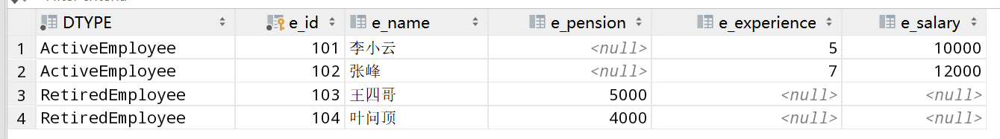

结果发现，凡是继承Employee的子类对象，都会保存到基类生成的表中，要注意不能直接使用lombok，因为在测试类中默认表示存在父类属性与子类属性共存的构造方法，但这个构造方法需要在子类中显示指定！

就像下面这样

```java
package cn.pikaqiang.entity.employees;


import lombok.AllArgsConstructor;
import lombok.Data;
import lombok.NoArgsConstructor;

import javax.persistence.Entity;

@Data
@AllArgsConstructor
@NoArgsConstructor
@Entity
public class ActiveEmployee extends Employee {

    private int e_salary;
    private int e_experience;

    public ActiveEmployee(int e_id, String e_name, int e_salary, int e_experience) {
        super(e_id, e_name);
        this.e_salary = e_salary;
        this.e_experience = e_experience;
    }
}
```


### 连接策略

> 什么是连接策略？

在连接策略中，为每个实体类生成一个单独的表。 


> 语法

```java
@Inheritance(strategy=InheritanceType.JOINED)
```


> 连接策略演示

1、依旧使用上面的例子，只是在`Employee`类上修改为连接策略

```java
@Inheritance(strategy=InheritanceType.JOINED) 
public class Employee implements Serializable
```

2、测试后，发现生成了3张表，每个类对应一张表

 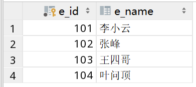

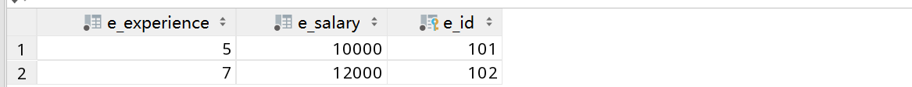

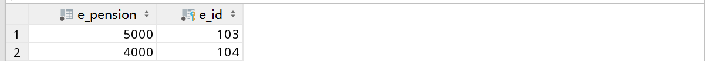


### 按类表策略

> 什么是按类表策略？

在按类表策略中，为每个子实体类生成一个单独的表。 与连接策略不同，在按类表策略中不会为父实体类生成单独的表。


> 语法

```java
@Inheritance(strategy=InheritanceType.TABLE_PER_CLASS)
```

这个也比较简单，就不再演示了。


