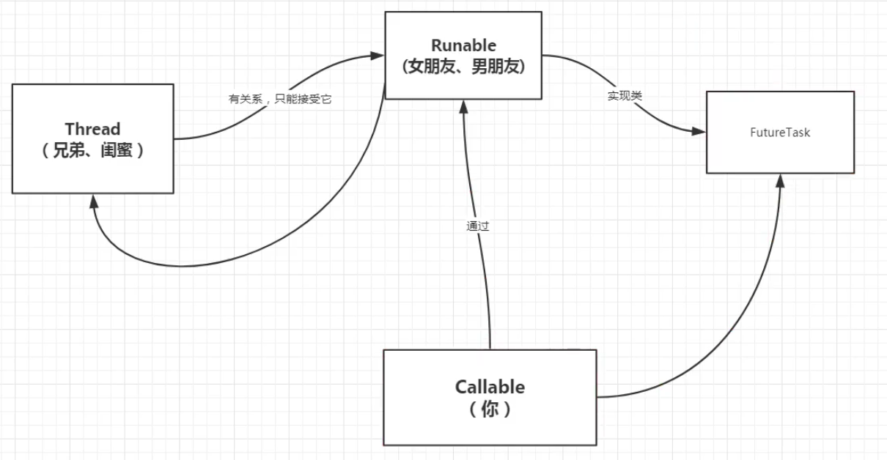
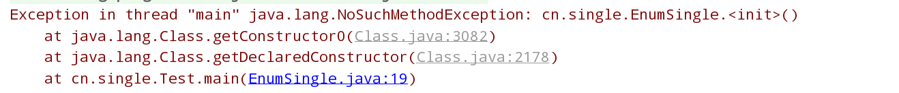

# 多线程

你的主要参考资料就是**源码**+**官方文档**！

## 什么是JUC

顾名思义，java util concurrent，查看java文档有java util concurrent、java util concurrent atomic、java util concurrent locks三个包。

应用：

1、普通的线程Thread

2、实现Runnable接口，没有返回值，效率比Callable相对较低！


## 进程与线程

> 进程与线程的概念

**进程**：进程是程序的一次执行过程，是程序在执行过程中的分配和管理资源的基本单位，每个进程都有自己的地址空间，通俗来说就是应用程序，如qq.exe。

**线程**：线程是CPU调度和分派的基本单位，它可以和同一进程下的其他线程共享全部资源，比如qq里面的状态显示功能、天气显示功能代表不同的线程。


> 进程与线程的联系

线程是进程中的一部分，一个进程可以有多个线程，但线程只能存在于一个进程中。


> 进程与线程的区别

1、根本区别：进程是操作系统资源调度的基本单位，线程是任务的调度执行的基本单位

2、开销方面：进程都有自己的独立数据空间，程序之间的切换开销大；线程也有自己的运行栈和程序计数器，线程间的切换开销较小。

3、共享空间：进程拥有各自独立的地址空间、资源，所以共享复杂，需要用IPC（Inter-Process Communication，进程间通信），但是同步简单。而线程共享所属进程的资源，因此共享简单，但是同步复杂，需要用加锁等措施。


> 其它

1、java默认有两个线程：main主线程、GC线程

2、java能自己开启线程吗？

```java
bew Thread().start;
private native void start0();
```

通过查看start方法，发现线程的启动是通过本地方法，底层是C++


> 并行与并发

**并行**：对于多CPU系统进行多线程操作，一个CPU在执行一个线程时，另一个CPU执行另一个线程。两个线程互不抢CPU资源，可以同时进行。

**并发**：单个CPU的操作系统在进行多线程操作时，将CPU运行时间划分成若干个时间段，再将时间段分配给各个线程执行，在一个时间段内只运行一个线程，其他线程处于挂起状态。

**区别**：并行是指两个或者多个时间在同一时刻发生，并发性是指在一段时间内宏观上有多个程序在同时运行，**微观上**只是在分时交替执行。

> 查看当前cpu有多少核

```java
public static void main(String[] args) {
    System.out.println(Runtime.getRuntime().availableProcessors());
}
```


> 线程的状态

```java
public enum State {
        /**
         * Thread state for a thread which has not yet started.
         */
        NEW,

        /**
         * Thread state for a runnable thread.  A thread in the runnable
         * state is executing in the Java virtual machine but it may
         * be waiting for other resources from the operating system
         * such as processor.
         */
        RUNNABLE,

        /**
         * Thread state for a thread blocked waiting for a monitor lock.
         * A thread in the blocked state is waiting for a monitor lock
         * to enter a synchronized block/method or
         * reenter a synchronized block/method after calling
         * {@link Object#wait() Object.wait}.
         */
        BLOCKED,

        /**
         * Thread state for a waiting thread.
         * A thread is in the waiting state due to calling one of the
         * following methods:
         * <ul>
         *   <li>{@link Object#wait() Object.wait} with no timeout</li>
         *   <li>{@link #join() Thread.join} with no timeout</li>
         *   <li>{@link LockSupport#park() LockSupport.park}</li>
         * </ul>
         *
         * <p>A thread in the waiting state is waiting for another thread to
         * perform a particular action.
         *
         * For example, a thread that has called <tt>Object.wait()</tt>
         * on an object is waiting for another thread to call
         * <tt>Object.notify()</tt> or <tt>Object.notifyAll()</tt> on
         * that object. A thread that has called <tt>Thread.join()</tt>
         * is waiting for a specified thread to terminate.
         */
        WAITING,

        /**
         * Thread state for a waiting thread with a specified waiting time.
         * A thread is in the timed waiting state due to calling one of
         * the following methods with a specified positive waiting time:
         * <ul>
         *   <li>{@link #sleep Thread.sleep}</li>
         *   <li>{@link Object#wait(long) Object.wait} with timeout</li>
         *   <li>{@link #join(long) Thread.join} with timeout</li>
         *   <li>{@link LockSupport#parkNanos LockSupport.parkNanos}</li>
         *   <li>{@link LockSupport#parkUntil LockSupport.parkUntil}</li>
         * </ul>
         */
        TIMED_WAITING,

        /**
         * Thread state for a terminated thread.
         * The thread has completed execution.
         */
        TERMINATED;
    }
```

通过查看源码得知，线程的状态6种！


> wait与sleep的区别

1、wait来自Object类，sleep来自Thread类

2、wait会释放锁，sleep不会释放

3、wait必须在同步代码块中使用，而sleep可在任意线程中使用

4、wait无须捕获异常，sleep必须捕获异常（为什么？）


## 线程锁

### 传统的Synchronsized

记住：线程就是一个单独的资源类，只有属性和方法，我们拿来就用即可！

> 并发演示

```java
public class SaleTicketDemo {

    public static void main(String[] args) {

        // 演示并发，即多个线程操作同一个资源

        // 创建资源类
        Ticket ticket = new Ticket();

        // 创建线程，把资源类丢给线程，使用lammbda表达式new Runnable接口
        // ()---方法参数，{}---存放代码
        new Thread(()->{
            for (int i = 0; i < 60; i++) {
                ticket.sale();
            }
        },"A").start();
        new Thread(()->{
            for (int i = 0; i < 60; i++) {
                ticket.sale();
            }
        },"B").start();
        new Thread(()->{
            for (int i = 0; i < 60; i++) {
                ticket.sale();
            }
        },"C").start();

    }

}

class Ticket {
    private int number = 50;
    public void sale() {
        if(number > 0) {
            System.out.println(Thread.currentThread().getName()+"卖出了第"+(number--)+"票");
        }
    }
}
```

通过运行结果，发现线程A、B、C谁抢到资源谁就执行，票并不是一张张减少的，


> 通过synchronsized解决并发问题

 在sale( )方法上加关键字synchronsized


发现票数已正常！


### Lock锁

> 先认识下公平锁和非公平锁

公平锁：多个线程按照申请锁的顺序去获得锁，线程会直接进入队列去排队，永远都是队列的第一位才能得到锁。

非公平锁：多个线程去获取锁的时候，会直接去尝试获取，获取不到，再去进入等待队列，如果能获取到，就直接获取到锁（默认）。


> 可重入锁的演示

```java
package cn.pikaqiang;

import java.util.concurrent.locks.Lock;
import java.util.concurrent.locks.ReentrantLock;

public class SaleTicketDemo02 {

    public static void main(String[] args) {

        // 演示并发，即多个线程操作同一个资源

        // 创建资源类
        Ticket2 ticket = new Ticket2();

        // 创建线程，把资源类丢给线程，使用lammbda表达式
        // ()---方法参数，{}---存放代码
        new Thread(()->{ for (int i = 0; i < 60; i++) ticket.sale(); },"A").start();
        new Thread(()->{ for (int i = 0; i < 60; i++) ticket.sale(); },"B").start();
        new Thread(()->{ for (int i = 0; i < 60; i++) ticket.sale(); },"C").start();
    }

}

class Ticket2 {
    private int number = 50;
    // 定义可重入锁
    private Lock lock = new ReentrantLock();

    public  void sale() {
        // 加锁
        lock.lock();
        // 业务代码使用try.catch.finally包围
        try {
            if(number > 0) {
                System.out.println(Thread.currentThread().getName()+"卖出了第"+(number--)+"票");
            }
        } catch (Exception e) {
            e.printStackTrace();
        } finally {
            // 释放锁
            lock.unlock();
        }
    }
}
```

发现结果正常！


> lock与synchronsized区别

1、synchronsized是一个内置的java关键字，lock是一个java类

2、synchronsized无法判断锁的状态，但lock可以判断是否获取到了锁

3、synchronsized自动释放锁，而lock需要手动释放，如果不释放，会导致死锁！

4、synchronsized 线程1（获得锁  阻塞）、线程2（等待、傻傻的等），lock锁由于有尝试获取锁的方法，因此不会一直等待下去！

5、synchronsized可重入锁、不可中断、非公平锁！lock可重入锁、可判断锁、自定义(非)公平锁

6、synchronsized适合锁少量的代码同步问题，lock适合锁大量同步代码


### 生产者和消费者

核心流程：判断等待--->执行业务--->通知其它线程业务处理完毕！

> 传统方式：synchronsized版

```java
package cn.pc;

import sun.awt.windows.ThemeReader;

/**
 * 线程之间的通信问题：生产者和消费者的问题
 */
public class A {

    public static void main(String[] args) {
        // 创建线程资源对象
        Data data = new Data();
        // 启动两个个线程
        new Thread(()->{
            for (int i = 0; i <10 ; i++) {
                try {
                    data.increment();
                } catch (InterruptedException e) {
                    e.printStackTrace();
                }
            }
        },"A").start();
        new Thread(()->{
            for (int i = 0; i < 10; i++) {
                try {
                    data.decrement();
                } catch (InterruptedException e) {
                    e.printStackTrace();
                }
            }
        },"B").start();
    }

}
// 数字、资源类
class Data {

    private int number = 0;

    public synchronized void increment() throws InterruptedException {
        // 判断是否需要等待
        while(number != 0) {
            this.wait();
        }
        // 业务
        number++;
        System.out.println(Thread.currentThread().getName()+"-->"+number);
        // 通知其它线程执行完业务
        this.notifyAll();
    }

    public synchronized void decrement() throws InterruptedException {
        // 判断是否需要等待
        while(number == 0) {
            this.wait();
        }
        // 业务
        number--;
        System.out.println(Thread.currentThread().getName()+"-->"+number);
        // 通知其它线程执行完业务
        this.notifyAll();
    }

}
```

发现A、B交替执行！

> 假设有A、B、C、D四个线程，那么就会出现问题，如何解决？

通过java api文档，查看wait与notify发现上面的代码中if判断有问题，因为if条件只会判断一次，从而会造成虚假唤醒，将if修改为while即可！

> 虚假唤醒的原因

当一个线程执行完当前业务时，会唤醒其它所有的线程，此时这些线程会竞争，只有一个正常唤醒，其它的会被虚假唤醒，本质上还是操作系统内部的问题。


> JUC：Lock版

```java
package cn.pc;

import java.util.concurrent.locks.Condition;
import java.util.concurrent.locks.Lock;
import java.util.concurrent.locks.ReentrantLock;

public class LockTest {

    public static void main(String[] args) {
        // 创建线程资源对象
        Data2 data = new Data2();

        // 启动两个个线程
        new Thread(()->{
            for (int i = 0; i <10 ; i++) {
                try {
                    data.increment();
                } catch (InterruptedException e) {
                    e.printStackTrace();
                }
            }
        },"A").start();
        new Thread(()->{
            for (int i = 0; i < 10; i++) {
                try {
                    data.decrement();
                } catch (InterruptedException e) {
                    e.printStackTrace();
                }
            }
        },"B").start();
        new Thread(()->{
            for (int i = 0; i < 10; i++) {
                try {
                    data.increment();
                } catch (InterruptedException e) {
                    e.printStackTrace();
                }
            }
        },"C").start();
        new Thread(()->{
            for (int i = 0; i < 10; i++) {
                try {
                    data.decrement();
                } catch (InterruptedException e) {
                    e.printStackTrace();
                }
            }
        },"D").start();

    }
}

// 数字、资源类
class Data2 {

    private int number = 0;
    Lock lock = new ReentrantLock();
    Condition condition  = lock.newCondition();

    public void increment() throws InterruptedException {
        // 锁住当前方法
        lock.lock();
        try {
            // 判断是否需要等待
            while (number != 0) {
                condition.await();
            }
            // 业务
            number++;
            System.out.println(Thread.currentThread().getName()+"-->"+number);
            // 通知其它线程执行完业务
            condition.signalAll();
        } catch (InterruptedException e) {
            e.printStackTrace();
        } finally {
            lock.unlock();
        }
    }

    public void decrement() throws InterruptedException {
        // 锁住当前方法
        lock.lock();
        try {
            // 判断是否需要等待
            while (number == 0) {
                condition.await();
            }
            // 业务
            number--;
            System.out.println(Thread.currentThread().getName()+"-->"+number);
            // 通知其它线程执行完业务
            condition.signalAll();
        } catch (InterruptedException e) {
            e.printStackTrace();
        } finally {
            lock.unlock();
        }
    }

}
```

我们发现，使用Lock与使用Synchronsized类似，Lock需要一个Condition对象来执行通知或等待操作，而且需要开启锁和关闭锁！因此上面代码的功能与synchronsized完全相同！<font color='red'>那么Condition的优势在哪里呢？</font>

> Condition的优势

1、精准的通知和唤醒线程，比如我想让线程执行顺序为A->B->C-A循环执行

```java
package cn.pc;

import java.util.concurrent.locks.Condition;
import java.util.concurrent.locks.Lock;
import java.util.concurrent.locks.ReentrantLock;

public class LockTest {

    public static void main(String[] args) {
        // 创建线程资源对象
        Data2 data = new Data2();

        new Thread(()->{
            for (int i = 0; i <10 ; i++) {
                try {
                    data.printA();
                } catch (InterruptedException e) {
                    e.printStackTrace();
                }
            }
        },"A").start();

        new Thread(()->{
            for (int i = 0; i <10 ; i++) {
                try {
                    data.printB();
                } catch (InterruptedException e) {
                    e.printStackTrace();
                }
            }
        },"B").start();

        new Thread(()->{
            for (int i = 0; i <10 ; i++) {
                try {
                    data.printC();
                } catch (InterruptedException e) {
                    e.printStackTrace();
                }
            }
        },"C").start();

    }
}

// 数字、资源类
class Data2 {

    private int number = 1;
    Lock lock = new ReentrantLock();
    Condition condition1  = lock.newCondition();
    Condition condition2 = lock.newCondition();
    Condition condition3  = lock.newCondition();

    // number=1,A执行，number=2,B执行，number=3,C执行
    public void printA() throws InterruptedException {
        // 锁住当前方法
        lock.lock();
        try {
            // 判断是否需要等待
            while (number != 1) {
                condition1.await();
            }
            number++;
            System.out.println(Thread.currentThread().getName()+"-->"+"AAAAAA");
            // 通知其它线程执行完业务
                condition2.signal();
        } catch (Exception e) {
            e.printStackTrace();
        } finally {
            lock.unlock();
        }
    }

    public void printB() throws InterruptedException {
        // 锁住当前方法
        lock.lock();
        try {
            // 判断是否需要等待
            while (number != 2) {
                condition2.await();
            }
            number++;
            System.out.println(Thread.currentThread().getName()+"-->"+"BBBBBB");
            // 通知其它线程执行完业务
            condition3.signal();
        } catch (Exception e) {
            e.printStackTrace();
        } finally {
            lock.unlock();
        }
    }

    public void printC() throws InterruptedException {
        // 锁住当前方法
        lock.lock();
        try {
            // 判断是否需要等待
            while (number != 3) {
                condition3.await();
            }
            number = 1;
            System.out.println(Thread.currentThread().getName()+"-->"+"AAAAAA");
            // 通知其它线程执行完业务
            condition1.signal();

        } catch (Exception e) {
            e.printStackTrace();
        } finally {
            lock.unlock();
        }
    }
}
```

通过signal方法，指定被唤醒的线程！


### 各种锁现象

> 关于锁的各个现象

**1、下面程序运行后，先打印发短信还是打电话？为什么？**

> 同一个对象有两个加锁的方法

```java
package cn.lock8;

import java.util.concurrent.TimeUnit;

public class Test1 {

    public static void main(String[] args) {
        Phone phone = new Phone();
        // A线程用来发短信
        new Thread(()->{
            phone.sendMessage();
        },"A").start();

        // 中间休息1s
        try {
            TimeUnit.SECONDS.sleep(1);
        } catch (InterruptedException e) {
            e.printStackTrace();
        }

        // B线程用来打电话
        new Thread(()->{
            phone.call();
        },"B").start();
    }

}

class Phone {
    // synchronsized锁的对象是方法的调用者，哪个方法先拿到锁就先执行谁
    public synchronized void sendMessage() {
        System.out.println("sendMessage");
    }

    public synchronized void call() {
        System.out.println("call");
    }
}
```

先发短信，然后打电话，原因是synchronsized锁的是对象，上面代码只有一个对象，哪个方法先拿到锁，就先执行谁，即便这个执行的方法里有延迟！

**2、下面程序运行后，打印发短信还是打印hello，为什么？**

> 同一个对象一个方法加锁、一个方法不加锁

```java
package cn.lock8;

import java.util.concurrent.TimeUnit;

public class Test1 {

    public static void main(String[] args) {
        Phone phone = new Phone();
        // A线程用来发短信
        new Thread(()->{
            phone.sendMessage();
        },"A").start();

        // 中间休息1s
        try {
            TimeUnit.SECONDS.sleep(1);
        } catch (InterruptedException e) {
            e.printStackTrace();
        }

        // B线程用来打电话
        new Thread(()->{
            phone.hello();
        },"B").start();
    }

}

class Phone {
    // synchronsized锁的对象是方法的调用者，哪个方法先拿到锁就先执行谁
    public synchronized void sendMessage() {
        System.out.println("sendMessage");
    }

    public synchronized void call() {
        System.out.println("call");
    }

    public void hello() {
        System.out.println("hello");
    }
}
```

先打印hello，因为hello方法不受锁的影响，在主线程中就是依次执行的

**3、下面程序运行后，先打印发短信还是打电话？为什么？**

> 锁两个对象

```java
package cn.lock8;

import java.util.concurrent.TimeUnit;

public class Test1 {

    public static void main(String[] args) {
        Phone phone = new Phone();
        Phone phone2 = new Phone();
        // A线程用来发短信
        new Thread(()->{
            phone.sendMessage();
        },"A").start();

        // 中间休息1s
        try {
            TimeUnit.SECONDS.sleep(1);
        } catch (InterruptedException e) {
            e.printStackTrace();
        }

        // B线程用来打电话
        new Thread(()->{
            phone2.call();
        },"B").start();
    }

}

class Phone {
    // synchronsized锁的对象是方法的调用者，哪个方法先拿到锁就先执行谁
    public synchronized void sendMessage() {
        try {
            TimeUnit.SECONDS.sleep(4);
            System.out.println("sendMessage");
        } catch (InterruptedException e) {
            e.printStackTrace();
        }
    }

    public synchronized void call() {
        System.out.println("call");
    }

    public void hello() {
        System.out.println("hello");
    }
}
```

先打电话，然后再发短信，因为这一次锁的是不同的对象，每个对象都有一把锁，打电话因为没有延迟，先执行！

**4、根据下面的代码，判断先发短信还是先打电话,为什么**

> 同一个对象，静态方法加锁

```java
package cn.lock8;

import java.util.concurrent.TimeUnit;

public class Test1 {

    public static void main(String[] args) {
        Phone phone = new Phone();
        // A线程用来发短信
        new Thread(()->{
            phone.sendMessage();
        },"A").start();

        // 中间休息1s
        try {
            TimeUnit.SECONDS.sleep(1);
        } catch (InterruptedException e) {
            e.printStackTrace();
        }

        // B线程用来打电话
        new Thread(()->{
            phone.call();
        },"B").start();
    }

}

class Phone {
    // synchronsized锁的对象是方法的调用者，哪个方法先拿到锁就先执行谁
    public static synchronized void sendMessage() {
        try {
            TimeUnit.SECONDS.sleep(4);
            System.out.println("sendMessage");
        } catch (InterruptedException e) {
            e.printStackTrace();
        }
    }

    public static synchronized void call() {
        System.out.println("call");
    }
}

```

先发短信，然后打电话，加上static后，synchronsized锁的是当前对象的Class对象，Class对象也是唯一的，只有一把锁，因此，哪个方法先获得锁，哪个方法先执行！

**5、根据下面的代码，判断先发短信还是先打电话,为什么**

> 两个对象，锁两个静态方法

```java
package cn.lock8;

import java.util.concurrent.TimeUnit;

public class Test1 {

    public static void main(String[] args) {
        Phone phone = new Phone();
        Phone phone2 = new Phone();
        // A线程用来发短信
        new Thread(()->{
            phone.sendMessage();
        },"A").start();

        // 中间休息1s
        try {
            TimeUnit.SECONDS.sleep(1);
        } catch (InterruptedException e) {
            e.printStackTrace();
        }

        // B线程用来打电话
        new Thread(()->{
            phone2.call();
        },"B").start();
    }

}

class Phone {
    // synchronsized锁的对象是方法的调用者，哪个方法先拿到锁就先执行谁
    public static synchronized void sendMessage() {
        try {
            TimeUnit.SECONDS.sleep(4);
            System.out.println("sendMessage");
        } catch (InterruptedException e) {
            e.printStackTrace();
        }
    }

    public static synchronized void call() {
        System.out.println("call");
    }
}
```

先发短信，然后打电话，因为上面提过了，锁的是Class对象，它是全局唯一的，谁先获得锁，谁先执行！

**6、根据下面的代码，判断先发短信还是先打电话,为什么**

> 同一个对象，锁静态方法和普通方法

```java
package cn.lock8;

import java.util.concurrent.TimeUnit;

public class Test1 {

    public static void main(String[] args) {
        Phone phone = new Phone();
        // A线程用来发短信
        new Thread(()->{
            phone.sendMessage();
        },"A").start();

        // 中间休息1s
        try {
            TimeUnit.SECONDS.sleep(1);
        } catch (InterruptedException e) {
            e.printStackTrace();
        }

        // B线程用来打电话
        new Thread(()->{
            phone.call();
        },"B").start();
    }

}

class Phone {

    public static synchronized void sendMessage() {
        try {
            TimeUnit.SECONDS.sleep(4);
            System.out.println("sendMessage");
        } catch (InterruptedException e) {
            e.printStackTrace();
        }
    }

    public synchronized void call() {
        System.out.println("call");
    }
}
```

先打电话，程序一开始就创建了对象，然后一把发短信的方法锁住了Class对象，开始延迟，而打电话锁住的是刚刚创建的对象，因此这也是两个不同的对象，从而按时间次序执行！

**7、根据下面的代码，判断先发短信还是先打电话,为什么**

> 两个对象，锁静态方法和普通方法

```java
package cn.lock8;

import java.util.concurrent.TimeUnit;

public class Test1 {

    public static void main(String[] args) {
        Phone phone = new Phone();
        Phone phone2 = new Phone();
        // A线程用来发短信
        new Thread(()->{
            phone.sendMessage();
        },"A").start();

        // 中间休息1s
        try {
            TimeUnit.SECONDS.sleep(1);
        } catch (InterruptedException e) {
            e.printStackTrace();
        }

        // B线程用来打电话
        new Thread(()->{
            phone2.call();
        },"B").start();
    }

}

class Phone {

    public static synchronized void sendMessage() {
        try {
            TimeUnit.SECONDS.sleep(4);
            System.out.println("sendMessage");
        } catch (InterruptedException e) {
            e.printStackTrace();
        }
    }

    public synchronized void call() {
        System.out.println("call");
    }
}
```

这个依然是打电话在前，因为锁的不是同一个对象，一个是锁phone的Class对象，一个是锁phone2对象，因此它们之间互不影响！


## 集合类不安全

#### List

> ArrayList不安全演示

```java
package cn.unsafe;

import java.util.*;

public class ListTest {

    public static void main(String[] args) {
        List<String> list = new ArrayList<>();
        // 随机生成10个字符串
        for (int i = 1; i <= 10; i++) {
            new Thread(()->{
                list.add(UUID.randomUUID().toString().substring(0,5));
                System.out.println(list);
            },String.valueOf(i)).start();
        }
    }

}
```


> 解决ArrayList线程安全

1、Vector代替

2、Collections工具类

```java
package cn.unsafe;

import java.util.*;

public class ListTest {

    public static void main(String[] args) {
        /**
         * 并发下ArrayList是不安全的，造成ConcurrentModificationException
         * 解决方案
         * 1、使用vector
         * 2、调用Collections中的集合同步方法
         */
        List<String> list = new ArrayList<>();
        List<String> list1 = Collections.synchronizedList(list);
        // 随机生成10个字符串
        for (int i = 1; i <= 10; i++) {
            new Thread(()->{
                list1.add(UUID.randomUUID().toString().substring(0,5));
                System.out.println(list1);
            },String.valueOf(i)).start();
        }
    }

}
```

3、CopyOnWriteArrayList

```java
package cn.unsafe;

import java.util.*;
import java.util.concurrent.CopyOnWriteArrayList;

public class ListTest {

    public static void main(String[] args) {
        /**
         * 并发下ArrayList是不安全的，造成ConcurrentModificationException
         * 解决方案
         * 1、使用vector
         * 2、调用Collections中的集合同步方法
         * 3、使用CopyOnWriteArrayList
         */
        CopyOnWriteArrayList<String> list = new CopyOnWriteArrayList<>();
        // 随机生成10个字符串
        for (int i = 1; i <= 10; i++) {
            new Thread(()->{
                list.add(UUID.randomUUID().toString().substring(0,5));
                System.out.println(list);
            },String.valueOf(i)).start();
        }
    }

}
```

#### Set

Set集合同List集合，它也存在线程安全问题，这里不作演示，只记录有区别的地方！

1、解决Set线程安全方案

- Collections工具类，将不安全的set变为安全的

- java.util.concurrent包下的copyOnWriteArraySet，实现读写分离，即先拷贝旧集合的内容到新集合，然后将新内容写入新集合，最后将新集合内容复制到旧集合中

  

> HashSet的底层是什么

```java
// HashSet的底层就是一个map
public HashSet() {
    map = new HashMap<>();
}

// add方法，本质是map的put方法，key是唯一的
public boolean add(E e) {
    return map.put(e, PRESENT)==null;
}

// PRESENT
private static final Object PRESENT = new Object();
```


#### Map

1、解决Map线程安全的方案

- ConcurrentHashMap

- Collections工具类

  

## Callable

> 什么是Callable？

```java
@FunctionalInterface
public interface Callable<V>
```

1、可以有返回值

2、可以抛出异常

3、定义了call方法


> 如何启动实现了Callable接口的线程



比如上面的图，你说Callable，你想认识女朋友的闺蜜，那么就要先通过你的女朋友，然后去找她的闺蜜！但是你女朋友不同意，那么你找到了中间人FutureTask，经过他的包装，你成功伪装成了你的对象，然后闺蜜就接受你了！


> Callable的使用

```java
package cn.callable;

import java.util.concurrent.Callable;
import java.util.concurrent.ExecutionException;
import java.util.concurrent.FutureTask;

public class CallableTest {

    public static void main(String[] args) throws ExecutionException, InterruptedException {

        MyThread myThread = new MyThread();
        FutureTask futureTask = new FutureTask(myThread);

        // 执行线程，自动调用call方法
        new Thread(futureTask,"A").start();

        // 线程执行后，获得返回值
        Integer res = (Integer) futureTask.get();
        System.out.println(res);
    }

}

class MyThread implements Callable<Integer> {

    @Override
    public Integer call() throws Exception {
        System.out.println("调用了call方法");
        return 1204;
    }
}
```

在获取返回值的时候，需要等待线程执行结束才能得到，因此这里可能会产生阻塞！因此这里的代码要放到最后！

<font color='red'>细节：如果启动两个线程，会调用几次call方法？</font>

```java
package cn.callable;


import java.util.concurrent.Callable;
import java.util.concurrent.ExecutionException;
import java.util.concurrent.FutureTask;

public class CallableTest {

    public static void main(String[] args) throws ExecutionException, InterruptedException {

        MyThread myThread = new MyThread();
        FutureTask futureTask = new FutureTask(myThread);

        // 执行线程，自动调用call方法
        new Thread(futureTask,"A").start();
        new Thread(futureTask,"B").start();

        // 线程执行后，获得返回值
        Integer res = (Integer) futureTask.get();
        System.out.println(res);
    }

}

class MyThread implements Callable<Integer> {

    @Override
    public Integer call() throws Exception {
        System.out.println("调用了call方法");
        return 1204;
    }
}
```

只会调用一次，JVM第二次调用FutureTask所持有的线程对象时，会直接结束该线程，因为第一次调用结束后，返回结果被保存了！


## 常用的辅助类

### CountDownLatch

> CountDownLatch是什么？

允许一个或多个线程等待直到在其他线程中执行的一组操作完成的同步辅助。

> CountDownLatch有什么用？如何使用？

1、用来倒计时

```java
package cn;

import java.util.concurrent.CountDownLatch;

// 计数器，假设现在有6个学生从教室里走出，保安等所有学生走完后关闭
public class CountDownLatchDemo {

    public static void main(String[] args) throws InterruptedException {
        // 倒计时6
        CountDownLatch countDownLatch = new CountDownLatch(6);
        for (int i = 1; i <= 6; i++) {
            new Thread(()->{
                System.out.println(Thread.currentThread().getName()+" go out");
                // 开始倒计时
                countDownLatch.countDown();
            },String.valueOf(i)).start();
        }
        // 归零后再向下执行
        countDownLatch.await();
        
        System.out.println("Close Door");
    }

}
```

如果注释掉countDownLatch.await()，那么for循环执行完后，这时所有的线程已启动，所有的线程与主线程会抢cpu资源，可能出现关门后，还有人走的情况；


### CyclicBarrier

> CyclicBarrier是什么？

允许一组线程全部等待彼此达到共同屏障点的同步辅助。 简单理解为加法计数器！

> CyclicBarrier的作用，怎么用？

1、集齐7颗龙珠召唤神龙！

```java
package cn;

import java.util.concurrent.BrokenBarrierException;
import java.util.concurrent.CountDownLatch;
import java.util.concurrent.CyclicBarrier;

// 集齐七颗龙珠召唤神龙
public class CyclicBarrierDemo {

    public static void main(String[] args) throws InterruptedException {
        //
        CyclicBarrier cyclicBarrier = new CyclicBarrier(7,new Thread(()->{
            System.out.println("召唤神龙成功！");
        }));
        for (int i = 1; i <= 7; i++) {
            // lambda表达式里不能直接使用i，使用final修饰，目的是保持数据的一致性
            final int tmp = i;
            new Thread(()->{
                System.out.println(Thread.currentThread().getName()+"收集了"+tmp+"颗龙珠");
                try {
                    // 7个线程执行后，唤醒所有线程，所有线程抢占式执行下面的语句
                    cyclicBarrier.await();
                    System.out.println(Thread.currentThread().getName());
                } catch (InterruptedException e) {
                    e.printStackTrace();
                } catch (BrokenBarrierException e) {
                    e.printStackTrace();
                }
            },String.valueOf(i)).start();
        }
    }

}
```


### Semaphore

>  Semaphore是什么？

一个计数信号量。 在概念上，信号量维持一组许可证。 如果有必要，每个[`acquire()`都会](https://www.matools.com/file/manual/jdk_api_1.8_google/java/util/concurrent/Semaphore.html#acquire--)阻塞，直到许可证可用，然后才能使用它。 每个[`release()`](https://www.matools.com/file/manual/jdk_api_1.8_google/java/util/concurrent/Semaphore.html#release--)添加许可证，潜在地释放阻塞获取方。 但是，没有使用实际的许可证对象; `Semaphore`只保留可用数量的计数，并相应地执行。


> Semaphore怎么用？

1、模拟抢车位小游戏

```java
package cn;

import java.util.concurrent.*;

// 集齐七颗龙珠召唤神龙
public class SemaphoneDemo {

    public static void main(String[] args) throws InterruptedException {

        // 现在有3个停车位
        Semaphore semaphore = new Semaphore(3);

        // 有6辆车来抢这3个停车位
        for (int i = 1; i <= 6; i++) {
            new Thread(()->{
                try {
                    // 拿到停车位，如果满了，就等待释放
                    semaphore.acquire();
                    // 看看是谁拿到了停车位
                    System.out.println(Thread.currentThread().getName()+"拿到了停车位");
                    // 车停2s后离开车位
                    TimeUnit.SECONDS.sleep(2);
                    System.out.println(Thread.currentThread().getName()+"离开了停车位");
                } catch (InterruptedException e) {
                    e.printStackTrace();
                } finally {
                    // 释放停车位，然后唤醒所有线程
                    semaphore.release();
                }
            },String.valueOf(i)).start();
        }
    }

}
```


> 应用场景

1、限流，比如限制上面的停车位只有3个！

2、多个共享资源互斥使用，3个车位是共享的，但是每次只能有三个线程享用！


## 读写锁

> 读写锁是什么？

A `ReadWriteLock`维护一对关联的[`locks`](https://www.matools.com/file/manual/jdk_api_1.8_google/java/util/concurrent/locks/Lock.html) ，一个用于只读操作，一个用于写入。 [`read lock`](https://www.matools.com/file/manual/jdk_api_1.8_google/java/util/concurrent/locks/ReadWriteLock.html#readLock--)可以由多个阅读器线程同时进行，写的时候只能由一个线程写。


> 读写锁如何使用？

```java
package cn;

import java.util.HashMap;
import java.util.Map;
import java.util.concurrent.*;
import java.util.concurrent.locks.Lock;
import java.util.concurrent.locks.ReadWriteLock;
import java.util.concurrent.locks.ReentrantLock;
import java.util.concurrent.locks.ReentrantReadWriteLock;

public class ReadWriteLockDemo {

    public static void main(String[] args){

        MyCache cache = new MyCache();
        // 写入
        for (int i = 1; i <= 5; i++) {
            final int tmp = i;
            new Thread(()->{
                cache.write(tmp+"",tmp);
            },String.valueOf(i)).start();
        }
        // 读取
        for (int i = 1; i <= 5; i++) {
            final int tmp = i;
            new Thread(()->{
                cache.read(tmp+"");
            },String.valueOf(i)).start();
        }
    }

}

/**
 * 自定义缓存，实现读写功能
 */
class MyCache {

    private volatile Map<String,Object> cache = new HashMap<>();
    // 可重入读写锁，更加精确的控制
    ReadWriteLock lock = new ReentrantReadWriteLock();
    // 写入时希望只有一个线程
    public void write(String key, Object value) {
        // 假设写入锁
        lock.writeLock().lock();
        try {
            System.out.println(Thread.currentThread().getName()+"写入"+key);
            cache.put(key,value);
            System.out.println(Thread.currentThread().getName()+"写入完毕");
        } catch (Exception e) {
            e.printStackTrace();
        } finally {
            lock.writeLock().unlock();
        }
    }

    // 读取时希望多个线程可以读
    public void read(String key) {
        // 上锁
        lock.readLock().lock();
        try {
            System.out.println(Thread.currentThread().getName()+"读取"+key);
            Object o = cache.get(key);
            System.out.println(Thread.currentThread().getName()+"读取完毕");
        } catch (Exception e) {
            e.printStackTrace();
        } finally {
            lock.readLock().unlock();
        }
    }

}
```

平常说的独占锁( 排他锁 )，就是写锁，共享锁就是读锁，写的时候只能有一个线程来，读的时候可以多个线程同时执行！


## 阻塞队列

> 阻塞队列是什么？


### BlockingQueue

> BlockingQueue是什么？

1、继承体系


> BlockingQueue的使用

操作：添加/移除元素

四组API：(不)抛出异常、阻塞等待、超时等待


**阻塞演示**

```java
package cn;

import java.util.HashMap;
import java.util.Map;
import java.util.concurrent.*;
import java.util.concurrent.locks.Lock;
import java.util.concurrent.locks.ReadWriteLock;
import java.util.concurrent.locks.ReentrantLock;
import java.util.concurrent.locks.ReentrantReadWriteLock;

public class ReadWriteLockDemo {

    public static void main(String[] args) throws InterruptedException {
        test1();
    }

    public static void test1() throws InterruptedException {
        BlockingQueue<Object> queue = new ArrayBlockingQueue<>(3);
        queue.put("a");
        queue.put("b");
        queue.put("c");
        // 没有位置了，那么会一直阻塞在这里！
        //queue.put("d");
        queue.take();
        queue.take();
        queue.take();
        // 没有元素的话也会一直等待
        //queue.take();
    }

}
```


**超时等待演示**

```java
package cn;

import java.util.HashMap;
import java.util.Map;
import java.util.concurrent.*;
import java.util.concurrent.locks.Lock;
import java.util.concurrent.locks.ReadWriteLock;
import java.util.concurrent.locks.ReentrantLock;
import java.util.concurrent.locks.ReentrantReadWriteLock;

public class ReadWriteLockDemo {

    public static void main(String[] args) throws InterruptedException {
        test1();
    }

    public static void test1() throws InterruptedException {
        BlockingQueue<Object> queue = new ArrayBlockingQueue<>(3);
        System.out.println(queue.offer("a"));
        System.out.println(queue.offer("b"));
        System.out.println(queue.offer("c"));
        // 超时就退出
        queue.offer("d",2,TimeUnit.SECONDS);

        System.out.println("-------------------------------------");

        System.out.println(queue.poll(2, TimeUnit.SECONDS));
        System.out.println(queue.poll(2, TimeUnit.SECONDS));
        System.out.println(queue.poll(2, TimeUnit.SECONDS));
        System.out.println(queue.poll(2, TimeUnit.SECONDS));

    }

}
```


> BlockingQueue应用场景

1、要求线程必须依次执行时，比如一个线程需要用到上一个线程的执行结果

2、线程池也会使用队列来维护线程


## 同步队列

### SynchronousQueue

> SynchronousQueue是什么？

没有容量，进去一个元素，必须等取出来之后才能再放入，相当于只能放一个元素


> SynchronousQueue的使用

```java
package cn;

import java.util.concurrent.SynchronousQueue;
import java.util.concurrent.TimeUnit;

public class ReadWriteLockDemo {

    public static void main(String[] args) {
        SynchronousQueue<String> queue = new SynchronousQueue<>();
        // T1线程写入
        new Thread(()->{
            try {
                System.out.println(Thread.currentThread().getName()+"put 1");
                queue.put("1");
                System.out.println(Thread.currentThread().getName()+"put 2");
                queue.put("2");
                System.out.println(Thread.currentThread().getName()+"put 3");
                queue.put("3");
            } catch (InterruptedException e) {
                e.printStackTrace();
            }
        },"T1").start();
        // T2线程读取
        new Thread(()->{
            try {
                TimeUnit.SECONDS.sleep(2);
                System.out.println(Thread.currentThread().getName()+"取"+queue.take());
                TimeUnit.SECONDS.sleep(2);
                System.out.println(Thread.currentThread().getName()+"取"+queue.take());
                TimeUnit.SECONDS.sleep(2);
                System.out.println(Thread.currentThread().getName()+"取"+queue.take());
            } catch (InterruptedException e) {
                e.printStackTrace();
            }
        },"T2").start();

    }2
}
```


## 线程池

> 池化技术

程序运行的本质，占用系统资源，一些对象的创建和销毁十分浪费资源，为了优化，衍生出了池化技术！

比如有线程池、连接池、内存池、对象池等待！

池化技术就是事先准备好一些资源，有人要用，就来拿，用完之后就换回来！


> 线程池的使用

创建线程池的三种方法，分别演示，不要同时执行！

```java
package cn;

import java.util.concurrent.ExecutorService;
import java.util.concurrent.Executors;

// Executors工具类，3大方法
public class ExecutorDemo {

    public static void main(String[] args) {

        // 单个线程池
        ExecutorService singleThreadPool = Executors.newSingleThreadExecutor();
        // 容量为5的线程池
        ExecutorService fixedThreadPool = Executors.newFixedThreadPool(5);
        // 可伸缩的线程池
        ExecutorService cacheThreadPool = Executors.newCachedThreadPool();

        try {
            // 演示单个线程池
            for (int i = 0; i < 10; i++) {
                singleThreadPool.execute(()->{
                    System.out.println(Thread.currentThread().getName()+"进来了");
                });
            }
            // 演示固定线程池
            for (int i = 0; i < 10; i++) {
                fixedThreadPool.execute(()->{
                    System.out.println(Thread.currentThread().getName()+"进来了");
                });
            }
            // 演示缓存线程池
            for (int i = 0; i < 10; i++) {
                cacheThreadPool.execute(()->{
                    System.out.println(Thread.currentThread().getName()+"进来了");
                });
            }

        } catch (Exception e) {
            e.printStackTrace();
        } finally {
            // 线程池使用后关闭
            singleThreadPool.shutdown();
            fixedThreadPool.shutdown();
            cacheThreadPool.shutdown();
        }
    }

}
```


> 七大参数

源码分析

1、打开各类创建各类线程池的方法

```java
public static ExecutorService newSingleThreadExecutor() {
    return new FinalizableDelegatedExecutorService
        (new ThreadPoolExecutor(1, 1,
                                0L, TimeUnit.MILLISECONDS,
                                new LinkedBlockingQueue<Runnable>()));
}
public static ExecutorService newFixedThreadPool(int nThreads) {
    return new ThreadPoolExecutor(nThreads, nThreads,
                                  0L, TimeUnit.MILLISECONDS,
                                  new LinkedBlockingQueue<Runnable>());
}
public static ExecutorService newCachedThreadPool() {
    return new ThreadPoolExecutor(0, Integer.MAX_VALUE,
                                  60L, TimeUnit.SECONDS,
                                  new SynchronousQueue<Runnable>());
}
```

我们发现，它们本质上都是创建了ThreadPoolExecutor对象，我们点进它的源码看看！

```java
public ThreadPoolExecutor(int corePoolSize, // 核心线程池大小
                          int maximumPoolSize, // 最大的核心线程池数量
                          long keepAliveTime, // 空线程存活时间
                          TimeUnit unit, // 时间单位
                          BlockingQueue<Runnable> workQueue, // 阻塞队列
                          ThreadFactory threadFactory, // 线程工厂，用来创建线程
                          RejectedExecutionHandler handler) { // 拒绝策略
    if (corePoolSize < 0 ||
        maximumPoolSize <= 0 ||
        maximumPoolSize < corePoolSize ||
        keepAliveTime < 0)
        throw new IllegalArgumentException();
    if (workQueue == null || threadFactory == null || handler == null)
        throw new NullPointerException();
    this.acc = System.getSecurityManager() == null ?
        null :
    AccessController.getContext();
    this.corePoolSize = corePoolSize;
    this.maximumPoolSize = maximumPoolSize;
    this.workQueue = workQueue;
    this.keepAliveTime = unit.toNanos(keepAliveTime);
    this.threadFactory = threadFactory;
    this.handler = handler;
}
```

阿里巴巴编程规约说了，我们不要通过Executors来创建线程池，因为newFixedThreadPool和newCachedThreadPool允许的最大线程池数量为Integer.MAX_VALUE，这样会导致OOM( out of memory )


**对ThreadPoolExecutor的形象理解**


> 自定义线程池来处理如上业务

```java
package cn;

import java.util.concurrent.*;

// Executors工具类，3大方法
public class ExecutorDemo {

    public static void main(String[] args) {

        // 单个线程池
        ExecutorService threadPool = new ThreadPoolExecutor(
                                2,5,
                                3, TimeUnit.SECONDS,
                                 new LinkedBlockingQueue<>(),
                                 Executors.defaultThreadFactory(),
                                 new ThreadPoolExecutor.AbortPolicy());
        try {
            
            for (int i = 1; i <= 8; i++) {
                threadPool.execute(()->{
                    System.out.println(Thread.currentThread().getName()+"进来了");
                });
            }

        } catch (Exception e) {
            e.printStackTrace();
        } finally {
            // 线程池使用后关闭
            threadPool.shutdown();
        }
    }

}
```

这里考虑电脑性能最差，进来8个人办理业务，触发最大并发数，5个窗口打开来为5个人办理业务，其余3个人在候客区等待，如果进来9个人甚至更多，那么就触发拒绝策略！


> 4种拒绝策略

AbortPolicy：银行的窗口满了、候客区满了，这时候还有人进来，那么抛出异常！

CallerRunsPolicyi：将任务分给调用线程来执行，哪个线程里使用了这种策略，就让该线程执行！

DiscardOldestPolicy：队列满了，尝试与最早的竞争，不成功的话就会被丢掉，不会抛出异常！

DiscardPolicy：队列满了，直接丢掉任务，不会抛出异常！


> 线程池的优势

1、降低系统的消耗

2、提高响应的速度

3、方便管理，线程复用，可以控制最大并发数


> 小结

1、线程池的最大容量该如何定义？

cpu密集型：几核的cpu就可以启动几条线程，这样效率最高！

```java
System.out.println(Runtime.getRuntime().availableProcessors());
```

io密集型：判断程序中十分耗IO的线程，假设有15个，那么我们就开启30个！


## 函数式接口

新时代程序员：lambda表达式、链式编程、函数式接口、Stream流式计算

> 什么是函数式接口？

用于@FunctionalInterface注解，并且接口里只有一个方法，比如Runnable接口

```java
@FunctionalInterface
public interface Runnable {
    public abstract void run();
}
```


> 函数式接口的使用

### Function

函数型接口，两个参数，一个作为输入、一个作为返回值

```java
package cn;

import java.util.function.Function;


/**
 * Function的演示
 */
public class FunctionInterfaceDemo {

    public static void main(String[] args) {

        Function function = new Function<String,String>() {
            // 返回输入的值
            @Override
            public String apply(String str) {
                return str;
            }
        };
        // 等加于
        //Function function = (str) -> {return str;};
        // 输出123
        System.out.println(function.apply("123"));
    }

}
```

### Predicate

断定型接口，一个输入参数，返回值为布尔值

```java
package cn;

import java.util.function.Predicate;


/**
 * Predicate的演示
 */
public class PredicateInterfaceDemo {

    public static void main(String[] args) {

        Predicate<String> predicate = (str)->{return str.isEmpty();};
        System.out.println(predicate.test("123"));
    }

}
```

### Consumer

消费型接口，只有一个输入，并且没有返回值，那它有什么用？如果不知道它的应用场合，肯定不会去用，时间长了必忘！

```java
package cn;

import java.util.function.Consumer;
import java.util.function.Predicate;


/**
 * Consumer的演示
 */
public class ConsumerInterfaceDemo {

    public static void main(String[] args) {

        Consumer<String> consumer = (str)->{System.out.println(str);};
        consumer.accept("123");
    }

}
```


### Supplier

供给型接口，没有参数，只有返回值

```java
package cn;

import java.util.function.Supplier;


/**
 * Supplier的演示
 */
public class SupplierInterfaceDemo {

    public static void main(String[] args) {

        Supplier<String> supplier = ()->{return "123";};

        System.out.println(supplier.get());
    }

}
```


## Stream流式计算

> 什么是Stream流式计算？

```java
public interface Stream<T> extends BaseStream<T,Stream<T>>
```


> Stream流的使用

```java
package cn.stream;

import java.util.Arrays;
import java.util.List;

/**
 * 题目要求：一分钟内完成此题，只能使用一行代码
 * 现在有5个用户，筛选：
 * 1、ID必须是偶数
 * 2、年龄必须大于23岁
 * 3、用户名转为大写字母
 * 4、根据用户名倒序排序
 * 5、只输出一个用户
 */

public class Test {

    public static void main(String[] args) {
        User u1 = new User(1,"a",21);
        User u2 = new User(2,"b",22);
        User u3 = new User(3,"c",23);
        User u4 = new User(4,"d",24);
        User u5 = new User(6,"e",25);
        // 集合就是管存储
        List<User> users = Arrays.asList(u1, u2, u3, u4, u5);
        // 集合转换为流对象，然后过滤
        users.stream()
                .filter(user -> {return user.getId() % 2==0;})
                .filter(user -> {return user.getAge() > 23;})
                .map(user -> {return user.getName().toUpperCase();})
                .sorted((user1,user2)->{return user2.compareTo(user1);})
                .limit(1)
                .forEach(System.out::println);
    }

}
```


## ForkJoin

> ForkJoin是什么？

ForkJoin是JDK1.7后出现的，用来并行执行任务，提高效率！其原理类似于分治算法！

 


> ForkJoin的特点

1、工作窃取

 .jpg)

要执行的任务在双端队列中，B线程早早执行完了，而A线程还在执行，这个时候B线程就去"抢"A的任务来执行！


> ForkJoin的使用

```java
package cn.forkjoin;

import java.util.concurrent.RecursiveTask;

/**
 * 求和计算的任务
 * 3000、6000(forkjoin)、9000(stream并行流)
 */
public class ForkJoinDemo extends RecursiveTask<Long> {

    private Long start;
    private Long end;

    private Long temp = 10000L;

    public ForkJoinDemo(Long start, Long end) {
        this.start = start;
        this.end = end;
    }

    @Override
    protected Long compute() {
        if((end - start) > temp) {
            // 分支合并计算
            long mid = (end  + start)/2;
            ForkJoinDemo task1 = new ForkJoinDemo(start, mid);
            // 将任务压入线程队列
            task1.fork();
            ForkJoinDemo task2 = new ForkJoinDemo(mid+1, end);
            task2.fork();
            // 返回结果
            return task1.join() + task2.join();
        } else {
            return (end-start+1)*(start+end)/2;
        }
    }
}
```

```java
package cn.forkjoin;

import java.util.concurrent.ExecutionException;
import java.util.concurrent.ForkJoinPool;
import java.util.concurrent.ForkJoinTask;

public class Test {

    public static void main(String[] args) throws ExecutionException, InterruptedException {
        long start = System.currentTimeMillis();
        // 创建任务
        ForkJoinDemo task = new ForkJoinDemo(1L,10_0000_0000L);
        // 创建forkjoin对象
        ForkJoinPool forkJoinPool = new ForkJoinPool();
        // 提交任务
        ForkJoinTask<Long> submit = forkJoinPool.submit(task);
        // 获得执行结果
        System.out.println("计算结果为: " + submit.get());
        long end = System.currentTimeMillis();
        System.out.println("共耗时: "+(end-start)+"毫秒");
    }

}
```


> 更快的方法，Stream并行流

```java
package cn.forkjoin;

import java.util.concurrent.ExecutionException;
import java.util.stream.LongStream;

public class Test {

    public static void main(String[] args) throws ExecutionException, InterruptedException {
        long start = System.currentTimeMillis();
        // rangeClosed返回指定范围内的有序序列流对象
        // reduce,第一个参数表示要汇聚成的数据类型，第二个为汇聚操作
        long sum = LongStream.rangeClosed(0L, 10_0000_0000L).parallel().reduce(0, Long::sum);
        long end = System.currentTimeMillis();
        System.out.println("结果为: "+ sum);
        System.out.println("共耗时: "+(end-start)+"毫秒");
    }

}
```


## 异步回调

> 什么是异步回调？

类似于ajax，可实现并发，主业务线程可以及时释放；异步线程完成工作，执行回调函数，完成善后工作；提高了执行效率。

> 无返回值的异步回调演示

```java
package cn.future;

import java.util.concurrent.CompletableFuture;
import java.util.concurrent.ExecutionException;
import java.util.concurrent.TimeUnit;

/**
 * 异步调用，CompleteableFuture
 * 异步执行
 * 成功回调
 * 失败回调
 */
public class FutureDemo {

    public static void main(String[] args) throws ExecutionException, InterruptedException {
        // 定义异步请求对象
        CompletableFuture<Void> completableFuture = CompletableFuture.runAsync(() -> {
            try {
                TimeUnit.SECONDS.sleep(2);
            } catch (InterruptedException e) {
                e.printStackTrace();
            }
            System.out.println(Thread.currentThread().getName() + "runAsyn->Void");
        });
        System.out.println("1111");
        // 获取异步请求后的结果，等待异步请求完成，返回或不返回结果
        completableFuture.get();
    }
}
```


根据结果发现，异步线程在2s后执行结束，因此主线程和处理异步请求的线程是分开执行的！

> 有返回值的异步回调演示

```java
package cn.future;

import java.util.concurrent.CompletableFuture;
import java.util.concurrent.ExecutionException;
import java.util.concurrent.TimeUnit;

/**
 * 异步调用，CompleteableFuture
 * 异步执行
 * 成功回调
 * 失败回调
 */
public class FutureDemo {

    public static void main(String[] args) throws ExecutionException, InterruptedException {
        // 定义异步请求对象
        CompletableFuture<Integer> completableFuture = CompletableFuture.supplyAsync(() -> {
            System.out.println(Thread.currentThread().getName() + "runAsyn->Integer");
            int i = 1/0;
            return 1024;
        });
        // 编译成功后调用，编译失败则打印信息
       completableFuture.whenComplete((t,u)->{
           // t是一个正常结果，发生异常时为null 
           System.out.println("t->"+t);
           // u异常时有值，正常时为null
           System.out.println("u->"+u);
       }).exceptionally((e)->{
           System.out.println(e.getMessage());
           return 233;
       }).get();
    }
}
```


## JMM

> 什么是JMM？

它是一种Java内存模型，是一种概念、约定！

**关于JMM的一些同步约定**

1、线程解锁前：必须更新主从中的共享变量值，因为线程在操作共享变量时会拷贝一份，修改了共享变量后，要将主存中的值更新！

2、线程加锁前：必须读取主存中的最新值到工作内存中！

3、必须保证加锁、解锁是同一把锁！

<font color='red'>对JMM的理解如下：</font>


上面的store和write写反了！

> 为什么必须加volatile？

```java
package cn.tvolatile;

import java.util.concurrent.TimeUnit;
// 希望1s后程序终止
public class JMMDemo {

    private static int num = 0;

    public static void main(String[] args) {
        new Thread(()->{
            while (num == 0) {

            }
        }).start();

        try {
            TimeUnit.SECONDS.sleep(1);
        } catch (InterruptedException e) {
            e.printStackTrace();
        }
        num = 1;
        System.out.println(num);
    }

}
```

从代码上理解，我们觉得1s后，主线程执行结束，而子线程因为不满足条件也会结束，实际上子线程不会结束，因为它在频繁的刷新num，根本没有时间去内存里去读新的num值！

这个子线程对主内存的变化是不知道的，正式一点就是对主内存的变化不可见！


## Volatile

> 谈谈你对Volatile的理解

Volatile是java虚拟机提供的轻量级同步机制，它有如下特点：

1、保证可见性

2、不保证原子性

3、禁止指令重排


> 保证可见性

保证可见性是指被volatile修饰的共享变量只要在内存中发生了变化，那么不管它在哪个线程中，都会被其它线程看到！

```java
package cn.tvolatile;

import java.util.concurrent.TimeUnit;
// 希望1s后程序终止
public class JMMDemo {

    private volatile static int num = 0;

    public static void main(String[] args) {
        new Thread(()->{
            while (num == 0) {
            }
        }).start();

        try {
            TimeUnit.SECONDS.sleep(1);
        } catch (InterruptedException e) {
            e.printStackTrace();
        }
        num = 1;
        System.out.println(num);
    }

}
```

上面的程序由于加入了volatile并不会进入死循环！


> 不保证原子性

原子性：线程在执行时不能被打扰，不能被分割！

```java
package cn.tvolatile;

import java.util.concurrent.TimeUnit;
// 希望1s后程序终止
public class JMMDemo {

    private volatile static int num = 0;

    public static void add() {
        num++;
    }

    public static void main(String[] args) {
        for (int i = 1; i <= 20; i++) {
            new Thread(()->{
                for (int j = 0; j < 1000; j++) {
                    add();
                }
            }).start();
        }
        // 处理main，gc还有其它线程
        while (Thread.activeCount() > 2) {
            // 告诉当前main线程让出资源
            Thread.yield();
        }
        System.out.println(num);
    }

}
```


原因是num++不是一个原子性操作，它分成了3步，先读取，再加一，然后再存储！


> 不加synchronsized或lock，如何保证原子性？

使用原子类，解决原子性问题！

```java
package cn.tvolatile;

import java.util.concurrent.TimeUnit;
import java.util.concurrent.atomic.AtomicInteger;

// 希望1s后程序终止
public class JMMDemo {

    private static AtomicInteger num = new AtomicInteger();

    public static void add() {
        // 加一
        num.getAndIncrement();
    }

    public static void main(String[] args) {
        for (int i = 1; i <= 20; i++) {
            new Thread(()->{
                for (int j = 0; j < 1000; j++) {
                    add();
                }
            }).start();
        }
        // 处理main，gc还有其它线程
        while (Thread.activeCount() > 2) {
            // 告诉当前main线程让出资源
            Thread.yield();
        }
        System.out.println(num);
    }

}
```


现在成功解决原子性问题，其本质用到了CAS！


> 禁止指令重排

1、什么是指令重排？

指令重排序是指源码顺序和程序顺序不一样，在不影响程序（单线程程序）正确性的条件下进行重新排序，重排序的对象是指令，指令重排序会导致线程安全问题。

重排的情况： 编译器优化性能、指令并行重排、内存系统重排

**volatile禁止指令重排是因为内存屏障**

内存屏障，即一个cpu指令，它有如下作用：

1、保证特定的执行顺序！
2、保证某些变量的内存可见性


## 单例模式

> 什么是单例模式？

**意图：**保证一个类仅有一个实例，并提供一个访问它的全局访问点。

**主要解决：**一个全局使用的类频繁地创建与销毁。

**何时使用：**当您想控制实例数目，节省系统资源的时候。

**如何解决：**判断系统是否已经有这个单例，如果有则返回，如果没有则创建。

**关键代码：**构造函数是私有的。


> 应用场景

- 1、要求生产唯一序列号。
- 2、WEB 中的计数器，不用每次刷新都在数据库里加一次，用单例先缓存起来。
- 3、创建的一个对象需要消耗的资源过多，比如 I/O 与数据库的连接等。


> 饿汉式单例

```java
package cn.single;

public class HungryDemo {

    // 这个对象一旦创建，可能会浪费大量内存，这是它的缺点
    private byte[] data1 = new byte[1024*1024];
    private byte[] data2 = new byte[1024*1024];
    private byte[] data3 = new byte[1024*1024];
    private byte[] data4 = new byte[1024*1024];

    // 私有化构造方法
    private HungryDemo() {}
    // 创建一个对象
    private final static HungryDemo hungryDemo = new HungryDemo();
    // 获取唯一可用对象
    public static HungryDemo getInstance() {
        return hungryDemo;
    }
    // 对外公开的方法
    public void showMessage(){
        System.out.println("Hello World!");
    }
}
```

优点：没有加锁，执行效率会提高。
缺点：类加载时就初始化，浪费内存。


> DCL懒汉式单例----双重检测锁

```java
package cn.single;

public class LazyDemo {

    private LazyDemo() {}
    // 禁止指令重排
    private volatile static LazyDemo lazyDemo;

    public LazyDemo getInstance() {
        if(lazyDemo == null) {
            // 上锁，锁的范围越小越好
            synchronized (LazyDemo.class) {
                if(lazyDemo == null) {
                    lazyDemo = new LazyDemo();
                }
            }
        }
        return lazyDemo;
    }

}
```

双重检测锁

1、禁止指令重排，因为new LazyDemo()不是原子性操作，线程A在对象初始化前就存储了对象的内存地址，线程B进来拿到了内存地址，以为对象已经初始化，这时候返回对象就会出现问题！

2、加锁、每次只能由一个线程来初始化对象！


> 静态内部类

```java
package cn.single;

public class StaticDemo {
    
    private StaticDemo() {}
    
    public static StaticDemo getInstance() {
        return InnerClass.staticDemo;
    }
    
    private static class InnerClass {
        private static final StaticDemo staticDemo = new StaticDemo();
    }
    
}
```


> 反射不能破坏枚举类的单例模式

1、通过反射创建两个对象，看看是否是同一个

```java
package cn.single;

import java.lang.reflect.Constructor;
import java.lang.reflect.InvocationTargetException;

public  enum  EnumSingle {

    INSTANCE;

    public EnumSingle getInstance() {
        return INSTANCE;
    }

}

class Test {
    public static void main(String[] args) throws NoSuchMethodException, IllegalAccessException, InvocationTargetException, InstantiationException {
        EnumSingle instance1 = EnumSingle.INSTANCE;
        Constructor<EnumSingle> declaredConstructor = EnumSingle.class.getDeclaredConstructor(null);
        declaredConstructor.setAccessible(true);
        EnumSingle instance2 = declaredConstructor.newInstance();
        System.out.println(instance1 == instance2);
    }
}
```



结果表明，没有这样的构造方法！

2、检测枚举类对应的class文件，看看有没有构造方法！

```java
package cn.single;

public enum EnumSingle {
    INSTANCE;

    private EnumSingle() {
    }

    public EnumSingle getInstance() {
        return INSTANCE;
    }
}
```

发现有class文件，idea不对！同样如果再命令行使用javap -c来反编译class文件也不行！

这时候我们要使用更好的工具jad，通过jad来将`jad -sjava EnumSingle.class`class文件反编译为java代码

```java
// Decompiled by Jad v1.5.8e2. Copyright 2001 Pavel Kouznetsov.
// Jad home page: http://kpdus.tripod.com/jad.html
// Decompiler options: packimports(3) 
// Source File Name:   EnumSingle.java

package cn.single;


public final class EnumSingle extends Enum
{

    public static EnumSingle[] values()
    {
        return (EnumSingle[])$VALUES.clone();
    }

    public static EnumSingle valueOf(String name)
    {
        return (EnumSingle)Enum.valueOf(cn/single/EnumSingle, name);
    }

    private EnumSingle(String s, int i)
    {
        super(s, i);
    }

    public EnumSingle getInstance()
    {
        return INSTANCE;
    }

    public static final EnumSingle INSTANCE;
    private static final EnumSingle $VALUES[];

    static 
    {
        INSTANCE = new EnumSingle("INSTANCE", 0);
        $VALUES = (new EnumSingle[] {
            INSTANCE
        });
    }
}
```

发现的确没有无参构造，只有有参构造！

3、传入参数测试

```java
package cn.single;

import java.lang.reflect.Constructor;
import java.lang.reflect.InvocationTargetException;

public  enum  EnumSingle {

    INSTANCE;

    public EnumSingle getInstance() {
        return INSTANCE;
    }

}

class Test {
    public static void main(String[] args) throws NoSuchMethodException, IllegalAccessException, InvocationTargetException, InstantiationException {
        EnumSingle instance1 = EnumSingle.INSTANCE;
        Constructor<EnumSingle> declaredConstructor = EnumSingle.class.getDeclaredConstructor(String.class,int.class);
        declaredConstructor.setAccessible(true);
        EnumSingle instance2 = declaredConstructor.newInstance();
        System.out.println(instance1 == instance2);
    }
}
```


这是我们期望的结果，即枚举类不能通过反射来破坏单例模式！这个异常信息在newInstance的源码中！


## 深入理解CAS

> 什么是CAS？

就是一个方法，如果参数1就是期望的值，那么就更新参数1为参数2，否则不更新！

> CAS的使用

```java
package cn.cas;

import java.util.concurrent.atomic.AtomicInteger;

public class CASDemo {

    public static void main(String[] args) {
        // 定义一个原子类
        AtomicInteger atomicInteger = new AtomicInteger(2020);
        // 调用CAS方法，如果期望的值达到了，那么就更新，否则不更新
        atomicInteger.compareAndSet(2020,2021);
        System.out.println(atomicInteger.get());
    }

}
```

进入compareAndSet看看

```java
public final boolean compareAndSet(int expect, int update) {
    return unsafe.compareAndSwapInt(this, valueOffset, expect, update);
}
```

进入compareAndSwapInt看看

```java
public final native boolean compareAndSwapInt(Object var1, long var2, int var4, int var5);
```

这里本地方法，C++调用底层的方法，而Unsafe类用来调用C++的方法！

趁热打铁，我们再来看看getAndIncrement的底层

```java
public final int getAndIncrement() {
        return unsafe.getAndAddInt(this, valueOffset, 1);
    }
```

```java
public final int getAndAddInt(Object var1, long var2, int var4) {
    int var5;
    do {
        // 根据this和偏移量获得当前值
        var5 = this.getIntVolatile(var1, var2);
        // 如果当前值等于this和偏移量求出来的值，那么就执行+1操作，否则就一直尝试
    } while(!this.compareAndSwapInt(var1, var2, var5, var5 + var4));
    return var5;
}
```

<font color='red'>这里的偏移量不理解！</font>

> CAS的缺点

1、循环会耗时

2、一次性只保证一个共享变量的原子性

3、存在ABA问题


> 什么是ABA问题？

 

线程A期望变量A=1，这时候线程B来了，它进行了两次操作，此时变量A仍等于1，这仍然是线程A所期望的，但是它不知道线程B已经操作过变量A了！


> ABA问题演示

```java
package cn.cas;

import java.util.concurrent.atomic.AtomicInteger;

public class CASDemo {

    public static void main(String[] args) {
        // 定义一个原子类
        AtomicInteger atomicInteger = new AtomicInteger(2020);

        // 捣乱的线程
        atomicInteger.compareAndSet(2020,2021);
        atomicInteger.compareAndSet(2021,2020);

        // 期望的线程
        atomicInteger.compareAndSet(2020,6666);

        System.out.println(atomicInteger.get());
    }

}
```


> 原子引用解决ABA问题----乐观锁


```java
package cn.cas;

import java.util.concurrent.TimeUnit;
import java.util.concurrent.atomic.AtomicStampedReference;

public class CASDemo {

    public static void main(String[] args) {
        // 定义一个原子类
        AtomicStampedReference<Integer> atomicInteger = new AtomicStampedReference<>(20,1);
        // 线程A
        new Thread(()->{
            // 获得版本号
            int stamp = atomicInteger.getStamp();
            System.out.println("A1->"+atomicInteger.getStamp());
            try {
                TimeUnit.SECONDS.sleep(1);
            } catch (InterruptedException e) {
                e.printStackTrace();
            }
            atomicInteger.compareAndSet(20,21,atomicInteger.getStamp(),atomicInteger.getStamp()+1);
            System.out.println("A2->"+atomicInteger.getStamp());
            try {
                TimeUnit.SECONDS.sleep(1);
            } catch (InterruptedException e) {
                e.printStackTrace();
            }
            atomicInteger.compareAndSet(21,20,atomicInteger.getStamp(),atomicInteger.getStamp()+1);
            System.out.println("A3->"+atomicInteger.getStamp());
         },"A").start();

        // 线程B
        new Thread(()->{
            // 获得版本号
            int stamp = atomicInteger.getStamp();
            System.out.println("B1->"+atomicInteger.getStamp());
            try {
                TimeUnit.SECONDS.sleep(1);
            } catch (InterruptedException e) {
                e.printStackTrace();
            }
            atomicInteger.compareAndSet(20,66,
                    stamp,atomicInteger.getStamp()+1);

            System.out.println("B2->"+atomicInteger.getStamp());


        },"B").start();
    }

}
```


结果表明，每次版本(时间戳)修改后，都会留下记录！


## 各种锁的理解

### 公平锁与非公平锁

公平锁：多个线程按照申请锁的顺序去获得锁，线程会直接进入队列去排队，永远都是队列的第一位才能得到锁。

非公平锁：多个线程去获取锁的时候，会直接去尝试获取，获取不到，再去进入等待队列，如果能获取到，就直接获取到锁（默认）。

```java
// 默认为非公平锁
public ReentrantLock() {
    sync = new NonfairSync();
}
// 定义公平锁
public ReentrantLock(boolean fair) {
    sync = fair ? new FairSync() : new NonfairSync();
}
```


### 可重入锁


可重入锁，也叫做递归锁，是指在一个线程中可以多次获取同一把锁，比如：一个线程在执行一个带锁的方法，该方法中又调用了另一个需要相同锁的方法，则该线程可以直接执行调用的方法【即可重入】，而无需重新获得锁。


理解：通过Lock锁住了方法A、B，其中A还调用了B，那么在获得A锁的同时也获得了B锁，执行完B后释放B锁，然后再释放A锁！


### 自旋锁

线程反复检查锁变量是否可用。由于线程在这一过程中保持执行，因此是一种[忙等待](https://zh.wikipedia.org/wiki/忙等待)。一旦获取了自旋锁，线程会一直保持该锁，直至显式释放自旋锁，对于线程只会阻塞很短时间的场合是有效的。

```java
public final int getAndAddInt(Object var1, long var2, int var4) {
    int var5;
    do {
        // 根据this和偏移量获得当前值
        var5 = this.getIntVolatile(var1, var2);
        // 如果当前值等于this和偏移量求出来的值，那么就执行+1操作，否则就一直尝试
    } while(!this.compareAndSwapInt(var1, var2, var5, var5 + var4));
    return var5;
}
```


> 自旋锁演示

```java
package cn.lock8;


import java.util.concurrent.TimeUnit;
import java.util.concurrent.atomic.AtomicReference;

//自旋锁
public class SpinLock {

    public static void main(String[] args) {
        MySpinLock mySpinLock = new MySpinLock();

        //线程T1，原来没有锁，现在加锁。等待5秒后，解锁
        new Thread(()->{
            mySpinLock.myLock();
            try {
                TimeUnit.SECONDS.sleep(5);
            } catch (InterruptedException e) {
                e.printStackTrace();
            }finally {
                mySpinLock.myUnLock();
            }
        },"T1").start();

        //线程T2，原来没有锁。现在加锁，因为都是同一把锁，要上面的锁解了，才能解现在的锁，然后等5s后释放锁
        new Thread(()->{
            mySpinLock.myLock();
            try {
                TimeUnit.SECONDS.sleep(5);
            } catch (InterruptedException e) {
                e.printStackTrace();
            }finally {
                mySpinLock.myUnLock();
            }
        },"T2").start();
    }
}

//我的自旋锁
class MySpinLock{
    /**
     * int 0
     * Thread null
     */
    AtomicReference<Thread> atomicReference = new AtomicReference<>();

    //加锁
    public void myLock(){
        Thread thread = Thread.currentThread();
        System.out.println(Thread.currentThread().getName()+"==>MyLock");

        //自旋锁(如果没有锁，给他加锁。如果有锁，进入方法体)
        while (!atomicReference.compareAndSet(null, thread)){

        }
    }

    //解锁
    public void myUnLock(){
        Thread thread = Thread.currentThread();
        System.out.println(Thread.currentThread().getName()+"==>myUnlock");
        atomicReference.compareAndSet(thread, null);
    }
}
```


### 死锁

> 死锁是什么？

指两个或两个以上的进程在执行过程中,因争夺资源而造成的一种**互相等待**的现象,若无**外力**作用,它们都将无法推进下去

 


> 死锁的演示

```java
package cn.lock8;

import java.util.concurrent.TimeUnit;

public class DeadLock {
    public static void main(String[] args) {
        String lockA= "lockA";
        String lockB= "lockB";

        new Thread(new MyThread(lockA,lockB),"t1").start();
        new Thread(new MyThread(lockB,lockA),"t2").start();
    }
}

class MyThread implements Runnable{

    private String lockA;
    private String lockB;

    public MyThread(String lockA, String lockB) {
        this.lockA = lockA;
        this.lockB = lockB;
    }

    @Override
    public void run() {
        synchronized (lockA){
            System.out.println(Thread.currentThread().getName()+" lock"+lockA+"===>get"+lockB);
            try {
                TimeUnit.SECONDS.sleep(2);
            } catch (InterruptedException e) {
                e.printStackTrace();
            }
            synchronized (lockB){
                System.out.println(Thread.currentThread().getName()+" lock"+lockB+"===>get"+lockA);
            }
        }
    }
}
```


> 如何排查死锁？

**1、使用jps定位进程号，jdk的bin目录下： 有一个jps，在命令行或terminal终端输入**

```java
jps -l
```

获得进程号: 5232 cn.lock8.DeadLock

**2、使用`jstack` 根据进程号 找到死锁信息**


