# 深入理解jvm

## 走近java

### 安装openjdk 12

> 什么是JDK？

Java开发工具包，它提供了Java的开发环境(提供了编译器javac等工具)和java运行环境


> 什么是编译JDK？

JDK是c/c++写的, 编译就是把JDK编译成可以运行的状态, 可运行的意思是指可以编译运行.java文件. 而一般情况下官方下载的JDK都是已经帮你编译好而已


>  实战：编译JDK

1、获取openjdk12的源码https://hg.openjdk.java.net/jdk/jdk12/，直接下载zip

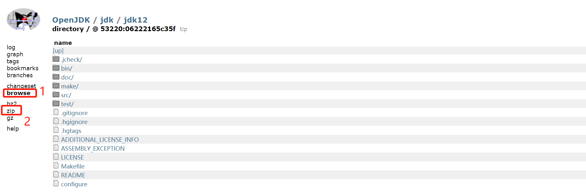

2、利用xftp将压缩包上传至`/usr/local/`

3、解压

```bash
# 安装unzip工具包
yum install -y unzip
unzip jdk12-06222165c35f
```

4、下载oracle jdk并解压，目的是编译openjdk12中的java代码

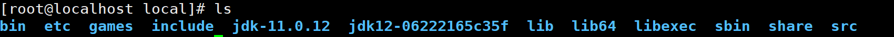

5、配置jdk11环境变量

```bash
# 进入配置文件
[root@localhost local]# vim /etc/profile

# 配置JAVA_HOME与PATH
JAVA_HOME=/usr/local/jdk-11.0.12
export PATH=$PATH:$JAVA_HOME/bin

# 使配置文件生效
source /etc/profile

# 查看java版本
```

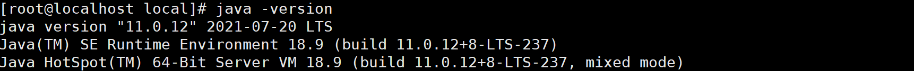

6、安装扩展依赖

```bash
yum groupinstall -y "Development Tools"
yum install -y freetype-devel
yum install -y cups-devel
yum install -y libXtst-devel libXt-devel libXrender-devel libXrandr-devel libXi-devel
yum install -y alsa-lib-devel
yum install -y libffi-devel
yum install -y autoconf
yum install -y fontconfig-devel
```

7、进行编译相关配置，切换到openjdk12的`configure`所在目录

```bash
bash configure --enable-debug --with-jvm-variants=server
```

8、运行`make`，如果安装失败了，解决错误后要使用`make clean`和`make dist-clean`清理后再执行`make`，该过程需要一些时间

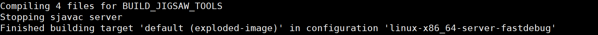

9、查看安装的jdk

```bash
cd build/linux-x86_64-server-fastdebug/jdk/bin
./java -version
```

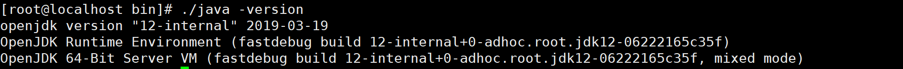

**成功安装了openjdk 12！**


### 安装Clion

1、下载地址https://www.jetbrains.com/clion/download/download-thanks.html?platform=linux

2、


## 自动内存管理

### 运行时数据区

#### 概述

Java虚拟机在执行Java程序的过程中会把它所管理的内存划分为若干个不同的数据区域。

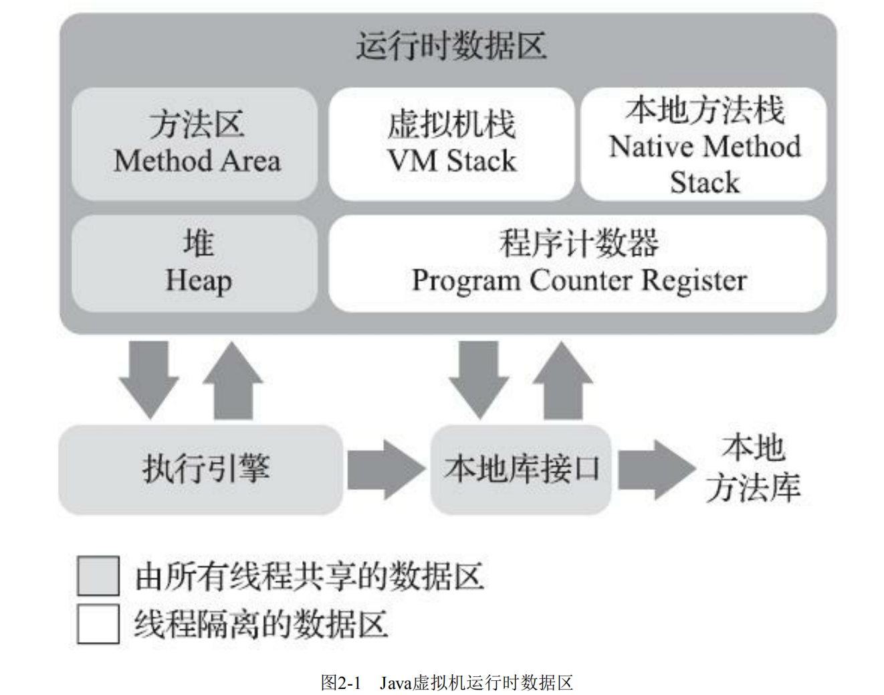

#### 程序计数器

> 什么是程序计数器？

程序计数器（Program Counter Register）是一块较小的内存空间，存储的是待执行字节码的行号，字节码解释器通过改变计数器的值来执行不同的字节码指令


> 什么是线程私有？

多线程模式下，为了保证线程切换后能够恢复到正确的执行位置，每个线程都有一个独立的程序计数器，这块内存区域就称为"线程私有"的内存


#### Java虚拟机栈

> 什么是虚拟机栈？

虚拟机栈描述了java方法的线程内存模型，每个方法执行时，会同步创建一个栈帧，栈帧里存放与方法相关的信息，方法的调用过程就对应栈帧在虚拟机栈中入栈和出栈的过程


> 什么是局部变量表？

局部变量表用来存储java的各种数据类型，比如基本数据类型，引用数据类型的指针等，它们通过局部变量槽(slot)存储，其中long、double会占用2个slot，即64bit，其余数据类型占用一个

局部变量表的内存空间在编译期间完成分配，即执行的每个方法在栈帧中分配的局部变量表空间是完全确定的


#### 本地方法栈

> 什么是本地方法栈？

**本地方法栈（Native Method Stacks）与虚拟机栈的区别**

虚拟机栈面向的是Java方法（也就是字节码）

本地方法栈面向的是本地（Native）方法


#### Java堆

> 什么是Java堆？

Java堆是被所有线程共享的一块内存区域，在虚拟机启动时创建。此内存区域的唯一目的就是存放对象实例，它是垃圾收集器管理的内存区域


#### 方法区

> 什么是方法区？

方法区（Method Area）与Java堆一样，是各个线程共享的内存区域，它用于存储已被虚拟机加载 的类型信息、常量、静态变量、即时编译器编译后的代码缓存等数据。


#### 运行时常量池 

> 什么是运行时常量池？

运行时常量池（Runtime Constant Pool）是方法区的一部分。Class文件中除了有类的相关描述信息外，还有常量池表（Constant Pool Table），存放各种字面量与符号引用，这部分内容将在类加载后存放到方法区的运行时常量池中。


#### 直接内存

> 什么是直接内存？

直接内存是在java堆外的、直接向系统申请的内存空间。通常访问直接内存的速度会优于Java堆，适合读写频繁的场合


### HotSpot虚拟机对象探秘

#### 概述

深入探讨一下HotSpot虚拟机在Java堆中对象分配、布局和访问的全过程。

#### 对象的创建

1、java文件中使用关键字new来创建对象

2、java文件编译后生成class文件

3、jvm遇到字节码指令new，检查常量池中有没有该类的符号引用，有的话就无须加载该类，否则执行类加载过程

4、jvm为新生对象分配内存，其大小在类加载完成后完全确定，根据java堆的内存是否规整，分配方式可以分为指针碰撞和空闲列表

5、jvm将分配到的内存空间（但不包括对象头）都初始化为零值，保证对象的实例字段不赋初值即可使用

6、jvm对对象进行其它设置，比如哈希码、GC分代年龄等

7、new指令之后会接着执行init ()方法，按照程序员的意愿对对象进行初始化


#### 对象的内存布局

> 概述

在HotSpot虚拟机里，对象在堆内存中的存储布局可以划分为三个部分：对象头（Header）、实例数据（Instance Data）和对齐填充（Padding）


> 对象头

存储对象自身运行时的数据，如哈希码

存储类型指针，用来确定该对象是哪个类的实例


> 实例数据

对象真正存储的有效信息，即我们在程序代码里面所定义的各种类型的字段内容


> 对齐填充

任何对象的大小都必须是8字节的整数倍，分没有对齐的话，就需要通过对齐填充来补全，它就相当于占位符


#### 对象的访问定位

> 句柄访问

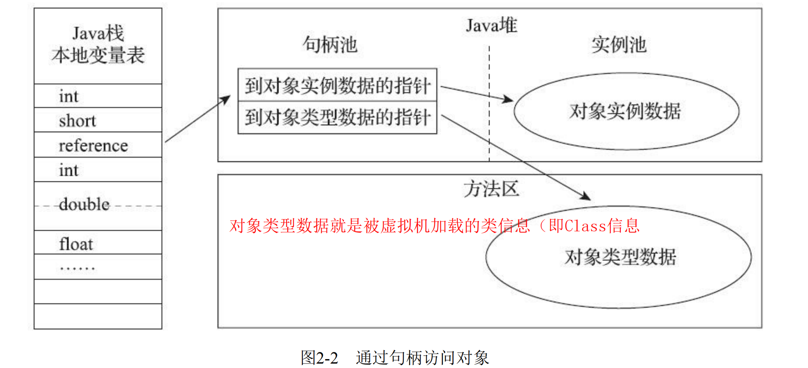


> 直接指针访问

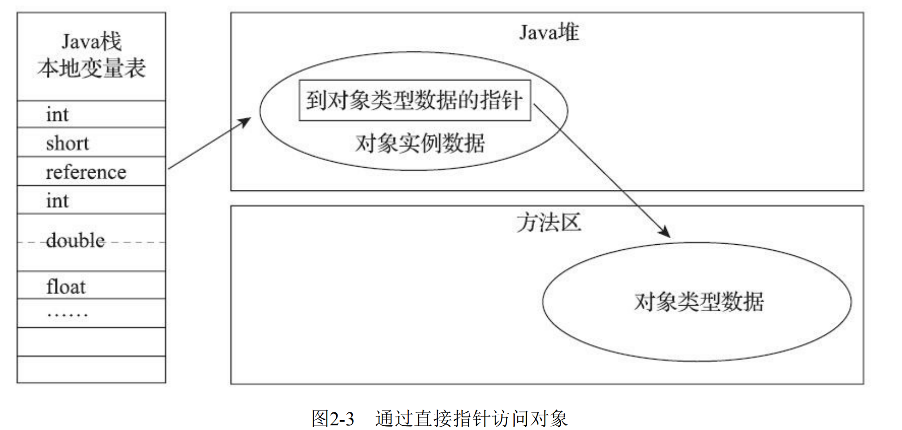


> 两种方式的比较

句柄访问好处是存储稳定的句柄地址，对象发生改变时，只会改变句柄池中的实例数据指针，而栈中的reference无须修改

直接指针访问直接存储实例数据的地址，访问效率较高


### 垃圾收集器与内存分配策略

#### 概述

> 垃圾收集器

*垃圾收集器 是*一个在*Java*虚拟机 上运行的程序，它释放不再使用的对象内存。它是自动内存管理的一种形式。


#### 引用计数算法

> 什么是引用计数算法？

在对象中添加一个计数器，每次引用该对象时，计数器加一，当引用失效时，计数器减一，当计数器为零时，说明这个对象不再使用，可以进行回收


> 为什么java没有采用引用计数算法？

假设现在有两个对象，它们都有属性instance，当它们的instance相互引用时，即使这两个对象不再使用，它们的引用计数器也无法清零，这样就无法进行垃圾回收了


#### 可达性分析算法

> 什么是引用链？

从GC Roots开始，根据对象间的引用关系向下搜索，搜索过程走过的路径


> 什么是可达性分析算法？

如果某个对象到GC Roots之间没有任何引用链相连，说明此对象已不会被使用

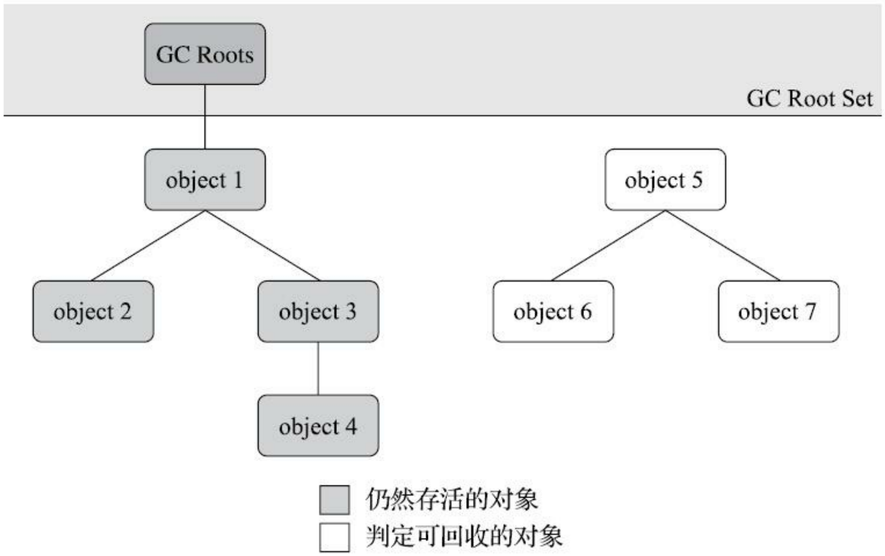


#### 引用

> 什么是强引用？

reference类型的数据中存储的数值代表的是另外一块内存的起始地址


> 什么是软引用？

对于一些有用但是非必须的对象，被软引用关联的对象在即将发生OOM前，会将这些对象进行二次回收


> 什么是弱引用？

弱引用也是针对一些非必须的对象，它们一直存活到下一次垃圾收集器工作之前


> 什么是虚引用？

虚引用是最弱的一种引用关系，它的作用是被关联虚引用的对象在被垃圾收集器回收后，收到一条系统通知


#### 对象死亡条件

1、可达性分析算法判断对象为不可达

2、对象放置在F-Queue队列中，由Finalizer线程为该对象执行finalize()方法

注意：

如果在执行finalize()方法中，对象有了引用关系，那么该对象将会存活

任何一个对象的finalize()方法都只会被系统自动调用一次


#### 回收方法区

> 什么是回收方法区

它主要回收废弃的常量和不再使用的类型，与java堆的垃圾回收相比，它的回收条件更加严格，"性价比"比较低


> 应用场景

大量使用反射、动态代理、CGLib等字节码框架，动态生成JSP以及OSGi这类频繁自定义类加载器的场景，都需要Java虚拟机具备类型卸载的能力，以保证不会对方法区造成过大的内存压力。


#### 垃圾收集算法

> 垃圾收集名词

部分收集(Partial GC)：并不是针对整个java堆进行回收

新生代收集(Minor GC/Young GC)：只对新生代对象进行垃圾回收

老年代收集(Major GC/Old GC)：只对老年代对象进行垃圾回收

混合收集(Mixed GC)：回收对象是新生代和部分老年代

整堆收集(Full GC)：收集整个Java堆和方法区


> 类别

引用式垃圾收集，又称直接垃圾收集，英文全称为Reference Counting GC 

追踪式垃圾收集，又称间接垃圾收集，英文全称为Tracing GC


> 标记-清除算法

标记要回收的对象，标记完成后，统一回收被标记的对象，或者是反过来，标记存活的对象，统一回收未被标记的对象

缺点有两个

- 执行效率不稳定，标记和回收次数要受到java堆中对象数量的影响

- 内存空间碎片化，垃圾回收后，如果想要分配占用内存较大的对象，可能找不到连续内存，从而触发又一次垃圾回收


> 标记-复制算法

标记-复制算法它将内存划分为完全相同的两块，假设为A、B，一开始使用A，在进行垃圾回收时，将存活对象转移B，之后释放A的内存空间，B到A也是同理，它适合于回收大量存在"朝生熄灭"类的对象，比如新生代


> 标记-整理算法

标记-清除算法与标记-整理算法的本质差异在于后者是一种移动式算法，它将存活的对象移动到边界，按照次序排列，解决了内存碎片化的问题，其缺点不适合移动大量存活的对象


#### 分代收集理论

> 分代收集理论

弱分代假说：绝大多数对象都是朝生夕灭的

强分代假说：熬过越多次垃圾回收，对象就越难以消亡

跨代引用假说：跨代引用相对于同代引用来说仅占极少数


> Java垃圾收集器的设计原则

收集器将java堆划分为不同的区域，根据回收对象的年龄，将它们分配的不同的空间存储，比如处于新生代的对象放在一起，处于老年代的对象放在一起，不同区域采用不同的垃圾收集算法，从而提升jvm的性能


> 什么是跨代引用

当jvm进行Minor GC时，会扫描新生代中建立的记忆集，该记忆集标记了老年代哪块内存有跨代引用，对于存在跨代引用的新生代对象将不会被回收


#### 经典垃圾收集器

##### HotSpot虚拟机垃圾收集器

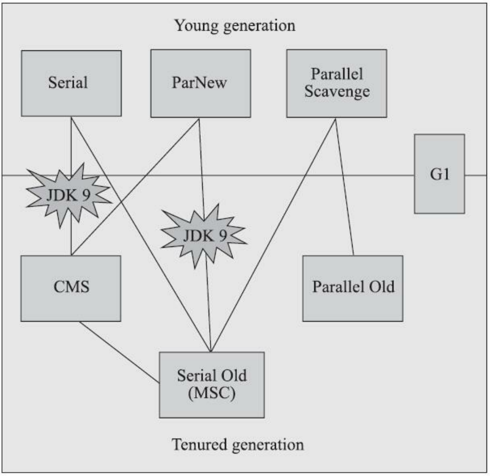

等了解各个垃圾收集器，再回来看看这张图


##### Serial收集器

Serial收集器是一个单线程的收集器，其进行垃圾回收时，必须暂停所有的工作线程，优点是内存消耗小，适合做客户端模式下虚拟机的新生代收集器

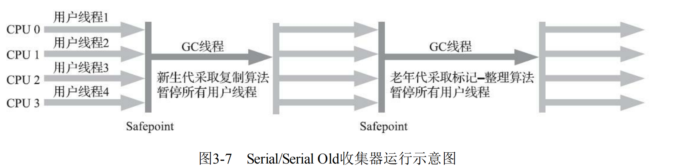


##### ParNew收集器

ParNew收集器实质上是Serial收集器的多线程并行版本，说白了就是多条线程进行垃圾回收，适合做服务端模式下虚拟机的新生代收集器

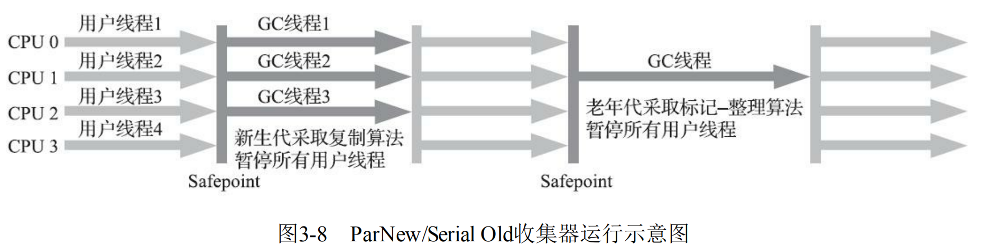


##### Parallel Scavenge收集器

Parallel Scavenge是一款新生代收集器，基于标记-整理算法，与ParNew的区别在于它的关注点是吞吐量，它有一种自适用调节吞吐量的策略，参数为UseAdaptiveSizePolicy，激活后即可自动调节

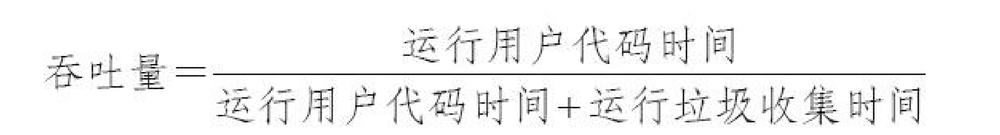


##### Serial Old收集器

Serial收集器的老年代版本，同样是一个单线程收集器，采用标记-整理算法，应用于客户端模式下的HotSpot虚拟机


##### Parallel Old收集器

Parallel Old是Parallel Scavenge收集器的老年代版本，支持多线程并发收集，基于标记-整理算法实现，适合吞吐量优先的场景

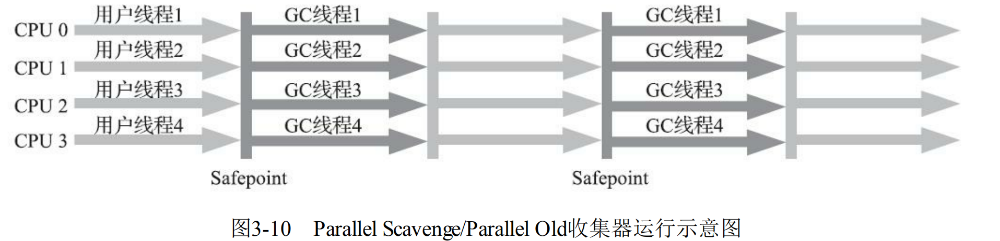


##### CMS收集器

> 什么是CMS收集器？

CMS(Concurrent Mark Sweep)收集器是基于标记-清除算法的，目的是获取最短的系统停顿时间，比如互联网网站，用户比较关注服务的响应速度，希望系统停顿时间尽可能短，所以，CMS收集器就非常适合这类场景


> CMS收集器工作流程

**1、初始标记**

标记一下GC Roots能直接关联到的对象

**2、并发标记**

从GC Roots的直接关联对象开始遍历整个对象图的过程，这个过程耗时较长但是不需要停顿用户线程，可以与垃圾收集线程一起并发运行

**3、重新标记**

修正并发标记期间，因用户程序继续运作而导致标记产生变动的那一部分对象的标记记录

**4、并发清除**

清理删除掉标记阶段判断的已经死亡的对象，可以与用户线程同时并发

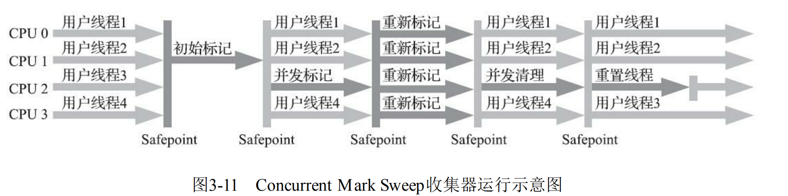


> CMS收集器的优点

并发收集、低停顿


> CMS收集器的缺点

1、对CPU资源比较敏感

2、无法处理"浮动垃圾"，"浮动垃圾"是在CMS的并发标记和并发清理阶段产生的，它们和用户线程是并发执行的，由用户线程产生的垃圾称为"浮动垃圾"

3、由于采用标记-清除算法，会存在内存碎片化的问题


##### Garbage First收集器

> 什么是Garbage First收集器？

Garbage First收集器简称G1收集器，它基于Region的内存布局，它将java堆划分成多个大小相等的独立区域，每一区域都可作为新生代空间或者老年代空间，G1的垃圾回收针对的就是划分的区域，而不是新生代、老年代或者整个java堆，每次回收垃圾对象较多的内存区域

基于Region的区域中有一块特殊的区域称为"Humongous"，它专门用来存储大对象(超过Region容量一半的对象)


> G1收集器的运作流程

初始标记：标记一下GC Roots能直接关联到的对象

并发标记：从GC Root开始扫描整个堆里的对象图，找出要回收的对象，只有该阶段可与用户线程并发执行

最终标记：对用户线程做另一个短暂的暂停，用于处理并发阶段结束后遗留下来的记录 

筛选回收：回收Region中死亡的对象，存活的对象移动到空Region中

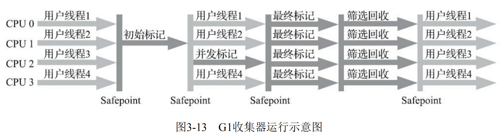


> G1收集器的优点

1、指定最大停顿时间

2、基于Region的内存布局

3、按收益动态确定回收集

4、解决了内存碎片化问题


> G1的缺点

1、G1使用卡表来处理跨代指针，对于每个Region，都必须有一份卡表，导致G1的记忆集占用java堆中更多的内存

2、用户程序执行时负载较高


#### 低延迟垃圾收集器

> 什么是低延迟垃圾收集器？

Shenandoah和ZGC它们的工作过程几乎全是并发的，垃圾回收的停顿时间极短


> 衡量垃圾收集器的指标

内存占用（Footprint）

吞吐量（Throughput）

延迟（Latency）

这三者不可能同时达成


> 各种垃圾收集器的并发情况

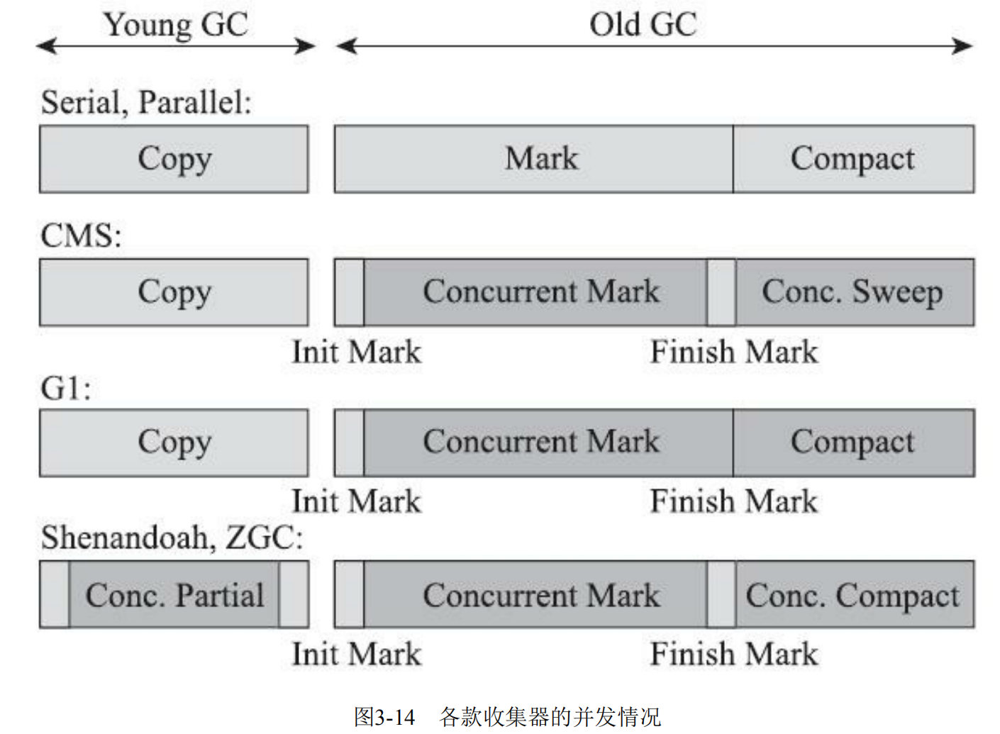


##### Shenandoah收集器

> 什么是Shenandoah收集器？

Shenandoah收集器更像是G1收集器的改进版，它有着与G1相似的内存布局、回收策略等，它的特点是垃圾回收阶段可与用户线程并发执行，没有分代收集，使用连接矩阵代替G1中的记忆集

连接矩阵可以理解为一张二维表格，下图中Region5中的某个对象引用了Region的某个对象，Region2中的某个对象引用

了Region1的某个对象

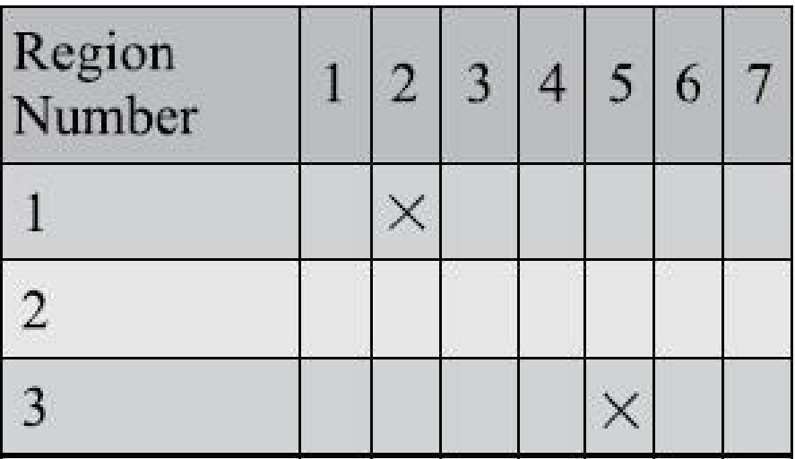


> Shenandoah收集器的工作过程

初始标记（Initial Marking）

并发标记（Concurrent Marking）

最终标记（Final Marking）

并发清理（Concurrent Cleanup）：清理那些整个区域内连一个存活对象都没有找到的Region

并发回收（Concurrent Evacuation）：Shenandoah将会通过读屏障和被称为“Brooks Pointers”的转发指针将回收集中的存活对象复制到未被使用的Region中

初始引用更新（Initial Update Reference）：把堆中所有指向旧对象的引用修正到复制后的新地址

并发引用更新（Concurrent Update Reference）：这个不太理解

最终引用更新（Final Update Reference）：修正存在于GC Roots中的引用

并发清理（Concurrent Cleanup）：清理整个回收集中的Region区域

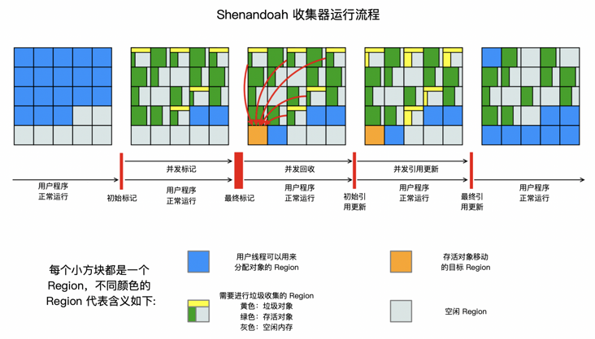


##### ZGC收集器 

> 什么是ZGC收集器？

ZGC收集器是一款基于Region内存布局的，不设分代的，使用了读屏障、染色指针和内存多重映射等技术来实现可并发的标记-整理算法的，以低延迟为首要目标的一款垃圾收集器


> ZGC收集器的堆内存布局

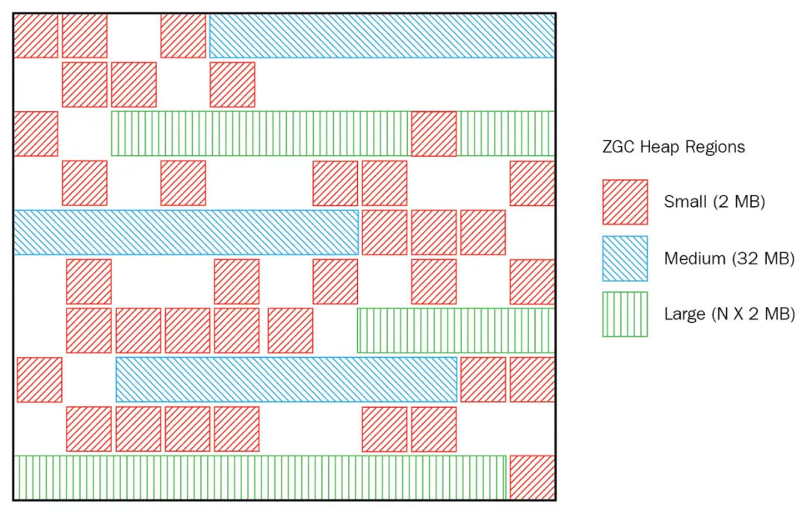


> ZGC工作过程

**并发标记**：遍历对象图做可达性分析，标记阶段更新染色指针中的Marked 0、Marked 1标志位

**并发预备重分配**：统计出本次收集过程要清理哪些Region，将这些Region组成重分配集（Relocation Set）

**并发重分配**：把重分配集中的存活对象复制到新的Region上，并为重分配集中的每个Region维护一个转发表（Forward 

Table），记录从旧对象到新对象的转向关系

**并发重映射**：修正整个堆中指向重分配集中旧对象的所有引用


### 虚拟机执行子系统

#### 无关性基石

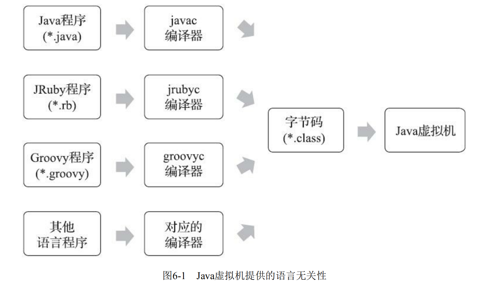


#### Class类文件的结构 

##### 魔数

> 什么是魔数？

每个Class文件的头4个字节被称为魔数，作用是确定这个文件是否为一个能被虚拟机接受的Class文件。


> 魔数与class文件版本

魔数的4个字节存储的是Class文件的版本号

第5和第6个字节是次版本号（Minor Version）

第7和第8个字节是主版本号（Major Version）


> 查看class文件的魔数

1、使用十六进制编辑器WinHex打开这个Class文件

2、如图所示，前4个字节16进制表示0xCAFEBABE，主版本号的值为0x0032

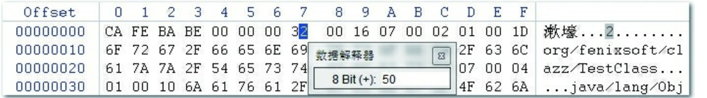


##### 常量池 

> 什么是常量池？

紧接着主、次版本之后就是常量池入口，前2个字节用来记录常量池容量，容量计数从1开始，比如下图表示常量池中共有21项常量，其中第0项常量为空，目的是当数据不想引用任何常量时，可以指向它

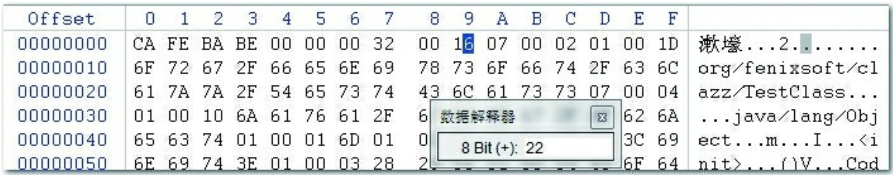


> 常量池中存放什么？

字面量：如文本字符串、final常量等

符号引用：如全类名、字段名和方法名


> 常量池中的常量

常量池中每一项常量都是一个表，现在共有17种不同类型的常量，其中于以CONSTANT_Class_info为例，其结构为

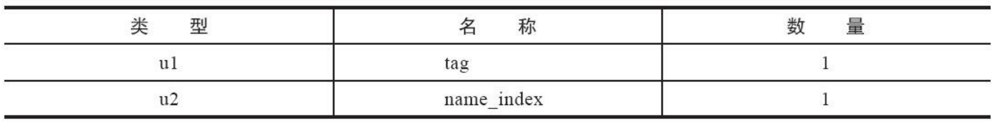

tag是标志位：区分常量类型

name_index：指向常量池中一个CONSTANT_Utf8_info类型常量，代表类或接口的全限定名


##### 访问标志

> 什么是访问标志？

在常量池结束之后，紧接着的2个字节代表访问标志，用于识别一些类或者接口层次的访问信息，比如是Class还是接口，是否定义为public类型


##### 类索引、父类索引与接口索引集合

> 什么是类索引？

类索引是一个u2类型的数据，用于确定该类的全限定名


> 什么是父类索引？

父类索引也是一个u2类型的数据，用于确定父类的全限定名


> 什么是接口索引集合？

接口索引集合是一组u2类型数据的集合，描述类实现了哪些接口


> 三者关系

类索引、父类索引和接口索引集合都按顺序排列在访问标志之后，如下图，从偏移地址为0x000000F1开始，第一个u2表示类索引、第二个u2表示父类索引、第三个u2表示接口索引集合的计数器，记录实现接口的数量，表中数量为0，那么后面的接口索引表不再占有任何字节

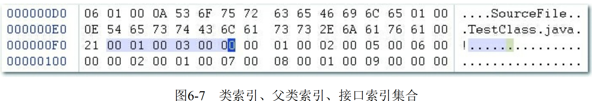


##### 字段表集合 

> 什么是字段表？

字段表（field_info）用于描述接口或者类中声明的变量，变量包括类级变量和实例变量

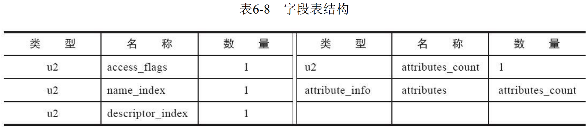

access_flags：设置字段类型，比如是否为public、是否为static、是否为enum等待

name_index：字段简单名称，比如private String name，直接简化为name

descriptor_index：描述字段的数据类型、方法的参数列表（包括数量、类型以及顺序）和返回值。


> 字段表理解

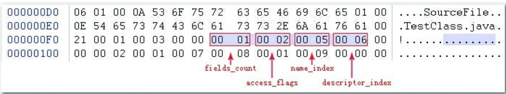

字段表集合从地址0x000000F8开始，第一个u2记录字段表数据的个数，其值为0x0001，即只有一个字段表数据，第二个u2值为0x0002，查询表格得到的标志名称为"ACC_PRIVATE"，第三个u2值为0x0005，查询常量表是CONSTANT_Utf8_info类型，其简单名称为"m"，代表字段描述符的descriptor_index的值为0x0006，指向常量池的字符串“I”，可以推断出原代码定义的字段为“private int m


##### 方法表集合

> 什么是方法表？

方法表用于描述接口或者类中声明的方法，它的结构类似于字段表

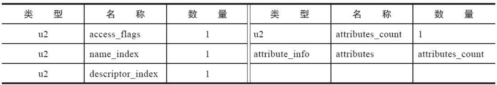


> 方法表理解

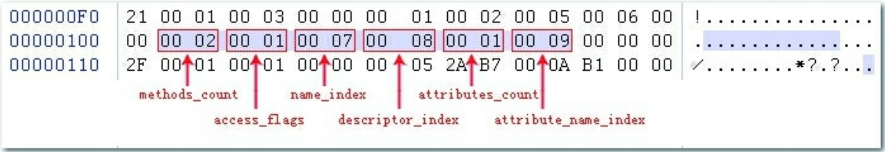

方法表入口地址为0x00000101，第一个u2表示方法的数量为2，第二个u2表示修饰符为public，第三个u2表示简单名称为<init>，第四个u2表示方法()V，第五个u2表示属性表集合中有一项属性，最后一个u2表示属性的简单名称Code


> Java重载

特征签名：方法中各个参数在常量池中字段符号引用的集合

Java重载除了要求方法名相同外，还需要方法间具有不同的特征签名，但特征签名中不包括方法的返回值，所以方法的返回值不能作为java重载的依据

在Class文件格式中，方法的描述符中包含返回值，描述符不同即可视为不同的方法


##### 属性表集合

> 什么是属性表？

前面的字段表、方法表在描述符后记录属性表相关信息，比如public static final String s = "123"，字段表中的属性表就会有ConstantValue属性，只要类中有方法，那么方法表中就会有Code属性


> Code属性

Java程序方法体里面的代码经过Javac编译器处理之后，最终变为字节码指令存储在Code属性内


> Exceptions属性 

Exceptions属性的作用是列举出方法抛出的受查异常


> LineNumberTable属性 

LineNumberTable属性用于描述Java源码行号与字节码行号（字节码的偏移量）之间的对应关系，比如执行时发生了异常，你会在控制台看到源码对应的异常所在行信息


> LocalVariableTable属性

描述栈帧中局部变量表的变量与Java源码中定义的变量之间的关系


> LocalVariableTypeTable属性

与LocalVariableTable非常相似，仅仅是把记录的字段描述符的descriptor_index替换成了字段的特征签名，目的是为了描述泛型


> SourceFile属性

SourceFile属性用于记录生成这个Class文件的源码文件名称


> SourceDebugExtension属性

用于存储额外的代码调试信息，比如JSP文件调试


> ConstantValue属性

通知虚拟机自动为静态变量赋值，静态变量有两种赋值方式，一种是在<cinit>方法汇总进行，一种是通过ConstantValue属性


> InnerClasses属性

记录内部类与宿主类之间的关联


> Deprecated属性

布尔属性，表示某个类、字段或者方法，已经被程序作者定为不再推荐使用


> Synthetic属性

布尔属性，字段或者方法并不是由Java源码直接产生的，而是由编译器自行添加的


> StackMapTable属性

虚拟机在加载字节码文件时，用于字节码文件的校验


> Signature属性 

Java采用的是泛型擦除法，编译之后泛型信息都会被擦除掉，而Signature记录了泛型信息


> BootstrapMethods属性 

保存invokedynamic指令引用的引导方法限定符


> MethodParameters属性 

记录方法的各个形参名称和信息


