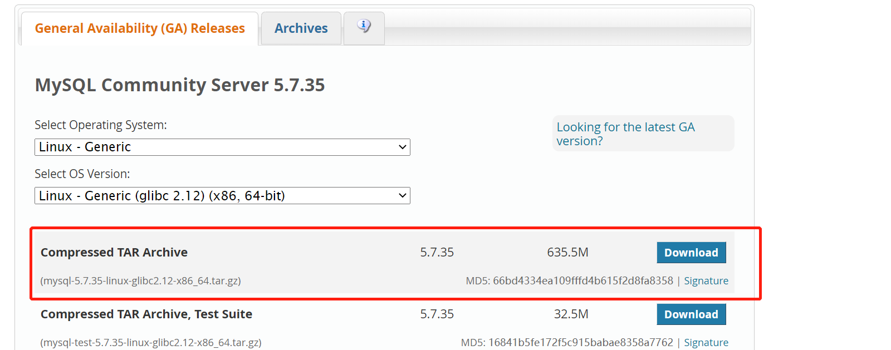
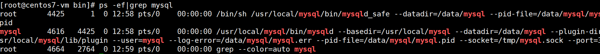
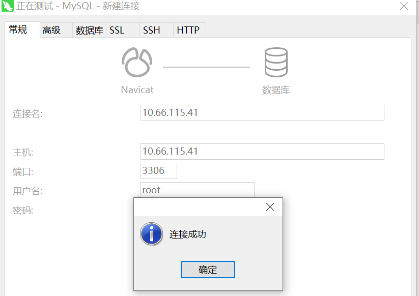

# Linux

## Linux安装mysql

> 安装方式一

1、下载mysql：https://dev.mysql.com/downloads/mysql/5.7.html#downloads



2、使用ftp工具将mysql压缩文件传输到/opt目录

3、解压下载的`.tar.gz`文件

```bash
[root@centos7-vm tarfile]# tar -zxvf mysql-5.7.35-linux-glibc2.12-x86_64.tar.gz
```


4、移动解压后的文件到/usr/local/mysql下

```bash
[root@centos7-vm tarfile]# mv mysql-5.7.35-linux-glibc2.12-x86_64 /usr/local/mysql
```


5、创建用户组和用户

```bash
[root@centos7-vm local]# groupadd mysql
[root@centos7-vm local]# useradd -r -g mysql mysql
```

6、创建数据目录，并赋予权限

```bash
[root@centos7-vm local]# mkdir -p  /data/mysql
[root@centos7-vm /]# chown mysql:mysql -R /data/mysql
```

7、配置my.cnf

```bash
[mysqld]
bind-address=0.0.0.0
port=3306
user=mysql
basedir=/usr/local/mysql
datadir=/data/mysql
socket=/tmp/mysql.sock
log-error=/data/mysql/mysql.err
pid-file=/data/mysql/mysql.pid
#character config
character_set_server=utf8mb4
symbolic-links=0
explicit_defaults_for_timestamp=true
```

8、进入mysql的bin目录进行初始化

```bash
# 初始化
[root@centos7-vm bin]# ./mysqld --defaults-file=/etc/my.cnf --basedir=/usr/local/mysql/ --datadir=/data/mysql/ --user=mysql --initialize
```

9、查看临时密码

```bash
[root@centos7-vm bin]# cat /data/mysql/mysql.err
# 密码
A temporary password is generated for root@localhost: upEt:v2:wh+*
```

10、拷贝mysql.server至/etc/init.d/mysql中

```bash
[root@centos7-vm support-files]# cp /usr/local/mysql/support-files/mysql.server /etc/init.d/mysql
```

11、启动数据库

```bash
[root@centos7-vm bin]# service mysql start
```


12、查看mysql详细信息

```bash
ps -ef|grep mysql
```



13、登录mysql，输入初始化后随机生成的密码

```bash
[root@centos7-vm bin]# ./mysql -u root -p
```

14、修改密码

```bash
SET PASSWORD = PASSWORD('root');
ALTER USER 'root'@'localhost' PASSWORD EXPIRE NEVER;
FLUSH PRIVILEGES;                                 
```

15、设置root访问权限

```java
use mysql
update user set host = '%' where user = 'root';
FLUSH PRIVILEGES;
```

16、打开windows本地navicat，测试连接linux数据库



