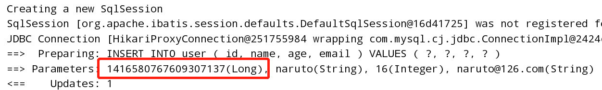
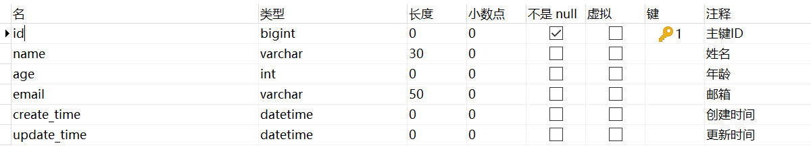
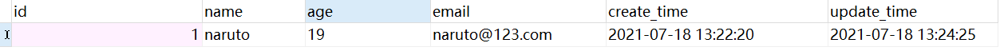
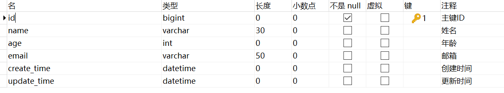
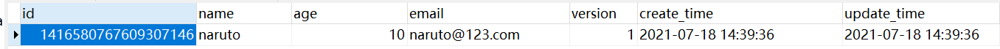
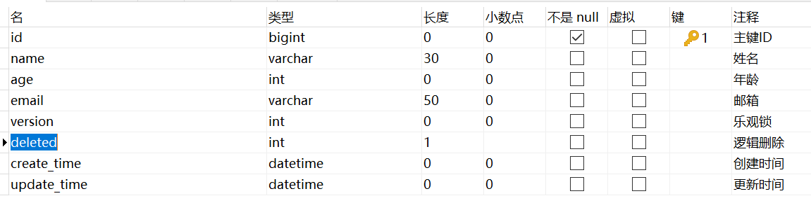
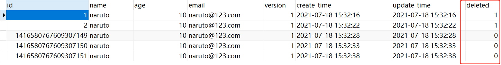
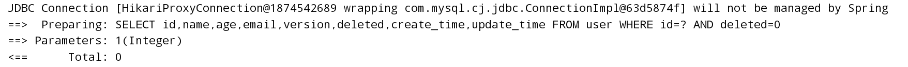

# MyBatis-Plus

## 快速入门

地址：https://baomidou.com/guide/

> 步骤

1、创建数据库`mybatis-plus`

2、创建user表

```sql
DROP TABLE IF EXISTS user;

CREATE TABLE user
(
	id BIGINT(20) NOT NULL COMMENT '主键ID',
	name VARCHAR(30) NULL DEFAULT NULL COMMENT '姓名',
	age INT(11) NULL DEFAULT NULL COMMENT '年龄',
	email VARCHAR(50) NULL DEFAULT NULL COMMENT '邮箱',
	PRIMARY KEY (id)
);
DELETE FROM user;

INSERT INTO user (id, name, age, email) VALUES
(1, 'Jone', 18, 'test1@baomidou.com'),
(2, 'Jack', 20, 'test2@baomidou.com'),
(3, 'Tom', 28, 'test3@baomidou.com'),
(4, 'Sandy', 21, 'test4@baomidou.com'),
(5, 'Billie', 24, 'test5@baomidou.com');
```

3、编写项目，使用`SpringBoot`初始化项目

4、导入依赖

```xml
<!--springboot-web相关-->
<dependency>
    <groupId>org.springframework.boot</groupId>
    <artifactId>spring-boot-starter-web</artifactId>
</dependency>

<!--springboot测试相关-->
<dependency>
    <groupId>org.springframework.boot</groupId>
    <artifactId>spring-boot-starter-test</artifactId>
    <scope>test</scope>
    <exclusions>
        <exclusion>
            <groupId>org.junit.vintage</groupId>
            <artifactId>junit-vintage-engine</artifactId>
        </exclusion>
    </exclusions>
</dependency>

<!--mysql-->
<dependency>
    <groupId>mysql</groupId>
    <artifactId>mysql-connector-java</artifactId>
    <scope>runtime</scope>
</dependency>

<!--lombok-->
<dependency>
    <groupId>org.projectlombok</groupId>
    <artifactId>lombok</artifactId>
    <optional>true</optional>
</dependency>

<!--mybatis-plus-->
<dependency>
    <groupId>com.baomidou</groupId>
    <artifactId>mybatis-plus-boot-starter</artifactId>
    <version>3.0.5</version>
</dependency>
```

说明：尽量不要同时导入 mybatis 和 mybatis-plus 版本的差异！

5、连接数据库！

```properties
# 数据库驱动：
spring.datasource.driver-class-name=com.mysql.cj.jdbc.Driver
# 数据库连接地址
spring.datasource.url=jdbc:mysql://localhost:3306/schema?useUnicode=true&characterEncoding=utf8&useSSL=false&serverTimezone=Asia/Shanghai&allowPublicKeyRetrieval=true
# 数据库用户名&密码：
spring.datasource.username=root
spring.datasource.password=root
```

<font color='red'>6、传统方式pojo-dao(连接mybatis，配置mapper.xml)-service-controller</font>

6、使用mybatis-plus之后

- pojo

  ```java
  package cn.pikaqiang.pojo;
  
  import lombok.AllArgsConstructor;
  import lombok.Data;
  import lombok.NoArgsConstructor;
  
  @Data
  @AllArgsConstructor
  @NoArgsConstructor
  public class User {
  
      private Long id;
      private String name;
      private Integer age;
      private String email;
  
  }
  ```

- mapper接口

  ```java
  package cn.pikaqiang.mapper;
  
  import com.baomidou.mybatisplus.core.mapper.BaseMapper;
  import cn.pikaqiang.pojo.User;
  import org.springframework.stereotype.Repository;
  
  /**
   * 继承BaseMapper
   */
  @Repository
  public interface UserMapper extends BaseMapper<User> {
  
  }
  ```

- 注意点，需要在启动类上去扫描mapper包下的所有接口`@MapperScan("cn.pikaqiang.mapper")`

  ```java
  package cn.pikaqiang;
  
  import org.apache.ibatis.annotations.Mapper;
  import org.mybatis.spring.annotation.MapperScan;
  import org.springframework.boot.SpringApplication;
  import org.springframework.boot.autoconfigure.SpringBootApplication;
  
  // 扫描mapper文件夹
  @MapperScan("cn.pikaqiang.mapper")
  @SpringBootApplication
  public class MybatisPlusApplication {
  
      public static void main(String[] args) {
          SpringApplication.run(MybatisPlusApplication.class, args);
      }
  
  }
  ```

- 测试类

  ```java
  package cn.pikaqiang;
  
  import cn.pikaqiang.mapper.UserMapper;
  import cn.pikaqiang.pojo.User;
  import org.junit.jupiter.api.Test;
  import org.springframework.beans.factory.annotation.Autowired;
  import org.springframework.boot.test.context.SpringBootTest;
  
  import java.util.List;
  
  @SpringBootTest
  class MybatisPlusApplicationTests {
  
      // 继承了BaseMapper，可以使用它的所有方法，我们也可以自定义方法
  
      @Autowired
      private UserMapper userMapper;
  
      @Test
      void contextLoads() {
  
          List<User> users = userMapper.selectList(null);
          // 看源码得知其参数action为对每个元素要执行的操作
          users.forEach(System.out::println);
      }
  
  }
  ```

- 运行结果

  ```txt
  User(id=1, name=Jone, age=18, email=test1@baomidou.com)
  User(id=2, name=Jack, age=20, email=test2@baomidou.com)
  User(id=3, name=Tom, age=28, email=test3@baomidou.com)
  User(id=4, name=Sandy, age=21, email=test4@baomidou.com)
  User(id=5, name=Billie, age=24, email=test5@baomidou.com)
  ```


## 配置日志

因为sql是不可见的，要想知道sql是如何执行的，必须看日志！

```properties
# 日志配置--mybatis默认日志格式
mybatis-plus.configuration.log-impl=org.apache.ibatis.logging.stdout.StdOutImpl
```


## CRUD扩展

### 插入操作

> Insert插入

- 在测试类中进行插入测试

```java
@Test
void insertUser() {
    User user = new User(null,"naruto",16,"naruto@126.com");
    int res = userMapper.insert(user);
    System.out.println(res);
}
```

- 运行结果



> 数据库插入的id默认值：全局的唯一id

### 主键生成策略

分布式系统唯一id生成：https://juejin.cn/post/6844904016141369352

**雪花算法**：

SnowFlake 算法，是 Twitter 开源的分布式 id 生成算法。其核心思想就是：使用一个 64 bit 的 long 型的数字作为全局唯一 id。在分布式系统中的应用十分广泛，且ID 引入了时间戳，基本上保持自增的。

> 主键自增

1、实体类字段`@TableId(type = IdType.AUTO)`

2、数据库字段也要设置自增

3、再次测试插入即可！

> 其余的字段解释

```java
public enum IdType {
    AUTO(0), // id自增
    NONE(1), // 未设置主键类型
    INPUT(2), // 手动输入id
    ID_WORKER(3), // 默认的全局唯一id
    UUID(4), // 全局唯一id
    ID_WORKER_STR(5); //ID_WORKER的字符串表示
}

```

### 更新操作

```java
@Test
    void updateUser() {
        User user = new User(5L,"sasuke",16,"naruto@126.com");
        userMapper.updateById(user);
    }
```

注意：mybatis-plus可以根据条件自动拼接动态sql

### 自动填充

创建时间、修改时间一般是自动完成的，我们不希望手动更新！

阿里巴巴开发手册要求几乎所有的数据库表都要配置：gmt_create、gmt_modified！

> 方式一：数据库级别(**工作中不允许修改数据库**)

1、在表中新增字段create_time，update_time



其中，create_time默认值为`CURRENT_TIMESTAMP`，update_time默认值相同，还要勾选**根据当前时间戳更新**！

2、在实体类添加字段！再次测试插入方法

```java
private Date createTime;
private Date updateTime;
```

mybatis-plus默认开启了驼峰式命名规则，即实体类中的`驼峰式命名`可与数据库中的`下划线命名`相对应

3、运行结果



> 方式二：代码级别

1、删除数据库的默认值、更新操作



2、在实体类字段属性上增加注解

```java
// 设置字段填充策略
@TableField(fill = FieldFill.INSERT)
private Date createTime;
@TableField(fill = FieldFill.INSERT_UPDATE)
private Date updateTime;
```

3、编写处理器处理注解

```java
package cn.pikaqiang.handler;

import com.baomidou.mybatisplus.core.handlers.MetaObjectHandler;
import lombok.extern.slf4j.Slf4j;
import org.apache.ibatis.reflection.MetaObject;
import org.springframework.stereotype.Component;

import java.util.Date;

@Slf4j
@Component
public class MyMetaObjectHandler implements MetaObjectHandler {

    /**
     * 插入填充策略
     * @param metaObject
     */
    @Override
    public void insertFill(MetaObject metaObject) {
        log.info("start insert fill......");
        // 看源码就是为java bean属性赋值
        this.setFieldValByName("createTime",new Date(),metaObject);
        this.setFieldValByName("updateTime",new Date(),metaObject);
        log.info("insert fill completed");
    }

    /**
     * 更新填充策略
     * @param metaObject
     */
    @Override
    public void updateFill(MetaObject metaObject) {
        log.info("start update fill......");
        this.setFieldValByName("updateTime",new Date(),metaObject);
        log.info("update fill completed!");
    }
}
```

4、测试插入、更新


### 乐观锁

> 乐观锁：认为不会出现问题，无论干什么都不会去上锁，如果出了问题，再去更新值测试
>
> 悲观锁：认为总是出现问题，无论干什么都会上锁，再去操作

version、new version

当要更新一条记录的时候，希望这条记录没有被别人更新
乐观锁实现方式：

- 取出记录时，获取当前version
- 更新时，带上这个version(附加条件)
- 执行更新时， set version = newVersion where version = oldVersion
- 如果version不对，就更新失败

```sql
update user set name = "naruto", version = version + 1
where id = 2 and version = 1
```

> 测试MP的乐观锁插件

1、给数据库中增加version字段



2、同步实体类

```java
@Version
private Integer version;
```

3、注册组件

```java
package cn.pikaqiang.config;

import com.baomidou.mybatisplus.extension.plugins.MybatisPlusInterceptor;
import com.baomidou.mybatisplus.extension.plugins.inner.OptimisticLockerInnerInterceptor;
import org.mybatis.spring.annotation.MapperScan;
import org.springframework.context.annotation.Bean;
import org.springframework.context.annotation.Configuration;
import org.springframework.transaction.annotation.EnableTransactionManagement;

// 扫描mapper文件夹
@MapperScan("cn.pikaqiang.mapper")
@EnableTransactionManagement
@Configuration
public class MyBatisPlusConfig {
    // 注册乐观锁插件
    @Bean
    public MybatisPlusInterceptor mybatisPlusInterceptor() {
        MybatisPlusInterceptor interceptor = new MybatisPlusInterceptor();
        interceptor.addInnerInterceptor(new OptimisticLockerInnerInterceptor());
        return interceptor;
    }
}
```

4、测试乐观锁

```java
// 测试乐观锁成功案例
@Test
public void testOptimisticLockerSuccess() {
    // 查询用户信息
    User user = userMapper.selectById(1L);
    // 修改用户信息
    user.setName("sasuke");
    userMapper.updateById(user);
}


// 测试乐观锁失败案例
@Test
public void testOptimisticLockerLose() {
    // 线程1
    User user1 = userMapper.selectById(1L);
    user1.setName("kakaxi");

    // 线程2，插队操作
    User user2 = userMapper.selectById(1L);
    user2.setName("naruto");
    userMapper.updateById(user2);

    userMapper.updateById(user1);
}
```

根据控制台打印的日志，查看每次sql执行拿到的版本！


### 查询操作

```java
// 根据 ID 查询
T selectById(Serializable id);
// 根据 entity 条件，查询一条记录
T selectOne(@Param(Constants.WRAPPER) Wrapper<T> queryWrapper);

// 查询（根据ID 批量查询）
List<T> selectBatchIds(@Param(Constants.COLLECTION) Collection<? extends Serializable> idList);
// 根据 entity 条件，查询全部记录
List<T> selectList(@Param(Constants.WRAPPER) Wrapper<T> queryWrapper);
// 查询（根据 columnMap 条件）
List<T> selectByMap(@Param(Constants.COLUMN_MAP) Map<String, Object> columnMap);
// 根据 Wrapper 条件，查询全部记录
List<Map<String, Object>> selectMaps(@Param(Constants.WRAPPER) Wrapper<T> queryWrapper);
// 根据 Wrapper 条件，查询全部记录。注意： 只返回第一个字段的值
List<Object> selectObjs(@Param(Constants.WRAPPER) Wrapper<T> queryWrapper);

// 根据 entity 条件，查询全部记录（并翻页）
IPage<T> selectPage(IPage<T> page, @Param(Constants.WRAPPER) Wrapper<T> queryWrapper);
// 根据 Wrapper 条件，查询全部记录（并翻页）
IPage<Map<String, Object>> selectMapsPage(IPage<T> page, @Param(Constants.WRAPPER) Wrapper<T> queryWrapper);
// 根据 Wrapper 条件，查询总记录数
Integer selectCount(@Param(Constants.WRAPPER) Wrapper<T> queryWrapper);
```


### 分页查询

1、原始的limit分页

2、pageHelper插件

3、MP内置分页插件

> 如何使用

```java
// 扫描mapper文件夹
@MapperScan("cn.pikaqiang.mapper")
@EnableTransactionManagement
@Configuration
public class MyBatisPlusConfig {
    // 注册分页插件
    @Bean
    public MybatisPlusInterceptor mybatisPlusInterceptor() {
        MybatisPlusInterceptor interceptor = new MybatisPlusInterceptor();
        interceptor.addInnerInterceptor(new PaginationInnerInterceptor(DbType.MYSQL));
        return interceptor;
    }
}
```

2、测试一下

```java
// 测试分页查询
@Test
public void textPage() {
    // 当前第一页，每页显示5条数据
    Page<User> page = new Page<>(1,5);
    userMapper.selectPage(page,null);
    page.getRecords().forEach(System.out::println);
    System.out.println("总个数: "+page.getTotal());
    long pages = page.getPages();
    System.out.println("总页数: "+pages);
}
```


### 删除操作

1、根据id删除记录

```java
// 根据 entity 条件，删除记录
int delete(@Param(Constants.WRAPPER) Wrapper<T> wrapper);
// 删除（根据ID 批量删除）
int deleteBatchIds(@Param(Constants.COLLECTION) Collection<? extends Serializable> idList);
// 根据 ID 删除
int deleteById(Serializable id);
// 根据 columnMap 条件，删除记录
int deleteByMap(@Param(Constants.COLUMN_MAP) Map<String, Object> columnMap);
```


### 逻辑删除

> 物理删除：从数据库直接移除
>
> 逻辑删除：通过一个变量让字段失效，无法查询得到，类似于回收站

1、在数据表中增加deleted字段，默认值为0



2、同步实体类

```java
private Integer deleted;
```

3、在`application.properties`配置逻辑删除

```properties
#配置逻辑删除
mybatis-plus.global-config.db-config.logic-delete-field: deleted
mybatis-plus.global-config.db-config.logic-delete-value: 1
mybatis-plus.global-config.db-config.logic-not-delete-value: 0
```

4、测试

```java
// 测试逻辑删除
@Test
public void testDelete() {
    userMapper.deleteById(1L);
}
```

**注意：还有一种方式**

```java
// 只需配置该注解，无须任何配置
@TableLogic
private Integer deleted;
```



5、测试查询(找不到)




### 性能分析插件

平时开发中，会遇到一些慢sql。MP提供了性能分析插件，超时就会停止运行！

1、详情见官网：https://baomidou.com/guide/p6spy.html


### 条件查询器

1、查询name不为空并且邮箱不为空的用户，年龄大于等于12

```java
@Test
void contextLoads() {

    // 查询name不为空并且邮箱不为空的用户，年龄大于等于12
    QueryWrapper<User> wrapper = new QueryWrapper<>();
    wrapper.isNotNull("name").isNotNull("email").ge("age",12);
    userMapper.selectList(wrapper).forEach(System.out::println);
}
```

2、详情见官网：https://baomidou.com/guide/wrapper.html#le


### 代码生成器

1、详情见官网：https://baomidou.com/guide/generator.html#%E4%BD%BF%E7%94%A8%E6%95%99%E7%A8%8B

2、基本代码

```java
package cn.pikaqiang;

import com.baomidou.mybatisplus.annotation.FieldFill;
import com.baomidou.mybatisplus.annotation.IdType;
import com.baomidou.mybatisplus.core.exceptions.MybatisPlusException;
import com.baomidou.mybatisplus.core.toolkit.StringPool;
import com.baomidou.mybatisplus.core.toolkit.StringUtils;
import com.baomidou.mybatisplus.generator.AutoGenerator;
import com.baomidou.mybatisplus.generator.InjectionConfig;
import com.baomidou.mybatisplus.generator.config.*;
import com.baomidou.mybatisplus.generator.config.po.TableFill;
import com.baomidou.mybatisplus.generator.config.po.TableInfo;
import com.baomidou.mybatisplus.generator.config.rules.DateType;
import com.baomidou.mybatisplus.generator.config.rules.NamingStrategy;
import com.baomidou.mybatisplus.generator.engine.FreemarkerTemplateEngine;

import java.util.ArrayList;
import java.util.List;
import java.util.Scanner;

// 演示例子，执行 main 方法控制台输入模块表名回车自动生成对应项目目录中
public class CodeGenerator {

    /**
     * <p>
     * 读取控制台内容
     * </p>
     */
    public static String scanner(String tip) {
        Scanner scanner = new Scanner(System.in);
        StringBuilder help = new StringBuilder();
        help.append("请输入" + tip + "：");
        System.out.println(help.toString());
        if (scanner.hasNext()) {
            String ipt = scanner.next();
            if (StringUtils.isNotBlank(ipt)) {
                return ipt;
            }
        }
        throw new MybatisPlusException("请输入正确的" + tip + "！");
    }

    public static void main(String[] args) {
        // 代码生成器
        AutoGenerator mpg = new AutoGenerator();

        // 全局配置
        GlobalConfig gc = new GlobalConfig();
        // user.dir为当前系统目录
        String projectPath = System.getProperty("user.dir");
        // 代码生成路径
        gc.setOutputDir(projectPath + "/src/main/java");
        // 设置作者
        gc.setAuthor("jobob");
        // 资源生成后是否打开文件目录，选择不打开
        gc.setOpen(false);
        // 是否覆盖原来生成的
        gc.setFileOverride(false);
        // 去Service的I前缀
        gc.setServiceName("%sService");
        // 主键生成策略
        gc.setIdType(IdType.ASSIGN_ID);
        // 日期类型
        gc.setDateType(DateType.ONLY_DATE);
        // 实体属性 Swagger2 注解
      /*  gc.setSwagger2(true);*/
        mpg.setGlobalConfig(gc);

        // 数据源配置
        DataSourceConfig dsc = new DataSourceConfig();
        dsc.setUrl("jdbc:mysql://localhost:3306/schema?useUnicode=true&characterEncoding=utf8&useSSL=false&serverTimezone=Asia/Shanghai&allowPublicKeyRetrieval=true");
        // dsc.setSchemaName("public");
        dsc.setDriverName("com.mysql.cj.jdbc.Driver");
        dsc.setUsername("root");
        dsc.setPassword("root");
        mpg.setDataSource(dsc);

        // 包配置
        PackageConfig pc = new PackageConfig();
        pc.setModuleName(scanner("模块名"));
        pc.setParent("cn.pikaqiang.test");
        mpg.setPackageInfo(pc);

        // 自定义配置
        InjectionConfig cfg = new InjectionConfig() {
            @Override
            public void initMap() {
                // to do nothing
            }
        };

        // 如果模板引擎是 freemarker
        /*String templatePath = "/templates/mapper.xml.ftl";*/
        // 如果模板引擎是 velocity
        String templatePath = "/templates/mapper.xml.vm";

        // 自定义输出配置
        List<FileOutConfig> focList = new ArrayList<>();
        // 自定义配置会被优先输出
        focList.add(new FileOutConfig(templatePath) {
            @Override
            public String outputFile(TableInfo tableInfo) {
                // 自定义输出文件名 ， 如果你 Entity 设置了前后缀、此处注意 xml 的名称会跟着发生变化！！
                return projectPath + "/src/main/resources/mapper/" + pc.getModuleName()
                        + "/" + tableInfo.getEntityName() + "Mapper" + StringPool.DOT_XML;
            }
        });
        /*
        cfg.setFileCreate(new IFileCreate() {
            @Override
            public boolean isCreate(ConfigBuilder configBuilder, FileType fileType, String filePath) {
                // 判断自定义文件夹是否需要创建
                checkDir("调用默认方法创建的目录，自定义目录用");
                if (fileType == FileType.MAPPER) {
                    // 已经生成 mapper 文件判断存在，不想重新生成返回 false
                    return !new File(filePath).exists();
                }
                // 允许生成模板文件
                return true;
            }
        });
        */
        cfg.setFileOutConfigList(focList);
        mpg.setCfg(cfg);

        // 配置模板
        TemplateConfig templateConfig = new TemplateConfig();

        // 配置自定义输出模板
        //指定自定义模板路径，注意不要带上.ftl/.vm, 会根据使用的模板引擎自动识别
        // templateConfig.setEntity("templates/entity2.java");
        // templateConfig.setService();
        // templateConfig.setController();

        templateConfig.setXml(null);
        mpg.setTemplate(templateConfig);

        // 策略配置
        StrategyConfig strategy = new StrategyConfig();
        // 设置要映射的表名
        strategy.setInclude("user");
        // 设置命名规则，下划线转驼峰式命名
        strategy.setNaming(NamingStrategy.underline_to_camel);
        strategy.setColumnNaming(NamingStrategy.underline_to_camel);
        // 自动生成Lombok
        strategy.setEntityLombokModel(true);
        // 自动填充配置
        strategy.setLogicDeleteFieldName("deleted");
        TableFill gmtCreate = new TableFill("gmt_create", FieldFill.INSERT);
        TableFill gmtModified = new TableFill("gmt_modified",FieldFill.INSERT_UPDATE);
        ArrayList<TableFill> tableFills = new ArrayList<>();
        tableFills.add(gmtCreate);
        tableFills.add(gmtModified);
        // 乐观锁
        strategy.setVersionFieldName("version");
        // 开启restful的驼峰式命名
        strategy.setRestControllerStyle(true);
        // 公共父类
        strategy.setSuperControllerClass("你自己的父类控制器,没有就不用设置!");
        // 链接：localhost:8080/hello_id_2，即下划线命名
        strategy.setControllerMappingHyphenStyle(true);
        mpg.setStrategy(strategy);
        mpg.execute();
    }

}
```


