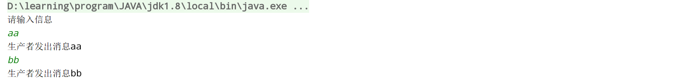
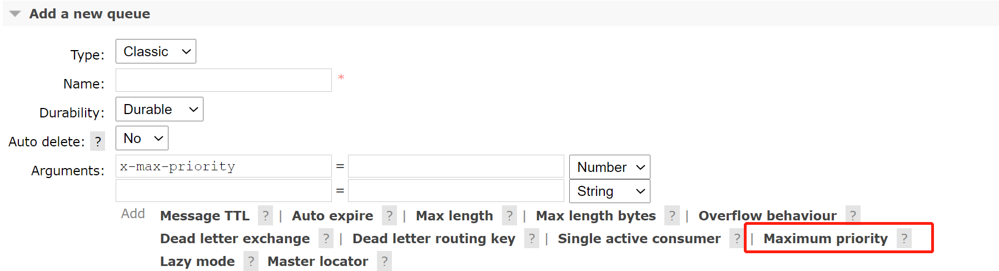
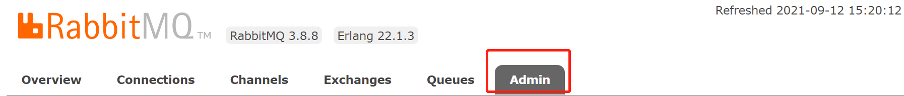
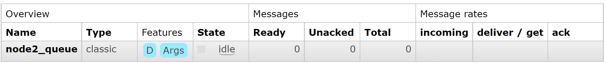

RabbitMQ

## 消息队列

### 概述

> 什么是MQ？

MQ(message queue)，顾名思义，消息队列，它是一种进程间或者线程间的异步通信方式。


> 为什么要使用MQ？

**流量消峰**：比如订单系统1s内可处理1w个订单，此时有2w个订单，那就多给订单系统几秒，直到处理完毕

**应用解耦**：比如电商应用中有订单系统和物流系统等等，用户创建订单后，订单信息会写入消息队列，物流系统要处理的信息在消息队列中，物流系统发不发生故障都不会影响到用户的成功下单

**异步处理**：A 调用 B 服务后，只需要监听 B 处理完成的消息，当 B 处理完成后，会发送一条消息给 MQ，MQ 会将此消息转发给 A 服务


> MQ分类

ActiveMQ：一款开源的消息中间件，基于**主从架构(集群中的主节点与从节点)**实现高可用性，适合低吞吐量的场景

Kafka：吞吐量高，在大数据领域的实时计算以及日志采集被大规模使用

RockerMQ：阿里巴巴开源产品，单机吞吐量十万级，分布式架构

RabbitMQ：在AMQP(高级消息队列协议)基础上完成，吞吐量万级，高并发特性


> MQ应用场景

Kafka：适合产生**大量数据**的互联网服务的数据收集业务。

RocketMQ：对于可靠性要求很高的场景，尤其是电商里面的订单扣款

RabbitMQ：中小型公司优先选择功能比较完备的 RabbitMQ


> 什么是RabbitMQ？

RabbitMQ是一个消息中间件，它用来接收、存储和转发消息数据


> 四大核心

生产者：负责产生数据并发送消息的程序

交换机：一方面接收生成者发送的消息，一方面将消息推送到队列中

队列：本质是一个消息缓冲区，交换机将消息推送给队列，然后消费者从队列中获取消息

消费者：负责接收消息的程序


> 工作原理


**Broker**：接收和分发消息的应用，RabbitMQ Server 就是 Message Broker

**Virtual host**：类似于网络中的 namespace 概念

**Connection**：publisher／consumer 和 broker 之间的 TCP 连接

**Channel**：  connection 内部建立的逻辑连接

**Exchange**：根据分发规则，匹配查询表中的 routing key，分发消息到 queue 中去

**Queue**：消息最终被送到这里等待 consumer 取走

**Binding**：exchange 和 queue 之间的虚拟连接，binding 中可以包含 routing key，Binding 信息被保

存到 exchange 中的查询表中，用于 message 的分发依据


### 安装

1、下载erlang依赖，选择版本`erlang-22.1.3-1.el7.x86_64.rpm`

https://github.com/rabbitmq/erlang-rpm/releases?after=v22.1.6

2、下载rabbitmq-server，选择版本`rabbitmq-server-3.8.8-1.el7.noarch.rpm`

https://github.com/rabbitmq/rabbitmq-server/releases/tag/v3.8.8

3、将`erlang`依赖与`rabbitmq-server`上传至centos`/usr/local/software`


4、依次执行

```bash
# i表示安装 v显示指令执行过程 h表示打印hash标记
rpm -ivh erlang-22.1.3-1.el7.x86_64.rpm
# 安装socat网络工具，要联网，网络要好
yum install socat -y
# 安装rabbitmq
rpm -ivh rabbitmq-server-3.8.8-1.el7.noarch.rpm
```

5、配置开机启动

```bash
# 配置开机启动rabbitmq
chkconfig rabbitmq-server on
```

6、启动服务

```bash
# 启动rabbitmq服务
/sbin/service rabbitmq-server start
```

7、查看服务状态

```bash
# 查看服务状态
/sbin/service rabbitmq-server status
```


8、停止服务

```bash
/sbin/service rabbitmq-server stop
```

9、开启web管理插件

```bash
rabbitmq-plugins enable rabbitmq_management
```

10、重启服务，访问：15672端口


11、默认账号密码为guest，点击登录


> 添加新用户

1、创建用户

```bash
# 用户名:admin 密码:123
rabbitmqctl add_user admin 123
```

2、设置用户为管理员

```bash
rabbitmqctl set_user_tags admin administrator
```

3、设置用户权限

```bash
# 语法
set_permissions [-p <vhostpath>] <user> <conf> <write> <read>
# 授予admin所有权限
rabbitmqctl set_permissions -p "/" admin ".*" ".*" ".*"
```

4、查看所有用户

```bash
rabbitmqctl list_users
```

5、重置命令

```bash
# 终止RabbitMQ的应用
rabbitmqctl stop_app
# 设置RabbitMQ节点为原始状态
rabbitmqctl reset
# 重新启动命令
rabbitmqctl start_app
```


### HelloWorld

我们将用 Java 编写两个程序，即发送单个消息的生产者和接收消息并打印出来的消费者。


> 项目演示

1、新建springboot项目

2、pom文件配置

```xml
<!--rabbitmq-->
<dependency>
    <groupId>com.rabbitmq</groupId>
    <artifactId>amqp-client</artifactId>
    <version>5.8.0</version>
</dependency>
<!--操作文件流-->
<dependency>
    <groupId>commons-io</groupId>
    <artifactId>commons-io</artifactId>
    <version>2.6</version>
</dependency>
```

3、消息的生产者

```java
package cn.pikaqiang.service;

import com.rabbitmq.client.Channel;
import com.rabbitmq.client.Connection;
import com.rabbitmq.client.ConnectionFactory;

public class Producer {
    private final static String QUEUE_NAME = "hello";
    public static void main(String[] args) throws Exception {
        //创建一个连接工厂
        ConnectionFactory factory = new ConnectionFactory();
        factory.setHost("10.253.12.90");
        factory.setUsername("admin");
        factory.setPassword("123");
        //channel 实现了自动 close 接口 自动关闭 不需要显示关闭
        try(Connection connection = factory.newConnection();
            Channel channel = connection.createChannel()) {
            /**
             * 生成一个队列
             * 1.队列名称
             * 2.队列里面的消息是否持久化 默认消息存储在内存中
             * 3.该队列是否只供一个消费者进行消费 是否进行共享 true 可以多个消费者消费
             * 4.是否自动删除 最后一个消费者端开连接以后 该队列是否自动删除 true 自动删除
             * 5.其他参数
             */
            channel.queueDeclare(QUEUE_NAME,false,false,false,null);
            String message="hello world";
            /**
             * 发送一个消息
             * 1.发送到那个交换机
             * 2.路由的 key 是哪个
             * 3.其他的参数信息
             * 4.发送消息的消息体
             */
            channel.basicPublish("",QUEUE_NAME,null,message.getBytes());
            System.out.println("消息发送完毕");
        }
    }
}
```

4、消息的消费者

```java
package cn.pikaqiang;

import com.rabbitmq.client.*;

public class Consumer {

    private final static String QUEUE_NAME = "hello";

    public static void main(String[] args) throws Exception {
        ConnectionFactory factory = new ConnectionFactory();
        factory.setHost("10.253.12.90");
        factory.setUsername("admin");
        factory.setPassword("123");
        Connection connection = factory.newConnection();
        Channel channel = connection.createChannel();
        System.out.println("等待接收消息.........");
        //推送的消息如何进行消费的接口回调
        DeliverCallback deliverCallback=(consumerTag,delivery)->{String message= new String(delivery.getBody());
                    System.out.println(message);};
        //取消消费的一个回调接口 如在消费的时候队列被删除掉了
        CancelCallback cancelCallback=(consumerTag)->{System.out.println("消息消费被中断");};
        /**
         * 消费者消费消息
         * 1.消费哪个队列
         * 2.消费成功之后是否要自动应答 true 代表自动应答 false 手动应答
         * 3.消费者未成功消费的回调
         * 4.消费者取消回调
         */
        channel.basicConsume(QUEUE_NAME,true,deliverCallback,cancelCallback);
    }
}
```

服务端：


客户端：


### Work Queues

> 什么是Work Queues？

*工作队列（workqueue）* 是一个内核对象，它使用专用的线程以先入先出方式处理工作项（work item）。


> Demo演示

启动两个工作线程、一个消息发送线程

1、抽取工具类

```java
package cn.pikaqiang.utils;

import com.rabbitmq.client.Channel;
import com.rabbitmq.client.Connection;
import com.rabbitmq.client.ConnectionFactory;

public class RabbitMqUtils {

    public static Channel getChannel() throws Exception{
        ConnectionFactory factory = new ConnectionFactory();
        factory.setHost("10.253.12.90");
        factory.setUsername("admin");
        factory.setPassword("123");
        Connection connection = factory.newConnection();
        Channel channel = connection.createChannel();
        return channel;
    }
}
```

2、启动两个工作线程

```java
package cn.pikaqiang.service;

import cn.pikaqiang.utils.RabbitMqUtils;
import com.rabbitmq.client.CancelCallback;
import com.rabbitmq.client.Channel;
import com.rabbitmq.client.DeliverCallback;

public class Worker01 {

    private static final String QUEUE_NAME="hello";

    public static void main(String[] args) throws Exception {
        Channel channel = RabbitMqUtils.getChannel();
        DeliverCallback deliverCallback=(consumerTag, delivery)->{
            String receivedMessage = new String(delivery.getBody());
            System.out.println("接收到消息:"+receivedMessage);
        };
        CancelCallback cancelCallback=(consumerTag)->{ System.out.println(consumerTag+"消费者取消消费接口回调逻辑");};
        System.out.println("C1 消费者启动等待消费.................. ");
        channel.basicConsume(QUEUE_NAME,true,deliverCallback,cancelCallback);
    }
}
```

不必新建两个类，只需要在`edit configuration`中配置允许并行执行即可

3、启动一个发送线程

```java
package cn.pikaqiang.service;

import cn.pikaqiang.utils.RabbitMqUtils;
import com.rabbitmq.client.Channel;

import java.util.Scanner;

public class Task01 {

    private static final String QUEUE_NAME="hello";

    public static void main(String[] args) throws Exception {
        Channel channel= RabbitMqUtils.getChannel();
        channel.queueDeclare(QUEUE_NAME,false,false,false,null);
        //从控制台当中接受信息
        Scanner scanner = new Scanner(System.in);
        while (scanner.hasNext()){
            String message = scanner.next();
            channel.basicPublish("",QUEUE_NAME,null,message.getBytes());
            System.out.println("发送消息完成:"+message);
        }
    }
}
```

4、测试


结果表明，生产者发送了4个消息，两个工作线程会轮流处理消息！


## 消息应答

### 概述

> 什么是消息应答？

消费者在接收并且处理完消息后，告诉rabbitmq它已经处理了，这时候rabbitmq会将队列中的消息删除


> 什么是自动应答？

消息发送后立即认为消息被成功处理，不在乎消费者能否成功处理，仅适合消费者高效率处理消息的情况


> 消息应答方式

- Channel.basicAck(用于肯定确认) 
- Channel.basicNack(用于否定确认)
- Channel.basicReject(用于否定确认) 


> 消息重新入队


消费者1在处理消息1的时候挂掉了，rabbitmq没有收到ack，那么消息1会重新入队，这时候正好消费者2将消息处理完了，它可以处理消息1


### 演示

该demo基于WorkQueues，用到的工具类在上面都有

1、睡眠工具类

```java
package cn.pikaqiang.util;

public class SleepUtils {
    public static void sleep(int second) {
        try {
            Thread.sleep(1000*second);
        } catch (InterruptedException e) {
            e.printStackTrace();
        }
    }
}
```

2、生产者

```java
package cn.pikaqiang.service;

import cn.pikaqiang.util.RabbitMqUtils;
import com.rabbitmq.client.Channel;

import java.util.Scanner;

public class Task01 {

    private static final String QUEUE_NAME="ack_queue";

    public static void main(String[] args) throws Exception {
        // 创建Channel对象
        Channel channel= RabbitMqUtils.getChannel();
        // 声明队列
        channel.queueDeclare(QUEUE_NAME,false,false,false,null);
        //从控制台当中接收信息
        Scanner scanner = new Scanner(System.in);
        while (scanner.hasNext()){
            String message = scanner.next();
            // 发送消息
            channel.basicPublish("",QUEUE_NAME,null,message.getBytes("UTF-8"));
            System.out.println("生产者发出消息:"+message);
        }
    }
}
```

3、消费者1

```java
package cn.pikaqiang.service;

import cn.pikaqiang.util.RabbitMqUtils;
import cn.pikaqiang.util.SleepUtils;
import com.rabbitmq.client.Channel;
import com.rabbitmq.client.DeliverCallback;

public class Worker01 {

    private static final String QUEUE_NAME="ack_queue";

    public static void main(String[] args) throws Exception {
        // 获取channel对象
        Channel channel = RabbitMqUtils.getChannel();
        System.out.println("C1 等待接收消息处理时间较短");
        // 处理消息并回调
        DeliverCallback deliverCallback=(consumerTag, delivery)->{
            String receivedMessage = new String(delivery.getBody());
            SleepUtils.sleep(1);
            System.out.println("接收到消息:"+receivedMessage);
            /**
             * 1.消息标记 tag
             * 2.是否批量应答未应答消息
             */
            channel.basicAck(delivery.getEnvelope().getDeliveryTag(),false);
        };
        //采用手动应答
        boolean autoAck=false;
        // 开始消费
        channel.basicConsume(QUEUE_NAME,autoAck,deliverCallback,(consumerTag)->{
            System.out.println(consumerTag+"消费者取消消费接口回调逻辑");
        });
    }
}
```

4、消费者2

```java
package cn.pikaqiang.service;

import cn.pikaqiang.util.RabbitMqUtils;
import cn.pikaqiang.util.SleepUtils;
import com.rabbitmq.client.Channel;
import com.rabbitmq.client.DeliverCallback;

public class Worker02 {
    private static final String QUEUE_NAME="ack_queue";

    public static void main(String[] args) throws Exception {
        Channel channel = RabbitMqUtils.getChannel();
        System.out.println("C2 等待接收消息处理时间较长");
        DeliverCallback deliverCallback=(consumerTag, delivery)->{
            String receivedMessage = new String(delivery.getBody());
            SleepUtils.sleep(30);
            System.out.println("接收到消息:"+receivedMessage);
            /**
             * 1.消息标记 tag
             * 2.是否批量应答未应答消息
             */
            channel.basicAck(delivery.getEnvelope().getDeliveryTag(),false);
        };
        //采用手动应答
        boolean autoAck=false;
        channel.basicConsume(QUEUE_NAME,autoAck,deliverCallback,(consumerTag)->{
            System.out.println(consumerTag+"消费者取消消费接口回调逻辑");
        });
    }
}
```

5、测试


这里我们采用手动应答的方式，aa,bb,cc是消费者轮流处理消息，dd本来轮到C2处理，但是我们让它挂掉，dd会重新回到消息队列的队首，C1会来处理该消息


## RabbitMQ持久化

### RabbitMQ持久化

> 什么是RabbitMQ持久化？

一般情况下，RabbitMQ如果突然挂掉了，队列及消息都会消失，因此需要对队列及消息做持久化处理


> 设置RabbitMQ持久化

1、队列实现持久化


```java
channel.queueDeclare(QUEUE_NAME,true,false,false,null);
```

注意，如果rabbitmq服务启动后，队列是非持久化的，那么如果设置druable属性为true，就会报错！要么定义一个新队列，要么重启rabbitmq服务


2、消息实现持久化

```java
channel.basicPublish("",QUEUE_NAME, MessageProperties.PERSISTENT_TEXT_PLAIN,message.getBytes("UTF-8"));
```

即发送消息时，将消息做持久化，它会通知rabbitmq将消息保存至磁盘，但是会存在一个间隔点，即消息的一部分在队列中，一部分在磁盘中，持久性不强，适合简单的队列任务


### 不公平分发

> 什么是不公平分发？

一开始消息的处理策略是轮询，比如有两个消费者，消费者1处理消息很快，消费者2处理消息很慢，这时候消费者1在消费者2处理消息时就会处于空闲状态，这种情况下消息处理方式效率较低，这就需要不公平分发策略了

使用不公平分发后，如果消费者2在处理任务，消费者1空闲，那么队列会将消息交给消费者1来处理


> 如何实现不公平分发?

```java
/**
     * Request a specific prefetchCount "quality of service" settings
     * for this channel.
     *
     * @see #basicQos(int, int, boolean)
     * @param prefetchCount maximum number of messages that the server
     * will deliver, 0 if unlimited
     * @throws java.io.IOException if an error is encountered
     */
    void basicQos(int prefetchCount) throws IOException;
```

```java
// 在消费者处设置，默认0表示轮询
int prefetchCount = 1;
channel.basicQos(prefetchCount);
```


### 预取值

> 什么是预取值？

Channel通道上存在一个未确认的消息缓冲区，预取值就是该缓冲区上允许的未确认消息的最大数量


> 预取值作用


这里的消息就是未确认的消息


## 发布确认

### 概述

> 什么是发布确认？

生产者将Channel设置为Confirm模式，所有在该Channel上发布的消息会被指派一个ID(从1开始)，一旦消息被投递至所匹配的队列后，broker就会发送一个确认给生产者(包含消息的唯一 ID)，然后生产者就知道消息到达目的队列了


> 发布确认的优势

核心：异步回调

生产者发布一条消息后，在等待消息确认的同时，生产者可以继续发送下一条消息，当消息最终得到确认之后，生产者便可以通过回调方法来处理该确认消息


### 发布确认策略

> 如何开启发布确认

```java
Channel channel = connection.createChannel();
channel.confirmSelect();
```


#### 单个确认发布

> 什么是单个确认发布？

一种同步确认方式，生产者发送一个消息后，只有该消息被确认发布后，后续的消息才能继续发布，如果消息一直未被确认，会抛出异常


> 演示

```java
public static void publishMessageIndividually() throws Exception {
        try (Channel channel = RabbitMqUtils.getChannel()) {
            // 创建一个队列
            String queueName = UUID.randomUUID().toString();
            channel.queueDeclare(queueName, false, false, false, null);
            //开启发布确认
            channel.confirmSelect();
            long begin = System.currentTimeMillis();
            for (int i = 0; i < 1000; i++) {
                String message = i + "";
                channel.basicPublish("", queueName, null, message.getBytes());
                //服务端返回 false 或超时时间内未返回，生产者可以消息重发
                boolean flag = channel.waitForConfirms();
            }
            long end = System.currentTimeMillis();
            System.out.println("发布" + 1000 + "个单独确认消息,耗时" + (end - begin) + "ms");
        }
    }
```


#### 批量确认发布

> 什么是批量确认发布？

与单个确认发布相比，先发布一批消息，然后一起确认，缺点是如果某个消息出了问题，不知道具体是哪个消息，需要保存一批消息才行


> 演示

```java
public static void publishMessageBatch() throws Exception {
    try (Channel channel = RabbitMqUtils.getChannel()) {
        String queueName = UUID.randomUUID().toString();
        channel.queueDeclare(queueName, false, false, false, null);
        //开启发布确认
        channel.confirmSelect();
        //批量确认消息大小
        int batchSize = 100;
        //未确认消息个数
        int outstandingMessageCount = 0;
        long begin = System.currentTimeMillis();
        for (int i = 0; i < 1000; i++) {
            String message = i + "";
            channel.basicPublish("", queueName, null, message.getBytes());
            outstandingMessageCount++;
            if (outstandingMessageCount == batchSize) {
                channel.waitForConfirms();
                outstandingMessageCount = 0;
            }
        }
        //为了确保还有剩余没有确认消息 再次确认
        if (outstandingMessageCount > 0) {
            channel.waitForConfirms();
        }
        long end = System.currentTimeMillis();
        System.out.println("发布" + 1000 + "个批量确认消息,耗时" + (end - begin) + "ms");
    }
}
```


#### 异步确认发布

> 异步确认原理

生产者发送消息到Channel，然后将消息投递到消息队列，投递成功后broker会返回给生产者确认收到的消息，生产者执行消息投递成功的回调函数，否则执行消息投递失败的回调函数


> 演示

```java
public static void publishMessageAsync() throws Exception {
        try (Channel channel = RabbitMqUtils.getChannel()) {
            String queueName = UUID.randomUUID().toString();
            channel.queueDeclare(queueName, false, false, false, null);
            //开启发布确认
            channel.confirmSelect();
            /**
             * 线程安全有序的一个哈希表，适用于高并发的情况
             * 1.轻松的将序号与消息进行关联
             * 2.轻松批量删除条目 只要给到序列号
             * 3.支持并发访问
             */
            ConcurrentSkipListMap<Long, String> outstandingConfirms = new ConcurrentSkipListMap<>();
            /**
             * 确认收到消息的一个回调
             * 1.消息序列号
             * 2.true 可以确认小于等于当前序列号的消息
             *   false 确认当前序列号消息
             */
            ConfirmCallback ackCallback = (sequenceNumber, multiple) -> {
                if (multiple) {
                    //返回的已确认的消息
                    ConcurrentNavigableMap<Long, String> confirmed =
                            outstandingConfirms.headMap(sequenceNumber, true);
                    //清除确认的消息，剩下的就是未确认的消息
                    confirmed.clear();
                }else{
                    //如果不是批量消息，那么只清除当前序列号的消息
                    outstandingConfirms.remove(sequenceNumber);
                }
            };
            /**
             * 未收到确认消息的一个回调
             */
            ConfirmCallback nackCallback = (sequenceNumber, multiple) -> {
                String message = outstandingConfirms.get(sequenceNumber);
                System.out.println("发布的消息"+message+"未被确认，序列号"+sequenceNumber);
            };
            /**
             * 添加一个异步确认的监听器
             * 1.确认收到消息的回调
             * 2.未收到消息的回调
             */
            channel.addConfirmListener(ackCallback, null);
            long begin = System.currentTimeMillis();
            for (int i = 0; i < 1000; i++) {
                String message = "消息" + i;
                /**
                 * channel.getNextPublishSeqNo()获取下一个消息的序列号
                 * 通过序列号与消息体进行一个关联
                 * 全部都是未确认的消息体
                 */
                outstandingConfirms.put(channel.getNextPublishSeqNo(), message);
                channel.basicPublish("", queueName, null, message.getBytes());
            }
            long end = System.currentTimeMillis();
            System.out.println("发布" + 1000 + "个异步确认消息,耗时" + (end - begin) + "ms");
        }
    }
}
```


比较上面三个，异步确认发布的效率最高！


> 如何处理异步未确认消息

使用ConcurrentLinkedQueue处理，它可以在消息发布线程与确认回调线程之间传递信息，上面代码中使用`ConcurrentSkipListMap`做了演示


## 交换机

### 概述

> 什么是Exchanges？

生产者将消息发送到交换机，由交换机将消息发送到队列


> 临时队列

```java
String queueName = channel.queueDeclare().getQueue();
```


> 绑定

binding其实就是交换机与队列之间的桥梁


### 无名Exchange

之前一直练习的，都没有指定交换机，消息之所以能够发送到队列，是因为我们指定了队列名称

```java
// 第一个参数即为交换机名称
channel.basicPublish("", queueName, null, message.getBytes());
```


### Fanout Exchange

> 什么是Fanout类型

Fanout类型的交换机会将收到的消息广播到与它连接的所有队列


> demo演示

场景：生产者发送日志信息，通过交换机将信息传递到临时队列，然后消费者消费临时队列中的消息

1、生产者

```java
package cn.pikaqiang.service;

import cn.pikaqiang.util.RabbitMqUtils;
import com.rabbitmq.client.Channel;

import java.util.Scanner;

public class EmitLog {

    private static final String EXCHANGE_NAME = "logs";

    public static void main(String[] argv) throws Exception {
        try (Channel channel = RabbitMqUtils.getChannel()) {
        /**
         * 声明一个 exchange
         * 1.exchange 的名称
         * 2.exchange 的类型
         */
            channel.exchangeDeclare(EXCHANGE_NAME, "fanout");
            Scanner sc = new Scanner(System.in);
            System.out.println("请输入信息");
            while (sc.hasNext()) {
                String message = sc.nextLine();
                channel.basicPublish(EXCHANGE_NAME, "", null, message.getBytes("UTF-8"));
                System.out.println("生产者发出消息" + message);
            }
        }
    }

}
```

2、消费者1

```java
package cn.pikaqiang.service;

import cn.pikaqiang.util.RabbitMqUtils;
import com.rabbitmq.client.Channel;
import com.rabbitmq.client.DeliverCallback;

public class ReceiveLogs01 {

    private static final String EXCHANGE_NAME = "logs";

    public static void main(String[] argv) throws Exception {
        Channel channel = RabbitMqUtils.getChannel();
        // 创建一个fanout类型的交换机
        channel.exchangeDeclare(EXCHANGE_NAME, "fanout");
        /**
         * 生成一个临时的队列 队列的名称是随机的
         * 当消费者断开和该队列的连接时 队列自动删除
         */
        String queueName = channel.queueDeclare().getQueue();
        //把该临时队列绑定我们的 exchange 其中 routingkey(也称之为 binding key)为空字符串
        channel.queueBind(queueName, EXCHANGE_NAME, "");
        System.out.println("等待接收消息,把接收到的消息打印在屏幕........... ");
        DeliverCallback deliverCallback = (consumerTag, delivery) -> {
            String message = new String(delivery.getBody(), "UTF-8");
            System.out.println("控制台打印接收到的消息"+message);
        };
        channel.basicConsume(queueName, true, deliverCallback, consumerTag -> {});
    }
}

```

3、消费者2

```java
package cn.pikaqiang.service;

import cn.pikaqiang.util.RabbitMqUtils;
import com.rabbitmq.client.Channel;
import com.rabbitmq.client.DeliverCallback;
import org.apache.commons.io.FileUtils;

import java.io.File;

public class ReceiveLogs02 {

    private static final String EXCHANGE_NAME = "logs";

    public static void main(String[] argv) throws Exception {
        Channel channel = RabbitMqUtils.getChannel();
        channel.exchangeDeclare(EXCHANGE_NAME, "fanout");
        /**
         * 生成一个临时的队列 队列的名称是随机的
         * 当消费者断开和该队列的连接时 队列自动删除
         */
        String queueName = channel.queueDeclare().getQueue();
        //把该临时队列绑定我们的 exchange 其中 routingkey(也称之为 binding key)为空字符串
        channel.queueBind(queueName, EXCHANGE_NAME, "");
        System.out.println("等待接收消息,把接收到的消息写到文件........... ");
        DeliverCallback deliverCallback = (consumerTag, delivery) -> {
            String message = new String(delivery.getBody(), "UTF-8");
            File file = new File("C:\\work\\rabbitmq_info.txt");
            FileUtils.writeStringToFile(file, message, "UTF-8");
            System.out.println("数据写入文件成功");
        };
        channel.basicConsume(queueName, true, deliverCallback, consumerTag -> {});
    }
}
```




通过结果可以发现，生产者发送的消息均被消费者1和消费者2消费了，这个就是Fanout类型交换机的特点


### Direct Exchange

> 什么是Direct exchange？

如果交换机类型为direct，那么会根据消息类型来绑定不同的队列


还可以实现多重绑定，不过这就类似于Fanout类型了


> demo演示

场景：生产者发送日志信息，消费者1将错误信息打印至磁盘，消费者2将info、warning类的信息打印在控制台

1、生产者

```java
package cn.pikaqiang.service;

import cn.pikaqiang.util.RabbitMqUtils;
import com.rabbitmq.client.BuiltinExchangeType;
import com.rabbitmq.client.Channel;

import java.util.HashMap;
import java.util.Map;
import java.util.Scanner;

public class EmitLogDirect {

    private static final String EXCHANGE_NAME = "direct_logs";

    public static void main(String[] argv) throws Exception {

        try (Channel channel = RabbitMqUtils.getChannel()) {
            channel.exchangeDeclare(EXCHANGE_NAME, BuiltinExchangeType.DIRECT);
            //创建多个 bindingKey
            Map<String, String> bindingKeyMap = new HashMap<>();
            bindingKeyMap.put("info", "普通 info 信息");
            bindingKeyMap.put("warning", "警告 warning 信息");
            bindingKeyMap.put("error", "错误 error 信息");
            //debug 没有消费这接收这个消息 所有就丢失了
            bindingKeyMap.put("debug", "调试 debug 信息");
            for (Map.Entry<String, String> bindingKeyEntry : bindingKeyMap.entrySet()) {
                String bindingKey = bindingKeyEntry.getKey();
                String message = bindingKeyEntry.getValue();
                // 绑定交换机和日志级别
                channel.basicPublish(EXCHANGE_NAME, bindingKey, null, message.getBytes("UTF-8"));
                System.out.println("生产者发出消息:" + message);
            }
        }
    }
}
```

2、消费者1

```java
package cn.pikaqiang.service;

import cn.pikaqiang.util.RabbitMqUtils;
import com.rabbitmq.client.BuiltinExchangeType;
import com.rabbitmq.client.Channel;
import com.rabbitmq.client.DeliverCallback;
import org.apache.commons.io.FileUtils;

import java.io.File;

public class ReceiveLogsDirect01 {

    private static final String EXCHANGE_NAME = "direct_logs";
    public static void main(String[] argv) throws Exception {
        Channel channel = RabbitMqUtils.getChannel();
        channel.exchangeDeclare(EXCHANGE_NAME, BuiltinExchangeType.DIRECT);
        String queueName = "disk";
        channel.queueDeclare(queueName, false, false, false, null);
        // 绑定交换机和日志级别
        channel.queueBind(queueName, EXCHANGE_NAME, "error");
        System.out.println("等待接收消息........... ");
        DeliverCallback deliverCallback = (consumerTag, delivery) -> {
            String message = new String(delivery.getBody(), "UTF-8");
            message="接收绑定键:"+delivery.getEnvelope().getRoutingKey()+",消息:"+message;
            File file = new File("C:\\work\\rabbitmq_info.txt");
            FileUtils.writeStringToFile(file,message,"UTF-8");
            System.out.println("错误日志已经接收");
        };
        channel.basicConsume(queueName, true, deliverCallback, consumerTag -> {});
    }
}
```

3、消费者2

```java
package cn.pikaqiang.service;

import cn.pikaqiang.util.RabbitMqUtils;
import com.rabbitmq.client.BuiltinExchangeType;
import com.rabbitmq.client.Channel;
import com.rabbitmq.client.DeliverCallback;
import org.apache.commons.io.FileUtils;

import java.io.File;

public class ReceiveLogsDirect02 {

    private static final String EXCHANGE_NAME = "direct_logs";

    public static void main(String[] argv) throws Exception {

        Channel channel = RabbitMqUtils.getChannel();
        channel.exchangeDeclare(EXCHANGE_NAME, BuiltinExchangeType.DIRECT);
        String queueName = "console";
        channel.queueDeclare(queueName, false, false, false, null);
        channel.queueBind(queueName, EXCHANGE_NAME, "info");
        channel.queueBind(queueName, EXCHANGE_NAME, "warning");
        System.out.println("等待接收消息........... ");
        DeliverCallback deliverCallback = (consumerTag, delivery) -> {
            String message = new String(delivery.getBody(), "UTF-8");
            System.out.println(" 接收绑定键 :"+delivery.getEnvelope().getRoutingKey()+", 消 息:"+message);
        };
        channel.basicConsume(queueName, true, deliverCallback, consumerTag -> {});
    }
}
```


流程：生产者在发送消息时绑定交换机和routing key，消费者这边绑定一个临时队列、交换机和routing key，这样交换机会根据生产者的routing key，找到对应routing key的临时队列，然后消费者从这个临时队列里取数据

比如生产者发送info级别的日志，其中routing key为info，message假设为"123"，那么该消息通过Direct交换机投递到routing key为info的队列中，然后消费者2会从里面取出消息

生产者发送了debug级别的日志，但是找不到要投递的队列，因此也就丢弃了！


### Topics Exchange

> 什么是Topics exchange？

`topic`交换机背后的逻辑跟`direct`交换机很相似 —— 一个携带着特定routing_key的消息会被topic交换机投递给绑定键与之想匹配的队列。但是它的binding key和routing_key有两个特殊应用方式：

- `*` (星号) 用来表示一个单词.
- `#` (井号) 用来表示任意数量（零个或多个）单词。


Q1-->绑定的是中间为 orange 带 3 个单词的字符串(*.orange.*)

Q2-->绑定的是最后一个单词是 rabbit 的 3 个单词(*.*.rabbit)以及第一个单词是 lazy 的多个单词(lazy.#)

**数据接收情况**

quick.orange.rabbit 被队列 Q1Q2 接收到

azy.pink.rabbit 虽然满足两个绑定但只被队列 Q2 接收一次

quick.brown.fox 不匹配任何绑定不会被任何队列接收到会被丢弃

**当一个队列绑定键是#,那么这个队列将接收所有数据，就有点像fanout了**

**如果队列绑定键当中没有#和出现*，那么该队列绑定类型就是direct了**


> demo演示

场景：演示如上的数据接收情况

1、生产者

```java
package cn.pikaqiang.service;

import cn.pikaqiang.util.RabbitMqUtils;
import com.rabbitmq.client.BuiltinExchangeType;
import com.rabbitmq.client.Channel;

import java.util.HashMap;
import java.util.Map;

public class EmitLogTopic {

    private static final String EXCHANGE_NAME = "topic_logs";

    public static void main(String[] argv) throws Exception {
        try (Channel channel = RabbitMqUtils.getChannel()) {
            channel.exchangeDeclare(EXCHANGE_NAME, "topic");
            /**
             * Q1-->绑定的是
             * 中间带 orange 带 3 个单词的字符串(*.orange.*)
             * Q2-->绑定的是
             * 最后一个单词是 rabbit 的 3 个单词(*.*.rabbit)
             * 第一个单词是 lazy 的多个单词(lazy.#)
             *
             */
            Map<String, String> bindingKeyMap = new HashMap<>();
            bindingKeyMap.put("quick.orange.rabbit","被队列 Q1Q2 接收到");
            bindingKeyMap.put("lazy.orange.elephant","被队列 Q1Q2 接收到");
            bindingKeyMap.put("quick.orange.fox","被队列 Q1 接收到");
            bindingKeyMap.put("lazy.brown.fox","被队列 Q2 接收到");
            bindingKeyMap.put("lazy.pink.rabbit","虽然满足两个绑定但只被队列 Q2 接收一次");
            bindingKeyMap.put("quick.brown.fox","不匹配任何绑定不会被任何队列接收到会被丢弃");
            bindingKeyMap.put("quick.orange.male.rabbit","是四个单词不匹配任何绑定会被丢弃");
            bindingKeyMap.put("lazy.orange.male.rabbit","是四个单词但匹配 Q2");

            for (Map.Entry<String, String> bindingKeyEntry: bindingKeyMap.entrySet()){
                String bindingKey = bindingKeyEntry.getKey();
                String message = bindingKeyEntry.getValue();
                channel.basicPublish(EXCHANGE_NAME,bindingKey, null,
                        message.getBytes("UTF-8"));
                System.out.println("生产者发出消息" + message);
            }
        }
    }
}
```

2、消费者1

```java
package cn.pikaqiang.service;

import cn.pikaqiang.util.RabbitMqUtils;
import com.rabbitmq.client.BuiltinExchangeType;
import com.rabbitmq.client.Channel;
import com.rabbitmq.client.DeliverCallback;
import org.apache.commons.io.FileUtils;

import java.io.File;

public class ReceiveLogsTopic01 {

    private static final String EXCHANGE_NAME = "topic_logs";

    public static void main(String[] argv) throws Exception {
        Channel channel = RabbitMqUtils.getChannel();
        channel.exchangeDeclare(EXCHANGE_NAME, "topic");
        //声明 Q1 队列与绑定关系
        String queueName="Q1";
        channel.queueDeclare(queueName, false, false, false, null);
        channel.queueBind(queueName, EXCHANGE_NAME, "*.orange.*");
        System.out.println("等待接收消息........... ");
        DeliverCallback deliverCallback = (consumerTag, delivery) -> {
            String message = new String(delivery.getBody(), "UTF-8");
            System.out.println(" 接 收 队 列 :"+queueName+" 绑 定 键:"+delivery.getEnvelope().getRoutingKey()+",消息:"+message);
        };
        channel.basicConsume(queueName, true, deliverCallback, consumerTag -> {});
    }
}
```

3、消费者2

```java
package cn.pikaqiang.service;

import cn.pikaqiang.util.RabbitMqUtils;
import com.rabbitmq.client.BuiltinExchangeType;
import com.rabbitmq.client.Channel;
import com.rabbitmq.client.DeliverCallback;
import org.apache.commons.io.FileUtils;

import java.io.File;

public class ReceiveLogsTopic02 {

    private static final String EXCHANGE_NAME = "topic_logs";

    public static void main(String[] argv) throws Exception {
        Channel channel = RabbitMqUtils.getChannel();
        channel.exchangeDeclare(EXCHANGE_NAME, "topic");
        //声明 Q2 队列与绑定关系
        String queueName="Q2";
        channel.queueDeclare(queueName, false, false, false, null);
        channel.queueBind(queueName, EXCHANGE_NAME, "*.*.rabbit");
        channel.queueBind(queueName, EXCHANGE_NAME, "lazy.#");
        System.out.println("等待接收消息........... ");
        DeliverCallback deliverCallback = (consumerTag, delivery) -> {
            String message = new String(delivery.getBody(), "UTF-8");
            System.out.println(" 接 收 队 列 :"+queueName+" 绑 定 键:"+delivery.getEnvelope().getRoutingKey()+",消息:"+message);
        };
        channel.basicConsume(queueName, true, deliverCallback, consumerTag -> {});
    }
}
```


## 死信队列

### 概述

> 死信是什么？

某些时候由于特定的**原因导致** **queue** **中的某些消息无法被消费**，这样的消息如果没有后续的处理，就变成了死信，有死信自然就有了死信队列。


> 死信的来源

消息 TTL 过期

队列达到最大长度(队列满了，无法再添加数据到 mq 中)

消息被拒绝(basic.reject 或 basic.nack)并且 requeue=false.


> 应用场景

为了保证订单业务的消息数据不丢失，当消息消费发生异常时，将消息投入死信队列中

用户在商城下单成功并点击去支付后在指定时间未支付时自动失效


### 演示

架构图


#### TTL过期

1、生产者代码

```java
package cn.pikaqiang.service;

import cn.pikaqiang.util.RabbitMqUtils;
import com.rabbitmq.client.AMQP;
import com.rabbitmq.client.BuiltinExchangeType;
import com.rabbitmq.client.Channel;

public class Producer {

    private static final String NORMAL_EXCHANGE = "normal_exchange";

    public static void main(String[] argv) throws Exception {

        try (Channel channel = RabbitMqUtils.getChannel()) {
            channel.exchangeDeclare(NORMAL_EXCHANGE, BuiltinExchangeType.DIRECT);
            //设置消息的 TTL 时间为10s
            AMQP.BasicProperties properties = new AMQP.BasicProperties().builder().expiration("10000").build();
            //该信息是用作演示队列个数限制
            for (int i = 1; i <11 ; i++) {
                String message="info"+i;
                channel.basicPublish(NORMAL_EXCHANGE,"zhangsan",properties, message.getBytes());
                System.out.println("生产者发送消息:"+message);
            }
        }
    }
}
```

2、消费者1

```java
package cn.pikaqiang.service;

import cn.pikaqiang.util.RabbitMqUtils;
import com.rabbitmq.client.BuiltinExchangeType;
import com.rabbitmq.client.Channel;
import com.rabbitmq.client.DeliverCallback;
import org.apache.commons.io.FileUtils;

import java.io.File;
import java.util.HashMap;
import java.util.Map;

public class Consumer01 {

    //普通交换机名称
    private static final String NORMAL_EXCHANGE = "normal_exchange";
    //死信交换机名称
    private static final String DEAD_EXCHANGE = "dead_exchange";

    public static void main(String[] argv) throws Exception {
        Channel channel = RabbitMqUtils.getChannel();
        // 声明死信和普通交换机 类型为 direct
        channel.exchangeDeclare(NORMAL_EXCHANGE, BuiltinExchangeType.DIRECT);
        channel.exchangeDeclare(DEAD_EXCHANGE, BuiltinExchangeType.DIRECT);
        // 声明死信队列
        String deadQueue = "dead-queue";
        channel.queueDeclare(deadQueue, false, false, false, null);
        // 死信队列绑定死信交换机与 routingkey
        channel.queueBind(deadQueue, DEAD_EXCHANGE, "lisi");
        // 正常队列绑定死信队列信息
        Map<String, Object> params = new HashMap<>();
        // 正常队列设置死信交换机 参数 key 是固定值
        params.put("x-dead-letter-exchange", DEAD_EXCHANGE);
        // 正常队列设置死信 routing-key 参数 key 是固定值
        params.put("x-dead-letter-routing-key", "lisi");
        // 设置普通队列
        String normalQueue = "normal-queue";
        channel.queueDeclare(normalQueue, false, false, false, params);
        channel.queueBind(normalQueue, NORMAL_EXCHANGE, "zhangsan");
        System.out.println("等待接收消息........... ");
        DeliverCallback deliverCallback = (consumerTag, delivery) -> {
            String message = new String(delivery.getBody(), "UTF-8");
            System.out.println("Consumer01 接收到消息"+message);
        };
        channel.basicConsume(normalQueue, true, deliverCallback, consumerTag -> {});
    }
}
```

3、消费者2

```java
package cn.pikaqiang.service;

import cn.pikaqiang.util.RabbitMqUtils;
import com.rabbitmq.client.BuiltinExchangeType;
import com.rabbitmq.client.Channel;
import com.rabbitmq.client.DeliverCallback;


public class Consumer02 {

    private static final String DEAD_EXCHANGE = "dead_exchange";

    public static void main(String[] argv) throws Exception {

        Channel channel = RabbitMqUtils.getChannel();
        channel.exchangeDeclare(DEAD_EXCHANGE, BuiltinExchangeType.DIRECT);
        String deadQueue = "dead-queue";
        channel.queueDeclare(deadQueue, false, false, false, null);
        channel.queueBind(deadQueue, DEAD_EXCHANGE, "lisi");
        System.out.println("等待接收死信队列消息........... ");
        DeliverCallback deliverCallback = (consumerTag, delivery) -> {
            String message = new String(delivery.getBody(), "UTF-8");
            System.out.println("Consumer02 接收死信队列的消息" + message);
        };
        channel.basicConsume(deadQueue, true, deliverCallback, consumerTag -> {});
    }
}
```

**演示流程**

首先启动消费者1，登录rabbitmq发现以创建死信队列与普通队列


然后我们停掉消费者1，启动生产者，让生产者发送10条消息，那么这10条消息会先到普通队列中


由于消费者1停掉了，因此消息在队列中一直停留，10s后，消息将依次进入死信队列


启动消费者2来消费死信队列中的消息


#### 队列达到最大长度

1、生产者

```java
package cn.pikaqiang.service;

import cn.pikaqiang.util.RabbitMqUtils;
import com.rabbitmq.client.AMQP;
import com.rabbitmq.client.BuiltinExchangeType;
import com.rabbitmq.client.Channel;

public class Producer {

    private static final String NORMAL_EXCHANGE = "normal_exchange";

    public static void main(String[] argv) throws Exception {

        try (Channel channel = RabbitMqUtils.getChannel()) {
            channel.exchangeDeclare(NORMAL_EXCHANGE, BuiltinExchangeType.DIRECT);
            //该信息是用作演示队列个数限制
            for (int i = 1; i <11 ; i++) {
                String message="info"+i;
                channel.basicPublish(NORMAL_EXCHANGE,"zhangsan",null, message.getBytes());
                System.out.println("生产者发送消息:"+message);
            }
        }
    }
}
```

2、消费者1

```java
package cn.pikaqiang.service;

import cn.pikaqiang.util.RabbitMqUtils;
import com.rabbitmq.client.BuiltinExchangeType;
import com.rabbitmq.client.Channel;
import com.rabbitmq.client.DeliverCallback;
import org.apache.commons.io.FileUtils;

import java.io.File;
import java.util.HashMap;
import java.util.Map;

public class Consumer01 {

    //普通交换机名称
    private static final String NORMAL_EXCHANGE = "normal_exchange";
    //死信交换机名称
    private static final String DEAD_EXCHANGE = "dead_exchange";

    public static void main(String[] argv) throws Exception {
        Channel channel = RabbitMqUtils.getChannel();
        // 声明死信和普通交换机 类型为 direct
        channel.exchangeDeclare(NORMAL_EXCHANGE, BuiltinExchangeType.DIRECT);
        channel.exchangeDeclare(DEAD_EXCHANGE, BuiltinExchangeType.DIRECT);
        // 声明死信队列
        String deadQueue = "dead-queue";
        channel.queueDeclare(deadQueue, false, false, false, null);
        // 死信队列绑定死信交换机与 routingkey
        channel.queueBind(deadQueue, DEAD_EXCHANGE, "lisi");
        // 正常队列绑定死信队列信息
        Map<String, Object> params = new HashMap<>();
        // 正常队列设置死信交换机 参数 key 是固定值
        params.put("x-dead-letter-exchange", DEAD_EXCHANGE);
        // 正常队列设置死信 routing-key 参数 key 是固定值
        params.put("x-dead-letter-routing-key", "lisi");
        // 设置队列的最大长度
        params.put("x-max-length",6);
        // 设置普通队列
        String normalQueue = "normal-queue";
        channel.queueDeclare(normalQueue, false, false, false, params);
        channel.queueBind(normalQueue, NORMAL_EXCHANGE, "zhangsan");
        System.out.println("等待接收消息........... ");
        DeliverCallback deliverCallback = (consumerTag, delivery) -> {
            String message = new String(delivery.getBody(), "UTF-8");
            System.out.println("Consumer01 接收到消息"+message);
        };
        channel.basicConsume(normalQueue, true, deliverCallback, consumerTag -> {});
    }
}
```

3、消费者2

```java
package cn.pikaqiang.service;

import cn.pikaqiang.util.RabbitMqUtils;
import com.rabbitmq.client.BuiltinExchangeType;
import com.rabbitmq.client.Channel;
import com.rabbitmq.client.DeliverCallback;


public class Consumer02 {

    private static final String DEAD_EXCHANGE = "dead_exchange";

    public static void main(String[] argv) throws Exception {

        Channel channel = RabbitMqUtils.getChannel();
        channel.exchangeDeclare(DEAD_EXCHANGE, BuiltinExchangeType.DIRECT);
        String deadQueue = "dead-queue";
        channel.queueDeclare(deadQueue, false, false, false, null);
        channel.queueBind(deadQueue, DEAD_EXCHANGE, "lisi");
        System.out.println("等待接收死信队列消息........... ");
        DeliverCallback deliverCallback = (consumerTag, delivery) -> {
            String message = new String(delivery.getBody(), "UTF-8");
            System.out.println("Consumer02 接收死信队列的消息" + message);
        };
        channel.basicConsume(deadQueue, true, deliverCallback, consumerTag -> {});
    }
}
```

流程和上面类似，先启动消费者1创建普通队列和死信队列，之后停掉消费者1，启动生产者发送消息，结果如下


发现当消息队列长度满了后，10s后其余的4个消息被发送到了死信队列，然后我们启动消费者2来消费死信队列中的消息


#### 消息被拒

1、生产者同上

2、消费者1

```java
package cn.pikaqiang.service;

import cn.pikaqiang.util.RabbitMqUtils;
import com.rabbitmq.client.BuiltinExchangeType;
import com.rabbitmq.client.Channel;
import com.rabbitmq.client.DeliverCallback;
import java.util.HashMap;
import java.util.Map;

public class Consumer01 {

    //普通交换机名称
    private static final String NORMAL_EXCHANGE = "normal_exchange";
    //死信交换机名称
    private static final String DEAD_EXCHANGE = "dead_exchange";

    public static void main(String[] argv) throws Exception {

        Channel channel = RabbitMqUtils.getChannel();
        //声明死信和普通交换机 类型为 direct
        channel.exchangeDeclare(NORMAL_EXCHANGE, BuiltinExchangeType.DIRECT);
        channel.exchangeDeclare(DEAD_EXCHANGE, BuiltinExchangeType.DIRECT);
        //声明死信队列
        String deadQueue = "dead-queue";
        channel.queueDeclare(deadQueue, false, false, false, null);
        //死信队列绑定死信交换机与 routingkey
        channel.queueBind(deadQueue, DEAD_EXCHANGE, "lisi");
        //正常队列绑定死信队列信息
        Map<String, Object> params = new HashMap<>();
        //正常队列设置死信交换机 参数 key 是固定值
        params.put("x-dead-letter-exchange", DEAD_EXCHANGE);
        //正常队列设置死信 routing-key 参数 key 是固定值
        params.put("x-dead-letter-routing-key", "lisi");
        String normalQueue = "normal-queue";
        channel.queueDeclare(normalQueue, false, false, false, params);
        channel.queueBind(normalQueue, NORMAL_EXCHANGE, "zhangsan");
        System.out.println("等待接收消息........... ");
        DeliverCallback deliverCallback = (consumerTag, delivery) -> {
            String message = new String(delivery.getBody(), "UTF-8");
            if (message.equals("info5")) {
                System.out.println("Consumer01 接收到消息" + message + "并拒绝签收该消息");
                //requeue 设置为 false 代表拒绝重新入队 该队列如果配置了死信交换机将发送到死信队列中
                channel.basicReject(delivery.getEnvelope().getDeliveryTag(), false);
            } else {
                System.out.println("Consumer01 接收到消息" + message);
                channel.basicAck(delivery.getEnvelope().getDeliveryTag(), false);
            }
        };
        boolean autoAck = false;
        channel.basicConsume(normalQueue, autoAck, deliverCallback, consumerTag -> {});
    }
}
```

3、消费者2不变

**流程**

启动消费者1生成普通队列与死信队列，之后关掉消费者1，启动生产者发送消息


启动消费者1和消费者2，其中消费者2将消费message为info5的消息，因为它被消费者1拒绝接收，因此它进入了死信队列


## 延迟队列

### 概述

> 什么是延迟队列？

延时队列就是用来存放需要在指定时间被处理的消息的队列


> 应用场景

订单在十分钟之内未支付则自动取消

用户注册成功后，如果三天内没有登陆则进行短信提醒

预定会议后，需要在预定的时间点前十分钟通知各个与会人员参加会议

这些场景都有一个特点，需要在某个事件发生之后或者之前的指定时间点完成某一项任务


### TTL

> 什么是TTL？

TTL 是 RabbitMQ 中一个消息或者队列的属性，表明一条消息或者该队列中的所有消息的最大存活时间，单位是毫秒。

如果一条消息设置了 TTL 属性或者进入了设置TTL 属性的队列，那么这条消息如果在TTL 设置的时间内没有被消费，则会成为"死信"。如果同时配置了队列的TTL 和消息的TTL，那么较小的那个值将会被使用


> TTL的设置方式

第一种是在创建队列的时候设置队列的“x-message-ttl”属性

```java
Map<String, Object>  argss = new HashMap<String, Object>();
argss.put("vhost", "/");
argss.put("username","root");
argss.put("password", "root");
argss.put("x-message-ttl",6000);
channel.queueDeclare(queueName, durable, exclusive, autoDelete, argss);
```

第二种是为每条消息设置ttl

```java
AMQP.BasicProperties.Builder builder = new AMQP.BasicProperties.Builder();
builder.deliveryMode(2);
builder.expiration("6000");
AMQP.BasicProperties  properties = builder.build();
channel.basicPublish(exchangeName,routingKey,mandatory,properties,"ttlTestMessage".getBytes());
```


### 延迟队列演示

> 新建springboot项目

1、pom文件配置

```xml
<?xml version="1.0" encoding="UTF-8"?>
<project xmlns="http://maven.apache.org/POM/4.0.0" xmlns:xsi="http://www.w3.org/2001/XMLSchema-instance"
         xsi:schemaLocation="http://maven.apache.org/POM/4.0.0 https://maven.apache.org/xsd/maven-4.0.0.xsd">
    <modelVersion>4.0.0</modelVersion>
    <groupId>cn.pikaqiang</groupId>
    <artifactId>delayqueue-02</artifactId>
    <version>0.0.1-SNAPSHOT</version>
    <name>delayqueue-02</name>
    <description>Demo project for Spring Boot</description>

    <properties>
        <java.version>1.8</java.version>
        <project.build.sourceEncoding>UTF-8</project.build.sourceEncoding>
        <project.reporting.outputEncoding>UTF-8</project.reporting.outputEncoding>
        <spring-boot.version>2.3.7.RELEASE</spring-boot.version>
    </properties>

    <dependencies>
        <!--rabbitmq-->
        <dependency>
            <groupId>org.springframework.boot</groupId>
            <artifactId>spring-boot-starter-amqp</artifactId>
        </dependency>
        <dependency>
            <groupId>org.springframework.boot</groupId>
            <artifactId>spring-boot-starter-web</artifactId>
        </dependency>
        <dependency>
            <groupId>org.springframework.boot</groupId>
            <artifactId>spring-boot-devtools</artifactId>
            <scope>runtime</scope>
            <optional>true</optional>
        </dependency>
        <dependency>
            <groupId>org.projectlombok</groupId>
            <artifactId>lombok</artifactId>
            <optional>true</optional>
        </dependency>
        <!--fast json-->
        <dependency>
            <groupId>com.alibaba</groupId>
            <artifactId>fastjson</artifactId>
            <version>1.2.47</version>
        </dependency>
        <dependency>
            <groupId>org.springframework.boot</groupId>
            <artifactId>spring-boot-starter-test</artifactId>
            <scope>test</scope>
            <exclusions>
                <exclusion>
                    <groupId>org.junit.vintage</groupId>
                    <artifactId>junit-vintage-engine</artifactId>
                </exclusion>
            </exclusions>
        </dependency>
        <!--swagger-->
        <dependency>
            <groupId>io.springfox</groupId>
            <artifactId>springfox-swagger2</artifactId>
            <version>2.9.2</version>
        </dependency>
        <dependency>
            <groupId>io.springfox</groupId>
            <artifactId>springfox-swagger-ui</artifactId>
            <version>2.9.2</version>
        </dependency>
        <!--RabbitMQ 测试依赖-->
        <dependency>
            <groupId>org.springframework.amqp</groupId>
            <artifactId>spring-rabbit-test</artifactId>
            <scope>test</scope>
        </dependency>
    </dependencies>

    <dependencyManagement>
        <dependencies>
            <dependency>
                <groupId>org.springframework.boot</groupId>
                <artifactId>spring-boot-dependencies</artifactId>
                <version>${spring-boot.version}</version>
                <type>pom</type>
                <scope>import</scope>
            </dependency>
        </dependencies>
    </dependencyManagement>

    <build>
        <plugins>
            <plugin>
                <groupId>org.apache.maven.plugins</groupId>
                <artifactId>maven-compiler-plugin</artifactId>
                <version>3.8.1</version>
                <configuration>
                    <source>1.8</source>
                    <target>1.8</target>
                    <encoding>UTF-8</encoding>
                </configuration>
            </plugin>
            <plugin>
                <groupId>org.springframework.boot</groupId>
                <artifactId>spring-boot-maven-plugin</artifactId>
                <version>2.3.7.RELEASE</version>
                <configuration>
                    <mainClass>cn.pikaqiang.Delayqueue02Application</mainClass>
                </configuration>
                <executions>
                    <execution>
                        <id>repackage</id>
                        <goals>
                            <goal>repackage</goal>
                        </goals>
                    </execution>
                </executions>
            </plugin>
        </plugins>
    </build>

</project>
```

2、application.properties

```properties
# 应用名称
spring.application.name=delayqueue-02
spring.rabbitmq.host=10.253.1.237
# 这里端口是5672，不是访问rabbitmq界面的端口!
spring.rabbitmq.port=5672
spring.rabbitmq.username=admin
spring.rabbitmq.password=123
```

3、添加swagger配置类

```java
package cn.pikaqiang.config;

import org.springframework.context.annotation.Bean;
import org.springframework.context.annotation.Configuration;
import springfox.documentation.builders.ApiInfoBuilder;
import springfox.documentation.service.ApiInfo;
import springfox.documentation.service.Contact;
import springfox.documentation.spi.DocumentationType;
import springfox.documentation.spring.web.plugins.Docket;
import springfox.documentation.swagger2.annotations.EnableSwagger2;

@EnableSwagger2
@Configuration
public class SwaggerConfig {

    @Bean
    public Docket webApiConfig() {
    return new Docket(DocumentationType.SWAGGER_2)
            .groupName("webApi")
            .apiInfo(webApiInfo())
            .select() // 配置扫描接口
            .build();
    }
    // 配置文档的属性信息
    private ApiInfo webApiInfo() {
    return new ApiInfoBuilder()
            .title("rabbitmq 接口文档")
            .description("本文档描述了 rabbitmq 微服务接口定义")
            .version("1.0")
            .contact(new Contact("enjoy6288", "http://atguigu.com", "1551388580@qq.com"))
            .build();
    }

}
```


> 队列TTL

场景


1、队列配置文件

```java
package cn.pikaqiang.config;

import org.springframework.amqp.core.*;
import org.springframework.beans.factory.annotation.Qualifier;
import org.springframework.context.annotation.Bean;
import org.springframework.context.annotation.Configuration;

import java.util.HashMap;
import java.util.Map;

@Configuration
public class TTLQueueConfig {

    public static final String X_EXCHANGE = "X";
    public static final String QUEUE_A = "QA";
    public static final String QUEUE_B = "QB";
    public static final String Y_DEAD_LETTER_EXCHANGE = "Y";
    public static final String DEAD_LETTER_QUEUE = "QD";

    // 声明 xExchange
    @Bean("xExchange")
    public DirectExchange xExchange() {
        return new DirectExchange(X_EXCHANGE);
    }
    // 声明 yExchange
    @Bean("yExchange")
    public DirectExchange yExchange() {
        return new DirectExchange(Y_DEAD_LETTER_EXCHANGE);
    }
    //声明队列 A ttl 为 10s 并绑定到对应的死信交换机
    @Bean("queueA")
    public Queue queueA() {
        Map<String, Object> args = new HashMap<>(3);
        //声明当前队列绑定的死信交换机
        args.put("x-dead-letter-exchange", Y_DEAD_LETTER_EXCHANGE);
        //声明当前队列的死信路由 key
        args.put("x-dead-letter-routing-key", "YD");
        //声明队列的 TTL
        args.put("x-message-ttl", 10000);
        return QueueBuilder.durable(QUEUE_A).withArguments(args).build();
    }
    // 声明队列 A 绑定 X 交换机
    @Bean
    public Binding queueaBindingX(@Qualifier("queueA") Queue queueA,
                                  @Qualifier("xExchange") DirectExchange xExchange) {
        return BindingBuilder.bind(queueA).to(xExchange).with("XA");
    }
    //声明队列 B ttl 为 40s 并绑定到对应的死信交换机
    @Bean("queueB")
    public Queue queueB() {
        Map<String, Object> args = new HashMap<>(3);
        //声明当前队列绑定的死信交换机
        args.put("x-dead-letter-exchange", Y_DEAD_LETTER_EXCHANGE);
        //声明当前队列的死信路由 key
        args.put("x-dead-letter-routing-key", "YD");
        //声明队列的 TTL
        args.put("x-message-ttl", 40000);
        return QueueBuilder.durable(QUEUE_B).withArguments(args).build();
    }
    //声明队列 B 绑定 X 交换机
    @Bean
    public Binding queuebBindingX(@Qualifier("queueB") Queue queue1B,
                                  @Qualifier("xExchange") DirectExchange xExchange) {
        return BindingBuilder.bind(queue1B).to(xExchange).with("XB");
    }
    //声明死信队列 QD
    @Bean("queueD")
    public Queue queueD() {
        return new Queue(DEAD_LETTER_QUEUE);
    }
    //声明死信队列 QD 绑定关系
    @Bean
    public Binding deadLetterBindingQAD(@Qualifier("queueD") Queue queueD,
                                        @Qualifier("yExchange") DirectExchange yExchange) {
        return BindingBuilder.bind(queueD).to(yExchange).with("YD");
    }
}
```

2、生产者

```java
package cn.pikaqiang.controller;

import lombok.extern.slf4j.Slf4j;
import org.springframework.amqp.rabbit.core.RabbitTemplate;
import org.springframework.beans.factory.annotation.Autowired;
import org.springframework.web.bind.annotation.GetMapping;
import org.springframework.web.bind.annotation.PathVariable;
import org.springframework.web.bind.annotation.RequestMapping;
import org.springframework.web.bind.annotation.RestController;

import java.util.Date;

@Slf4j
@RequestMapping("ttl")
@RestController
public class SendMsgController {

    @Autowired
    private RabbitTemplate rabbitTemplate;

    @GetMapping("sendMsg/{message}")
    public void sendMsg(@PathVariable String message) {
        log.info("当前时间：{},发送一条信息给两个 TTL 队列:{}", new Date(), message);
        rabbitTemplate.convertAndSend("X", "XA", "消息来自 ttl 为 10S 的队列: "+message);
        rabbitTemplate.convertAndSend("X", "XB", "消息来自 ttl 为 40S 的队列: "+message);
    }

}
```

3、消费者

```java
package cn.pikaqiang.pojo;

import com.rabbitmq.client.Channel;
import lombok.extern.slf4j.Slf4j;
import org.springframework.amqp.core.Message;
import org.springframework.amqp.rabbit.annotation.RabbitListener;
import org.springframework.stereotype.Component;

import java.io.IOException;
import java.util.Date;

@Slf4j
@Component
public class DeadLetterQueueConsumer {

    @RabbitListener(queues = "QD")
    public void receiveD(Message message, Channel channel) throws IOException {
        String msg = new String(message.getBody());
        log.info("当前时间：{},收到死信队列信息{}", new Date().toString(), msg);
    }
}
```

4、测试访问http://localhost:8080/ttl/sendMsg/%E5%98%BB%E5%98%BB%E5%98%BB


结果表明，我们在9s的时候将信息发送到两个TTL队列，然后过了10s后，ttl队列将消息通过死信交换机到达死信队列，立刻被绑定死信队列的消费者消费了，即我们手动实现了延迟队列


### 延迟队列优化

上面的demo中，两个延迟队列的ttl时间为10s和40s，为了让队列的ttl时间更加灵活，我们设计一种新架构


1、在上面代码的基础上，添加新队列的相关配置

```java
package cn.pikaqiang.config;

import org.springframework.amqp.core.*;
import org.springframework.beans.factory.annotation.Qualifier;
import org.springframework.context.annotation.Bean;
import org.springframework.stereotype.Component;

import java.util.HashMap;
import java.util.Map;

@Component
public class MsgTtlQueueConfig {

    public static final String Y_DEAD_LETTER_EXCHANGE = "Y";
    public static final String QUEUE_C = "QC";

    //声明队列 C 死信交换机
    @Bean("queueC")
    public Queue queueB(){
        Map<String, Object> args = new HashMap<>(3);
        //声明当前队列绑定的死信交换机
        args.put("x-dead-letter-exchange", Y_DEAD_LETTER_EXCHANGE);
        //声明当前队列的死信路由 key
        args.put("x-dead-letter-routing-key", "YD");
        //没有声明 TTL 属性
        return QueueBuilder.durable(QUEUE_C).withArguments(args).build();
    }
    //声明队列 B 绑定 X 交换机
    @Bean
    public Binding queuecBindingX(@Qualifier("queueC") Queue queueC,
                                  @Qualifier("xExchange") DirectExchange xExchange){
        return BindingBuilder.bind(queueC).to(xExchange).with("XC");
    }
}
```

2、生产者代码，直接添在上面demo中的controller中即可

```java
@GetMapping("sendExpirationMsg/{message}/{ttlTime}")
public void sendMsg(@PathVariable String message,@PathVariable String ttlTime) {
    rabbitTemplate.convertAndSend("X", "XC", message, correlationData -> {
        // 传过来的ttlTime单位为ms
        correlationData.getMessageProperties().setExpiration(ttlTime);
        return correlationData;
    });
    log.info("当前时间：{},发送一条时长{}毫秒 TTL 信息给队列 C:{}", new Date(),ttlTime, message);
}
```

3、访问http://localhost:8080/ttl/sendExpirationMsg/hello/20000


### 继续优化

上面的代码提高了队列中消息ttl的灵活性，但是队列中的消息ttl是一致的，这就不太聪明了，如果不使用延迟队列而直接为每个消息设置ttl，这样也有问题，比如第一个消息ttl很长，第二个消息ttl很短，在第一个消息等待消费前，第二个消息按理来说已经过期了，但它还在队列中等待消费

因此，我们借助插件来实现：①每个消息设置ttl②每个消息到达ttl时及时死亡

> 安装延迟队列插件

1、官网下载插件https://www.rabbitmq.com/community-plugins.html


2、将插件解压到rabbitmq的插件目录

```bash
/usr/lib/rabbitmq/lib/rabbitmq_server-3.8.8/plugins
```


3、设置插件生效

```bash
[root@centos7-vm plugins]# rabbitmq-plugins enable rabbitmq_delayed_message_exchange
```


4、登录rabbitmq的ui界面


> demo演示

场景：延迟交换机+延迟队列


1、配置交换机和队列

```java
package cn.pikaqiang.config;

import org.springframework.amqp.core.Binding;
import org.springframework.amqp.core.BindingBuilder;
import org.springframework.amqp.core.CustomExchange;
import org.springframework.amqp.core.Queue;
import org.springframework.beans.factory.annotation.Qualifier;
import org.springframework.context.annotation.Bean;
import org.springframework.context.annotation.Configuration;

import java.util.HashMap;
import java.util.Map;

@Configuration
public class DelayedQueueConfig {

    public static final String DELAYED_QUEUE_NAME = "delayed.queue";
    public static final String DELAYED_EXCHANGE_NAME = "delayed.exchange";
    public static final String DELAYED_ROUTING_KEY = "delayed.routingkey";

    @Bean
    public Queue delayedQueue() {
        return new Queue(DELAYED_QUEUE_NAME);
    }
    //自定义交换机 我们在这里定义的是一个延迟交换机
    @Bean
    public CustomExchange delayedExchange() {
        Map<String, Object> args = new HashMap<>();
        //自定义交换机的类型
        args.put("x-delayed-type", "direct");
        return new CustomExchange(DELAYED_EXCHANGE_NAME, "x-delayed-message", true, false, args);
    }

    @Bean
    public Binding bindingDelayedQueue(@Qualifier("delayedQueue") Queue queue,
                                       @Qualifier("delayedExchange") CustomExchange delayedExchange) {
        return BindingBuilder.bind(queue).to(delayedExchange).with(DELAYED_ROUTING_KEY).noargs();
    }
}
```

2、生产者

```java
@GetMapping("sendDelayMsg/{message}/{delayTime}")
public void sendMsg(@PathVariable String message,@PathVariable Integer delayTime) {
    rabbitTemplate.convertAndSend(DELAYED_EXCHANGE_NAME, DELAYED_ROUTING_KEY, message,
                                  correlationData -> {
                                      correlationData.getMessageProperties().setDelay(delayTime);
                                      return correlationData;
                                  });
    log.info(" 当 前 时 间 ： {}, 发 送 一 条 延 迟 {} 毫秒的信息给队列 delayed.queue:{}", new
             Date(),delayTime, message);
}
```

3、消费者

```java
public static final String DELAYED_QUEUE_NAME = "delayed.queue";
@RabbitListener(queues = DELAYED_QUEUE_NAME)
public void receiveDelayedQueue(Message message) {
    String msg = new String(message.getBody());
    log.info("当前时间：{},收到延时队列的消息：{}", new Date().toString(), msg);
}
```

4、访问以下地址

http://localhost:8080/ttl/sendDelayMsg/comeonbaby1/20000

http://localhost:8080/ttl/sendDelayMsg/comeonbaby2/2000


这里利用的是延迟交换机，它会将延迟发送的消息存到一个数据表中，时间到了才投递给队列

注意上面的代码中延迟队列并未设置ttl


### 拓展

> 延迟队列的其它选择

比如 Java 的 DelayQueue，利用 Redis 的 zset，利用 Quartz或者利用 kafka 的时间轮，这些方式各有特点，根据需要适用场景


## 发布确认高级

### 发布确认springboot版本

> 确认机制方案


> 代码架构图


1、配置文件

```properties
# 应用名称
spring.application.name=delayqueue-02
spring.rabbitmq.host=10.253.1.237
spring.rabbitmq.port=5672
spring.rabbitmq.username=admin
spring.rabbitmq.password=123
# 发布消息成功到交换机后触发回调方法
spring.rabbitmq.publisher-confirm-type=correlated
```

2、配置交换机与队列

```java
package cn.pikaqiang.config;

import org.springframework.amqp.core.*;
import org.springframework.beans.factory.annotation.Qualifier;
import org.springframework.context.annotation.Bean;
import org.springframework.context.annotation.Configuration;

@Configuration
public class ConfirmConfig {

    public static final String CONFIRM_EXCHANGE_NAME = "confirm.exchange";
    public static final String CONFIRM_QUEUE_NAME = "confirm.queue";
    //声明业务 Exchange
    @Bean("confirmExchange")
    public DirectExchange confirmExchange() {
        return new DirectExchange(CONFIRM_EXCHANGE_NAME);
    }
    // 声明确认队列
    @Bean("confirmQueue")
    public Queue confirmQueue(){
        return QueueBuilder.durable(CONFIRM_QUEUE_NAME).build();
    }
    // 绑定队列与交换机
    @Bean
    public Binding queueBinding(@Qualifier("confirmQueue") Queue queue,
                                @Qualifier("confirmExchange") DirectExchange exchange){
        return BindingBuilder.bind(queue).to(exchange).with("key1");
    }
}
```

3、回调接口

```java
package cn.pikaqiang.function;

import lombok.extern.slf4j.Slf4j;
import org.springframework.amqp.rabbit.connection.CorrelationData;
import org.springframework.amqp.rabbit.core.RabbitTemplate;
import org.springframework.stereotype.Component;

@Component
@Slf4j
public class MyCallBack implements RabbitTemplate.ConfirmCallback {
    /**
     * 交换机不管是否收到消息的一个回调方法
     * CorrelationData
     * 消息相关数据
     * ack
     * 交换机是否收到消息
     */
    @Override
    public void confirm(CorrelationData correlationData, boolean ack, String cause) {
        String id=correlationData!=null?correlationData.getId():"";
        if(ack){
            log.info("交换机已经收到 id 为:{}的消息",id);
        } else{
            log.info("交换机还未收到 id 为:{}消息,由于原因:{}",id,cause);
        }
    }
}
```

4、生产者

```java
package cn.pikaqiang.controller;

import cn.pikaqiang.function.MyCallBack;
import lombok.extern.slf4j.Slf4j;
import org.springframework.amqp.rabbit.connection.CorrelationData;
import org.springframework.amqp.rabbit.core.RabbitTemplate;
import org.springframework.beans.factory.annotation.Autowired;
import org.springframework.web.bind.annotation.GetMapping;
import org.springframework.web.bind.annotation.PathVariable;
import org.springframework.web.bind.annotation.RequestMapping;
import org.springframework.web.bind.annotation.RestController;

import javax.annotation.PostConstruct;

@RestController
@RequestMapping("/confirm")
@Slf4j
public class Producer {

    public static final String CONFIRM_EXCHANGE_NAME = "confirm.exchange";

    @Autowired
    private RabbitTemplate rabbitTemplate;
    @Autowired
    private MyCallBack myCallBack;
    //依赖注入 rabbitTemplate 之后再设置它的回调对象
    @PostConstruct
    public void init(){
        rabbitTemplate.setConfirmCallback(myCallBack);
    }
    @GetMapping("sendMessage/{message}")
    public void sendMessage(@PathVariable String message){
        //指定消息 id 为 1
        CorrelationData correlationData1=new CorrelationData("1");
        String routingKey="key1";
        rabbitTemplate.convertAndSend(CONFIRM_EXCHANGE_NAME,routingKey,message+routingKey,correlationData1);
        CorrelationData correlationData2=new CorrelationData("2");
        routingKey="key2";
        rabbitTemplate.convertAndSend(CONFIRM_EXCHANGE_NAME,routingKey,message+routingKey,correlationData2);
        log.info("发送消息内容:{}",message);
    }
}
```

5、消费者

```java
package cn.pikaqiang.pojo;

import lombok.extern.slf4j.Slf4j;
import org.springframework.amqp.core.Message;
import org.springframework.amqp.rabbit.annotation.RabbitListener;
import org.springframework.stereotype.Component;

@Component
@Slf4j
public class ConfirmConsumer {

    public static final String CONFIRM_QUEUE_NAME = "confirm.queue";

    @RabbitListener(queues = CONFIRM_QUEUE_NAME)
    public void receiveMsg(Message message) {
        String msg = new String(message.getBody());
        log.info("接受到队列 confirm.queue 消息:{}", msg);
    }
}
```

6、访问http://localhost:8080/confirm/sendMessage/xx1


可以发现，生产者发送的两条消息都被交换机收到，且触发了回调函数，由于消息队列绑定的路由是key1，因此路由为key1的消息能够成功投递到消息队列


### 回退消息

> 什么是回退消息？

在上面的demo中，交换机收到来自生产者的消息后，触发回调函数，告诉生产者收到了，但是有的消息没有路由，会被交换机丢弃，但是生产者不知道消息被丢弃了，因此我们需要设置mandatory参数告诉生产者哪些消息被丢弃了


> demo

1、配置文件

```properties
spring.rabbitmq.publisher-returns=true
```

2、生产者

```java
package cn.pikaqiang.controller;

import lombok.extern.slf4j.Slf4j;
import org.springframework.amqp.core.Message;
import org.springframework.amqp.rabbit.connection.CorrelationData;
import org.springframework.amqp.rabbit.core.RabbitTemplate;
import org.springframework.beans.factory.annotation.Autowired;
import org.springframework.stereotype.Component;
import org.springframework.web.bind.annotation.GetMapping;

import javax.annotation.PostConstruct;
import java.util.UUID;

@Slf4j
@Component
public class MessageProducer implements RabbitTemplate.ConfirmCallback, RabbitTemplate.ReturnCallback {

    @Autowired
    private RabbitTemplate rabbitTemplate;

    //rabbitTemplate 注入之后就设置该值
    @PostConstruct
    private void init() {
        rabbitTemplate.setConfirmCallback(this);
        /**
         * true： * 交换机无法将消息进行路由时，会将该消息返回给生产者
         * false： * 如果发现消息无法进行路由，则直接丢弃
         */
        rabbitTemplate.setMandatory(true);
        //设置回退消息交给谁处理
        rabbitTemplate.setReturnCallback(this);
    }

    @GetMapping("sendMessage")
    public void sendMessage(String message){
        //让消息绑定一个 id 值
        CorrelationData correlationData1 = new CorrelationData(UUID.randomUUID().toString());
        rabbitTemplate.convertAndSend("confirm.exchange","key1",message+"key1",correlationData1);
        log.info("发送消息 id 为:{}内容为{}",correlationData1.getId(),message+"key1");
        CorrelationData correlationData2 = new CorrelationData(UUID.randomUUID().toString());
        rabbitTemplate.convertAndSend("confirm.exchange","key2",message+"key2",correlationData2);
        log.info("发送消息 id 为:{}内容为{}",correlationData2.getId(),message+"key2");
    }

    @Override
    public void confirm(CorrelationData correlationData, boolean ack, String cause) {
        String id = correlationData != null ? correlationData.getId() : "";
        if (ack) {
            log.info("交换机收到消息确认成功, id:{}", id);
        } else {
            log.error("消息 id:{}未成功投递到交换机,原因是:{}", id, cause);
        }
    }

    @Override
    public void returnedMessage(Message message, int replyCode, String replyText, String exchange, String routingKey) {
        log.info("消息:{}被服务器退回，退回原因:{}, 交换机是:{}, 路由 key:{}", new String(message.getBody()),replyText, exchange, routingKey);
    }
}
```

3、回调函数

```java
package cn.pikaqiang.function;

import lombok.extern.slf4j.Slf4j;
import org.springframework.amqp.core.Message;
import org.springframework.amqp.rabbit.connection.CorrelationData;
import org.springframework.amqp.rabbit.core.RabbitTemplate;
import org.springframework.stereotype.Component;

@Component
@Slf4j
public class MyCallBack implements RabbitTemplate.ReturnCallback,RabbitTemplate.ConfirmCallback {
    /**
     * 交换机不管是否收到消息的一个回调方法
     * CorrelationData
     * 消息相关数据
     * ack
     * 交换机是否收到消息
     */
    @Override
    public void confirm(CorrelationData correlationData, boolean ack, String cause) {
        String id=correlationData!=null?correlationData.getId():"";
        if(ack){
            log.info("交换机已经收到 id 为:{}的消息",id);
        }else {
            log.info("交换机还未收到 id 为:{}消息,由于原因:{}",id,cause);
        }
    }

    //当消息无法路由的时候的回调方法
    @Override
    public void returnedMessage(Message message, int replyCode, String replyText, String exchange, String routingKey) {
        log.error(" 消 息 {}, 被 交 换 机 {} 退 回 ， 退 回 原 因 :{}, 路 由 key:{}",new String(message.getBody()),exchange,replyText,routingKey);
    }
}
```

4、控制层

```java
package cn.pikaqiang.controller;

import cn.pikaqiang.function.MyCallBack;
import lombok.extern.slf4j.Slf4j;
import org.springframework.amqp.rabbit.connection.CorrelationData;
import org.springframework.amqp.rabbit.core.RabbitTemplate;
import org.springframework.beans.factory.annotation.Autowired;
import org.springframework.web.bind.annotation.GetMapping;
import org.springframework.web.bind.annotation.PathVariable;
import org.springframework.web.bind.annotation.RequestMapping;
import org.springframework.web.bind.annotation.RestController;

import javax.annotation.PostConstruct;

@RestController
@RequestMapping("/confirm")
@Slf4j
public class Producer {

    public static final String CONFIRM_EXCHANGE_NAME = "confirm.exchange";

    @Autowired
    private RabbitTemplate rabbitTemplate;

    @GetMapping("sendMessage/{message}")
    public void sendMessage(@PathVariable String message){
        //指定消息 id 为 1
        CorrelationData correlationData1=new CorrelationData("1");
        String routingKey="key1";
        rabbitTemplate.convertAndSend(CONFIRM_EXCHANGE_NAME,routingKey,message+routingKey,correlationData1);
        CorrelationData correlationData2=new CorrelationData("2");
        routingKey="key2";
        rabbitTemplate.convertAndSend(CONFIRM_EXCHANGE_NAME,routingKey,message+routingKey,correlationData2);
        log.info("发送消息内容:{}",message);
    }
}
```

5、访问http://localhost:8080/confirm/sendMessage/hello


### 备份交换机

> 备份交换机是什么？

当交换机收到不可路由的消息时，将该消息转发至备份交换机，备份交换机类型通常为Fanout，就能够将消息投递到所有与其绑定的队列中


> demo演示

1、配置交换机与队列

```java
package cn.pikaqiang.config;

import org.springframework.amqp.core.*;
import org.springframework.beans.factory.annotation.Qualifier;
import org.springframework.context.annotation.Bean;
import org.springframework.context.annotation.Configuration;

@Configuration
public class ConfirmConfig {

    public static final String CONFIRM_EXCHANGE_NAME = "confirm.exchange";
    public static final String CONFIRM_QUEUE_NAME = "confirm.queue";
    public static final String BACKUP_EXCHANGE_NAME = "backup.exchange";
    public static final String BACKUP_QUEUE_NAME = "backup.queue";
    public static final String WARNING_QUEUE_NAME = "warning.queue";

    //声明确认 Exchange 交换机的备份交换机
    @Bean("confirmExchange")
    public DirectExchange confirmExchange() {
        ExchangeBuilder exchangeBuilder = ExchangeBuilder
                .directExchange(CONFIRM_EXCHANGE_NAME)
                .durable(true)
                //设置该交换机的备份交换机
                .withArgument("alternate-exchange", BACKUP_EXCHANGE_NAME);
        return (DirectExchange)exchangeBuilder.build();
    }
    
    // 声明确认队列
    @Bean("confirmQueue")
    public Queue confirmQueue(){
        return QueueBuilder.durable(CONFIRM_QUEUE_NAME).build();
    }

    // 绑定队列与交换机
    @Bean
    public Binding queueBinding(@Qualifier("confirmQueue") Queue queue,
                                @Qualifier("confirmExchange") DirectExchange exchange) {
        return BindingBuilder.bind(queue).to(exchange).with("key1");
    }

    //声明备份 Exchange
    @Bean("backupExchange")
    public FanoutExchange backupExchange() {
        return new FanoutExchange(BACKUP_EXCHANGE_NAME);
    }

    // 声明警告队列
    @Bean("warningQueue")
    public Queue warningQueue(){
        return QueueBuilder.durable(WARNING_QUEUE_NAME).build();
    }
    // 声明报警队列绑定关系
    @Bean
    public Binding warningBinding(@Qualifier("warningQueue") Queue queue,
                                  @Qualifier("backupExchange") FanoutExchange backupExchange){
        return BindingBuilder.bind(queue).to(backupExchange);
    }

    // 声明备份队列
    @Bean("backQueue")
    public Queue backQueue(){
        return QueueBuilder.durable(BACKUP_QUEUE_NAME).build();
    }

    // 声明备份队列绑定关系
    @Bean
    public Binding backupBinding(@Qualifier("backQueue") Queue queue,
                                 @Qualifier("backupExchange") FanoutExchange backupExchange){
        return BindingBuilder.bind(queue).to(backupExchange);
    }
}
```

2、生产者

```java
package cn.pikaqiang.controller;

        import lombok.extern.slf4j.Slf4j;
        import org.springframework.amqp.core.Message;
        import org.springframework.amqp.rabbit.connection.CorrelationData;
        import org.springframework.amqp.rabbit.core.RabbitTemplate;
        import org.springframework.beans.factory.annotation.Autowired;
        import org.springframework.stereotype.Component;
        import org.springframework.web.bind.annotation.GetMapping;
        import org.springframework.web.bind.annotation.RequestMapping;
        import org.springframework.web.bind.annotation.RestController;

        import javax.annotation.PostConstruct;
        import java.util.UUID;

@Component
@Slf4j
public class MessageProducer implements RabbitTemplate.ConfirmCallback, RabbitTemplate.ReturnCallback {

    @Autowired
    private RabbitTemplate rabbitTemplate;

    //rabbitTemplate 注入之后就设置该值
    @PostConstruct
    private void init() {
        rabbitTemplate.setConfirmCallback(this);
        /**
         * true： * 交换机无法将消息进行路由时，会将该消息返回给生产者
         * false： * 如果发现消息无法进行路由，则直接丢弃
         */
        rabbitTemplate.setMandatory(true);
        //设置回退消息交给谁处理
        rabbitTemplate.setReturnCallback(this);
    }

    @GetMapping("sendMessage")
    public void sendMessage(String message){
        //让消息绑定一个 id 值
        CorrelationData correlationData1 = new CorrelationData(UUID.randomUUID().toString());
        rabbitTemplate.convertAndSend("confirm.exchange","key1",message+"key1",correlationData1);
        log.info("发送消息 id 为:{}内容为{}",correlationData1.getId(),message+"key1");
        CorrelationData correlationData2 = new CorrelationData(UUID.randomUUID().toString());
        rabbitTemplate.convertAndSend("confirm.exchange","key2",message+"key2",correlationData2);
        log.info("发送消息 id 为:{}内容为{}",correlationData2.getId(),message+"key2");
    }

    @Override
    public void confirm(CorrelationData correlationData, boolean ack, String cause) {
        String id = correlationData != null ? correlationData.getId() : "";
        if (ack) {
            log.info("交换机收到消息确认成功, id:{}", id);
        } else {
            log.error("消息 id:{}未成功投递到交换机,原因是:{}", id, cause);
        }
    }

    @Override
    public void returnedMessage(Message message, int replyCode, String replyText, String exchange, String routingKey) {
        log.info("消息:{}被服务器退回，退回原因:{}, 交换机是:{}, 路由 key:{}", new String(message.getBody()),replyText, exchange, routingKey);
    }
}
```

3、消费者1

```java
package cn.pikaqiang.pojo;

import lombok.extern.slf4j.Slf4j;
import org.springframework.amqp.core.Message;
import org.springframework.amqp.rabbit.annotation.RabbitListener;
import org.springframework.stereotype.Component;

@Component
@Slf4j
public class ConfirmConsumer {

    public static final String CONFIRM_QUEUE_NAME = "confirm.queue";

    @RabbitListener(queues = CONFIRM_QUEUE_NAME)
    public void receiveMsg(Message message) {
        String msg = new String(message.getBody());
        log.info("接受到队列 confirm.queue 消息:{}", msg);
    }
}
```

4、消费者2

```java
package cn.pikaqiang.pojo;

import lombok.extern.slf4j.Slf4j;
import org.springframework.amqp.core.Message;
import org.springframework.amqp.rabbit.annotation.RabbitListener;
import org.springframework.stereotype.Component;

@Component
@Slf4j
public class WarningConsumer {

    public static final String WARNING_QUEUE_NAME = "warning.queue";

    @RabbitListener(queues = WARNING_QUEUE_NAME)
    public void receiveWarningMsg(Message message) {
        String msg = new String(message.getBody());
        log.error("报警发现不可路由消息：{}", msg);
    }
}
```

5、控制层

```java
package cn.pikaqiang.controller;

import cn.pikaqiang.function.MyCallBack;
import lombok.extern.slf4j.Slf4j;
import org.springframework.amqp.rabbit.connection.CorrelationData;
import org.springframework.amqp.rabbit.core.RabbitTemplate;
import org.springframework.beans.factory.annotation.Autowired;
import org.springframework.web.bind.annotation.GetMapping;
import org.springframework.web.bind.annotation.PathVariable;
import org.springframework.web.bind.annotation.RequestMapping;
import org.springframework.web.bind.annotation.RestController;

import javax.annotation.PostConstruct;

@RestController
@RequestMapping("/confirm")
@Slf4j
public class Producer {

    public static final String CONFIRM_EXCHANGE_NAME = "confirm.exchange";

    @Autowired
    private RabbitTemplate rabbitTemplate;

    @GetMapping("sendMessage/{message}")
    public void sendMessage(@PathVariable String message) {
        //指定消息 id 为 1
        CorrelationData correlationData1=new CorrelationData("1");
        String routingKey="key1";
        rabbitTemplate.convertAndSend(CONFIRM_EXCHANGE_NAME,routingKey,message+routingKey,correlationData1);
        CorrelationData correlationData2=new CorrelationData("2");
        routingKey="key2";
        rabbitTemplate.convertAndSend(CONFIRM_EXCHANGE_NAME,routingKey,message+routingKey,correlationData2);
        log.info("发送消息内容:{}",message);
    }
}
```

6、访问http://localhost:8080/confirm/sendMessage/hello


首先我们发送message="hello"给交换机，然后交换机根据队列和路由将消息投递出去，由于不存在路由为key2的队列，因此消息转发到备份交换机，然后备份交换机再将消息转发到报警队列中


## RabbitMQ其它知识点

### 幂等性

> 什么是幂等性？

用户对于同一操作发起的一次请求或者多次请求的结果是一致的。比如在支付的时候，用户点击付款后，扣款成功但返回的结果是网络异常，这时候用户再次重新付款，返回扣款成功，但实际上扣了两次款


> 什么是消息重复消费？

消费者处理来自MQ的消息，返回ack时网络中断，因此MQ未收到确认信息，该条消息会重新发给其它消费者或者网络重连后再发给该消费者，然而实际上这条消息已经被消费了


> 如何实现消费者幂等性？

全局 ID 或者写个唯一标识比如时间戳 或者 UUID ，每次消费消息时用该 id 先判断该消息是否已消费过。

唯一 ID+指纹码机制,利用数据库主键去重

利用 redis 的原子性去实现，**推荐使用**


### 优先级队列

> 什么是优先级队列？

普通的队列是一种先进先出的数据结构，元素在队列尾追加，而从队列头删除。当访问元素时，具有最高优先级的元素最先删除。优先队列具有最高级先出 （first in, largest out）的行为特征。


> 如何设置优先级队列？

1、web界面添加



2、队列添加优先级

```java
Map<String, Object> params = new HashMap();
params.put("x-max-priority", 10);
channel.queueDeclare("hello", true, false, false, params);
```

3、消息中代码添加优先级

```java
AMQP.BasicProperties properties = new AMQP.BasicProperties().builder().priority(5).build();
```


> demo演示

1、工具类

```java
package cn.pikaqiang.util;

import com.rabbitmq.client.Channel;
import com.rabbitmq.client.Connection;
import com.rabbitmq.client.ConnectionFactory;

public class RabbitMqUtils {

    public static Channel getChannel() throws Exception{
        ConnectionFactory factory = new ConnectionFactory();
        factory.setHost("10.253.1.237");
        factory.setUsername("admin");
        factory.setPassword("123");
        Connection connection = factory.newConnection();
        Channel channel = connection.createChannel();
        channel.confirmSelect();
        return channel;
    }
}
```

2、生产者

```java
package cn.pikaqiang.server;

import cn.pikaqiang.util.RabbitMqUtils;
import com.rabbitmq.client.AMQP;
import com.rabbitmq.client.Channel;

public class Producer {

    private static final String QUEUE_NAME="hello";

    public static void main(String[] args) throws Exception {
        try (Channel channel = RabbitMqUtils.getChannel();) {
            //给消息赋予一个 priority 属性
            AMQP.BasicProperties properties = new AMQP.BasicProperties().builder().priority(5).build();
            for (int i = 1; i <11; i++) {
                String message = "info"+i;
                if(i==5){
                    channel.basicPublish("", QUEUE_NAME, properties, message.getBytes());
                }else{
                    channel.basicPublish("", QUEUE_NAME, null, message.getBytes());
                }
                System.out.println("发送消息完成:" + message);
            } 
        } 
    }
}
```

3、消费者

```java
package cn.pikaqiang.consumer;

import cn.pikaqiang.util.RabbitMqUtils;
import com.rabbitmq.client.Channel;
import com.rabbitmq.client.DeliverCallback;

import java.util.HashMap;
import java.util.Map;

public class Consumer {

    private static final String QUEUE_NAME="hello";

    public static void main(String[] args) throws Exception {
        Channel channel = RabbitMqUtils.getChannel();
        //设置队列的最大优先级 最大可以设置到 255 官网推荐 1-10 如果设置太高比较吃内存和 CPU
        Map<String, Object> params = new HashMap();
        params.put("x-max-priority", 10);
        channel.queueDeclare(QUEUE_NAME, true, false, false, params);
        System.out.println("消费者启动等待消费..............");
        DeliverCallback deliverCallback=(consumerTag, delivery) -> { String receivedMessage = new
            String(delivery.getBody());System.out.println("接收到消息:"+receivedMessage);
        };
        channel.basicConsume(QUEUE_NAME,true,deliverCallback,(consumerTag)->{System.out.println("消费者无法消费消息时调用，如队列被删除");});
    }
}
```

4、生产者发送消息，然后启动消费者


可以发现，优先级最高的先被消费了！


### 惰性队列

> 什么是惰性队列？

惰性队列会尽可能的将消息存入磁盘中，而在消费者消费到相应的消息时才会被加载到内存中，它的一个重要的设计目标是能够支持更长的队列，即支持更多的消息存储。


> 声明惰性队列

```java
Map<String, Object> args = new HashMap<String, Object>();
args.put("x-queue-mode", "lazy");
channel.queueDeclare("myqueue", false, false, false, args);
```


> 惰性队列与普通队列的内存开销


## RabbitMQ集群

### Clustering

> 为什么需求RabbitMQ集群？

如果 RabbitMQ 服务器遇到内存崩溃、机器掉电或者主板故障等情况，通过搭建一个 RabbitMQ 集群可以保证消息不丢失


> 搭建步骤

场景


1、修改3台机器的主机名称，修改为node1、node2、node3，修改后重启

```bash
vim /etc/hostname
```

2、配置各个节点的hosts文件，让节点相互识别

```bash
vim /etc/hosts
```

```bash
127.0.0.1   localhost localhost.localdomain localhost4 localhost4.localdomain4
::1         localhost localhost.localdomain localhost6 localhost6.localdomain6
10.2.125.102 node1
10.2.125.100 node2
10.2.125.101 node3
```

3、确保各个节点的 cookie 文件使用的是同一个值

```bash
# 在 node1 上执行远程操作命令
scp /var/lib/rabbitmq/.erlang.cookie root@node2:/var/lib/rabbitmq/.erlang.cookie
scp /var/lib/rabbitmq/.erlang.cookie root@node3:/var/lib/rabbitmq/.erlang.cookie
```

4、三台机器启动 RabbitMQ 服务,顺带启动 Erlang 虚拟机和 RbbitMQ 应用服务

```bash
# 奇怪的是查看服务状态，服务并未激活
rabbitmq-server -detached
```

5、将节点2加入节点1

```bash
# 关闭rabbitmq服务
rabbitmqctl stop_app
# 重置rabbitmq服务
rabbitmqctl reset
# 将node2加入node1
rabbitmqctl join_cluster rabbit@node1
# 启动服务
rabbitmqctl start_app
```

6、将节点3加入节点2

```bash
# 关闭rabbitmq服务
rabbitmqctl stop_app
# 重置rabbitmq服务
rabbitmqctl reset
# 将node3加入node1
rabbitmqctl join_cluster rabbit@node2
# 启动服务
rabbitmqctl start_app
```

7、在任一个节点查看集群状态

```bash
rabbitmqctl cluster_status
```


8、重新设置用户

```bash
# 创建账号
rabbitmqctl add_user admin 123
# 设置用户角色
rabbitmqctl set_user_tags admin administrator
# 设置用户权限
rabbitmqctl set_permissions -p "/" admin ".*" ".*" ".*"
# 查看所有用户
rabbitmqctl list_users
```

9、访问节点1rabbitmq的web界面，可以发现有三个节点，因为虚拟机在另一台机器上，这里就不截图了

10、解除集群节点

```bash
# node2 和 node3 机器分别执行
rabbitmqctl stop_app
rabbitmqctl reset

# 查看集群状态
rabbitmqctl cluster_status

# node1 机器上执行
rabbitmqctl forget_cluster_node rabbit@node2
```


### 镜像队列

> 什么是镜像队列？

引入镜像队列(Mirror Queue)的机制，可以将队列镜像添加到集群中的其他 Broker 节点之上，如果集群中的一个节点失效了，队列能自动地切换到镜像中的另一个节点上以保证服务的可用性。


> 搭建镜像队列

1、搭建拥有三个节点的集群


2、随便找一个节点添加 policy




添加后得到


3、在node1上创建一个队列


4、现在我们让节点1挂掉，看看队列存不存在，登录节点3


看到出来，队列依然存在！


### **Haproxy+Keepalive负载均衡** 

> 什么是Haproxy？

**HAProxy**是一个开源软件，其提供[高可用性](https://baike.baidu.com/item/高可用性/909038)、[负载均衡](https://baike.baidu.com/item/负载均衡/932451)，以及基于[TCP](https://baike.baidu.com/item/TCP)和[HTTP](https://baike.baidu.com/item/HTTP)的应用程序[代理](https://baike.baidu.com/item/代理/3242667)。


> 什么是Keepalive？

**Keepalive**（简称：**KA**，中文：**存活**）是用于监测两个设备之间的[数据链路](https://zh.wikipedia.org/wiki/数据链路)是否正常工作，或防止链路中断的信息，在这里就是检测客户端和微服务之间的连接是否正常


> 实现负载均衡

场景：**文档中并不全面，下面的安装过程请忽略！**


1、下载 haproxy(在 node1 和 node2)

```bash
yum -y install haproxy
```

2、修改 node1 和 node2 的 haproxy.cfg

```bash
vim /etc/haproxy/haproxy.cfg
```

```bash
listen rabbitmq_cluster
    bind :5673
    mode tcp
    server rabbitmq_node1 10.2.125.102:5672 check inter 5000 rise 2 fall 3 weight 1
    server rabbitmq_node2 10.2.125.100:5672 check inter 5000 rise 2 fall 3 weight 1
    server rabbitmq_node3 10.2.125.101:5672 check inter 5000 rise 2 fall 3 weight 1
```

3、在两台节点启动 haproxy

```bash
haproxy -f /etc/haproxy/haproxy.cfg
ps -ef | grep haproxy
```

4、访问地址http://10.211.55.71:8888/stats


### Federation Exchange

> 什么是联邦交换机？

BrokerA服务部署在上海，BrokerB服务部署在北京。来自上海的ClientA向BrokerA的exchangeA发送消息网络延迟很小，但是北京的ClientB向BrokerA的exchangeA发送消息那么将会面临网络延迟的问题。Federation机制则可以帮助我们解决这个问题。


> 联邦交换机原理


上游的联邦交换机绑定节点2的地址，可以将消息同步到节点2的联邦交换机


> 搭建步骤

1、保证两个节点可独立运行

2、每个节点上开启federation插件

```bash
rabbitmq-plugins enable rabbitmq_federation
rabbitmq-plugins enable rabbitmq_federation_management
```

3、在下游节点2创建联邦交换机


4、节点2创建并绑定队列




4、在下游节点2配置上游节点1


5、添加policy


6、查看上游与下游交换机的绑定情况


### Federation Queue

> 概述

联邦队列可以在多个 Broker 节点(或者集群)之间为单个队列提供均衡负载的功能。一个联邦队列可以连接一个或者多个上游队列(upstream queue)，并从这些上游队列中获取消息以满足本地消费者消费消息的需求。

说白了也是为了实现上下游消息的同步，与联邦交换机的目的一样


> 联邦队列原理


> 搭建联邦队列

1、节点2先创建队列

2、添加 upstream(同上)

3、添加policy


### Shovel

> 什么是Shovel？

Shovel和联邦交换机功能类似，它也是用来做消息转发的，它将一个broker中的队列作为源端，将一个broker的队列作为目的地，在这之间转发消息，broker可以相同也可以不同


> Shovel原理


> 搭建步骤

1、开启插件(需要的都开启)

```bash
rabbitmq-plugins enable rabbitmq_shovel
rabbitmq-plugins enable rabbitmq_shovel_management
```

2、添加 shovel 源和目的地


