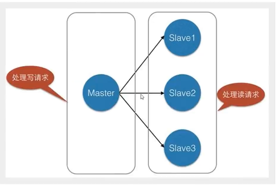

# Redis

## 概述

> Redis是什么

**Redis**是一个使用[ANSI C](https://zh.wikipedia.org/wiki/ANSI_C)编写的[开源](https://zh.wikipedia.org/wiki/开源)、支持[网络](https://zh.wikipedia.org/wiki/电脑网络)、基于[内存](https://zh.wikipedia.org/wiki/内存)、[分布式](https://zh.wikipedia.org/wiki/分布式缓存)、可选[持久性](https://zh.wikipedia.org/w/index.php?title=持久性_(数据库)&action=edit&redlink=1)的[键值对存储数据库](https://zh.wikipedia.org/wiki/键值-值数据库)，当前最热门得NoSQL技术之一！

官方地址：https://redis.io/

> Redis能干嘛

1、内存存储、持久化（rdb、aof）

2、效率高，用于高速缓存

3、发布订阅系统

4、地图信息分析

5、计时器、计数器

6、......

> 特性

1、多样的数据类型

2、持久化

3、集群

4、事务

5、......


## Redis安装

> Windows下安装

1、下载安装包并解压

下载地址：https://github.com/tporadowski/redis/releases

2、开启Redis服务端，双击`redis-server.exe`

3、开启Redis客户端，双击`redis-cli.exe`

4、在客户端测试连接

```bash
# 测试命令
ping
# 连接成功
PONG
```

5、设置键值对

```bash
# 设置键值对
set key value
# 获取值
get key
```


> Linux下安装

1、从官网下载redis

地址：https://redis.io/

2、将`jdk-8u161-linux-x64.tar.gz`移动到linux下的opt目录，并解压

3、基本的环境安装

```bash
# 安装gcc环境
yum install gcc-c++

# 安装成功后执行make，即编译
make

# 执行make install，即安装
make install
```

4、redis的默认安装路径`/usr/local/bin`

5、拷贝`redis.conf`到`/usr/local/bin/bconfig`

```bash
cp /opt/redis/redis-6.2.4/redis.conf bconfig
```

其中bconfig是自定义的文件夹，存放`redis.conf`的拷贝，这样即便出了问题，我们还可以还原！

6、redis默认不是后台启动的，修改配置文件

```bash
# 进入配置文件
vim redis.conf
```


8、启动redis服务

```bash
[root@centos7-vm bin]# redis-server bconfig/redis.conf
```

9、启动redis客户端

```bash
[root@centos7-vm bin]# redis-cli -p 6379
```

10、测试连接

```bash
# 输入ping
ping

# 设置key-value
set name naruto

# 查看key
get key

# 查看所有的key
get keys *
```

11、查看redis进程是否开启

```bash
[root@centos7-vm bin]# ps -ef|grep redis
```


12、关闭redis服务

```bash
# 在客户端执行关闭连接
shutdown
# 退出
exit
```

13、再次查看进程是否存在


## 性能测试

> 什么是性能测试

redis-benchmark是官方自带的一个性能测试工具，redis 性能测试是通过同时执行多个命令实现的

redis 性能测试的基本命令如下：

```bash
redis-benchmark [option] [option value]
```


> redis 性能测试工具可选参数

| 1    | **-h**                    | 指定服务器主机名                           | 127.0.0.1 |
| ---- | ------------------------- | ------------------------------------------ | --------- |
| 2    | **-p**                    | 指定服务器端口                             | 6379      |
| 3    | **-s**                    | 指定服务器 socket                          |           |
| 4    | **-c**                    | 指定并发连接数                             | 50        |
| 5    | **-n**                    | 指定请求数                                 | 10000     |
| 6    | **-d**                    | 以字节的形式指定 SET/GET 值的数据大小      | 2         |
| 7    | **-k**                    | 1=keep alive 0=reconnect                   | 1         |
| 8    | **-r**                    | SET/GET/INCR 使用随机 key, SADD 使用随机值 |           |
| 9    | **-P**                    | 通过管道传输 <numreq> 请求                 | 1         |
| 10   | **-q**                    | 强制退出 redis。仅显示 query/sec 值        |           |
| 11   | **--csv**                 | 以 CSV 格式输出                            |           |
| 12   | ***-l\*（L 的小写字母）** | 生成循环，永久执行测试                     |           |
| 13   | **-t**                    | 仅运行以逗号分隔的测试命令列表。           |           |
| 14   | ***-I\*（i 的大写字母）** | Idle 模式。仅打开 N 个 idle 连接并等待。   |           |


> 简单测试

```bash
# 100个并发连接，10000个请求
redis-benchmark -h localhost -p 6379 -c 100 -n 1000
```


## 基础知识

> redis数据库

redis默认有16个数据库，默认使用第0个，数据库之间是独立的

```bash
# 切换到索引为3的数据库
127.0.0.1:6379> select 3

# 查看数据库大小
127.0.0.1:6379[3]> dbsize

# 清空当前数据库
flushdb

# 清空所有数据库
flushall
```


> redis是单线程的

官方表示，redis是基于内存操作，cpu不是redis的性能瓶颈，其瓶颈是机器的内存和网络带宽，因此就使用单线程

> 为什么redis这么快？

1、误区1：高性能的服务器一定是多线程的？

2、误区2：多线程一定比单线程效率高？

核心：redis是将所有的数据全部放在内存中的，因此使用单线程操作效率就是最高的，多线程需要cpu上下文切换，这是耗时的操作！


## 数据类型

### Redis-Key

```bash
# 设置key
127.0.0.1:6379[3]> set key value

# 查看key
127.0.0.1:6379[3]> get key

# 查看所有的key
127.0.0.1:6379[3]> get keys *

# 判断key是否存在
127.0.0.1:6379[3]> exists key

# 移除key
127.0.0.1:6379[3]> move key 1

# 设置key的过期时间为10s
127.0.0.1:6379[3]> expire key 10

# 查看key的类型
127.0.0.1:6379[3]> type key
```


### String

```bash
# 当前key追加字符串
127.0.0.1:6379[3]> append key new_str

# 获取key对应的字符串长度
127.0.0.1:6379[3]> strlen key

# 实现++操作
127.0.0.1:6379[3]> incr key

# 实现--操作
127.0.0.1:6379[3]> decr key

# 设置增加步长
127.0.0.1:6379[3]> incrby key step_num

# 设置减少步长
127.0.0.1:6379[3]> decrby key step_num

# 获取子串，begin为起始索引，end为末尾索引，若end=-1，则表示查看整个字符串
127.0.0.1:6379[3]> getrange key begin end

# 替换子串，表示从begin开始，替换指定的value值
127.0.0.1:6379[3]> setrange key begin value

# 设置过期时间(set with expire)
127.0.0.1:6379[3]> setex key 30 "hello"

# 不存在则设置(set if not exist)，防止覆盖原来的key
127.0.0.1:6379[3]> setnx key value

# 批量设置key
127.0.0.1:6379[3]> mset key1 value1 key2 value2

# 批量设置key,若某个key已存在，则msetnx对所有key无效，它是一个原子性操作
127.0.0.1:6379[3]> msetnx key1 value1 key2 value2

# 批量获取key
127.0.0.1:6379[3]> mget key1 key2 key3

# 设置一个user:1对象，值为json格式
127.0.0.1:6379[3]> set user:1 {name:zhangsan,age:3}

# 设置一个user:1对象，将各属性作为key，这样可根据key来取值
127.0.0.1:6379[3]> mset user:1:name zhangsan user:1:age 2

# 先get后set
127.0.0.1:6379[3]> getset key value 
```


### List

```bash
# 在头部添加元素，头插法
127.0.0.1:6379[3]> lpush list one

# 在尾部添加元素，尾插法
127.0.0.1:6379[3]> rpush list two

# 获取List中的元素，begin、end与获取字符串描述一样
127.0.0.1:6379[3]> lrange list begin end

# 移除头部元素
127.0.0.1:6379[3]> lpop list

# 移除尾部元素
127.0.0.1:6379[3]> rpop list

# 获得指定索引的元素，index从0开始
127.0.0.1:6379[3]> lindex list index

# 查找list长度
127.0.0.1:6379[3]> llen list

# 移除指定的值，key即list，count表示要移除的数量，value是list中的元素
127.0.0.1:6379[3]> lrem key count value

# 假设list中有两个重复元素three，同时移除可以这样做
127.0.0.1:6379[3]> lrem list 2 three

# 保留list中的[begin,end]间的元素
127.0.0.1:6379[3]> ltrim list begin end

# 移除源list的最后一个元素，将该元素添加到新的list
127.0.0.1:6379[3]> rpoplpush source destination

# 向list中添加元素，在index处替换value，注意，list必须存在才行！！！
127.0.0.1:6379[3]> lset list index value

# pivot是位置，即列表项
127.0.0.1:6379[3]> linsert key before|after pivot value
```


### Set

```bash
# 向集合key中添加元素value
127.0.0.1:6379[3]> sadd key value

# 查看集合key的所有元素
127.0.0.1:6379[3]> smembers key

# 判断集合key中是否存在某一value
127.0.0.1:6379[3]> sismember key value

# 获取集合key元素个数
127.0.0.1:6379[3]> scard key

# 移除集合key的某个元素
127.0.0.1:6379[3]> srem key value

# 随机选择集合key中的元素，count为指定的个数
127.0.0.1:6379[3]> srandmember key count

# 随机删除一个元素
127.0.0.1:6379[3]> spop key

# 将一个元素移动到另外一个集合中
127.0.0.1:6379[3]> smove source destination memeber

# 求两个集合的差集，如查找key1中与key2中不同的元素
127.0.0.1:6379[3]> sdiff key1 key2

# 求两个集合的交集
127.0.0.1:6379[3]> sinter key1 key2

# 求两个集合的并集
127.0.0.1:6379[3]> sunion key1 key2
```


### Hash

```bash
# 设置一个集合，key为集合名称，field为map键，value为map值
127.0.0.1:6379[3]> hset key field value

# 获得集合中的值
127.0.0.1:6379[3]> hget key field

# 批量设置
127.0.0.1:6379[3]> hmest key field1 value1 field2 value2

# 批量获取
127.0.0.1:6379[3]> hmget key field1 field2

# 获取所有的值
127.0.0.1:6379[3]> hgetall key

# 删除集合指定字段
127.0.0.1:6379[3]> hdel key feild

# 获取hash表的字段数量
127.0.0.1:6379[3]> hlen key

# 判断hash是否存在
127.0.0.1:6379[3]> hexists key field

# 获得所有的field
127.0.0.1:6379[3]> hkeys key

# 获取所有的value
127.0.0.1:6379[3]> hvals key

# 设置自增
127.0.0.1:6379[3]> hincrby key field value

# 设置自减
127.0.0.1:6379[3]> hdecrby key field value

# 不存在则可以设置，存在则不能设置
127.0.0.1:6379[3]> hsetnx key field value
```

> 应用场景

Hash适合存储变更的数据，比如User对象，里面有很多属性值是不断变化的！


### Zset

在set的基础上，增加了一个值，set k1 v1，zset k1 socre1 v1

```bash
# 添加一个元素，score作为排序依据
127.0.0.1:6379[3]> zadd key score member

# 集合排序，其中score名称根据场景自定义
127.0.0.1:6379[3]> zrangebyscore score min max
127.0.0.1:6379[3]> zrevrange score max min

# 获取集合中的个数
127.0.0.1:6379[3]> zcard key

# 统计区间内元素个数
127.0.0.1:6379[3]> zcount key begin end
```

> 应用场景

存储班级成绩表、工资表、排行榜应用！


### Geospatial

Redis 的 Geo 在3.2版本之后引入的，它可以用来推算地理位置信息，如两地之间的距离，附近的人

查询城市经纬度：http://www.jsons.cn/lngcode/

```bash
# 添加中国城市的地理位置
127.0.0.1:6379[3]> geoadd key longitude latitude member

# 添加潍坊的地理位置
127.0.0.1:6379[3]> geoadd china:city 119.107078 36.70925 weifang

# 获取key的经度和维度
127.0.0.1:6379[3]> geopos key member

# 查看城市之间的距离，unit为单位，有m/km/mi/ft
127.0.0.1:6379[3]> geodist china:key member1 member2 [unit]

# 以给定的经纬度为中心，找出某一半径内的元素，withcoord为经/维度，withdist为直线距离，count为查询的个数
127.0.0.1:6379[3]> georadius key longitude latitude radius m|km|mi|ft [withcoord] [withdist] [count num]

# 以member为中心查询周围
127.0.0.1:6379[3]> georadiusbymember key member radius m|km|mi|ft [withcoord] [withdist] [count num]

# 返回一个或读个member的geohash表示，将当前member的经纬度转换成一个11位的字符串
127.0.0.1:6379[3]> geohash key member [member ...]
```

> 小结

- geo底层使用zset实现的，我们可以使用zset来操作geo！

```bash
# 查看所有member
127.0.0.1:6379[3]> zrange key begin end

# 移除一个元素
127.0.0.1:6379[3]> zrem key member
```

> 应用场景

微信里的定位、附近的人，打车距离的计算？


### hyperloglog

> 什么是基数？

基数就是集合中不重复元素的个数，比如集合A={1,1,2,2,3}，那么基数 = 3

hyperloglog是用来做基数统计的算法，占用的内存是固定的，只需要12kb！但是有0.81%的错误率！如果场景中允许容错，就可以使用它！

```bash
# 添加元素
127.0.0.1:6379[3]> pfadd key element [element ...]

# 统计元素个数
127.0.0.1:6379[3]> pfcount key

# 并集
127.0.0.1:6379[3]> pfmerge destkey sourcekey [sourcekey ...]
```

> 应用场景

网页的用户访问量（一个人访问多次，但是访问量算1次）

**传统方式：**set保存用户id，统计set中的元素数量！这个方式如果保存大量用户id，比如uuid、分布式id就会消耗内存！


### Bitmaps

> 什么是Bigmaps？

Bitmaps是一种数据结构，操作二进制位来进行记录，比如那个经典例子：

有 1000 个一模一样的瓶子，其中有 999 瓶是普通的水，有一瓶是毒药。任何喝下毒药的生物都会在一星期之后死亡。现在，你只有 10 只小白鼠和一星期的时间，如何检验出哪个瓶子里有毒药？

```bash
# 设置当前key第offset处的value值
127.0.0.1:6379[3]> setbit key offset value

# 查看offset处的value值
127.0.0.1:6379[3]> getbit key offset

# 统计value为1的个数
127.0.0.1:6379[3]> bitcount key [start end]
```

> 应用场景

统计用户信息，活跃，不活跃！登录、未登录！打卡，365天打卡！凡是具有两个状态的我们都可以尝试去使用！


## 事务

> Redis事务介绍

- Redis单条命令是保证原子性的，但Redis事务是不保证原子性的，没有隔离级别的概念！

- **Redis事务的本质**：一组命令的集合！所有的命令都会被序列化，按照顺序执行！

- **Redis事务的特点**：一次性、顺序性、排他性！

- **Redis事务的流程**：开启事务、命令入队、执行事务！
- 编译期间异常，事务中所有命令均不会执行，运行期间异常，事务中的正常的命令是可以执行的，错误命令抛出异常

<font color='red'>异常体系图</font>


> 事务基本命令

```bash
# 开启事务
127.0.0.1:6379[3]> multi

# 将添加元素命令入队
127.0.0.1:6379[3]> set key value

# 执行队列中的命令，执行后事务消失
127.0.0.1:6379[3]> exec

# 取消事务
127.0.0.1:6379[3]> discard
```


### 乐观锁

> 乐观锁概念

乐观锁认为什么时候都不会有问题，因此不会上锁，只有出现问题了，比如更新数据时，在这个时候处理！

修改前获取version，更新的时候比较version！

> Redis的监视和测试

```bash
# 监视key
127.0.0.1:6379[3]> watch key [key ...]

# 取消监视
127.0.0.1:6379[3]> unwatch
```

当事务不能正常执行时，比如下面的情况

客户端1输入如下命令

```bash
127.0.0.1:6379[3]> set money 100
OK
127.0.0.1:6379[3]> watch money
OK
127.0.0.1:6379[3]> multi
OK
127.0.0.1:6379[3]> decrby money 10
QUEUED
127.0.0.1:6379[3]> incrby money 10
QUEUED
```

客户端2输入如下命令

```bash
127.0.0.1:6379[3]> get money
"100"
127.0.0.1:6379[3]> set money 1000
OK
```

客户端1执行事务，会报错，返回 (nil) !

```bash
127.0.0.1:6379[3]> exec
(nil)
```

如果发现事务执行失败，就先解锁，然后获取最新的值，再次监视！


## Jedis

### 概述

> 什么是Jedis？

Jedis是官方推荐的java连接开发工具！它是一个中间件，就像是jdbc一样！

> 体验一下

1、新建一个空项目

2、新建一个maven模块

3、pom文件中导入依赖

```xml
<!-- Jedis依赖 -->
<dependency>
    <groupId>redis.clients</groupId>
    <artifactId>jedis</artifactId>
    <version>3.6.1</version>
</dependency>

<!-- fastjson -->
<dependency>
    <groupId>com.alibaba</groupId>
    <artifactId>fastjson</artifactId>
    <version>1.2.76</version>
</dependency>
```

4、编码测试

1、通过配置文件启动redis服务

```bash
[root@centos7-vm bin]# redis-server bconfig/redis.conf 
```

2、查看是否已经启动

```bash
[root@centos7-vm bin]# ps -ef | grep redis
```


3、java程序连接redis服务，输出PONG表示连接成功！

```java
package cn.pikaqiang;

import redis.clients.jedis.Jedis;

public class TestPing {

    public static void main(String[] args) {

        // 创建Jedis对象
        Jedis jedis = new Jedis("10.66.115.41",6379);
        System.out.println(jedis.ping());

    }

}
```

连接失败尝试以下操作

```bash
1、远程主机关闭firewall服务
关闭：systemctl stop firewalld.service
禁用开机启动：systemctl disable firewalld.service
查看状态：firewall-cmd --state

2、注释掉配置文件中的bind的配置
3、设置配置文件中protect-mode no
4、关闭redis服务
5、重新启动redis
```


### 常用的API

```java
public static void main(String[] args) {
    // 创建Jedis对象
    Jedis jedis = new Jedis("10.66.115.41",6379);
    System.out.println("清空数据库: "+ jedis.flushDB());
    System.out.println("判断某个键是否存在: "+jedis.exists("username"));
    System.out.println("新增键值对: "+ jedis.set("username","naruto"));
    System.out.println("获取所有按键: "+jedis.keys("*"));
    System.out.println("删除键: "+ jedis.del("password"));
}
```

上面只是列出一部分，更多的去使用它们，才能掌握！


> Jedis操作事务

1、连接redis服务

```java
public static void main(String[] args) {

    // 创建Jedis对象
    Jedis jedis = new Jedis("10.66.115.41",6379);

    // 清空数据库
    jedis.flushDB();

    // 创建json对象
    JSONObject jsonObject = new JSONObject();
    jsonObject.put("hello","world");
    jsonObject.put("name","naruto");

    // 开启事务
    Transaction multi = jedis.multi();
    String json = jsonObject.toJSONString();

    try {
        // 添加键值对
        multi.set("user1",json);
        multi.set("user2",json);
        int i = 1/0;
        // 执行事务
        multi.exec();
    } catch (Exception e) {
        multi.discard();
        e.printStackTrace();
    } finally {
        System.out.println(jedis.get("user1"));
        System.out.println(jedis.get("user2"));
        // 关闭连接
        jedis.close();
    }
}
```


## SpringBoot整合

> 了解

- 在springboot2.x之后，原来使用的jedis被替换为了lettuce，原因是jedis采用的是直连，线程不安全，克服它需要使用jedis pool连接池，类似BIO模式。而lettuce底层为netty，是线程安全的，类似NIO模式！

> 整合步骤

1、新建一个springboot项目，勾选NoSQL中的redis

2、未勾选的话手动导入依赖

```xml
<!--redis相关-->
<dependency>
    <groupId>org.springframework.boot</groupId>
    <artifactId>spring-boot-starter-data-redis</artifactId>
</dependency>
```

3、配置redis属性

```properties
spring.redis.host=10.66.115.41
spring.redis.port=6379
```

4、测试一下

```java
@SpringBootTest
class Redis02SpringbootApplicationTests {

    @Autowired
    private RedisTemplate redisTemplate;

    @Test
    void contextLoads() {

        /* redisTemplate可以操作不同的数据类型，调用api后就和指令相同了
           opsForValue 操作字符串
           opsForList  操作List
           opsForSet   操作Set
           ...

           // 获取连接
           RedisConnection connection = redisTemplate.getConnectionFactory().getConnection();
           connection.flushDb();
        */
        // 简单测试一下
        redisTemplate.opsForValue().set("username","naruto");
        String username = (String) redisTemplate.opsForValue().get("username");
        System.out.println(username);
    }

}
```


> 源码分析

1、找到spring.factories

 

2、在spring.factories中找到redis相关配置


3、打开RedisAutoConfiguration，有两个方法如下

```java
@Bean
@ConditionalOnMissingBean(name = "redisTemplate") // 自定义模板可以覆盖默认的模板
public RedisTemplate<Object, Object> redisTemplate(RedisConnectionFactory redisConnectionFactory)
    throws UnknownHostException {
    // 默认的 RedisTempleate
    RedisTemplate<Object, Object> template = new RedisTemplate<>();
    template.setConnectionFactory(redisConnectionFactory);
    return template;
}
// 由于String类型常用，因此单独提出一个Bean
@Bean
@ConditionalOnMissingBean
public StringRedisTemplate stringRedisTemplate(RedisConnectionFactory redisConnectionFactory)
    throws UnknownHostException {
    StringRedisTemplate template = new StringRedisTemplate();
    template.setConnectionFactory(redisConnectionFactory);
    return template;
}
```

4、通过RedisProperties查看可配置的redis属性


> Redis序列化

1、创建实体类User并序列化

```java
@Component
@AllArgsConstructor
@NoArgsConstructor
@Data
public class User implements Serializable {

    private String name;
    private int age;

}
```

2、查看RedisTemplate序列化属性

```java
@SuppressWarnings("rawtypes") private @Nullable RedisSerializer keySerializer = null;
@SuppressWarnings("rawtypes") private @Nullable RedisSerializer valueSerializer = null;
@SuppressWarnings("rawtypes") private @Nullable RedisSerializer hashKeySerializer = null;
@SuppressWarnings("rawtypes") private @Nullable RedisSerializer hashValueSerializer = null;
private RedisSerializer<String> stringSerializer = RedisSerializer.string();
```

其中默认的序列化方式是jdk，会存在字符转义问题，因此我们需要自定义配置使用json来序列化！

3、自定义RedisTemplate类

```java
@Configuration
public class RedisConfig {
    @Bean
    public RedisTemplate<String,Object> redisTemplate(RedisConnectionFactory redisConnectionFactory){
        //自定义RedisTemplate方便使用
        RedisTemplate<String,Object> template = new RedisTemplate<>();
        template.setConnectionFactory(redisConnectionFactory);
        //Json序列化配置
        Jackson2JsonRedisSerializer jackson2JsonRedisSerializer = new Jackson2JsonRedisSerializer<>(Object.class);
        ObjectMapper om = new ObjectMapper();
        om.setVisibility(PropertyAccessor.ALL, JsonAutoDetect.Visibility.ANY);
        //enableDefaultTyping已过时
        //om.enableDefaultTyping(ObjectMapper.DefaultTyping.NON_FINAL);
        om.activateDefaultTyping(LaissezFaireSubTypeValidator.instance,ObjectMapper.DefaultTyping.NON_FINAL, JsonTypeInfo.As.WRAPPER_ARRAY);
        jackson2JsonRedisSerializer.setObjectMapper(om);
        StringRedisSerializer stringRedisSerializer = new StringRedisSerializer();
        //key采用Stirng的序列化方式
        template.setKeySerializer(stringRedisSerializer);
        //hash的key采用Stirng的序列化方式
        template.setHashKeySerializer(stringRedisSerializer);
        //value采用jackson2JsonRedisSerializer的序列化方式
        template.setValueSerializer(jackson2JsonRedisSerializer);
        //hash的value采用jackson2JsonRedisSerializer的序列化方式
        template.setHashValueSerializer(jackson2JsonRedisSerializer);
        template.afterPropertiesSet();
        return  template;
    }
}
```

4、测试一下

```java
@SpringBootTest
class Redis02SpringbootApplicationTests {

    @Autowired
    @Qualifier("redisTemplate")
    private RedisTemplate redisTemplate;
    
    @Test
    void test() throws JsonProcessingException {
        // 实际开发中使用json传递对象
        User user = new User("naruto", 16);
        String jsonUser = new ObjectMapper().writeValueAsString(user);
        redisTemplate.opsForValue().set("user",jsonUser);
        System.out.println(redisTemplate.opsForValue().get("user"));
    }

}
```

测试发现不管在控制台和远程终端，乱码问题均已解决！


> Redis的工具类

网址：https://gitee.com/nmwork/RedisUtil

代码很长，这里就不粘贴了，如果网址失效了，在`redis-02-springboot`项目中！

注意，在使用之前先测试与Redis的服务是否连接成功！！！

1、测试连接

```java
@SpringBootTest
class Redis02SpringbootApplicationTests {
    
    @Autowired
    private RedisTemplate redisTemplate;
    
    @Test
    void test() {

        RedisConnection connection = redisTemplate.getConnectionFactory().getConnection();
        System.out.println(connection);
    }
}
```

2、工具类的简单使用

```java
@SpringBootTest
class Redis02SpringbootApplicationTests {

    @Autowired
    private RedisUtil redisUtil;

    @Autowired
    private RedisTemplate redisTemplate;

    @Test
    void test() {

       redisUtil.set("name","naruto");
       System.out.println(redisUtil.get("name"));

    }
}
```


## Redis.conf详解

```bash
# Redis 配置文件

# 当配置中需要配置内存大小时，可以使用 1k, 5GB, 4M 等类似的格式，其转换方式如下(不区分大小写)
#
# 1k => 1000 bytes
# 1kb => 1024 bytes
# 1m => 1000000 bytes
# 1mb => 1024*1024 bytes
# 1g => 1000000000 bytes
# 1gb => 1024*1024*1024 bytes
#
# 内存配置大小写是一样的.比如 1gb 1Gb 1GB 1gB

# daemonize no 默认情况下，redis不是在后台运行的，如果需要在后台运行，把该项的值更改为yes
daemonize yes

# 当redis在后台运行的时候，Redis默认会把pid文件放在/var/run/redis.pid，你可以配置到其他地址。
# 当运行多个redis服务时，需要指定不同的pid文件和端口
pidfile /var/run/redis.pid

# 保护模式，默认就好
protected-mode yes

# 指定redis运行的端口，默认是6379
port 6379

# 指定redis只接收来自于该IP地址的请求，如果不进行设置，那么将处理所有请求，
# 在生产环境中最好设置该项
# bind 127.0.0.1

# Specify the path for the unix socket that will be used to listen for
# incoming connections. There is no default, so Redis will not listen
# on a unix socket when not specified.
#
# unixsocket /tmp/redis.sock
# unixsocketperm 755

# 设置客户端连接时的超时时间，单位为秒。当客户端在这段时间内没有发出任何指令，那么关闭该连接
# 0是关闭此设置
timeout 0

# 指定日志记录级别
# Redis总共支持四个级别：debug、verbose、notice、warning，默认为verbose
# debug 记录很多信息，用于开发和测试
# varbose 有用的信息，不像debug会记录那么多
# notice 普通的verbose，常用于生产环境
# warning 只有非常重要或者严重的信息会记录到日志
loglevel debug

# 配置log文件地址
# 默认值为stdout，标准输出，若后台模式会输出到/dev/null
#logfile stdout
logfile /var/log/redis/redis.log

# To enable logging to the system logger, just set 'syslog-enabled' to yes,
# and optionally update the other syslog parameters to suit your needs.
# syslog-enabled no

# Specify the syslog identity.
# syslog-ident redis

# Specify the syslog facility. Must be USER or between LOCAL0-LOCAL7.
# syslog-facility local0

# 可用数据库数
# 默认值为16，默认数据库为0，数据库范围在0-（database-1）之间
databases 16

################################ 快照 #################################
#
# 保存数据到磁盘，格式如下:
#
# save <seconds> <changes>
#
# 指出在多长时间内，有多少次更新操作，就将数据同步到数据文件rdb。
# 相当于条件触发抓取快照，这个可以多个条件配合
#
# 比如默认配置文件中的设置，就设置了三个条件
#
# save 900 1 900秒内至少有1个key被改变
# save 300 10 300秒内至少有300个key被改变
# save 60 10000 60秒内至少有10000个key被改变

save 900 1
save 300 10
save 60 10000

# 持久化出错，是否还需要继续工作
stop-writes-on-bgsave-error yes

# 存储至本地数据库时（持久化到rdb文件）是否压缩数据，默认为yes
rdbcompression yes

# 保存rdb文件时进行错误校验
rdbchecksum yes

# 本地持久化数据库文件名，默认值为dump.rdb
dbfilename dump.rdb

# 工作目录
#
# 数据库镜像备份的文件放置的路径。
# 这里的路径跟文件名要分开配置是因为redis在进行备份时，先会将当前数据库的状态写入到一个临时文件中，等备份完成时，
# 再把该该临时文件替换为上面所指定的文件，而这里的临时文件和上面所配置的备份文件都会放在这个指定的路径当中。
#
# AOF文件也会存放在这个目录下面
#
# 注意这里必须制定一个目录而不是文件，该目录是redis的启动目录即/usr/local/bin
dir ./

################################# 复制 #################################

# 主从复制. 设置该数据库为其他数据库的从数据库.
# 设置当本机为slav服务时，设置master服务的IP地址及端口，在Redis启动时，它会自动从master进行数据同步
#
# slaveof <masterip> <masterport>

# 当master服务设置了密码保护时(用requirepass制定的密码)
# slav服务连接master的密码
#
# masterauth <master-password>


# 当从库同主机失去连接或者复制正在进行，从机库有两种运行方式：
#
# 1) 如果slave-serve-stale-data设置为yes(默认设置)，从库会继续相应客户端的请求
#
# 2) 如果slave-serve-stale-data是指为no，出去INFO和SLAVOF命令之外的任何请求都会返回一个
# 错误"SYNC with master in progress"
#
slave-serve-stale-data yes

# 从库会按照一个时间间隔向主库发送PINGs.可以通过repl-ping-slave-period设置这个时间间隔，默认是10秒
#
# repl-ping-slave-period 10

# repl-timeout 设置主库批量数据传输时间或者ping回复时间间隔，默认值是60秒
# 一定要确保repl-timeout大于repl-ping-slave-period
# repl-timeout 60

################################## 安全 ###################################

# 设置客户端连接后进行任何其他指定前需要使用的密码。
# 警告：因为redis速度相当快，所以在一台比较好的服务器下，一个外部的用户可以在一秒钟进行150K次的密码尝试，这意味着你需要指定非常非常强大的密码来防止暴力破解
# foobared为要设置的密码
# requirepass foobared

# 命令重命名.
#
# 在一个共享环境下可以重命名相对危险的命令。比如把CONFIG重名为一个不容易猜测的字符。
#
# 举例:
#
# rename-command CONFIG b840fc02d524045429941cc15f59e41cb7be6c52
#
# 如果想删除一个命令，直接把它重命名为一个空字符""即可，如下：
#
# rename-command CONFIG ""

################################### 约束 ####################################

# 设置同一时间最大客户端连接数，默认无限制，Redis可以同时打开的客户端连接数为Redis进程可以打开的最大文件描述符数，
# 如果设置 maxclients 0，表示不作限制。
# 当客户端连接数到达限制时，Redis会关闭新的连接并向客户端返回max number of clients reached错误信息
#
# maxclients 128

# 指定Redis最大内存限制，Redis在启动时会把数据加载到内存中，达到最大内存后，Redis会先尝试清除已到期或即将到期的Key
# Redis同时也会移除空的list对象
#
# 当此方法处理后，仍然到达最大内存设置，将无法再进行写入操作，但仍然可以进行读取操作
#
# 注意：Redis新的vm机制，会把Key存放内存，Value会存放在swap区
#
# maxmemory的设置比较适合于把redis当作于类似memcached的缓存来使用，而不适合当做一个真实的DB。
# 当把Redis当做一个真实的数据库使用的时候，内存使用将是一个很大的开销
# maxmemory <bytes>

# 当内存达到最大值的时候Redis会选择删除哪些数据？有五种方式可供选择
#
# volatile-lru -> 利用LRU算法移除设置过过期时间的key (LRU:最近使用 Least Recently Used )
# allkeys-lru -> 利用LRU算法移除任何key
# volatile-random -> 移除设置过过期时间的随机key
# allkeys->random -> remove a random key, any key
# volatile-ttl -> 移除即将过期的key(minor TTL)
# noeviction -> 不移除任何可以，只是返回一个写错误
#
# 注意：对于上面的策略，如果没有合适的key可以移除，当写的时候Redis会返回一个错误
#
# 写命令包括: set setnx setex append
# incr decr rpush lpush rpushx lpushx linsert lset rpoplpush sadd
# sinter sinterstore sunion sunionstore sdiff sdiffstore zadd zincrby
# zunionstore zinterstore hset hsetnx hmset hincrby incrby decrby
# getset mset msetnx exec sort
#
# 默认是:
#
# maxmemory-policy volatile-lru

# LRU 和 minimal TTL 算法都不是精准的算法，但是相对精确的算法(为了节省内存)，随意你可以选择样本大小进行检测。
# Redis默认的灰选择3个样本进行检测，你可以通过maxmemory-samples进行设置
#
# maxmemory-samples 3

############################## AOF ###############################


# 默认情况下，redis会在后台异步的把数据库镜像备份到磁盘，但是该备份是非常耗时的，而且备份也不能很频繁，如果发生诸如拉闸限电、拔插头等状况，那么将造成比较大范围的数据丢失。
# 所以redis提供了另外一种更加高效的数据库备份及灾难恢复方式。
# 开启append only模式之后，redis会把所接收到的每一次写操作请求都追加到appendonly.aof文件中，当redis重新启动时，会从该文件恢复出之前的状态。
# 但是这样会造成appendonly.aof文件过大，所以redis还支持了BGREWRITEAOF指令，对appendonly.aof 进行重新整理。
# 你可以同时开启asynchronous dumps 和 AOF

appendonly no

# AOF文件名称 (默认: "appendonly.aof")
# appendfilename appendonly.aof

# Redis支持三种同步AOF文件的策略:
#
# no: 不进行同步，系统去操作 . Faster.
# always: always表示每次有写操作都进行同步. Slow, Safest.
# everysec: 表示对写操作进行累积，每秒同步一次. Compromise.
#
# 默认是"everysec"，按照速度和安全折中这是最好的。
# 如果想让Redis能更高效的运行，你也可以设置为"no"，让操作系统决定什么时候去执行
# 或者相反想让数据更安全你也可以设置为"always"
#
# 如果不确定就用 "everysec".

# appendfsync always
appendfsync everysec
# appendfsync no

# AOF策略设置为always或者everysec时，后台处理进程(后台保存或者AOF日志重写)会执行大量的I/O操作
# 在某些Linux配置中会阻止过长的fsync()请求。注意现在没有任何修复，即使fsync在另外一个线程进行处理
#
# 为了减缓这个问题，可以设置下面这个参数no-appendfsync-on-rewrite
#
# This means that while another child is saving the durability of Redis is
# the same as "appendfsync none", that in pratical terms means that it is
# possible to lost up to 30 seconds of log in the worst scenario (with the
# default Linux settings).
#
# If you have latency problems turn this to "yes". Otherwise leave it as
# "no" that is the safest pick from the point of view of durability.
no-appendfsync-on-rewrite no

# Automatic rewrite of the append only file.
# AOF 自动重写
# 当AOF文件增长到一定大小的时候Redis能够调用 BGREWRITEAOF 对日志文件进行重写
#
# 它是这样工作的：Redis会记住上次进行些日志后文件的大小(如果从开机以来还没进行过重写，那日子大小在开机的时候确定)
#
# 基础大小会同现在的大小进行比较。如果现在的大小比基础大小大制定的百分比，重写功能将启动
# 同时需要指定一个最小大小用于AOF重写，这个用于阻止即使文件很小但是增长幅度很大也去重写AOF文件的情况
# 设置 percentage 为0就关闭这个特性

auto-aof-rewrite-percentage 100
auto-aof-rewrite-min-size 64mb

################################## SLOW LOG ###################################

# Redis Slow Log 记录超过特定执行时间的命令。执行时间不包括I/O计算比如连接客户端，返回结果等，只是命令执行时间
#
# 可以通过两个参数设置slow log：一个是告诉Redis执行超过多少时间被记录的参数slowlog-log-slower-than(微妙)，
# 另一个是slow log 的长度。当一个新命令被记录的时候最早的命令将被从队列中移除

# 下面的时间以微妙微单位，因此1000000代表一分钟。
# 注意制定一个负数将关闭慢日志，而设置为0将强制每个命令都会记录
slowlog-log-slower-than 10000

# 对日志长度没有限制，只是要注意它会消耗内存
# 可以通过 SLOWLOG RESET 回收被慢日志消耗的内存
slowlog-max-len 1024

################################ VM ###############################

### WARNING! Virtual Memory is deprecated in Redis 2.4
### The use of Virtual Memory is strongly discouraged.

# Virtual Memory allows Redis to work with datasets bigger than the actual
# amount of RAM needed to hold the whole dataset in memory.
# In order to do so very used keys are taken in memory while the other keys
# are swapped into a swap file, similarly to what operating systems do
# with memory pages.
#
# To enable VM just set 'vm-enabled' to yes, and set the following three
# VM parameters accordingly to your needs.

vm-enabled no
# vm-enabled yes

# This is the path of the Redis swap file. As you can guess, swap files
# can't be shared by different Redis instances, so make sure to use a swap
# file for every redis process you are running. Redis will complain if the
# swap file is already in use.
#
# The best kind of storage for the Redis swap file (that's accessed at random)
# is a Solid State Disk (SSD).
#
# *** WARNING *** if you are using a shared hosting the default of putting
# the swap file under /tmp is not secure. Create a dir with access granted
# only to Redis user and configure Redis to create the swap file there.
vm-swap-file /tmp/redis.swap

# vm-max-memory configures the VM to use at max the specified amount of
# RAM. Everything that deos not fit will be swapped on disk *if* possible, that
# is, if there is still enough contiguous space in the swap file.
#
# With vm-max-memory 0 the system will swap everything it can. Not a good
# default, just specify the max amount of RAM you can in bytes, but it's
# better to leave some margin. For instance specify an amount of RAM
# that's more or less between 60 and 80% of your free RAM.
vm-max-memory 0

# Redis swap files is split into pages. An object can be saved using multiple
# contiguous pages, but pages can't be shared between different objects.
# So if your page is too big, small objects swapped out on disk will waste
# a lot of space. If you page is too small, there is less space in the swap
# file (assuming you configured the same number of total swap file pages).
#
# If you use a lot of small objects, use a page size of 64 or 32 bytes.
# If you use a lot of big objects, use a bigger page size.
# If unsure, use the default :)
vm-page-size 32

# Number of total memory pages in the swap file.
# Given that the page table (a bitmap of free/used pages) is taken in memory,
# every 8 pages on disk will consume 1 byte of RAM.
#
# The total swap size is vm-page-size * vm-pages
#
# With the default of 32-bytes memory pages and 134217728 pages Redis will
# use a 4 GB swap file, that will use 16 MB of RAM for the page table.
#
# It's better to use the smallest acceptable value for your application,
# but the default is large in order to work in most conditions.
vm-pages 134217728

# Max number of VM I/O threads running at the same time.
# This threads are used to read/write data from/to swap file, since they
# also encode and decode objects from disk to memory or the reverse, a bigger
# number of threads can help with big objects even if they can't help with
# I/O itself as the physical device may not be able to couple with many
# reads/writes operations at the same time.
#
# The special value of 0 turn off threaded I/O and enables the blocking
# Virtual Memory implementation.
vm-max-threads 4

############################### ADVANCED CONFIG ###############################

# 当hash中包含超过指定元素个数并且最大的元素没有超过临界时，
# hash将以一种特殊的编码方式（大大减少内存使用）来存储，这里可以设置这两个临界值
# Redis Hash对应Value内部实际就是一个HashMap，实际这里会有2种不同实现，
# 这个Hash的成员比较少时Redis为了节省内存会采用类似一维数组的方式来紧凑存储，而不会采用真正的HashMap结构，对应的value redisObject的encoding为zipmap,
# 当成员数量增大时会自动转成真正的HashMap,此时encoding为ht。
hash-max-zipmap-entries 512
hash-max-zipmap-value 64

# list数据类型多少节点以下会采用去指针的紧凑存储格式。
# list数据类型节点值大小小于多少字节会采用紧凑存储格式。
list-max-ziplist-entries 512
list-max-ziplist-value 64

# set数据类型内部数据如果全部是数值型，且包含多少节点以下会采用紧凑格式存储。
set-max-intset-entries 512

# zsort数据类型多少节点以下会采用去指针的紧凑存储格式。
# zsort数据类型节点值大小小于多少字节会采用紧凑存储格式。
zset-max-ziplist-entries 128
zset-max-ziplist-value 64

# Redis将在每100毫秒时使用1毫秒的CPU时间来对redis的hash表进行重新hash，可以降低内存的使用
#
# 当你的使用场景中，有非常严格的实时性需要，不能够接受Redis时不时的对请求有2毫秒的延迟的话，把这项配置为no。
#
# 如果没有这么严格的实时性要求，可以设置为yes，以便能够尽可能快的释放内存
activerehashing yes

################################## INCLUDES ###################################

# 指定包含其它的配置文件，可以在同一主机上多个Redis实例之间使用同一份配置文件，而同时各个实例又拥有自己的特定配置文件

# include /path/to/local.conf
# include /path/to/other.conf
```


## Redis持久化

Redis是内存数据库，如果不将内存中的数据库状态保存到磁盘，一旦服务器进程退出，服务器中的数据库状态也会消失，所以Redis提供了持久化的功能！

### RDB（Redis DataBase）

> 什么是RDB？


> Redis持久化的方式

**第一种持久化方式--save**

1、开启redis服务

```bash
[root@centos7-vm bin]# redis-server bconfig/redis.conf
```

2、在新的进程开启客户端连接服务

```bash
[root@centos7-vm bin]# redis-cli
```

3、查看客户端与redis服务状态

```bash
[root@centos7-vm bin]# ps -ef | grep redis
```

4、在服务端删除bin目录下的dumb.db文件

```bash
[root@centos7-vm bin]# rm -rf dump.rdb
```

5、在客户端设置3次，并输入`save`或`shutdown`

```bash
127.0.0.1:6379> set k1 v1
127.0.0.1:6379> set k2 v2
127.0.0.1:6379> set k3 v3
127.0.0.1:6379> shutdown
```

8、再次开启redis服务端、客户端，查找k1，发现可以得到！


<font color='red'>这说明在我们主动保存或者关闭连接的时候，redis会将内存中的数据保存到rdb文件中，即便没有rdb文件，也会生成一个！</font>


**第二种持久化方式--快照**

1、在redis.conf中修改快照触发条件

```bash
# 在服务端设置60s内修改5次key，就触发快照
save 60 5
```

1、在服务端删除bin目录下的rdb文件

```bash
[root@centos7-vm bin]# rm -rf dump.rdb
```

2、开启服务端、客户端、在客户端执行5次设置操作，按道理会触发一次bgsave操作

```bash
127.0.0.1:6379> set k1 v1
OK
127.0.0.1:6379> set k2 v2
OK
127.0.0.1:6379> set k3 v3
OK
127.0.0.1:6379> set k4 v4
OK
127.0.0.1:6379> set k5 v5
```

3、发现在服务端果然生成了dump.rdb文件


4、关闭连接，重新连接后，在客户端取值


5、说明内存数据成功保存，持久化数据成功！

快照是通过bgsave命令保存的，**当满足触发机制时就会自动执行**！即在后台开启了一个子进程将内存数据写入rdb文件，而save命令会阻塞主线程！

6、<font color='red'>测试结束后恢复配置文件</font>！


> 什么情况下会生成rdb文件？

1、save规则满足的情况

2、执行flushall命令

3、退出redis时

4、手动执行save命令


> 如何将持久化的数据恢复到内存中

1、只需要将rdb文件放到redis的启动目录下即可！redis启动时会自动检查！

```bash
# 在客户端获取redis的启动目录
127.0.0.1:6379> config get dir
```


> 小结

优点：

1、适合大规模的数据恢复！

2、对数据的完整性不高！

缺点：

1、需要一定的时间间隔进程操作！如果redis意外宕机了，最后一次修改的数据就没了！因此在生成环境要及时备份！

2、fork进程的时候，会会占用一定的内存！


### AOF（Append Only File）

> AOF是什么？


以日志的形式来记录每个写操作，将redis执行过的所有指令记录下来（读操作不记录），只许追加文件但不可修改文件，redis启动之初会读取该文件重新构建数据，换言之，redis重启的话就根据日志文件的内容将写指令从前到后执行一次以完成数据的恢复工作，aof保存的是<font color='red'>appendonly.aof</font>文件。


> AOF持久化方式

1、在配置文件中使AOF生效


2、开启redis服务，发现在服务端自动生成了aof文件


3、开启客户端，并执行set操作

```bash
127.0.0.1:6379> mset k1 v1 k2 v2 k3 v3
```

4、在服务端查看aof文件，发现值已存储

```bash
[root@centos7-vm bin]# vim appendonly.aof
```

5、测试结束后恢复配置文件中关于aof的配置，即将aof关闭！


> 如果AOF文件损坏，该怎么办？

1、执行如下命令，选择yes即可（该命令不能保证完全恢复数据！）

```bash
[root@centos7-vm bin]# redis-check-aof --fix appendonly.aof
```

2、重启redis服务即可


> AOF重写规则

aof默认的是文件的无限追加，文件会越来越大，当超过默认设置的大小64Mb时，就会fork一个子线程进行重写！

重写之后的aof文件包含了恢复当前数据集所需的最小命令集合！


> AOF的优点和缺点

优点：

1、每次修改都同步，文件的完整性会更好！

2、默认每秒同步一次，可能会丢失一秒的数据

3、从不同步，效率最高！

缺点：

1、相对于数据文件大小，aof远远大于rdb，修复速度慢！

2、aof运行效率比rdb慢！


## Redis发布订阅

Redis发布订阅(pub/sub)是一种**消息通信模式**：发送者(pub)发送消息，订阅者(sub)接收消息。如微博，微信，关注系统。

Redis客户端可以订阅任意数量的频道。

订阅/发布消息图：

第一个：消息发送者。第二个：频道。第三个：消息订阅者。


下图展示了频道channel1，以及订阅这个频道的三个客户端–client2，client5和client1之间的关系：

 

当有新消息通过PUBLIST命令发送给频道channel1时，这个消息就会被发送给订阅它的三个客户端：

 

> 命令


> 测试

1、开启redis服务、客户端

2、订阅一个频道，执行后处于监听状态

```bash
127.0.0.1:6379> SUBSCRIBE huoying
```

3、新开会话，向订阅方发送消息

```bash
127.0.0.1:6379> PUBLISH huoying "naruto"
```

4、订阅方成功接收信息


> 原理

Redis是C实现的，通过分析Redis源码里的pubsub.c文件，了解发布和订阅机制的底层实现，藉此加深对Redis的理解。

Redisi通过PUBLISH、SUBSCRIBE和PSUBSCRIBE等命令实现发布和订阅功能。

通过SUBSCRIBE命令订阅某频道后，redis-server里维护了一个字典，字典的键就是一个个channel，而字典的值则是一个链表，链表中保存了所有订阅这个channel的客户端。SUBSCRIBE命令的关键，就是将客户端添加到给定channel的订阅链表中。

通过PUBLISH命令向订阅者发送消息，redis-server会使用给定的频道作为键，在它维护的channel字典中查找记录了订阅这个频道的所有客户端的链表，遍历这个链表，将消息发布给所有订阅者。

Pub/Sub从字面上理解就是发布与订阅，在Redis中，你可以设定对某一个key值进行消息发布及消息订阅，当一个key值上进行了消息发布后，所有订阅它的客户端都会收到相应的消息。这一功能最明显的用法就是用作实时消息系统，比如普通的即时聊天，群聊等功能。


> 使用场景

1、实时消息系统，比如点赞、评论

2、实时聊天系统！

3、订阅、关注系统！

复杂的场景使用消息中间件MQ


## Redis主从复制

### 概念

主从复制，是指将一台Redis服务器的数据，复制到其他的Redis服务器。前者称为主节点(master)，后者称为从节点(slave)；数据的复制是单向的，只能由主节点到从节点。

默认情况下，每台Redis服务器都是主节点；且一个主节点可以有多个从节点(或没有从节点)，但一个从节点只能有一个主节点。

**主从复制的作用**

主从复制的作用主要包括：

1、数据冗余：主从复制实现了数据的热备份，是持久化之外的一种数据冗余方式。

2、故障恢复：当主节点出现问题时，可以由从节点提供服务，实现快速的故障恢复；实际上是一种服务的冗余。

3、负载均衡：在主从复制的基础上，配合读写分离，可以由主节点提供写服务，由从节点提供读服务（即写Redis数据时 应用连接主节点，读Redis数据时应用连接从节点），分担服务器负载；尤其是在写少读多的场景下，通过多个从节点   分担读负载，可以大大提高Redis服务器的并发量。

4、高可用( 集群 )基石：除了上述作用以外，主从复制还是哨兵和集群能够实施的基础，因此说主从复制是Redis高可用的基础。


一般来说，要将Redis运用于工程项目中，只使用一台Redis是万万不能的，原因如下：

1、从结构上，单个Redis服务器会发生单点故障，并且一台服务器需要处理所有的请求负载，压力较大；

2、从容量上，单个Redis服务器内存容量有限，就算一台Redis服务器内存容量为256G，也不能将所有内存用作Redis存储内存一般来说，单台Redis最大使用内存不应该超过20G。

电商网站上的商品，一般都是一次上传，无数次浏览的（多读少写），对于这种场景，可以使用如下架构：

 

主从复制，读写分离。80%的情况下都是在进行读操作

架构中经常使用，减缓服务器压力，最低配一主二从！

只要在公司中，主从复制 是必须使用的，在真实的项目中不可能单机使用redis！


### 环境配置

> 单机多集群配置

1、启动redis，查看当前库的信息

```bash
127.0.0.1:6379> info replication
# Replication
role:master #角色
connected_slaves:0 #从机
master_failover_state:no-failover
master_replid:9f43c98a36517e174407707ba4918666a5a27479
master_replid2:0000000000000000000000000000000000000000
master_repl_offset:0
second_repl_offset:-1
repl_backlog_active:0
repl_backlog_size:1048576
repl_backlog_first_byte_offset:0
repl_backlog_histlen:0
```

2、打开四个会话，三个用于主从复制演示，一个用来测试

 

3、在配置文件目录下，拷贝三份conf

```java
[root@centos7-vm bconfig]# cp redis.conf redis79.conf 
[root@centos7-vm bconfig]# cp redis.conf redis80.conf 
[root@centos7-vm bconfig]# cp redis.conf redis81.conf 
[root@centos7-vm bconfig]# ls
redis79.conf  redis80.conf  redis81.conf  redis.conf
```

4、修改三个配置文件

```bash
# 端口号  如6379
# 开启后台运行  daemonize yes
# pidfile  修改端口为6379
# 日志文件logfile，如6379.log
# dumb.rdb，如dumb6379.log
```

5、通过配置文件启动三个redis服务


在测试会话中，发现启动服务后生成日志，说明启动成功！

6、查看redis的进程信息


### 一主二从

> 命令行方式

默认情况下，每一台redis服务都是主节点，一般情况下，只需配置从机即可

1、79默认即为主机，80、81为从机

```bash
# 配置80
127.0.0.1:6380> slaveof 127.0.0.1 6379 

# 配置81
127.0.0.1:6381> slaveof 127.0.0.1 6379 
```

2、80配置结束后replication信息显示从机


3、79主机配置信息也更新了从机


真实的从主配置应该在配置文件中配置，这样的话是永久的，我们这里使用的是命令，暂时的！想要永久有效的话，就在redis.conf中的replication部分配置！

**细节**

主机负责写，从机负责读！主机中的所有信息和数据都会被从机保存！

主机宕机，从机依旧是连接到主机的，但是没有写操作，如果主机恢复了，从机依然可以获得主机写入的信息！

命令行配置的主从，从机宕机，如果重启从机会变为主机！如果再设置为从机，那么依然可以获取主机写入的信息！

**复制原理**

Slave启动成功连接到Master后会发送一个sync同步命令。

Master 接到命令，启动后台的存盘进程，同时收集所有接收到的用于修改数据集命令，在后台进程执行完毕之后，Master将传送整个数据文件到Slave，并完成一次完全同步。

全量复制：Slave服务在接收到数据库文件数据后，将其存盘并加载到内存中。

增量复制：Master继续将新的所有收集到的修改命令依次传给Slave，完成同步，比如我在主机新添加了一个值，这时候从机就能获取，这就是增量复制。

只要是重新连接Master，一次完全同步（全量复制）将被自动执行，我们的数据一定可以在从机中看到。


> 毛毛虫模型

1、79默认主机不变、80作为79的从机和81的主机、81作为80的从机

 

<font color='red'>发现79主机只剩一个从机了</font>


<font color='red'>80依然是一个从机，但也包含了81的从机信息</font>


<font color='red'>81作为了80的从机</font>

2、如果主机宕机了，能不能在从机中选择一个主机呢？

```bash
# 设置从机为主机
127.0.0.1:6381> slaveof no one
```

 

注意，即便之前的主机恢复了，也不会影响到宕机后选择的主机！


### 哨兵模式

> 概述

主从切换技术的方法是：当主服务器宕机后，需要手动把一台从服务器切换为主服务器，这就需要人工干预，费事费力，还会造成一段时间内服务不可用。这不是一种推荐的方式，更多时候，我们优先考虑哨兵模式。Redis从2.8开始提供了Sentinel架构来解决这个问题。

谋朝篡位的自动版，能够后台监控主机是否故障，如果故障了根据投票数自动将从库转换为主库。

哨兵模式是一种特殊的模式，首先Redis提供了哨兵的命令，哨兵是一个独立的进程，作为进程，它会独立运行。其原理是哨兵通过发送命令，等待Redis服务器响应，从而监控运行的多个Redis实例。

 

这里的哨兵有两个作用

- 通过发送命令，让Redis服务器返回监控其运行状态，包括主服务器和从服务器。
- 当哨兵监测到master宕机，会自动将slave切换成master，然后通过**发布订阅模式**通知其他的从服务器，修改配置文件，让它们切换主机。

然而一个哨兵进程对Redis服务器进行监控，可能会出现问题，为此，我们可以使用多个哨兵进行监控。各个哨兵之间还会进行监控，这样就形成了多哨兵模式。

 

假设主服务器宕机，哨兵1先检测到这个结果，系统并不会马上进行failover( 故障转移 )过程，仅仅是哨兵1主观的认为主服务器不可用，这个现象成为**主观下线**。

当后面的哨兵也检测到主服务器不可用，并且数量达到一定值时，那么哨兵之间就会进行一次投票，投票的结果由一个哨兵发起，进行failover操作。切换成功后，就会通过发布订阅模式，让各个哨兵把自己监控的从服务器实现切换主机，这个过程称为**客观下线**。这样对于客户端而言，一切都是透明的。


> 哨兵模式演示

1、当前状态为一主二从，即非毛毛虫状态！

2、在配置文件夹`bconfig`下新建文件`sentinel.conf`

```bash
[root@centos7-vm bconfig]# vim sentinel.conf
```

3、在`sentinel.conf`中填入如下内容

```bash
# myredis为自定义的监控名称，后面的1表示主机宕机后，开始投票选择新主机
sentinel monitor myredis 127.0.0.1 6379 1
```

4、启动哨兵

```bash
[root@centos7-vm bin]# redis-sentinel bconfig/sentinel.conf
```


5、现在让主机崩掉

```bash
127.0.0.1:6379> shutdown
```

6、查看从机的状态


发现其中一个从机变为了主机！

如果之前坏掉的主机恢复了，那么它也只能作为从机！


> 哨兵模式的优缺点

优点：

1、哨兵集群，基于主从复制模式，拥有所有的主从配置优点

2、主从可以切换，故障可以转移，系统的可用性更好

3、哨兵模式就是主从模式的升级，手动到自动，更加健壮

缺点：

1、Redis不好在线扩容，集群容量一旦到达上限，在线扩容就十分麻烦！

2、实现哨兵模式的配置其实很麻烦，里面有很多选择！

> 哨兵模式的全部配置

```bash
# Example sentinel.conf
 
# 哨兵sentinel实例运行的端口 默认26379，如果有哨兵集群，需要配置多个端口
port 26379
 
# 哨兵sentinel的工作目录
dir /tmp
 
# 哨兵sentinel监控的redis主节点的 ip port 
# master-name  可以自己命名的主节点名字 只能由字母A-z、数字0-9 、这三个字符".-_"组成。
# quorum 当这些quorum个数sentinel哨兵认为master主节点失联 那么这时 客观上认为主节点失联了
# sentinel monitor <master-name> <ip> <redis-port> <quorum>
  sentinel monitor mymaster 127.0.0.1 6379 2
 
# 当在Redis实例中开启了requirepass foobared 授权密码 这样所有连接Redis实例的客户端都要提供密码
# 设置哨兵sentinel 连接主从的密码 注意必须为主从设置一样的验证密码
# sentinel auth-pass <master-name> <password>
sentinel auth-pass mymaster MySUPER--secret-0123passw0rd
 
 
# 指定多少毫秒之后 主节点没有应答哨兵sentinel 此时 哨兵主观上认为主节点下线 默认30秒
# sentinel down-after-milliseconds <master-name> <milliseconds>
sentinel down-after-milliseconds mymaster 30000
 
# 这个配置项指定了在发生failover主备切换时最多可以有多少个slave同时对新的master进行 同步，
这个数字越小，完成failover所需的时间就越长，
但是如果这个数字越大，就意味着越 多的slave因为replication而不可用。
可以通过将这个值设为 1 来保证每次只有一个slave 处于不能处理命令请求的状态。
# sentinel parallel-syncs <master-name> <numslaves>
sentinel parallel-syncs mymaster 1
 
 
 
# 故障转移的超时时间 failover-timeout 可以用在以下这些方面： 
#1. 同一个sentinel对同一个master两次failover之间的间隔时间。
#2. 当一个slave从一个错误的master那里同步数据开始计算时间。直到slave被纠正为向正确的master那里同步数据时。
#3.当想要取消一个正在进行的failover所需要的时间。  
#4.当进行failover时，配置所有slaves指向新的master所需的最大时间。不过，即使过了这个超时，slaves依然会被正确配置为指向master，但是就不按parallel-syncs所配置的规则来了
# 默认三分钟
# sentinel failover-timeout <master-name> <milliseconds>
sentinel failover-timeout mymaster 180000
 
# SCRIPTS EXECUTION
 
#配置当某一事件发生时所需要执行的脚本，可以通过脚本来通知管理员，例如当系统运行不正常时发邮件通知相关人员。
#对于脚本的运行结果有以下规则：
#若脚本执行后返回1，那么该脚本稍后将会被再次执行，重复次数目前默认为10
#若脚本执行后返回2，或者比2更高的一个返回值，脚本将不会重复执行。
#如果脚本在执行过程中由于收到系统中断信号被终止了，则同返回值为1时的行为相同。
#一个脚本的最大执行时间为60s，如果超过这个时间，脚本将会被一个SIGKILL信号终止，之后重新执行。
 
#通知型脚本:当sentinel有任何警告级别的事件发生时（比如说redis实例的主观失效和客观失效等等），将会去调用这个脚本，
这时这个脚本应该通过邮件，SMS等方式去通知系统管理员关于系统不正常运行的信息。调用该脚本时，将传给脚本两个参数，
一个是事件的类型，
一个是事件的描述。
如果sentinel.conf配置文件中配置了这个脚本路径，那么必须保证这个脚本存在于这个路径，并且是可执行的，否则sentinel无法正常启动成功。
#通知脚本
# sentinel notification-script <master-name> <script-path>
  sentinel notification-script mymaster /var/redis/notify.sh
 
# 客户端重新配置主节点参数脚本
# 当一个master由于failover而发生改变时，这个脚本将会被调用，通知相关的客户端关于master地址已经发生改变的信息。
# 以下参数将会在调用脚本时传给脚本:
# <master-name> <role> <state> <from-ip> <from-port> <to-ip> <to-port>
# 目前<state>总是“failover”,
# <role>是“leader”或者“observer”中的一个。 
# 参数 from-ip, from-port, to-ip, to-port是用来和旧的master和新的master(即旧的slave)通信的
# 这个脚本应该是通用的，能被多次调用，不是针对性的。
# sentinel client-reconfig-script <master-name> <script-path>
 sentinel client-reconfig-script mymaster /var/redis/reconfig.sh
```


## Redis缓存穿透和雪崩

Redis缓存的使用，极大的提升了应用程序的性能和效率，特别是数据查询方面。但同时，它也带来了一些问题。其中，最要害的问题，就是数据的一致性问题，从严格意义上讲，这个问题无解。如果对数据的一致性要求很高，那么就不能使用缓存。

另外的一些典型问题就是，缓存穿透、缓存雪崩和缓存击穿。目前，业界也都有比较流行的解决方案。

### 缓存穿透（查不到）

> 概念

缓存穿透的概念很简单，用户想要查询一个数据，发现redis内存数据库没有，也就是缓存没有命中，于是向持久层数据库查询。发现也没有，于是本次查询失败。当用户很多的时候，缓存都没有命中，于是都去请求了持久层数据库。这会给持久层数据库造成很大的压力，这时候就相当于出现了缓存穿透。

> 解决方案

布隆过滤器

布隆过滤器是一种数据结构，对所有可能查询的参数以hash形式存储，在控制层先进行`校验` ，**不符合则丢弃**，从而避免了对底层存储系统的查询压力；

 

缓存空对象

当存储层不命中后，即使返回的`空对象`也将其缓存起来，同时会设置一个`过期时间`，之后再访问这个数据将会从缓存中获取，保护了后端数据源；

 

**但是这种方法会存在两个问题：**

1、如果空值能够被缓存起来，这就意味着缓存需要更多的空间存储更多的键，因为这当中可能会有很多的空值的键；

2、即使对空值设置了过期时间，还是会存在缓存层和存储层的数据会有一段时间窗口的不一致，这对于需要保持一致性的业务会有影响。


### 缓存击穿（量太大）

> 概述

缓存击穿跟缓存雪崩有点类似，缓存雪崩是大规模的key失效，而缓存击穿是某个热点的key失效，大并发集中对其进行请求，就会造成大量请求读缓存没读到数据，从而导致高并发访问数据库，引起数据库压力剧增。这种现象就叫做缓存击穿。

> 解决方案

**1.设置热点数据永不过期**

从缓存层面来看，没有设置过期时间，所以不会出现热点key过期后产生的问题。

**2.加互斥锁**

分布式锁：使用分布式锁，保证对于每个key**同时只有一个线程**去查询后端服务，其他线程没有获得分布式锁的权限，因此只需要等待即可。这种方式将高并发的压力转移到了分布式锁，因此对分布式锁的考验很大。


### 缓存雪崩

> 概念

缓存雪崩，是指在某一个时间段，缓存集中过期失效。

产生雪崩的原因之一，有一部分东西在redis中**集中过期**了，而对这些东西的访问查询，都落到了数据库上，对于数据库而言，就会产生周期性的压力波峰。于是所有的请求都会达到存储层，存储层的调用量会暴增，造成存储层也会挂掉的情况。

 

其实集中过期，倒不是非常致命，**比较致命的缓存雪崩，是缓存服务器某个节点容机或断网**。因为自然形成的缓存雪崩，一定是在某个时间段集中创建缓存，这个时候，数据库也是可以顶住压力的。无非就是对数据库产生周期性的压力而已。而缓存服务节点的宕机，对数据库服务器造成的压力是不可预知的，很有可能瞬间就把数据库压垮。


> 解决方案

**1.redis高可用**

这个思想的含义是，既然redis有可能挂掉，那可以多增设几台redis，这样一台挂掉之后其他的还可以继续工作，其实就是搭建的集群。

**2.限流降级**

这个解决方案的思想是，在缓存失效后，通过**加锁或者队列**来控制读数据库写缓存的线程数量。比如对某个key只允许一个线程查询数据和写缓存，其他线程等待。

**3.数据预热**

数据加热的含义就是在正式部署之前，我先把可能的数据先**预先访问一遍**，这样部分可能大量访问的数据就会加载到缓存中。在即将发生大并发访问前手动触发加载缓存不同的key，**设置不同的过期时间**，让缓存失效的时间点尽量均匀。


