# Solr

## 概述

> 什么是Solr？

**Solr**是一个可扩展的，可部署，搜索/存储引擎，优化搜索大量以文本为中心的数据。


> 什么是搜索引擎？

搜索引擎有三个基本组件：

**Web爬虫** - Web爬虫也称为蜘蛛或机器人。 它是一个收集网络信息的软件组件。

**数据库** - Web上的所有信息都存储在数据库中。它们包含大量的Web资源。

**搜索接口** - 此组件是用户和数据库之间的接口。它帮助用户搜索数据库。


> 搜索引擎的工作原理


 


## 安装

> Windows下安装

1、下载地址：http://archive.apache.org/dist/lucene/solr/

2、解压后，进入bin目录，打开命令行，启动solr

```bash
D:\learning\program\software\solr-6.4.0\bin>solr start
```

3、访问：http://localhost:8983/

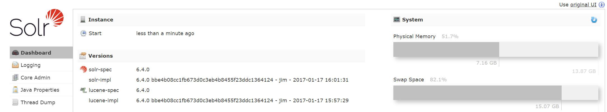


> Linux伪分布模式下安装Hadoop

1、下载地址：https://archive.apache.org/dist/hadoop/common/

2、在`/usr/local/`下新建`hadoop`目录，并创建`local`目录与`install`目录，解压文件上传至`install`

```bash
# 安装工具包
yum install -y lrzsz
# 上传文件
[root@centos7-vm hadoop]# rz
```

注：也可以通过xftp传输文件，效率更高、上面的这种不知道怎么回事，总是会导致本地与linux主机断开连接！

3、解压文件后的文件放入`local`

```bash
[root@centos7-vm hadoop]# tar -zxvf hadoop-2.6.4.tar.gz
```

4、进入`.bashrc`文件

```bash
[root@centos7-vm hadoop]# vim /root/.bashrc
```

5、配置hadoop的环境变量

```bash
export HADOOP_HOME=/usr/local/hadoop/local/hadoop-2.6.4 export
HADOOP_MAPRED_HOME=$HADOOP_HOME export
HADOOP_COMMON_HOME=$HADOOP_HOME export 
HADOOP_HDFS_HOME=$HADOOP_HOME export 
YARN_HOME=$HADOOP_HOME  
export HADOOP_COMMON_LIB_NATIVE_DIR=$HADOOP_HOME/lib/native  
export PATH=$PATH:$HADOOP_HOME/sbin:$HADOOP_HOME/bin  
export HADOOP_INSTALL=$HADOOP_HOME
```

6、将更改应用于当前系统

```bash
[root@centos7-vm hadoop-2.6.4]# source /root/.bashrc
```

7、查看hadoop是否安装成功

```bash
[root@centos7-vm hadoop-2.6.4]# hadoop version
```

8、hadoop配置java环境变量

```bash
# hadoop进入配置文件
[root@centos7-vm hadoop-2.6.4]# cd $HADOOP_HOME/etc/hadoop
# 编辑hadoop-env.sh
export JAVA_HOME=/usr/local/java/jdk1.8.0_161
```

9、配置core-site.xml

```xml
<configuration>
   <property>
      <name>fs.default.name</name>
      <value>hdfs://localhost:9000</value>   </property> 
</configuration>
```

10、配置hdfs-site.xml

```xml
<configuration>
   <property>
      <name>dfs.replication</name>
      <value>1</value>
   </property>

   <property>
      <name>dfs.name.dir</name>
      <value>file:///home/hadoop/hadoopinfra/hdfs/namenode</value>
   </property>

   <property>
      <name>dfs.data.dir</name>
      <value>file:///home/hadoop/hadoopinfra/hdfs/datanode</value>
   </property>
</configuration>
```

11、配置yarn-site.xml

```xml
<configuration>
<!-- Site specific YARN configuration properties -->
   <property>
      <name>yarn.nodemanager.aux-services</name>
      <value>mapreduce_shuffle</value>   </property> 
</configuration>
```

12、配置mapred-site.xml

```bash
# 将文件从mapred-site.xml.template复制到mapred-site.xml文件
[root@centos7-vm hadoop]# cp mapred-site.xml.template mapred-site.xml
# 编辑mapred-site.xml
<configuration> 
   <property>     
      <name>mapreduce.framework.name</name>     
      <value>yarn</value>   
   </property> 
</configuration>
```


> 验证Hadoop安装

1、设置namenode

```bash
[root@centos7-vm hadoop]# cd ~
[root@centos7-vm ~]# hdfs namenode -format
```


2、验证Hadoop dfs

```bash
[root@centos7-vm ~]# start-dfs.sh
```


3、验证Yarn脚本

```bash
[root@centos7-vm ~]# start-yarn.sh
```


4、在浏览器上访问hadoop：http://localhost:50070/


在linux系统的浏览器上可正常访问！


> 在Hadoop上安装Solr

1、下载solr-6.2.0，并解压至/home/hadoop目录


2、配置环境变量

```bash
# 进入/.bashrc文件
[root@centos7-vm hadoop]# vim /root/.bashrc
# 配置环境变量
export SOLR_HOME=/home/hadoop/solr-6.2.0
export PATH=$PATH:/$SOLR_HOME/bin/
# 配置生效
[root@centos7-vm hadoop]# source /root/.bashrc
```

3、查看solr版本信息

```bash
[root@centos7-vm hadoop]# solr version
```

特么的没差点被这条命令给坑死，一直在输`./solr version`，一直以为是环境变量的问题！


## Solr架构

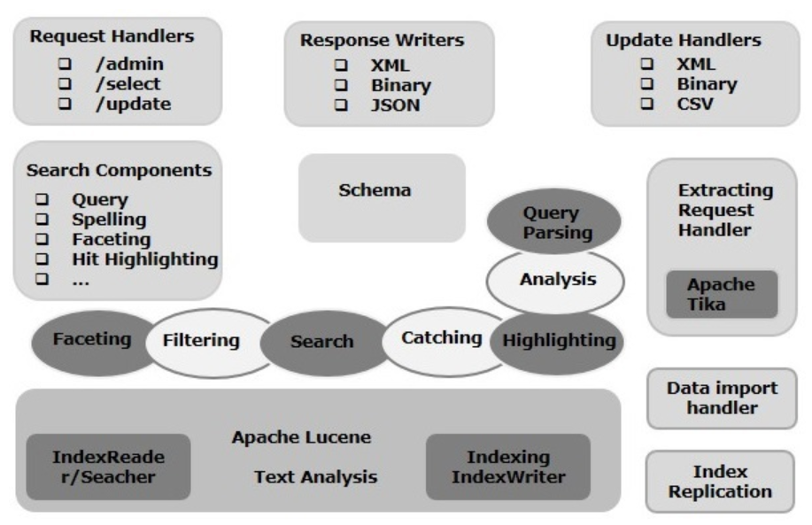


## Sorl术语

> 一般术语

**实例** - 就像一个`tomcat`实例或一个`jetty`实例，这个术语指的是在JVM中运行的应用程序服务器

**核心(core)** - 在应用程序中运行多个索引时，可以在每个实例中拥有多个核心，而不是每个核心的多个实例

**主目录(home)** - 术语`$SOLR_HOME`是指主目录，其中包含有关内核及其索引，配置和依赖关系的所有信息

**碎片(Shard)** - 在分布式环境中，数据在多个`Solr`实例之间进行分区，其中每个数据块可以称为碎片(`Shard`)。它包含整个索引的子集


> SolrCloud术语

**Solr**以主从模式安装，在分布式模式下，索引在主服务器上创建，并且将其复制到一个或多个从服务器。

**节点(Node)** - 在Solr云中，Solr的每个单个实例都被视为一个节点。

**集群** - Solr云环境中的所有节点组合在一起构成集群。

**集合** - 集群具有称为集合的逻辑索引。

**碎片** - 碎片是集合的一部分，它具有一个或多个索引副本。

**副本** - 在**Solr Core**中，在节点中运行的分片副本称为副本。

**领导者(Leader)** - 它也是碎片的副本，它将**Solr Cloud**的请求分发给剩余的副本。

**Zookeeper** - 这是一个Apache项目，用于集中配置和协调，管理集群和选择领导者。


> 配置文件

**Solr.xml** - 它是包含Solr Cloud相关信息，此文件是在`$SOLR_HOME`目录中

**Solrconfig.xml** − 此文件包含与请求处理和响应格式化相关的定义，核心特定配置，以及索引，配置，管理内存和提交

**Schema.xml** − 此文件包含整个模式以及字段和字段类型

**Core.properties** - 此文件包含特定于核心的配置。它被引用为核心发现，因为它包含核心的名称和数据目录的路径。它可以在任何目录中使用，会将此目录它视为核心目录


## Solr基本命令

1、启动solr

```bash
[root@centos7-vm bin]# solr start
```

因为配置了环境变量，它会去SOLR_HOME下寻找solr.xml，没有会报错


因此，我们从网络上下载一个默认的solr.xml放到SOLR_HOME目录下即可


2、启动成功后，访问8983端口

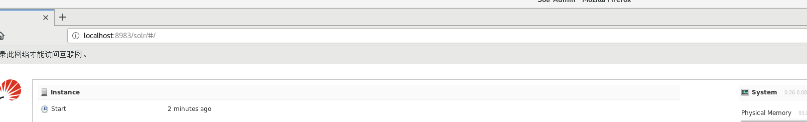

访问成功！


> 停止solr

```bash
[root@centos7-vm solr-6.2.0]# solr stop
```


> 指定端口启动solr

```bash
[root@centos7-vm solr-6.2.0]# solr start -p 8081
```

 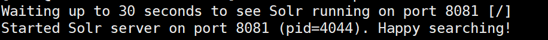


> 重新启动solr

```bash
centos7-vm solr-6.2.0]# solr restart
```


> help命令

```bash
[root@centos7-vm solr-6.2.0]# solr -help
```


> 查看solr实例状态

```bash
[root@centos7-vm solr-6.2.0]# solr status
```


## Solr核心

> 什么是Solr核心？

Solr核心(Core)是Lucene索引的运行实例，包含使用它所需的所有Solr配置文件，我们需要创建一个Solr Core来执行索引和分析等操作。


> 核心操作

1、启动solr，创建核心

```bash
# 方式一
centos7-vm solr-6.2.0]# solr create -c solr_sample
# 方式二
centos7-vm solr-6.2.0]# solr create_core solr_sample [-p portname] [-d conf_dir]
```

2、删除核心

```bash
[root@centos7-vm solr-6.2.0]# solr delete -c solr_sample
```


## Solr索引数据

### 概述

> 索引是什么？

索引是系统地排列文档或(其他实体)，使用户能够在文档中快速地查找信息。


> solr中的索引

在Apache Solr中，我们可以索引(添加，删除，修改)各种文档格式，如xml，csv，pdf等。


> 创建索引的方法

使用Solr Web界面

使用任何客户端API(如Java，Python等)

使用提交工具


### 添加文档

> post添加文档

1、在`/home/hadoop/solr-6.2.0/bin`目录下新建`sample.csv`文件，内容为

```txt
id,    first_name,   last_name,   phone_no,      location 
001,   Pruthvi,      Reddy,       9848022337,    Hyderabad 
002,   kasyap,       Sastry,      9848022338,    Vishakapatnam 
003,   Rajesh,       Khanna,      9848022339,    Delhi 
004,   Preethi,      Agarwal,     9848022330,    Pune 
005,   Trupthi,      Mohanty,     9848022336,    Bhubaneshwar 
006,   Archana,      Mishra,      9848022335,    Chennai
```

2、向核心`solr_sample`添加`sample.csv`文件

```bash
[root@centos7-vm bin]# post -c solr_sample sample.csv
```

3、登录选择核心，并执行查询

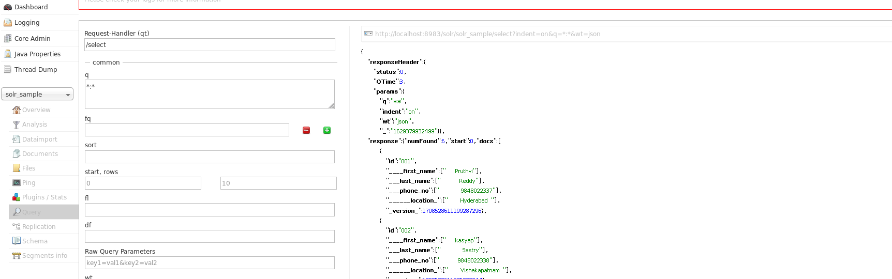

发现，数据已提交至solr核心，经过solr的一系列处理，它会存储在Lucene索引中


> web界面添加文档

1、准备json格式数据

```json
{"name":"naruto"}
```

2、点击提交按钮后，显示成功

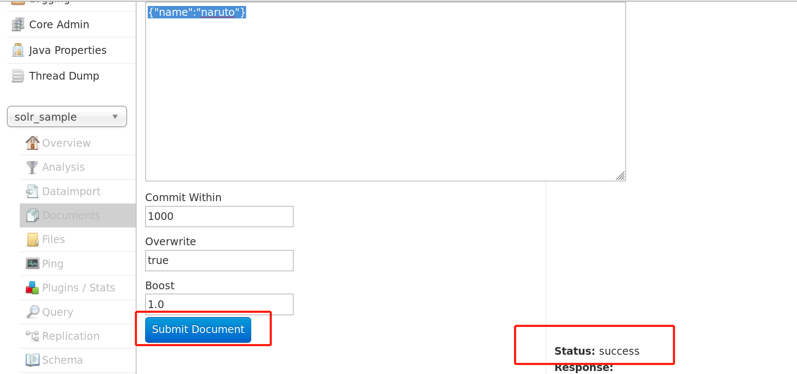

3、执行查询，发现数据已在索引中


> Java Client API添加文档

1、导入solr依赖，这里是为了方便在Maven中写程序

```xml
<dependency>
    <groupId>org.apache.solr</groupId>
    <artifactId>solr-solrj</artifactId>
    <version>6.6.2</version>
</dependency>
```

2、编写java程序

```java
import org.apache.solr.client.solrj.SolrClient;
import org.apache.solr.client.solrj.impl.HttpSolrClient;
import org.apache.solr.common.SolrInputDocument;

public class AddingDocument {

    public static void main(String args[]) throws Exception {
        //Preparing the Solr client
        String urlString = "http://localhost:8983/solr/#/solr_sample";
        SolrClient Solr = new HttpSolrClient.Builder(urlString).build();

        //Preparing the Solr document
        SolrInputDocument doc = new SolrInputDocument();

        //Adding fields to the document
        doc.addField("id", "003");
        doc.addField("name", "Rajaman");
        doc.addField("age","34");
        doc.addField("addr","vishakapatnam");

        //Adding the document to Solr
        Solr.add(doc);

        //Saving the changes
        Solr.commit();
        System.out.println("Documents added");
    }
}
```

3、将java文件和对应的jar包上传至linux下`/usr/local/solr-6.2.0/bin`

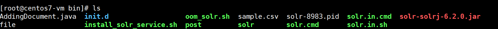

5、编译java文件，并执行java文件

一个jar包时

```bash
# 编译
[root@centos7-vm bin]# javac -cp solr-solrj-6.2.0.jar AddingDocument.java
# 执行
[root@centos7-vm bin]# java -cp solr-solrj-6.2.0.jar AddingDocument
```

一组jar包时

```bash
# 编译
[root@centos7-vm bin]# javac -Djava.ext.dirs=D:\lib test.java
# 执行
[root@centos7-vm bin]# java java  -Djava.ext.dirs=D:\lib test
```

这里就不测试了，整了都两个小时了，在windows上测了不同的版本的solr和httpclient组合，可以正常编译，但运行时就会报出不同的异常，不整了，估计是个坑。


> 使用xml添加文档

1、新建sample.xml文件，添加如下数据

```xml
<add> 
   <doc> 
      <field name = "id">001</field> 
      <field name = "first name">Rajiv</field> 
      <field name = "last name">Reddy</field> 
      <field name = "phone">9848022337</field> 
      <field name = "city">Hyderabad</field> 
   </doc>  
   <doc> 
      <field name = "id">002</field> 
      <field name = "first name">Siddarth</field> 
      <field name = "last name">Battacharya</field> 
      <field name = "phone">9848022338</field> 
      <field name = "city">Kolkata</field> 
   </doc>  
   <doc> 
      <field name = "id">003</field> 
      <field name = "first name">Rajesh</field> 
      <field name = "last name">Khanna</field> 
      <field name = "phone">9848022339</field> 
      <field name = "city">Delhi</field> 
   </doc>  
   <doc> 
      <field name = "id">004</field> 
      <field name = "first name">Preethi</field> 
      <field name = "last name">Agarwal</field> 
      <field name = "phone">9848022330</field> 
      <field name = "city">Pune</field> 
   </doc>  
   <doc> 
      <field name = "id">005</field> 
      <field name = "first name">Trupthi</field> 
      <field name = "last name">Mohanthy</field> 
      <field name = "phone">9848022336</field> 
      <field name = "city">Bhuwaeshwar</field> 
   </doc> 
   <doc> 
      <field name = "id">006</field> 
      <field name = "first name">Archana</field> 
      <field name = "last name">Mishra</field> 
      <field name = "phone">9848022335</field> 
      <field name = "city">Chennai</field> 
   </doc> 
</add>
```

2、利用post方法将xml文件提交至`my_core`

```bash
[root@centos7-vm bin]# post -c solr_sample sample.xml
```

3、登录solr地址查看

怎么说呢？post在linux提交成功了，但是数据没有传到`my_core`中，我又通过web界面的方式，结果提交成功了。

真特么，，，昨天还提交成功了。

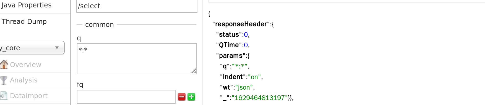


### 更新文档

1、新建`update.xml`文件，更新id为001的文档

```xml
<add>   
   <doc>     
      <field name = "id">001</field>     
      <field name = "first name" update = "set">Raj</field>     
      <field name = "last name" update = "add">Malhotra</field>     
      <field name = "phone" update = "add">9000000000</field>    
      <field name = "city" update = "add">Delhi</field>   
   </doc> 
</add>
```

2、再试试post行不行？OK了


我知道怎么回事了，就是xml里面的要么字段不一致，要么格式不正确，尤其是复制配置文件到终端时，复制完一定要检查一遍，我特么，让这个作者坑死我了，还好有日志。


### 删除文档

> 删除id为003和005的文档

1、编写文件delete.xml

```xml
<delete>   
   <id>003</id>   
   <id>005</id> 
</delete>
```

2、使用post提交至核心`my_core`


发现id为003和005的文档已被删除。


> 根据字段中的值删除文档

```xml
<delete> 
   <query>city:Chennai</query> 
</delete>
```


> 删除所有的文档

```xml
<delete> 
   <query>*:*</query> 
</delete>
```


## Solr检索数据

因为这里又涉及到java了，linux下又没有安装java的ide，所以直接在windows下演示吧

1、在本地启动solr，并访问主页

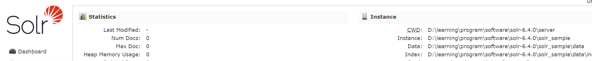

2、向核心中添加如下数据

```csv
001,9848022337,Hyderabad,Rajiv,Reddy  
002,9848022338,Kolkata,Siddarth,Battacharya 
003,9848022339,Delhi,Rajesh,Khanna
```

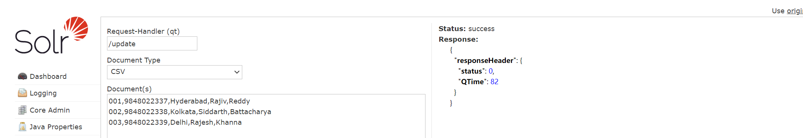

3、导入solr相关依赖

```xml
<?xml version="1.0" encoding="UTF-8"?>
<project xmlns="http://maven.apache.org/POM/4.0.0"
         xmlns:xsi="http://www.w3.org/2001/XMLSchema-instance"
         xsi:schemaLocation="http://maven.apache.org/POM/4.0.0 http://maven.apache.org/xsd/maven-4.0.0.xsd">
    <modelVersion>4.0.0</modelVersion>

    <groupId>cn.pikaqiang</groupId>
    <artifactId>solr-learning</artifactId>
    <version>1.0-SNAPSHOT</version>

    <dependencies>
        <dependency>
            <groupId>org.apache.solr</groupId>
            <artifactId>solr-solrj</artifactId>
            <version>6.2.0</version>
        </dependency>
        <dependency>
            <groupId>org.apache.httpcomponents</groupId>
            <artifactId>httpclient</artifactId>
            <version>4.5.2</version>
        </dependency>
    </dependencies>

    <build>
        <resources>
            <resource>
                <directory>src/main/resources</directory>
                <includes>
                    <include>**/*.properties</include>
                    <include>**/*.xml</include>
                </includes>
                <filtering>true</filtering>
            </resource>
            <resource>
                <directory>src/main/java</directory>
                <includes>
                    <include>**/*.properties</include>
                    <include>**/*.xml</include>
                </includes>
                <filtering>true</filtering>
            </resource>
        </resources>
    </build>

</project>
```

4、编写java程序

```java
package cn.pikaqiang.solr;

import org.apache.solr.client.solrj.SolrClient;
import org.apache.solr.client.solrj.SolrQuery;
import org.apache.solr.client.solrj.impl.HttpSolrClient;
import org.apache.solr.client.solrj.response.QueryResponse;
import org.apache.solr.common.SolrDocumentList;
import org.apache.solr.common.SolrInputDocument;

public class AddingDocument {

    public static void main(String args[]) throws Exception {
        //Preparing the Solr client
        String urlString = "http://localhost:8983/solr/solr_sample";
        SolrClient Solr = new HttpSolrClient.Builder(urlString).build();

        //Preparing Solr query
        SolrQuery query = new SolrQuery();
        // 查询所有
        query.setQuery("*:*");

        //Adding the field to be retrieved
        //
        query.addField("*");

        //Executing the query
        QueryResponse queryResponse = Solr.query(query);

        //Storing the results of the query
        SolrDocumentList docs = queryResponse.getResults();
        System.out.println(docs);
        System.out.println(docs.get(0));
        System.out.println(docs.get(1));

        //Saving the operations
        Solr.commit();
    }
}
```

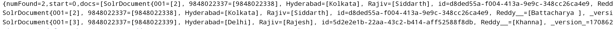

果然还是idea好使，命令行是什么玩意，一堆异常！！！


## Solr查询数据


