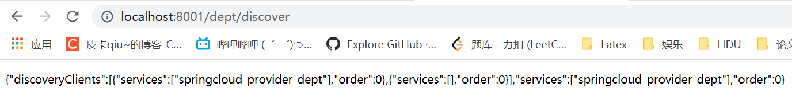
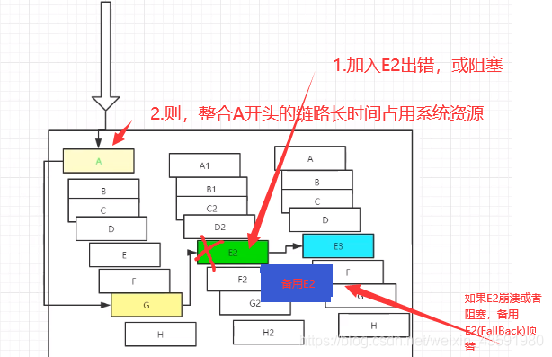

# SpringCloud

## 概述

> 什么是微服务？

微服务是SOA（Service-Oriented Architecture面向服务架构）的变体，将一个庞大的业务系统按照业务模块拆分成若干个独立的子系统，每个子系统都是一个独立的应用，每个子系统都可看作是一个微服务。


> 什么是微服务架构？

微服务架构是一种架构形式，将单一的程序应用划分成一组小的服务，服务之间相互配合，为用户提供价值。


> 微服务技术栈


> SpringCloud是什么？

Spring Cloud是一系列框架的[有序集合](https://baike.baidu.com/item/有序集合/994839)。它利用Spring Boot的简化了分布式系统的开发，如服务发现注册、配置中心、消息总线、负载均衡、断路器、数据监控等，都可以用Spring Boot的开发风格做到一键启动和部署。它将服务框架组合起来，给开发者留出了一套简单易懂的分布式系统开发工具包。

 


> SpringCloud与SpringBoot的关系

1.SpringBoot专注于快速开发单个个体微服务。

2.SpringCloud是关注全局的微服务协调整理治理框架，它将SpringBoot开发的一个个单体微服务整合并且管理起来，为各个服务之间提供，配置管理、服务发现、断路器、路由、微代理、事件总线、全局锁、精选决策、分布式会话等集成服务。

3.SpringBoot可以离开SpringCloud独立开发项目，但是SpringCloud离不开SpringBoot，属于依赖关系。


> SpringCloud能干嘛？

- Distributed/versioned configuration 分布式/版本控制配置
- Service registration and discovery 服务注册与发现
- Routing 路由
- Service-to-service calls 服务到服务的调用
- Load balancing 负载均衡配置
- Circuit Breakers 断路器
- Distributed messaging 分布式消息管理
- …


> SpringCloud与SpringBoot的版本选择

版本对应地址：https://start.spring.io/actuator/info


## 数据库

1、创建数据库

 

2、idea连接数据库

 

3、新建部门表


## SpringCloud框架

> 创建maven项目`springcloud`

1、删除`src`文件夹，作为父工程

2、pom文件配置

```xml
<?xml version="1.0" encoding="UTF-8"?>
<project xmlns="http://maven.apache.org/POM/4.0.0"
         xmlns:xsi="http://www.w3.org/2001/XMLSchema-instance"
         xsi:schemaLocation="http://maven.apache.org/POM/4.0.0 http://maven.apache.org/xsd/maven-4.0.0.xsd">
    <modelVersion>4.0.0</modelVersion>

    <groupId>cn.pikaqiang</groupId>
    <artifactId>springcloud</artifactId>
    <version>1.0-SNAPSHOT</version>

    <!--打包方式为pom-->
    <packaging>pom</packaging>

    <!--版本管理-->
    <properties>
        <project.build.sourceEncoding>UTF-8</project.build.sourceEncoding>
        <maven.compiler.source>1.8</maven.compiler.source>
        <maven.compiler.target>1.8</maven.compiler.target>
        <junit.version>4.12</junit.version>
        <log4j.version>1.2.17</log4j.version>
        <lombok.version>1.16.18</lombok.version>
    </properties>

    <!--依赖管理-->
    <dependencyManagement>
        <dependencies>
            <!--springcloud依赖-->
            <dependency>
                <groupId>org.springframework.cloud</groupId>
                <artifactId>spring-cloud-dependencies</artifactId>
                <version>Greenwich.SR1</version>
                <type>pom</type>
                <!--导入当前spring-cloud-dependencies下的所有依赖，不会进行依赖传递-->
                <!--如果没有import，由于这是父类，那么spring-cloud-dependencies的依赖会被子模块继承-->
                <scope>import</scope>
            </dependency>
            <!--springboot依赖-->
            <!--spring-boot-starter-parent是spring-boot-dependencies的子pom，
                只是额外添加了一些properties,resources,plugins-->
            <dependency>
                <groupId>org.springframework.boot</groupId>
                <artifactId>spring-boot-dependencies</artifactId>
                <version>2.1.4.RELEASE</version>
                <type>pom</type>
                <scope>import</scope>
            </dependency>

            <!--mybatis启动器-->
            <dependency>
                <groupId>org.mybatis.spring.boot</groupId>
                <artifactId>mybatis-spring-boot-starter</artifactId>
                <version>1.3.2</version>
            </dependency>

            <!--数据库相关-->
            <dependency>
                <groupId>mysql</groupId>
                <artifactId>mysql-connector-java</artifactId>
                <version>8.0.25</version>
            </dependency>
            <dependency>
                <groupId>com.alibaba</groupId>
                <artifactId>druid</artifactId>
                <version>1.1.21</version>
            </dependency>

            <!--日志测试~-->
            <dependency>
                <groupId>ch.qos.logback</groupId>
                <artifactId>logback-core</artifactId>
                <version>1.2.3</version>
            </dependency>
            <dependency>
                <groupId>junit</groupId>
                <artifactId>junit</artifactId>
                <version>${junit.version}</version>
            </dependency>
            <dependency>
                <groupId>log4j</groupId>
                <artifactId>log4j</artifactId>
                <version>${log4j.version}</version>
            </dependency>
            <dependency>
                <groupId>org.projectlombok</groupId>
                <artifactId>lombok</artifactId>
                <version>${lombok.version}</version>
            </dependency>

        </dependencies>
    </dependencyManagement>

    <!--资源导出配置-->
    <build>
        <resources>
            <resource>
                <directory>src/main/resources</directory>
                <includes>
                    <include>**/*.properties</include>
                    <include>**/*.xml</include>
                </includes>
                <filtering>true</filtering>
            </resource>
            <resource>
                <directory>src/main/java</directory>
                <includes>
                    <include>**/*.properties</include>
                    <include>**/*.xml</include>
                </includes>
                <filtering>true</filtering>
            </resource>
        </resources>
    </build>
</project>
```

## 创建微服务

> 创建微服务springcloud-api继承父工程

1、pom文件配置

```xml
<?xml version="1.0" encoding="UTF-8"?>
<project xmlns="http://maven.apache.org/POM/4.0.0"
         xmlns:xsi="http://www.w3.org/2001/XMLSchema-instance"
         xsi:schemaLocation="http://maven.apache.org/POM/4.0.0 http://maven.apache.org/xsd/maven-4.0.0.xsd">
    <parent>
        <artifactId>springcloud</artifactId>
        <groupId>cn.pikaqiang</groupId>
        <version>1.0-SNAPSHOT</version>
    </parent>
    <modelVersion>4.0.0</modelVersion>

    <artifactId>springcloud-api</artifactId>

    <!--导入子模块需要的依赖，如果父工程已经配置了版本，这里就不用写了-->
    <dependencies>
        <dependency>
            <groupId>org.projectlombok</groupId>
            <artifactId>lombok</artifactId>
        </dependency>
    </dependencies>

</project>
```

2、创建实体类

```java
package cn.pikaqiang.springcloud.pojo;

import lombok.Data;
import lombok.NoArgsConstructor;
import lombok.experimental.Accessors;

import java.io.Serializable;
/*实体类实现序列化*/
@Data
@NoArgsConstructor
@Accessors(chain = true)//开启链式编程
public class Dept  implements Serializable {

    private Long deptno;

    private String dname;
    // 比如部门信息可以存储在不同的数据库，该属性告诉我们部门信息来源于哪个数据库
    private String db_source;

    public Dept(String dname) {
        this.dname = dname;
    }
}
```


## 服务提供者

> 创建服务提供者springcloud-provider-dept-8001

1、pom文件配置

```xml
<?xml version="1.0" encoding="UTF-8"?>
<project xmlns="http://maven.apache.org/POM/4.0.0"
         xmlns:xsi="http://www.w3.org/2001/XMLSchema-instance"
         xsi:schemaLocation="http://maven.apache.org/POM/4.0.0 http://maven.apache.org/xsd/maven-4.0.0.xsd">
    <parent>
        <artifactId>springcloud</artifactId>
        <groupId>cn.pikaqiang</groupId>
        <version>1.0-SNAPSHOT</version>
    </parent>
    <modelVersion>4.0.0</modelVersion>

    <artifactId>springcloud-provider-dept-8001</artifactId>

    <dependencies>
        <!--配置微服务-->
        <dependency>
            <groupId>cn.pikaqiang</groupId>
            <artifactId>springcloud-api</artifactId>
            <version>1.0-SNAPSHOT</version>
        </dependency>
        <!--junit-->
        <dependency>
            <groupId>junit</groupId>
            <artifactId>junit</artifactId>
        </dependency>
        <!--数据库-->
        <dependency>
            <groupId>mysql</groupId>
            <artifactId>mysql-connector-java</artifactId>
        </dependency>
        <dependency>
            <groupId>com.alibaba</groupId>
            <artifactId>druid</artifactId>
        </dependency>
        <!--日志-->
        <dependency>
            <groupId>ch.qos.logback</groupId>
            <artifactId>logback-core</artifactId>
        </dependency>
        <!--mybatis-->
        <dependency>
            <groupId>org.mybatis.spring.boot</groupId>
            <artifactId>mybatis-spring-boot-starter</artifactId>
        </dependency>
        <!--springboot 相关-->
        <dependency>
            <groupId>org.springframework.boot</groupId>
            <artifactId>spring-boot-starter-web</artifactId>
        </dependency>
        <dependency>
            <groupId>org.springframework</groupId>
            <artifactId>spring-test</artifactId>
        </dependency>
        <!--jetty作为服务器-->
        <dependency>
            <groupId>org.springframework.boot</groupId>
            <artifactId>spring-boot-starter-jetty</artifactId>
        </dependency>
        <!--热部署-->
        <dependency>
            <groupId>org.springframework.boot</groupId>
            <artifactId>spring-boot-devtools</artifactId>
        </dependency>
    </dependencies>

</project>
```

2、配置application.yml

```yml
server:
  port: 8001
# mybatis配置
mybatis:
  type-aliases-package: cn.pikaqiang.springcloud.pojo
  config-location: classpath:mybatis/mybatis-config.xml
  mapper-locations: classpath:mybatis/mapper/*.xml
# spring配置
spring:
  application:
    name: springcloud-provider-dept
  datasource:
    type: com.alibaba.druid.pool.DruidDataSource
    driver-class-name: com.mysql.cj.jdbc.Driver
    url: jdbc:mysql://localhost:3306/db01?useUnicode=true&characterEncoding=utf8&useSSL=false&serverTimezone=Asia/Shanghai&allowPublicKeyRetrieval=true
    username: root
    password: root
```

3、配置mybatis-config.xml

```xml
<?xml version="1.0" encoding="UTF-8" ?>
<!DOCTYPE configuration
        PUBLIC "-//mybatis.org//DTD Config 3.0//EN"
        "http://mybatis.org/dtd/mybatis-3-config.dtd">
<!-- configuration核心配置文件 -->
<configuration>
    <settings>
        <!--开启二级缓存-->
        <setting name="cacheEnabled" value="true"/>
    </settings>
</configuration>
```

4、创建接口`DeptMapper`

```java
package cn.pikaqiang.springcloud.mapper;

import cn.pikaqiang.springcloud.pojo.Dept;
import org.apache.ibatis.annotations.Mapper;
import org.springframework.stereotype.Repository;

import java.util.List;

@Mapper
@Repository
public interface DeptMapper {

    /**
     * 增加一个部门
     * @param dept
     * @return
     */
    public boolean addDept(Dept dept);

    /**
     * 根据id查询部门
     * @param id
     * @return
     */
    public Dept queryDeptById(Long id);

    /**
     * 查询所有部门
     * @return
     */
    public List<Dept> queryAll();

}
```

5、编写`DeptMapper`对应的mapper文件`DeptMapper.xml`

```xml
<?xml version="1.0" encoding="UTF-8" ?>
<!DOCTYPE mapper
        PUBLIC "-//mybatis.org//DTD Mapper 3.0//EN"
        "http://mybatis.org/dtd/mybatis-3-mapper.dtd">

<mapper namespace="cn.pikaqiang.springcloud.mapper.DeptMapper">
    <insert id="addDept" parameterType="dept">
        insert into dept(dname,db_source)
        values (#{dname},DATABASE());
    </insert>

    <select id="queryDeptById" resultType="dept" parameterType="Long">
        select * from dept where deptno = #{deptno};
    </select>

    <select id="queryAll" resultType="dept">
        select * from dept;
    </select>
</mapper>
```

6、编写service层

```java
// 接口
package cn.pikaqiang.springcloud.service;

import cn.pikaqiang.springcloud.pojo.Dept;

import java.util.List;

public interface DeptService {

    /**
     * 增加一个部门
     * @param dept
     * @return
     */
    public boolean addDept(Dept dept);

    /**
     * 根据id查询部门
     * @param id
     * @return
     */
    public Dept queryDeptById(Long id);

    /**
     * 查询所有部门
     * @return
     */
    public List<Dept> queryAll();

}
```

```java
// 接口实现
package cn.pikaqiang.springcloud.service;

import cn.pikaqiang.springcloud.mapper.DeptMapper;
import cn.pikaqiang.springcloud.pojo.Dept;
import org.springframework.beans.factory.annotation.Autowired;
import org.springframework.stereotype.Service;

import java.util.List;
@Service
public class DeptServiceImpl implements DeptService {

    @Autowired
    private DeptMapper deptMapper;

    @Override
    public boolean addDept(Dept dept) {
        return deptMapper.addDept(dept);
    }

    @Override
    public Dept queryDeptById(Long id) {
        return deptMapper.queryDeptById(id);
    }

    @Override
    public List<Dept> queryAll() {
        return deptMapper.queryAll();
    }
}
```

7、编写controller，为外界提供访问的接口

```java
package cn.pikaqiang.springcloud.controller;

import cn.pikaqiang.springcloud.pojo.Dept;
import cn.pikaqiang.springcloud.service.DeptService;
import org.springframework.beans.factory.annotation.Autowired;
import org.springframework.web.bind.annotation.GetMapping;
import org.springframework.web.bind.annotation.PathVariable;
import org.springframework.web.bind.annotation.PostMapping;
import org.springframework.web.bind.annotation.RestController;

import java.util.List;

// 提供Restful服务
@RestController
public class DeptController {

    @Autowired
    private DeptService deptService;
    
    // 添加请求使用post，get不安全
    @PostMapping("/dept/add")
    public boolean addDept(Dept dept) {
        return deptService.addDept(dept);
    }
    // 查看指定部门
    @GetMapping("/dept/get/{id}")
    public Dept getDept(@PathVariable("id") Long id) {
        return deptService.queryDeptById(id);
    }
    // 查看所有部门
    @GetMapping("/dept/list")
    public List<Dept> listDept() {
        return deptService.queryAll();
    }
    
}
```

8、编写服务提供者的主启动类`DeptProvider_8001`

```java
package cn.pikaqiang.springcloud;

import org.mybatis.spring.annotation.MapperScan;
import org.springframework.boot.SpringApplication;
import org.springframework.boot.autoconfigure.SpringBootApplication;

@SpringBootApplication
@MapperScan("cn.pikaqiang.springcloud.mapper")
public class DeptProvider_8001 {

    public static void main(String[] args) {
        SpringApplication.run(DeptProvider_8001.class,args);
    }
}
```

9、启动项目，访问部门1


可以正常拿到数据，这说明客户端发起请求，请求由服务器接收，然后服务器去找微服务，微服务将数据返回给客户端


## 服务消费者

> 创建maven工程springcloud-consumer

1、pom文件配置

```xml
<?xml version="1.0" encoding="UTF-8"?>
<project xmlns="http://maven.apache.org/POM/4.0.0"
         xmlns:xsi="http://www.w3.org/2001/XMLSchema-instance"
         xsi:schemaLocation="http://maven.apache.org/POM/4.0.0 http://maven.apache.org/xsd/maven-4.0.0.xsd">
    <parent>
        <artifactId>springcloud</artifactId>
        <groupId>cn.pikaqiang</groupId>
        <version>1.0-SNAPSHOT</version>
    </parent>
    <modelVersion>4.0.0</modelVersion>

    <artifactId>springcloud-consumer-dept-80</artifactId>

    <!--实体类+web-->
    <dependencies>
        <dependency>
            <groupId>cn.pikaqiang</groupId>
            <artifactId>springcloud-api</artifactId>
            <version>1.0-SNAPSHOT</version>
        </dependency>
        <dependency>
            <groupId>org.springframework.boot</groupId>
            <artifactId>spring-boot-starter-web</artifactId>
        </dependency>
        <dependency>
            <groupId>org.springframework.boot</groupId>
            <artifactId>spring-boot-devtools</artifactId>
        </dependency>
    </dependencies>
</project>
```

2、application.yml配置

```yml
server:
  port: 80
```

3、resuful模板配置

```java
package cn.pikaqiang.springcloud.config;

import org.springframework.context.annotation.Bean;
import org.springframework.context.annotation.Configuration;
import org.springframework.web.client.RestTemplate;

@Configuration
public class ConfigBean {
    // 使用它可以拿到请求service层的url
    @Bean
    public RestTemplate getRestTemplate() {
        return new RestTemplate();
    }
}
```

4、编写控制器

```java
package cn.pikaqiang.springcloud.controller;

import cn.pikaqiang.springcloud.pojo.Dept;
import org.springframework.beans.factory.annotation.Autowired;
import org.springframework.stereotype.Controller;
import org.springframework.web.bind.annotation.PathVariable;
import org.springframework.web.bind.annotation.RequestMapping;
import org.springframework.web.bind.annotation.RestController;
import org.springframework.web.client.RestTemplate;

import java.util.List;
// 返回json数据
@RestController
public class DeptConsumerController {

    // 有了restTemplate可以方便的访问远程服务，简单的restful服务模板
    @Autowired
    private RestTemplate restTemplate;

    private static final String REST_URL_PREFIX = "http://localhost:8001";

    // 根据id获取部门服务
    @RequestMapping("/consumer/dept/get/{id}")
    public Dept get(@PathVariable("id") Long id) {
        return restTemplate.getForObject(REST_URL_PREFIX+"/dept/get/"+id,Dept.class);
    }
    // 添加一个部门
    @RequestMapping("/consumer/dept/add")
    public boolean add(Dept dept) {
        return restTemplate.postForObject(REST_URL_PREFIX+"/dept/add",dept,boolean.class);
    }
    // 查看所有部门
    @RequestMapping("/consumer/dept/list")
    public List<Dept> list() {
        return restTemplate.getForObject(REST_URL_PREFIX+"/dept/list",List.class);
    }

}
```

5、编写消费者的启动类

```java
package cn.pikaqiang.springcloud;

import org.springframework.boot.SpringApplication;
import org.springframework.boot.autoconfigure.SpringBootApplication;

@SpringBootApplication
public class DeptConsumer_80 {

    public static void main(String[] args) {
        SpringApplication.run(DeptConsumer_80.class,args);
    }
}
```


## 消费服务测试

1、依次启动服务提供者、启动服务消费者

2、消费者访问自定义的接口，以显示所有数据为例


**总结一下**

消费者类本身没有service层，它只有控制器，对外暴露的是接口，而接口里实际上调用的是服务提供者的接口，即服务提供者处理业务时的url，就相当于服务提供者的接口暴露给消费者，而消费者的接口暴露给用户或客户


## Eureka

> 什么是Eureka？

Eureka是[Netflix](https://baike.baidu.com/item/Netflix/662557)开发的服务发现框架，本身是一个基于[REST](https://baike.baidu.com/item/REST/6330506)的服务，主要用于定位运行在[AWS](https://baike.baidu.com/item/AWS/7630528)域中的中间层服务，以达到负载均衡和中间层服务故障转移的目的。SpringCloud将它集成在其子项目spring-cloud-netflix中，以实现SpringCloud的服务发现功能。

类似于Zookeeper，注册和转移服务


> Eureka原理

- Springcloud 封装了Netflix公司开发的Eureka模块来实现服务注册与发现 (对比Zookeeper)

- 而系统中的其他微服务，使用Eureka的客户端连接到EurekaServer并维持心跳连接。这样系统的维护人员就可以通过EurekaServer来监控系统中各个微服务是否正常运行，Springcloud 的一些其他模块 (比如Zuul) 就可以通过EurekaServer来发现系统中的其他微服务，并执行相关的逻辑
- Eureka 包含两个组件：Eureka Server 和 Eureka Client
- Eureka Server 提供服务注册，各个节点启动后，回在EurekaServer中进行注册，这样Eureka Server中的服务注册表中将会储存所有课用服务节点的信息，服务节点的信息可以在界面中直观的看到
- Eureka Client 是一个Java客户端，用于简化EurekaServer的交互，客户端同时也具备一个内置的，使用轮询负载算法的负载均衡器。在应用启动后，将会向EurekaServer发送心跳 (默认周期为30秒) 。如果Eureka Server在多个心跳周期内没有接收到某个节点的心跳，EurekaServer将会从服务注册表中把这个服务节点移除掉 (默认周期为90s)


> 三大角色

- Eureka Server：提供服务的注册与发现
- Service Provider：服务生产方，将自身服务注册到Eureka中，从而使服务消费方能狗找到
- Service Consumer：服务消费方，从Eureka中获取注册服务列表，从而找到消费服务


> 创建maven模块springcloud-eureka-7001

1、pom文件配置

```xml
<?xml version="1.0" encoding="UTF-8"?>
<project xmlns="http://maven.apache.org/POM/4.0.0"
         xmlns:xsi="http://www.w3.org/2001/XMLSchema-instance"
         xsi:schemaLocation="http://maven.apache.org/POM/4.0.0 http://maven.apache.org/xsd/maven-4.0.0.xsd">
    <parent>
        <artifactId>springcloud</artifactId>
        <groupId>cn.pikaqiang</groupId>
        <version>1.0-SNAPSHOT</version>
    </parent>
    <modelVersion>4.0.0</modelVersion>

    <artifactId>springcloud-eureka-7001</artifactId>

    <!--导包-->
    <dependencies>
        <!--导入Eureka Server依赖-->
        <dependency>
            <groupId>org.springframework.cloud</groupId>
            <artifactId>spring-cloud-starter-eureka-server</artifactId>
            <version>1.4.6.RELEASE</version>
        </dependency>
        <!--热部署工具-->
        <dependency>
            <groupId>org.springframework.boot</groupId>
            <artifactId>spring-boot-devtools</artifactId>
        </dependency>
    </dependencies>

</project>
```

2、application.yml配置

```yml
server:
  port: 7001
# eureka配置  
eureka:
  instance:
    hostname: localhost #服务端实例名称
  client:
    register-with-eureka: false #是否向eurka注册中心注册自己
    fetch-registry: false # false表示自己为注册中心
    service-url: # 监控页面
      defaultZone: http://${eureka.instance.hostname}:${server.port}/eureka/
```

3、编写启动类

```java
package cn.pikaqiang;


import org.springframework.boot.SpringApplication;
import org.springframework.boot.autoconfigure.SpringBootApplication;
import org.springframework.cloud.netflix.eureka.server.EnableEurekaServer;

@SpringBootApplication
@EnableEurekaServer// 开启Eureak服务
public class EurekaServer_7001 {

    public static void main(String[] args) {
        SpringApplication.run(EurekaServer_7001.class, args);
    }   
}
```

4、启动eureka启动类，测试


## 服务提供者向Eureka注册

> 服务提供者配置以及信息配置

1、pom文件配置

```xml
<?xml version="1.0" encoding="UTF-8"?>
<project xmlns="http://maven.apache.org/POM/4.0.0"
         xmlns:xsi="http://www.w3.org/2001/XMLSchema-instance"
         xsi:schemaLocation="http://maven.apache.org/POM/4.0.0 http://maven.apache.org/xsd/maven-4.0.0.xsd">
    <parent>
        <artifactId>springcloud</artifactId>
        <groupId>cn.pikaqiang</groupId>
        <version>1.0-SNAPSHOT</version>
    </parent>
    <modelVersion>4.0.0</modelVersion>

    <artifactId>springcloud-provider-dept-8001</artifactId>

    <dependencies>

        <!--Eureka依赖-->
        <!-- https://mvnrepository.com/artifact/org.springframework.cloud/spring-cloud-starter-eureka -->
        <dependency>
            <groupId>org.springframework.cloud</groupId>
            <artifactId>spring-cloud-starter-eureka</artifactId>
            <version>1.4.6.RELEASE</version>
        </dependency>

        <!--完善监控信息-->
        <dependency>
            <groupId>org.springframework.boot</groupId>
            <artifactId>spring-boot-starter-actuator</artifactId>
        </dependency>

        <!--配置微服务-->
        <dependency>
            <groupId>cn.pikaqiang</groupId>
            <artifactId>springcloud-api</artifactId>
            <version>1.0-SNAPSHOT</version>
        </dependency>
        <!--junit-->
        <dependency>
            <groupId>junit</groupId>
            <artifactId>junit</artifactId>
        </dependency>
        <!--数据库-->
        <dependency>
            <groupId>mysql</groupId>
            <artifactId>mysql-connector-java</artifactId>
        </dependency>
        <dependency>
            <groupId>com.alibaba</groupId>
            <artifactId>druid</artifactId>
        </dependency>
        <!--日志-->
        <dependency>
            <groupId>ch.qos.logback</groupId>
            <artifactId>logback-core</artifactId>
        </dependency>
        <!--mybatis-->
        <dependency>
            <groupId>org.mybatis.spring.boot</groupId>
            <artifactId>mybatis-spring-boot-starter</artifactId>
        </dependency>
        <!--springboot 相关-->
        <dependency>
            <groupId>org.springframework.boot</groupId>
            <artifactId>spring-boot-starter-web</artifactId>
        </dependency>
        <dependency>
            <groupId>org.springframework</groupId>
            <artifactId>spring-test</artifactId>
        </dependency>
        <!--jetty作为服务器-->
        <dependency>
            <groupId>org.springframework.boot</groupId>
            <artifactId>spring-boot-starter-jetty</artifactId>
        </dependency>
        <!--热部署-->
        <dependency>
            <groupId>org.springframework.boot</groupId>
            <artifactId>spring-boot-devtools</artifactId>
        </dependency>
    </dependencies>

</project>
```

2、application.yml配置

```yml
server:
  port: 8001
# mybatis配置
mybatis:
  type-aliases-package: cn.pikaqiang.springcloud.pojo
  config-location: classpath:mybatis/mybatis-config.xml
  mapper-locations: classpath:mybatis/mapper/*.xml
# spring配置
spring:
  application:
    name: springcloud-provider-dept
  datasource:
    type: com.alibaba.druid.pool.DruidDataSource
    driver-class-name: com.mysql.cj.jdbc.Driver
    url: jdbc:mysql://localhost:3306/db01?useUnicode=true&characterEncoding=utf8&useSSL=false&serverTimezone=Asia/Shanghai&allowPublicKeyRetrieval=true
    username: root
    password: root

#向eureka注册
eureka:
  client:
    service-url: #配置注册中心的url
      defaultZone: http://localhost:7001/eureka/
  instance: # 告诉注册中心status
    instance-id: springcloud-provider-dept-8001
# info 配置，配合actuator使用，点击监控status的链接即可获取json格式的info
info:
  app.name: naruto-springcloud
  company.name: naruto-company
```

3、主启动类开启Eureka支持

```java
package cn.pikaqiang.springcloud;

import org.mybatis.spring.annotation.MapperScan;
import org.springframework.boot.SpringApplication;
import org.springframework.boot.autoconfigure.SpringBootApplication;
import org.springframework.cloud.netflix.eureka.EnableEurekaClient;

@SpringBootApplication
@MapperScan("cn.pikaqiang.springcloud.mapper")
@EnableEurekaClient
public class DeptProvider_8001 {

    public static void main(String[] args) {
        SpringApplication.run(DeptProvider_8001.class,args);
    }
}
```


> 测试服务注册

1、依次启动eureka服务、服务提供者

2、访问http://localhost:7001/


发现服务提供者已注册到注册中心


> ##### EureKa自我保护机制：好死不如赖活着

一句话总结就是：**某时刻某一个微服务不可用，eureka不会立即清理，依旧会对该微服务的信息进行保存！**

- 但是我们在开发测试阶段，需要频繁地重启发布，如果触发了保护机制，则旧的服务实例没有被删除，这时请求有可能跑到旧的实例中，而该实例已经关闭了，这就导致请求错误，影响开发测试。所以，在开发测试阶段，我们可以把自我保护模式关闭，只需在eureka server配置文件中加上如下配置即可：
- `eureka.server.enable-self-preservation=false`【不推荐关闭自我保护机制】

## 服务提供者获取微服务列表

> 服务提供者配置

1、编写controller

```java
package cn.pikaqiang.springcloud.controller;

import cn.pikaqiang.springcloud.pojo.Dept;
import cn.pikaqiang.springcloud.service.DeptService;
import org.springframework.beans.factory.annotation.Autowired;
import org.springframework.cloud.client.ServiceInstance;
import org.springframework.cloud.client.discovery.DiscoveryClient;
import org.springframework.web.bind.annotation.*;

import java.util.List;

// 提供Restful服务
@RestController
public class DeptController {

    @Autowired
    private DeptService deptService;
    // 获取配置信息
    @Autowired
    private DiscoveryClient client;

    // 添加请求使用post，get不安全
    @PostMapping("/dept/add")
    public boolean addDept(Dept dept) {
        return deptService.addDept(dept);
    }
    // 查看指定部门
    @GetMapping("/dept/get/{id}")
    public Dept getDept(@PathVariable("id") Long id) {
        return deptService.queryDeptById(id);
    }
    // 查看所有部门
    @GetMapping("/dept/list")
    public List<Dept> listDept() {
        return deptService.queryAll();
    }

    // 获取注册进来的微服务的相关信息
    @GetMapping("/dept/discover")
    public Object discover() {
        // 获取微服务列表清单
        List<String> services = client.getServices();
        System.out.println("discover=>services:"+services);
        // 得到具体的微服务，通过具体的微服务id,applicationName
        List<ServiceInstance> instances = client.getInstances("SPRINGCLOUD-PROVIDER-DEPT");
        for (ServiceInstance instance : instances) {
            System.out.println(
                    instance.getHost()+"\t"+
                    instance.getPort()+"\t"+
                    instance.getUri()+"\t"+
                    instance.getServiceId()
            );
        }
        return this.client;
    }

}
```

2、启动类配置

```java
package cn.pikaqiang.springcloud;

import org.mybatis.spring.annotation.MapperScan;
import org.springframework.boot.SpringApplication;
import org.springframework.boot.autoconfigure.SpringBootApplication;
import org.springframework.cloud.client.discovery.EnableDiscoveryClient;
import org.springframework.cloud.netflix.eureka.EnableEurekaClient;

@SpringBootApplication
@MapperScan("cn.pikaqiang.springcloud.mapper")
@EnableEurekaClient
@EnableDiscoveryClient
public class DeptProvider_8001 {

    public static void main(String[] args) {
        SpringApplication.run(DeptProvider_8001.class,args);
    }
}
```


> 测试一下

1、启动eureka、服务提供者



**控制台信息**


## 集群环境配置

> 搭建三个eureka注册中心

1、新建maven模块`springcloud-eureka-7002`

2、pom文件配置

```xml
<?xml version="1.0" encoding="UTF-8"?>
<project xmlns="http://maven.apache.org/POM/4.0.0"
         xmlns:xsi="http://www.w3.org/2001/XMLSchema-instance"
         xsi:schemaLocation="http://maven.apache.org/POM/4.0.0 http://maven.apache.org/xsd/maven-4.0.0.xsd">
    <parent>
        <artifactId>springcloud</artifactId>
        <groupId>cn.pikaqiang</groupId>
        <version>1.0-SNAPSHOT</version>
    </parent>
    <modelVersion>4.0.0</modelVersion>

    <artifactId>springcloud-eureka-7002</artifactId>

    <!--导包-->
    <dependencies>
        <!--导入Eureka Server依赖-->
        <dependency>
            <groupId>org.springframework.cloud</groupId>
            <artifactId>spring-cloud-starter-eureka-server</artifactId>
            <version>1.4.6.RELEASE</version>
        </dependency>
        <!--热部署工具-->
        <dependency>
            <groupId>org.springframework.boot</groupId>
            <artifactId>spring-boot-devtools</artifactId>
        </dependency>
    </dependencies>

</project>
```

3、application.yml配置

```yml
server:
  port: 7002

#Eureka配置
eureka:
  instance:
    hostname: localhost #Eureka服务端的实例名称
  client:
    register-with-eureka: false # 表示是否向eureka注册中心注册自己
    fetch-registry: false #fetch-registry如果为false，则表示自己为注册中心
    service-url:
      defaultZone: http://${eureka.instance.hostname}:${server.port}/eureka/
      # 集群（关联）：
      # defaultZone: http://eureka7002.com:7002/eureka/,http://eureka7003.com:7003/eureka/
```

4、新建主启动类

```java
package cn.pikaqiang;

import org.springframework.boot.SpringApplication;
import org.springframework.boot.autoconfigure.SpringBootApplication;
import org.springframework.cloud.netflix.eureka.server.EnableEurekaServer;

@SpringBootApplication
@EnableEurekaServer// 开启Eureak服务
public class EurekaServer_7002 {

    public static void main(String[] args) {
        SpringApplication.run(EurekaServer_7002.class, args);
    }

}
```

5、7003对应的注册中心和上面的配置类似


> 配置注册中心集群

1、host文件自定义多个主机名

找到C--->windows---System32---drivers---etc---hosts，进行如下配置

```txt
# Copyright (c) 1993-2009 Microsoft Corp.
#
# This is a sample HOSTS file used by Microsoft TCP/IP for Windows.
#
# This file contains the mappings of IP addresses to host names. Each
# entry should be kept on an individual line. The IP address should
# be placed in the first column followed by the corresponding host name.
# The IP address and the host name should be separated by at least one
# space.
#
# Additionally, comments (such as these) may be inserted on individual
# lines or following the machine name denoted by a '#' symbol.
#
# For example:
#
#      102.54.94.97     rhino.acme.com          # source server
#       38.25.63.10     x.acme.com              # x client host

# localhost name resolution is handled within DNS itself.
#	127.0.0.1       localhost
#	::1             localhost
127.0.0.1       activate.navicat.com
127.0.0.1       eureka7001.com
127.0.0.1       eureka7002.com
127.0.0.1       eureka7003.com
```


2、修改application.yml中的hostname

```yml
server:
  port: 7001

#Eureka配置
eureka:
  instance:
    hostname: eureka7001.com #Eureka服务端的实例名称
  client:
    register-with-eureka: false # 表示是否向eureka注册中心注册自己
    fetch-registry: false #fetch-registry如果为false，则表示自己为注册中心
    service-url:
      #defaultZone: http://${eureka.instance.hostname}:${server.port}/eureka/
      # 集群（关联）：
      defaultZone: http://eureka7002.com:7002/eureka/,http://eureka7003.com:7003/eureka/
```

```yml
server:
  port: 7002

#Eureka配置
eureka:
  instance:
    hostname: eureka7002.com #Eureka服务端的实例名称
  client:
    register-with-eureka: false # 表示是否向eureka注册中心注册自己
    fetch-registry: false #fetch-registry如果为false，则表示自己为注册中心
    service-url:
      # defaultZone: http://${eureka.instance.hostname}:${server.port}/eureka/
      # 集群（关联）：
      defaultZone: http://eureka7001.com:7001/eureka/,http://eureka7003.com:7003/eureka/

```

```yml
server:
  port: 7003

#Eureka配置
eureka:
  instance:
    hostname: eureka7003.com #Eureka服务端的实例名称
  client:
    register-with-eureka: false # 表示是否向eureka注册中心注册自己
    fetch-registry: false #fetch-registry如果为false，则表示自己为注册中心
    service-url:
      # defaultZone: http://${eureka.instance.hostname}:${server.port}/eureka/
      # 集群（关联）：
      defaultZone: http://eureka7001.com:7001/eureka/,http://eureka7002.com:7002/eureka/
```


3、修改服务提供者的注册信息

```yml
server:
  port: 8001
# mybatis配置
mybatis:
  type-aliases-package: cn.pikaqiang.springcloud.pojo
  config-location: classpath:mybatis/mybatis-config.xml
  mapper-locations: classpath:mybatis/mapper/*.xml
# spring配置
spring:
  application:
    name: springcloud-provider-dept
  datasource:
    type: com.alibaba.druid.pool.DruidDataSource
    driver-class-name: com.mysql.cj.jdbc.Driver
    url: jdbc:mysql://localhost:3306/db01?useUnicode=true&characterEncoding=utf8&useSSL=false&serverTimezone=Asia/Shanghai&allowPublicKeyRetrieval=true
    username: root
    password: root

#向eureka注册
eureka:
  client:
    service-url: #配置注册中心的url
      defaultZone: http://eureka7001.com:7001/eureka/,http://eureka7002.com:7002/eureka/,http://eureka7003.com:7003/eureka/
  instance: # 告诉注册中心status
    instance-id: springcloud-provider-dept-8001
# 监控信息配置
info:
  app.name: naruto-springcloud
  company.name: naruto-company
```


> 测试一下

1、依次启动注册中心`7001`、`7002`、`7003`、服务提供者

2、随便访问一个注册中心


可以发现服务提供者向每个注册中心都进行了注册，而每个注册中心相关关联，如果某个注册中心挂掉了，并不会影响服务提供者。


## CAP原则

**1. 回顾CAP原则**

RDBMS (MySQL\Oracle\sqlServer) ===> ACID

NoSQL (Redis\MongoDB) ===> CAP

**2. ACID是什么？**

- A (Atomicity) 原子性
- C (Consistency) 一致性
- I (Isolation) 隔离性
- D (Durability) 持久性

**3. CAP是什么?**

- C (Consistency) 强一致性
- A (Availability) 可用性
- P (Partition tolerance) 分区容错性

CAP的三进二：CA、AP、CP

**4.CAP理论的核心**

- 一个分布式系统不可能同时很好的满足一致性，可用性和分区容错性这三个需求

- 根据CAP原理，将NoSQL数据库分成了满足CA原则，满足CP原则和满足AP原则三大类

  CA：单点集群，满足一致性，可用性的系统，通常可扩展性较差
  CP：满足一致性，分区容错的系统，通常性能不是特别高
  AP：满足可用性，分区容错的系统，通常可能对一致性要求低一些


**Zookeeper保证的是CP**

当向注册中心查询服务列表时，我们可以容忍注册中心返回的是几分钟以前的注册信息，但不能接收服务直接down掉不可用。也就是说，**服务注册功能对可用性的要求要高于一致性**。但zookeeper会出现这样一种情况，当master节点因为网络故障与其他节点失去联系时，剩余节点会重新进行leader选举。问题在于，选举leader的时间太长，30-120s，且选举期间整个zookeeper集群是不可用的，这就导致在选举期间注册服务瘫痪。在云部署的环境下，因为网络问题使得zookeeper集群失去master节点是较大概率发生的事件，虽然服务最终能够恢复，但是，漫长的选举时间导致注册长期不可用，是不可容忍的。


**Eureka保证的是AP**

 Eureka看明白了这一点，因此在设计时就**优先保证可用性**。Eureka各个节点都是平等的，几个节点挂掉不会影响正常节点的工作，剩余的节点依然可以提供注册和查询服务。而Eureka的客户端在向某个Eureka注册时，如果发现连接失败，则会自动切换至其他节点，只要有一台Eureka还在，就能保住注册服务的可用性，只不过查到的信息可能不是最新的，除此之外，Eureka还有之中自我保护机制，如果在15分钟内超过85%的节点都没有正常的心跳，那么Eureka就认为客户端与注册中心出现了网络故障，此时会出现以下几种情况：

Eureka不再从注册列表中移除因为长时间没收到心跳而应该过期的服务
Eureka仍然能够接受新服务的注册和查询请求，但是不会被同步到其他节点上 (即保证当前节点依然可用)
当网络稳定时，当前实例新的注册信息会被同步到其他节点中
**因此，Eureka可以很好的应对因网络故障导致部分节点失去联系的情况，而不会像zookeeper那样使整个注册服务瘫痪**


## Ribbon

### 概述

> Ribbon是什么？

Spring Cloud Ribbon 是基于Netflix Ribbon 实现的一套客户端负载均衡的工具。


> 什么是负载均衡？

 负载均衡简单的说就是将用户的请求平摊的分配到多个服务上，从而达到系统的HA (高用)。

 


> 负载均衡的分类

**集中式LB**
即在服务的提供方和消费方之间使用独立的LB设施，如Nginx(反向代理服务器)，由该设施负责把访问请求通过某种策略转发至服务的提供方！
**进程式 LB**
将LB逻辑集成到消费方，消费方从服务注册中心获知有哪些地址可用，然后自己再从这些地址中选出一个合适的服务器。
Ribbon 就属于进程内LB，它只是一个类库，集成于消费方进程，消费方通过它来获取到服务提供方的地址！


### Ribbon集成

1、消费者pom文件

```xml
<?xml version="1.0" encoding="UTF-8"?>
<project xmlns="http://maven.apache.org/POM/4.0.0"
         xmlns:xsi="http://www.w3.org/2001/XMLSchema-instance"
         xsi:schemaLocation="http://maven.apache.org/POM/4.0.0 http://maven.apache.org/xsd/maven-4.0.0.xsd">
    <parent>
        <artifactId>springcloud</artifactId>
        <groupId>cn.pikaqiang</groupId>
        <version>1.0-SNAPSHOT</version>
    </parent>
    <modelVersion>4.0.0</modelVersion>

    <artifactId>springcloud-consumer-dept-80</artifactId>

    <!--实体类+web-->
    <dependencies>
        <!--Ribbon-->
        <dependency>
            <groupId>org.springframework.cloud</groupId>
            <artifactId>spring-cloud-starter-ribbon</artifactId>
            <version>1.4.6.RELEASE</version>
        </dependency>
        <!--Eureka: Ribbon需要从Eureka服务中心获取要拿什么-->
        <dependency>
            <groupId>org.springframework.cloud</groupId>
            <artifactId>spring-cloud-starter-eureka</artifactId>
            <version>1.4.6.RELEASE</version>
        </dependency>
        <!--微服务模块-->
        <dependency>
            <groupId>cn.pikaqiang</groupId>
            <artifactId>springcloud-api</artifactId>
            <version>1.0-SNAPSHOT</version>
        </dependency>
        <dependency>
            <groupId>org.springframework.boot</groupId>
            <artifactId>spring-boot-starter-web</artifactId>
        </dependency>
        <dependency>
            <groupId>org.springframework.boot</groupId>
            <artifactId>spring-boot-devtools</artifactId>
        </dependency>
    </dependencies>
</project>
```

2、消费者application.yml配置

```yml
server:
  port: 80
  
# Eureka配置
eureka:
  client:
    register-with-eureka: false # 不向 Eureka注册自己
    service-url: # 从三个注册中心中随机取一个去访问
      defaultZone: http://eureka7001.com:7001/eureka/,http://eureka7002.com:7002/eureka/,http://eureka7003.com:7003/eureka/
```

3、主启动类配置

```java
package cn.pikaqiang.springcloud;

import org.springframework.boot.SpringApplication;
import org.springframework.boot.autoconfigure.SpringBootApplication;
import org.springframework.cloud.netflix.eureka.EnableEurekaClient;

@SpringBootApplication
@EnableEurekaClient
public class DeptConsumer_80 {

    public static void main(String[] args) {
        SpringApplication.run(DeptConsumer_80.class,args);
    }
}
```

4、配置负载均衡

```java
package cn.pikaqiang.springcloud.config;

import org.springframework.cloud.client.loadbalancer.LoadBalanced;
import org.springframework.context.annotation.Bean;
import org.springframework.context.annotation.Configuration;
import org.springframework.web.client.RestTemplate;

@Configuration
public class ConfigBean {
    // 使用它可以拿到请求service层的url
    // 配置负载均衡实现RestTemplat
    @Bean
    @LoadBalanced
    public RestTemplate getRestTemplate() {
        return new RestTemplate();
    }
}
```

5、编写controller层

```java
package cn.pikaqiang.springcloud.controller;

import cn.pikaqiang.springcloud.pojo.Dept;
import org.springframework.beans.factory.annotation.Autowired;
import org.springframework.stereotype.Controller;
import org.springframework.web.bind.annotation.PathVariable;
import org.springframework.web.bind.annotation.RequestMapping;
import org.springframework.web.bind.annotation.RestController;
import org.springframework.web.client.RestTemplate;

import java.util.List;
// 返回json数据
@RestController
public class DeptConsumerController {

    // 有了restTemplate可以方便的访问远程服务，简单的restful服务模板
    @Autowired
    private RestTemplate restTemplate;


    private static final String REST_URL_PREFIX = "http://SPRINGCLOUD-PROVIDER-DEPT";

    // 根据id获取部门服务
    @RequestMapping("/consumer/dept/get/{id}")
    public Dept get(@PathVariable("id") Long id) {
        return restTemplate.getForObject(REST_URL_PREFIX+"/dept/get/"+id,Dept.class);
    }
    // 添加一个部门
    @RequestMapping("/consumer/dept/add")
    public boolean add(Dept dept) {
        return restTemplate.postForObject(REST_URL_PREFIX+"/dept/add",dept,boolean.class);
    }
    // 查看所有部门
    @RequestMapping("/consumer/dept/list")
    public List<Dept> list() {
        return restTemplate.getForObject(REST_URL_PREFIX+"/dept/list",List.class);
    }

}
```


> 测试一下

1、依次启动3个注册中心和服务提供者、消费者

2、测试消费者接口，发现可以拿到数据


### Ribbon实现负载均衡

> 原理图


> 创建数据库

1、创建数据库db02、db03

 

 

> 创建服务提供者8002和8003

1、拷贝8001的pom文件中的所有依赖

2、拷贝8001中resources下的资源，修改数据源、服务提供者id

3、拷贝8001中java包下的所有内容

4、修改启动类的名称


> 测试一下

1、启动注册中心集群，启动三个服务，启动消费者

2、消费者多次访问接口


可以发现，处理客户端的请求根据负载均衡算法，会交给不同的服务器进行处理！

以上这种**每次访问随机访问集群中某个服务提供者，这种情况叫做轮询**，轮询算法在SpringCloud中可以自定义。


### 自定义负载均衡算法

> 配置轮询规则

1、配置消费者模块的config文件

```java
package cn.pikaqiang.springcloud.config;

import com.netflix.loadbalancer.IRule;
import com.netflix.loadbalancer.RandomRule;
import org.springframework.cloud.client.loadbalancer.LoadBalanced;
import org.springframework.context.annotation.Bean;
import org.springframework.context.annotation.Configuration;
import org.springframework.web.client.RestTemplate;

@Configuration
public class ConfigBean {
    // 使用它可以拿到请求service层的url
    // 配置负载均衡实现RestTemplat
    @Bean
    @LoadBalanced
    public RestTemplate getRestTemplate() {
        return new RestTemplate();
    }

    /**
     * IRule:
     * RoundRobinRule 轮询策略
     * RandomRule 随机策略
     * AvailabilityFilteringRule ： 会先过滤掉，跳闸，访问故障的服务~，对剩下的进行轮询~
     * RetryRule ： 会先按照轮询获取服务~，如果服务获取失败，则会在指定的时间内进行，重试
     */
    @Bean
    public IRule myRule() {
        return new RandomRule();//使用随机策略
        //return new RoundRobinRule();//使用轮询策略
        //return new AvailabilityFilteringRule();//使用轮询策略
        //return new RetryRule();//使用轮询策略
    }
}
```

2、自定义轮询规则

```java
package cn.pikaqiang.springcloud.myrule;

import com.netflix.client.config.IClientConfig;
import com.netflix.loadbalancer.AbstractLoadBalancerRule;
import com.netflix.loadbalancer.ILoadBalancer;
import com.netflix.loadbalancer.Server;

import java.util.List;
import java.util.concurrent.ThreadLocalRandom;

public class MyRandomRule extends AbstractLoadBalancerRule {

    /**
     * 每个服务访问5次则换下一个服务(总共3个服务)
     * <p>
     * total=0,默认=0,如果=5,指向下一个服务节点
     * index=0,默认=0,如果total=5,index+1
     */
    private int total = 0;//被调用的次数
    private int currentIndex = 0;//当前是谁在提供服务

    //@edu.umd.cs.findbugs.annotations.SuppressWarnings(value = "RCN_REDUNDANT_NULLCHECK_OF_NULL_VALUE")
    public Server choose(ILoadBalancer lb, Object key) {
        if (lb == null) {
            return null;
        }
        Server server = null;

        while (server == null) {
            if (Thread.interrupted()) {
                return null;
            }
            List<Server> upList = lb.getReachableServers();//获得当前活着的服务
            List<Server> allList = lb.getAllServers();//获取所有的服务

            int serverCount = allList.size();
            if (serverCount == 0) {
                /*
                 * No servers. End regardless of pass, because subsequent passes
                 * only get more restrictive.
                 */
                return null;
            }

            //int index = chooseRandomInt(serverCount);//生成区间随机数
            //server = upList.get(index);//从或活着的服务中,随机获取一个

            //=====================自定义代码=========================

            if (total < 5) {
                server = upList.get(currentIndex);
                total++;
            } else {
                total = 0;
                currentIndex++;
                if (currentIndex > upList.size()) {
                    currentIndex = 0;
                }
                server = upList.get(currentIndex);//从活着的服务中,获取指定的服务来进行操作
            }

            //======================================================

            if (server == null) {
                /*
                 * The only time this should happen is if the server list were
                 * somehow trimmed. This is a transient condition. Retry after
                 * yielding.
                 */
                Thread.yield();
                continue;
            }
            if (server.isAlive()) {
                return (server);
            }
            // Shouldn't actually happen.. but must be transient or a bug.
            server = null;
            Thread.yield();
        }
        return server;
    }

    protected int chooseRandomInt(int serverCount) {
        return ThreadLocalRandom.current().nextInt(serverCount);
    }

    @Override
    public Server choose(Object key) {
        return choose(getLoadBalancer(), key);
    }

    @Override
    public void initWithNiwsConfig(IClientConfig clientConfig) {
        // TODO Auto-generated method stub
    }
}
```


3、注入轮询规则

**该包不要和主启动类所在的包同级，要跟启动类所在包同级**：

```java
package cn.pikaqiang.springcloud.myrule;

import com.netflix.loadbalancer.IRule;
import org.springframework.context.annotation.Bean;

public class MyRule {

    @Bean
    public IRule myRule(){
        return new MyRandomRule();//默认是轮询RandomRule,现在自定义为自己的
    }
}
```


4、主启动类配置

```java
package cn.pikaqiang.springcloud;

import cn.pikaqiang.springcloud.myrule.MyRule;
import org.springframework.boot.SpringApplication;
import org.springframework.boot.autoconfigure.SpringBootApplication;
import org.springframework.cloud.netflix.eureka.EnableEurekaClient;
import org.springframework.cloud.netflix.ribbon.RibbonClient;

@SpringBootApplication
@EnableEurekaClient
@RibbonClient(name = "SPRINGCLOUD-PROVIDER-DEPT",configuration = MyRule.class)
public class DeptConsumer_80 {

    public static void main(String[] args) {
        SpringApplication.run(DeptConsumer_80.class,args);
    }
}
```


> 测试一下

经过测试，发现我们自定义的规则是有戏的，每请求5次，就会轮询一次！


## Feign负载均衡

### 概述

> 什么是Feign负载均衡？

Feign是声明式Web Service客户端，它让微服务之间的调用变得更简单，类似controller调用service。SpringCloud集成了Ribbon和Eureka，**可以使用Feigin提供负载均衡的http客户端**


### Feign集成

> 新建微服务模块springcloud-consumer-dept-feign

1、拷贝`springcloud-consumer-dept-80`内的内容至新模块

2、修改主启动类名称，取消ribbon

```java
package cn.pikaqiang.springcloud;

import org.springframework.boot.SpringApplication;
import org.springframework.boot.autoconfigure.SpringBootApplication;
import org.springframework.cloud.netflix.eureka.EnableEurekaClient;

@SpringBootApplication
@EnableEurekaClient
public class FeignDeptConsumer_80 {

    public static void main(String[] args) {
        SpringApplication.run(FeignDeptConsumer_80.class,args);
    }
}
```


> 在springcloud-api模块配置service

1、新建DeptClientService接口

```java
package cn.pikaqiang.springcloud.service;

import cn.pikaqiang.springcloud.pojo.Dept;
import org.springframework.cloud.openfeign.FeignClient;
import org.springframework.stereotype.Component;
import org.springframework.web.bind.annotation.GetMapping;
import org.springframework.web.bind.annotation.PathVariable;

import java.util.List;

// @FeignClient:微服务客户端注解,value:指定微服务的名字,这样就可以使Feign客户端直接找到对应的微服务
@FeignClient(value = "SPRINGCLOUD-PROVIDER-DEPT")
@Component
public interface DeptClientService {

    @GetMapping("/dept/get/{id}")
    public Dept queryById(@PathVariable("id") Long id);

    @GetMapping("/dept/list")
    public List<Dept> queryAll();

    @GetMapping("/dept/add")
    public boolean addDept(Dept dept);

}
```

2、在模块`springcloud-api`和模块`springcloud-consumer-dept-feign`导入fegin依赖

```xml
<!--Feign的依赖-->
<dependency>
    <groupId>org.springframework.cloud</groupId>
    <artifactId>spring-cloud-starter-feign</artifactId>
    <version>1.4.6.RELEASE</version>
</dependency>
```

3、模块`springcloud-consumer-dept-feign`中controller配置

```java
package cn.pikaqiang.springcloud.controller;

import cn.pikaqiang.springcloud.pojo.Dept;
import cn.pikaqiang.springcloud.service.DeptClientService;
import org.springframework.beans.factory.annotation.Autowired;
import org.springframework.stereotype.Component;
import org.springframework.web.bind.annotation.PathVariable;
import org.springframework.web.bind.annotation.RequestMapping;
import org.springframework.web.bind.annotation.RestController;

import java.util.List;
// 返回json数据
@RestController
public class DeptConsumerController {

    @Autowired
    private DeptClientService service;


    // 根据id获取部门服务
    @RequestMapping("/consumer/dept/get/{id}")
    public Dept get(@PathVariable("id") Long id) {
        return service.queryById(id);
    }
    // 添加一个部门
    @RequestMapping("/consumer/dept/add")
    public boolean add(Dept dept) {
        return service.addDept(dept);
    }
    // 查看所有部门
    @RequestMapping("/consumer/dept/list")
    public List<Dept> list() {
        return service.queryAll();
    }

}
```

4、配置主启动类

```java
package cn.pikaqiang.springcloud;

import org.springframework.boot.SpringApplication;
import org.springframework.boot.autoconfigure.SpringBootApplication;
import org.springframework.cloud.netflix.eureka.EnableEurekaClient;
import org.springframework.cloud.openfeign.EnableFeignClients;

@SpringBootApplication
@EnableEurekaClient
@EnableFeignClients
public class FeignDeptConsumer_80 {

    public static void main(String[] args) {
        SpringApplication.run(FeignDeptConsumer_80.class,args);
    }
}
```


> 测试一下

1、依次启动7001、8001、8002和feign

2、访问http://localhost/consumer/dept/list


可以正常拿到数据，这说明配置了客户端可以通过feign直接找到服务


## Hystrix服务熔断

### 概述

> 什么是服务雪崩？

多个微服务之间调用的时候，假设微服务A调用微服务B和微服务C，微服务B和微服务C又调用其他的微服务，这就是所谓的“扇出”，如果扇出的链路上**某个微服务的调用响应时间过长，或者不可用**，对微服务A的调用就会占用越来越多的系统资源，进而引起系统崩溃，所谓的“雪崩效应”。

 


> 什么是Hystrix服务熔断？

**Hystrix**是一个应用于处理分布式系统的延迟和容错的开源库，在分布式系统里，许多依赖不可避免的会调用失败，比如超时，异常等，**Hystrix** 能够保证在一个依赖出问题的情况下，不会导致整个体系服务失败，避免级联故障，以提高分布式系统的弹性。

“断路器”本身是一种开关装置，当某个服务单元发生故障之后，通过断路器的故障监控 (类似熔断保险丝) ，向调用方返回一个服务预期的，可处理的备选响应 (FallBack) ，而不是长时间的等待或者抛出调用方法无法处理的异常，这样就可以保证了服务调用方的线程不会被长时间，不必要的占用，从而避免了故障在分布式系统中的蔓延，乃至雪崩。

 


> Hystrix的作用

- 服务降级
- 服务熔断
- 服务限流
- 接近实时的监控
- …

当一切正常时，请求流可以如下所示：

 

当许多后端系统中有一个潜在阻塞服务时，它可以阻止整个用户请求：

 

随着大容量通信量的增加，单个后端依赖项的潜在性会导致所有服务器上的所有资源在几秒钟内饱和。

 

当使用**Hystrix**包装每个基础依赖项时，上面的图表中所示的体系结构会发生类似于以下关系图的变化。**每个依赖项是相互隔离的**，限制在延迟发生时它可以填充的资源中，并包含在回退逻辑中，该逻辑决定在依赖项中发生任何类型的故障时要做出什么样的响应：

 

> 服务熔断是什么？

**熔断机制是赌赢雪崩效应的一种微服务链路保护机制**。

当扇出链路的某个微服务不可用或者响应时间太长时，会进行服务的降级，进而熔断该节点微服务的调用，快速返回错误的响应信息。检测到该节点微服务调用响应正常后恢复调用链路。在SpringCloud框架里熔断机制通过Hystrix实现。Hystrix会监控微服务间调用的状况，当失败的调用到一定阀值缺省是5秒内20次调用失败，就会启动熔断机制。熔断机制的注解是：`@HystrixCommand`。


> 服务熔断解决的问题

- 当所依赖的对象不稳定时，能够起到快速失败的目的；
- 快速失败后，能够根据一定的算法动态试探所依赖对象是否恢复。


### Hystrix集成

> 新建模块springcloud-provider-dept-hystrix-8001

1、拷贝模块`springcloud-provider-dept–8001`下的文件至新模块，并做调整

2、导入`hystrix`依赖

```xml
<!--导入Hystrix依赖-->
<dependency>
    <groupId>org.springframework.cloud</groupId>
    <artifactId>spring-cloud-starter-hystrix</artifactId>
    <version>1.4.6.RELEASE</version>
</dependency>
```

3、配置application.yml

```yml
server:
  port: 8001
# mybatis配置
mybatis:
  type-aliases-package: cn.pikaqiang.springcloud.pojo
  config-location: classpath:mybatis/mybatis-config.xml
  mapper-locations: classpath:mybatis/mapper/*.xml
# spring配置
spring:
  application:
    name: springcloud-provider-dept #三个服务名称一致
  datasource:
    type: com.alibaba.druid.pool.DruidDataSource
    driver-class-name: com.mysql.cj.jdbc.Driver
    url: jdbc:mysql://localhost:3306/db01?useUnicode=true&characterEncoding=utf8&useSSL=false&serverTimezone=Asia/Shanghai&allowPublicKeyRetrieval=true
    username: root
    password: root

#向eureka注册
eureka:
  client:
    service-url: #配置注册中心的url
      defaultZone: http://eureka7001.com:7001/eureka/,http://eureka7002.com:7002/eureka/,http://eureka7003.com:7003/eureka/
  instance: # 告诉注册中心status
    instance-id: springcloud-provider-dept-hystrix-8001 #修改Eureka上的默认描述信息
    prefer-ip-address: true #改为true后默认显示的是ip地址而不再是localhost
# 监控信息配置
info:
  app.name: naruto-springcloud
  company.name: naruto-company
```

4、测试一下配置的怎么样，启动7001和模块`springcloud-provider-dept-hystrix-8001`


我们配置的status和实例信息生效了！


5、编写controller层

```java
package cn.pikaqiang.springcloud.controller;

import cn.pikaqiang.springcloud.pojo.Dept;
import cn.pikaqiang.springcloud.service.DeptService;
import com.netflix.hystrix.contrib.javanica.annotation.HystrixCommand;
import org.springframework.beans.factory.annotation.Autowired;
import org.springframework.cloud.client.ServiceInstance;
import org.springframework.cloud.client.discovery.DiscoveryClient;
import org.springframework.web.bind.annotation.*;

import java.util.List;

// 提供Restful服务
@RestController
public class DeptController {

    @Autowired
    private DeptService deptService;

    /**
     * 根据id查询部门信息
     * 如果根据id查询出现异常,则走hystrixGet这段备选代码
     * @param id
     * @return
     */
    @HystrixCommand(fallbackMethod = "hystrixGet")
    @GetMapping("/dept/get/{id}")
    public Dept getDept(@PathVariable("id") Long id) {
        Dept dept = deptService.queryDeptById(id);
        if (dept==null){
            throw new RuntimeException("这个id=>"+id+",不存在该用户，或信息无法找到~");
        }
        return dept;
    }
    /**
     * 根据id查询备选方案(熔断)
     * @param id
     * @return
     */
    public Dept hystrixGet(@PathVariable("id") Long id){
        return new Dept().setDeptno(id)
                .setDname("这个id=>"+id+",没有对应的信息,null---@Hystrix~")
                .setDb_source("在MySQL中没有这个数据库");
    }

}
```


5、主启动类配置

```java
package cn.pikaqiang.springcloud;

import org.mybatis.spring.annotation.MapperScan;
import org.springframework.boot.SpringApplication;
import org.springframework.boot.autoconfigure.SpringBootApplication;
import org.springframework.cloud.client.circuitbreaker.EnableCircuitBreaker;
import org.springframework.cloud.client.discovery.EnableDiscoveryClient;
import org.springframework.cloud.netflix.eureka.EnableEurekaClient;

@SpringBootApplication
@MapperScan("cn.pikaqiang.springcloud.mapper")
@EnableEurekaClient
@EnableDiscoveryClient
@EnableCircuitBreaker // 添加对熔断的支持注解
public class HystrixDeptProvider_8001 {
    public static void main(String[] args) {
        SpringApplication.run(HystrixDeptProvider_8001.class,args);
    }
}
```


> 测试一下

1、依次启动7001、模块springcloud-provider-dept-hystrix-8001、feign模块

2、先访问正常的：http://localhost/consumer/dept/get/1


3、访问一个不存在的部门：http://localhost/consumer/dept/get/10


可以发现，发生异常时hystrix熔断了服务，走了我们自定义的备选方案！

而没有加熔断的模块`springcloud-provider-dept-8001`会一直显示error page，因此，**为了避免因某个微服务后台出现异常或错误而导致整个应用或网页报错，使用熔断是必要的**。


### 服务降级

> 什么是服务降级？

服务降级是指 当服务器压力剧增的情况下，根据实际业务情况及流量，对一些服务和页面有策略的不处理，或换种简单的方式处理，从而释放服务器资源以保证核心业务正常运作或高效运作。说白了，**就是尽可能的把系统资源让给优先级高的服务**。


由上图可得，**当某一时间内服务A的访问量暴增，而B和C的访问量较少，为了缓解A服务的压力，这时候需要B和C暂时关闭一些服务功能，去承担A的部分服务，从而为A分担压力，叫做服务降级**。


> 服务降级的分类

1）超时降级：主要配置好超时时间和超时重试次数和机制，并使用异步机制探测回复情况

2）失败次数降级：主要是一些不稳定的api，当失败调用次数达到一定阀值自动降级，同样要使用异步机制探测回复情况

3）故障降级：比如要调用的远程服务挂掉了（网络故障、DNS故障、http服务返回错误的状态码、rpc服务抛出异常），则可以直接降级。降级后的处理方案有：默认值（比如库存服务挂了，返回默认现货）、兜底数据（比如广告挂了，返回提前准备好的一些静态页面）、缓存（之前暂存的一些缓存数据）

4）限流降级：秒杀或者抢购一些限购商品时，此时可能会因为访问量太大而导致系统崩溃，此时会使用限流来进行限制访问量，当达到限流阀值，后续请求会被降级；降级后的处理方案可以是：排队页面（将用户导流到排队页面等一会重试）、无货（直接告知用户没货了）、错误页（如活动太火爆了，稍后重试）。

> 服务降级实现

1、在springcloud-api模块下的service包中新建降级配置类

```java
package cn.pikaqiang.springcloud.service;

import cn.pikaqiang.springcloud.pojo.Dept;
import feign.hystrix.FallbackFactory;
import org.springframework.stereotype.Component;

import java.util.List;

@Component
public class DeptClientServiceFallBackFactory implements FallbackFactory {

    @Override
    public DeptClientService create(Throwable cause) {
        return new DeptClientService() {
            @Override
            public Dept queryById(Long id) {
                return new Dept()
                        .setDeptno(id)
                        .setDname("id=>" + id + "没有对应的信息，客户端提供了降级的信息，这个服务现在已经被关闭")
                        .setDb_source("没有数据~");
            }
            @Override
            public List<Dept> queryAll() {
                return null;
            }

            @Override
            public boolean addDept(Dept dept) {
                return false;
            }
        };
    }
}
```

2、在DeptClientService中指定降级配置类

```java
package cn.pikaqiang.springcloud.service;

import cn.pikaqiang.springcloud.pojo.Dept;
import org.springframework.cloud.openfeign.FeignClient;
import org.springframework.stereotype.Component;
import org.springframework.web.bind.annotation.GetMapping;
import org.springframework.web.bind.annotation.PathVariable;

import java.util.List;

// @FeignClient:微服务客户端注解,value:指定微服务的名字,这样就可以使Feign客户端直接找到对应的微服务
@FeignClient(value = "SPRINGCLOUD-PROVIDER-DEPT",fallbackFactory = DeptClientServiceFallBackFactory.class)
@Component
public interface DeptClientService {

    @GetMapping("/dept/get/{id}")
    public Dept queryById(@PathVariable("id") Long id);

    @GetMapping("/dept/list")
    public List<Dept> queryAll();

    @GetMapping("/dept/add")
    public boolean addDept(Dept dept);

}
```

3、**springcloud-consumer-dept-feign**模块中开启降级

```yml
server:
  port: 80

# Eureka配置
eureka:
  client:
    register-with-eureka: false # 不向 Eureka注册自己
    service-url: # 从三个注册中心中随机取一个去访问
      defaultZone: http://eureka7001.com:7001/eureka/,http://eureka7002.com:7002/eureka/,http://eureka7003.com:7003/eureka/
# 开启降级feign.hystrix
feign:
  hystrix:
    enabled: true
```


> 测试一下

1、启动7001、未作熔断的服务提供者8001、fegin模块

2、首先访问http://localhost/consumer/dept/get/1，可以正常获得数据

3、假设牺牲掉边缘模块8001，然后再访问2中的网址


这说明我们降级成功了！


> **熔断，降级，限流**

限流：限制并发的请求访问量，超过阈值则拒绝；

降级：服务分优先级，牺牲非核心服务（不可用），保证核心服务稳定；从整体负荷考虑；

熔断：依赖的下游服务故障触发熔断，避免引发本系统崩溃；系统自动执行和恢复


## Dashboard 流监控

> 什么是Dashboard 流监控？

在高并发环境下, 服务器负担很重. 在服务器崩掉前及时做出调整很有必要, 为了能实时观察到服务器的压力和访问的具体情况, SpringCloud下的Hystrix提供了Dashboard流监控技术。


> Dashboard 流监控配置

1、新建模块`springcloud-consumer-hystrix-dashboard`

2、pom文件配置

```xml
<?xml version="1.0" encoding="UTF-8"?>
<project xmlns="http://maven.apache.org/POM/4.0.0"
         xmlns:xsi="http://www.w3.org/2001/XMLSchema-instance"
         xsi:schemaLocation="http://maven.apache.org/POM/4.0.0 http://maven.apache.org/xsd/maven-4.0.0.xsd">
    <parent>
        <artifactId>springcloud</artifactId>
        <groupId>cn.pikaqiang</groupId>
        <version>1.0-SNAPSHOT</version>
    </parent>
    <modelVersion>4.0.0</modelVersion>

    <artifactId>springcloud-consumer-hystrix-dashboard</artifactId>

    <!--Hystrix依赖-->
    <dependencies>
        <dependency>
            <groupId>org.springframework.cloud</groupId>
            <artifactId>spring-cloud-starter-hystrix</artifactId>
            <version>1.4.6.RELEASE</version>
        </dependency>
        <!--dashboard依赖-->
        <dependency>
            <groupId>org.springframework.cloud</groupId>
            <artifactId>spring-cloud-starter-hystrix-dashboard</artifactId>
            <version>1.4.6.RELEASE</version>
        </dependency>
        <!--Ribbon-->
        <dependency>
            <groupId>org.springframework.cloud</groupId>
            <artifactId>spring-cloud-starter-ribbon</artifactId>
            <version>1.4.6.RELEASE</version>
        </dependency>
        <!--Eureka-->
        <dependency>
            <groupId>org.springframework.cloud</groupId>
            <artifactId>spring-cloud-starter-eureka</artifactId>
            <version>1.4.6.RELEASE</version>
        </dependency>
        <!--实体类+web-->
        <dependency>
            <groupId>cn.pikaqiang</groupId>
            <artifactId>springcloud-api</artifactId>
            <version>1.0-SNAPSHOT</version>
        </dependency>
        <dependency>
            <groupId>org.springframework.boot</groupId>
            <artifactId>spring-boot-starter-web</artifactId>
        </dependency>
        <!--热部署-->
        <dependency>
            <groupId>org.springframework.boot</groupId>
            <artifactId>spring-boot-devtools</artifactId>
        </dependency>
    </dependencies>

</project>
```

3、application.yml配置

```xml
server:
  port: 9001
```

4、主启动类配置

```java
package cn.pikaqiang.springcloud;

import org.springframework.boot.SpringApplication;
import org.springframework.boot.autoconfigure.SpringBootApplication;
import org.springframework.cloud.netflix.hystrix.dashboard.EnableHystrixDashboard;

@SpringBootApplication
// 开启Dashboard
@EnableHystrixDashboard
public class DeptConsumerDashboard_9001 {
    public static void main(String[] args) {
        SpringApplication.run(DeptConsumerDashboard_9001.class,args);
    }
}
```

5、给springcloud-provider-dept-hystrix-8001模块下的主启动类添加监控

```java
package cn.pikaqiang.springcloud;

import com.netflix.hystrix.contrib.metrics.eventstream.HystrixMetricsStreamServlet;
import org.mybatis.spring.annotation.MapperScan;
import org.springframework.boot.SpringApplication;
import org.springframework.boot.autoconfigure.SpringBootApplication;
import org.springframework.boot.web.servlet.ServletRegistrationBean;
import org.springframework.cloud.client.circuitbreaker.EnableCircuitBreaker;
import org.springframework.cloud.client.discovery.EnableDiscoveryClient;
import org.springframework.cloud.netflix.eureka.EnableEurekaClient;
import org.springframework.context.annotation.Bean;

@SpringBootApplication
@MapperScan("cn.pikaqiang.springcloud.mapper")
@EnableEurekaClient
@EnableDiscoveryClient
@EnableCircuitBreaker // 添加对熔断的支持注解
public class HystrixDeptProvider_8001 {
    public static void main(String[] args) {
        SpringApplication.run(HystrixDeptProvider_8001.class,args);
    }

    //增加一个 Servlet
    @Bean
    public ServletRegistrationBean hystrixMetricsStreamServlet(){
        ServletRegistrationBean registrationBean = new ServletRegistrationBean(new HystrixMetricsStreamServlet());
        //访问该页面就是监控页面
        registrationBean.addUrlMappings("/actuator/hystrix.stream");

        return registrationBean;
    }
}
```


> 测试一下

1、启动9001的模块：http://localhost:9001/hystrix


2、启动9001、7001、带有熔断的8001，点击监视流


如果不断发起请求：http://localhost/consumer/dept/get/1

那么监控页面也会不断变化


## Zuul路由网关

### 概述

> 什么是Zuul？

Zull包含了对请求的**路由**(用来跳转的)和**过滤**两个最主要功能：

其中路由功能负责将外部请求转发到具体的微服务实例上，是实现外部访问统一入口的基础，而过滤器功能则负责对请求的处理过程进行干预，是实现请求校验，服务聚合等功能的基础。Zuul和Eureka进行整合，将Zuul自身注册为Eureka服务治理下的应用，同时从Eureka中获得其他服务的消息，也即以后的访问微服务都是通过Zuul跳转后获得。


### Zuul集成

> **新建springcloud-zuul模块**

1、pom文件配置

```xml
<?xml version="1.0" encoding="UTF-8"?>
<project xmlns="http://maven.apache.org/POM/4.0.0"
         xmlns:xsi="http://www.w3.org/2001/XMLSchema-instance"
         xsi:schemaLocation="http://maven.apache.org/POM/4.0.0 http://maven.apache.org/xsd/maven-4.0.0.xsd">
    <parent>
        <artifactId>springcloud</artifactId>
        <groupId>cn.pikaqiang</groupId>
        <version>1.0-SNAPSHOT</version>
    </parent>
    <modelVersion>4.0.0</modelVersion>

    <artifactId>springcloud-zuul</artifactId>

    <dependencies>
        <!--导入zuul依赖-->
        <dependency>
            <groupId>org.springframework.cloud</groupId>
            <artifactId>spring-cloud-starter-zuul</artifactId>
            <version>1.4.6.RELEASE</version>
        </dependency>
        <!--Hystrix依赖-->
        <dependency>
            <groupId>org.springframework.cloud</groupId>
            <artifactId>spring-cloud-starter-hystrix</artifactId>
            <version>1.4.6.RELEASE</version>
        </dependency>
        <!--dashboard依赖-->
        <dependency>
            <groupId>org.springframework.cloud</groupId>
            <artifactId>spring-cloud-starter-hystrix-dashboard</artifactId>
            <version>1.4.6.RELEASE</version>
        </dependency>
        <!--Ribbon-->
        <dependency>
            <groupId>org.springframework.cloud</groupId>
            <artifactId>spring-cloud-starter-ribbon</artifactId>
            <version>1.4.6.RELEASE</version>
        </dependency>
        <!--Eureka-->
        <dependency>
            <groupId>org.springframework.cloud</groupId>
            <artifactId>spring-cloud-starter-eureka</artifactId>
            <version>1.4.6.RELEASE</version>
        </dependency>
        <!--实体类+web-->
        <dependency>
            <groupId>cn.pikaqiang</groupId>
            <artifactId>springcloud-api</artifactId>
            <version>1.0-SNAPSHOT</version>
        </dependency>
        <dependency>
            <groupId>org.springframework.boot</groupId>
            <artifactId>spring-boot-starter-web</artifactId>
        </dependency>
        <!--热部署-->
        <dependency>
            <groupId>org.springframework.boot</groupId>
            <artifactId>spring-boot-devtools</artifactId>
        </dependency>
    </dependencies>

</project>
```

2、application.yml配置

```yml
server:
  port: 9527

spring:
  application:
    name: springcloud-zuul #微服务名称

# eureka 注册中心配置
eureka:
  client:
    service-url:
      defaultZone: http://eureka7001.com:7001/eureka/,http://eureka7002.com:7002/eureka/,http://eureka7003.com:7003/eureka/
  instance: #实例的id
    instance-id: zuul9527.com
    prefer-ip-address: true # 显示ip

info:
  app.name: pikaqiang.springcloud # 项目名称
  company.name: 杭州电子科技大学 # 公司名称

# zull 路由网关配置
zuul:
  # 路由相关配置
  # 原来访问路由 eg:http://www.cspStudy.com:9527/springcloud-provider-dept/dept/get/1
  # zull路由配置后访问路由 eg:http://www.cspstudy.com:9527/haust/mydept/dept/get/1
  routes:
    mydept.serviceId: springcloud-provider-dept # eureka注册中心的服务提供方路由名称
    mydept.path: /mydept/** # 将eureka注册中心的服务提供方路由名称 改为自定义路由名称
  # 不能再使用这个路径访问了，*： 忽略,隐藏全部的服务名称~
  ignored-services: "*"
  # 设置公共的前缀
  prefix: /pikaqiang

```

3、主启动类配置

```java
package cn.pikaqiang.springcloud;

import org.springframework.boot.SpringApplication;
import org.springframework.boot.autoconfigure.SpringBootApplication;
import org.springframework.cloud.netflix.zuul.EnableZuulProxy;

@SpringBootApplication
@EnableZuulProxy // 开启Zuul
public class ZuulApplication_9527 {

    public static void main(String[] args) {
        SpringApplication.run(ZuulApplication_9527.class,args);
    }
}
```


> 测试一下

1、启动7001、带有熔断的8001，zuul模块

2、访问：http://127.0.0.1:9527/pikaqiang/mydept/dept/get/1


可以正常拿到数据的！


## 分布式配置

### 概述

> 什么是分布式配置？

分布式配置管理的本质就是一种推送-订阅模式的运用。配置的应用方是订阅者，配置管理服务则是推送方，客户端发布数据到配置中心，配置中心把配置数据推送到订阅者。


> 分布式配置分类

spring cloud config 分为**服务端**和**客户端**两部分。

服务端也称为 **分布式配置中心**，它是一个独立的微服务应用，用来连接配置服务器并为客户端提供获取配置信息，加密，解密信息等访问接口。

客户端则是**通过指定的配置中心来管理应用资源，以及与业务相关的配置内容，并在启动的时候从配置中心获取和加载配置信息**。配置服务器默认采用`git`来存储配置信息，这样就有助于对环境配置进行版本管理。并且通过git客户端工具来方便的管理和访问配置内容。


> 为什么需要分布式配置？

我们每一个微服务自己带着一个application.yml，那上百个的配置文件修改起来，令人头疼！spring cloud提供了configServer来解决这个问题，


### 服务端GitHub整合

> 新建模块springcloud-config-server-3344

1、pom文件配置

```xml
<?xml version="1.0" encoding="UTF-8"?>
<project xmlns="http://maven.apache.org/POM/4.0.0"
         xmlns:xsi="http://www.w3.org/2001/XMLSchema-instance"
         xsi:schemaLocation="http://maven.apache.org/POM/4.0.0 http://maven.apache.org/xsd/maven-4.0.0.xsd">
    <parent>
        <artifactId>springcloud</artifactId>
        <groupId>cn.pikaqiang</groupId>
        <version>1.0-SNAPSHOT</version>
    </parent>
    <modelVersion>4.0.0</modelVersion>

    <artifactId>springcloud-config-server-3344</artifactId>

    <dependencies>
        <!--web-->
        <dependency>
            <groupId>org.springframework.boot</groupId>
            <artifactId>spring-boot-starter-web</artifactId>
        </dependency>
        <!--config-->
        <dependency>
            <groupId>org.springframework.cloud</groupId>
            <artifactId>spring-cloud-config-server</artifactId>
            <version>2.1.1.RELEASE</version>
        </dependency>
        <!--eureka-->
        <dependency>
            <groupId>org.springframework.cloud</groupId>
            <artifactId>spring-cloud-starter-eureka</artifactId>
            <version>1.4.6.RELEASE</version>
        </dependency>
    </dependencies>
</project>
```

2、application.yml文件配置

```yml
server:
  port: 3344

spring:
  application:
    name: springcloud-config-server
  # 连接码云远程仓库
  cloud:
    config:
      server:
        git:
          # 注意是https的而不是ssh
          uri: https://gitee.com/cao_shi_peng/springcloud-config.git 
            # 通过 config-server可以连接到git，访问其中的资源以及配置~

# 不加这个配置会报Cannot execute request on any known server 这个错：连接Eureka服务端地址不对
# 或者直接注释掉eureka依赖 这里暂时用不到eureka
eureka:
  client:
    register-with-eureka: false
    fetch-registry: false
```

3、主启动类配置

```java
package cn.pikaqiang.springcloud;

import org.springframework.boot.SpringApplication;
import org.springframework.boot.autoconfigure.SpringBootApplication;
import org.springframework.cloud.config.server.EnableConfigServer;

@EnableConfigServer // 开启spring cloud config server服务
@SpringBootApplication
public class Config_server_3344 {
    public static void main(String[] args) {
        SpringApplication.run(Config_server_3344.class,args);
    }
}
```

4、将`application.yml`文件提交至远程仓库

```yml
spring:
  profiles:
    active: dev

---
spring:
  profiles: dev
  application:
    name: springcloud-config-dev

---
spring:
  profiles: test
  application:
    name: springcloud-config-test
```


> 测试一下

1、启动3344模块，访问远程仓库的yml文件：http://localhost:3344/application-dev.yml


访问时需要明确指定application-dev！


### 客户端GitHub整合

> 新建模块springcloud-config-client-3355

1、pom文件配置

```xml
<?xml version="1.0" encoding="UTF-8"?>
<project xmlns="http://maven.apache.org/POM/4.0.0"
         xmlns:xsi="http://www.w3.org/2001/XMLSchema-instance"
         xsi:schemaLocation="http://maven.apache.org/POM/4.0.0 http://maven.apache.org/xsd/maven-4.0.0.xsd">
    <parent>
        <artifactId>springcloud</artifactId>
        <groupId>cn.pikaqiang</groupId>
        <version>1.0-SNAPSHOT</version>
    </parent>
    <modelVersion>4.0.0</modelVersion>

    <artifactId>springcloud-config-client-3355</artifactId>

    <dependencies>
        <!--config-->
        <!-- https://mvnrepository.com/artifact/org.springframework.cloud/spring-cloud-start -->
        <dependency>
            <groupId>org.springframework.cloud</groupId>
            <artifactId>spring-cloud-starter-config</artifactId>
            <version>2.1.1.RELEASE</version>
        </dependency>
        <dependency>
            <groupId>org.springframework.boot</groupId>
            <artifactId>spring-boot-starter-actuator</artifactId>
        </dependency>
        <dependency>
            <groupId>org.springframework.boot</groupId>
            <artifactId>spring-boot-starter-web</artifactId>
        </dependency>

    </dependencies>

</project>
```

2、application.yml配置

```yml
# 用户级别的配置
spring:
  application:
    name: springcloud-config-client
```

3、bootstrap.yml配置

```yml
# 系统级别的配置
spring:
  cloud:
    config:
      name: config-client # 需要从git上读取的资源名称，不要后缀
      profile: dev
      label: master
      uri: http://localhost:3344
```

4、编写controller

```java
package cn.pikaqiang.springcloud.controller;

import org.springframework.beans.factory.annotation.Value;
import org.springframework.web.bind.annotation.RequestMapping;
import org.springframework.web.bind.annotation.RestController;

@RestController
public class ConfigClientController {

    @Value("${spring.application.name}")
    private String applicationName; //获取微服务名称

    @Value("${eureka.client.service-url.defaultZone}")
    private String eurekaServer; //获取Eureka服务

    @Value("${server.port}")
    private String port; //获取服务端的端口号


    @RequestMapping("/config")
    public String getConfig(){
        return "applicationName:"+applicationName +
                "eurekaServer:"+eurekaServer +
                "port:"+port;
    }
}
```

5、编写主启动类

```java
package cn.pikaqiang.springcloud;

import org.springframework.boot.SpringApplication;
import org.springframework.boot.autoconfigure.SpringBootApplication;

@SpringBootApplication
public class ConfigClient {
    public static void main(String[] args) {
        SpringApplication.run(ConfigClient.class,args);
    }
}
```

6、提交`config-client.yml`到远程仓库

```yml
# spring配置
spring:
  profiles:
    active: dev
    
---
server:
  port: 8201
spring:
  profiles: dev
  application:
    name: springcloud-provider-dept

#向eureka注册
eureka:
  client:
    service-url: #配置注册中心的url
      defaultZone: http://eureka7001.com:7001/eureka/

---  
server:
  port: 8202
spring:
  profiles: test
  application:
    name: springcloud-provider-dept
    
eureka:
  client:
    service-url: #配置注册中心的url
      defaultZone: http://eureka7001.com:7001/eureka/
```


> 测试一下

1、启动服务端Config_server_3344 、客户端ConfigClient，访问：http://localhost:8201/config/


能够获取到微服务名称和注册中心地址、及客户端本身的端口号


