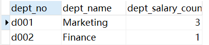
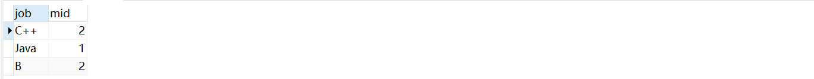
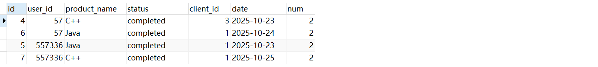

# Sql Practice

## SQL Blot

### Lesson 5 : Review Simple SELECT Queries

| City                | Country       | Population | Latitude  | Longitude   |
| ------------------- | ------------- | ---------- | --------- | ----------- |
| Guadalajara         | Mexico        | 1500800    | 20.659699 | -103.349609 |
| Toronto             | Canada        | 2795060    | 43.653226 | -79.383184  |
| Houston             | United States | 2195914    | 29.760427 | -95.369803  |
| New York            | United States | 8405837    | 40.712784 | -74.005941  |
| Philadelphia        | United States | 1553165    | 39.952584 | -75.165222  |
| Havana              | Cuba          | 2106146    | 23.05407  | -82.345189  |
| Mexico City         | Mexico        | 8555500    | 19.432608 | -99.133208  |
| Phoenix             | United States | 1513367    | 33.448377 | -112.074037 |
| Los Angeles         | United States | 3884307    | 34.052234 | -118.243685 |
| Ecatepec de Morelos | Mexico        | 1742000    | 19.601841 | -99.050674  |
| Montreal            | Canada        | 1717767    | 45.501689 | -73.567256  |
| Chicago             | United States | 2718782    | 41.878114 | -87.629798  |

> List all the cities west of Chicago, ordered from west to east 

```sql
SELECT city
FROM north_american_cities
WHERE longitude < -87.629798
ORDER BY longitude;
```

完成该题目，需要你有点地理学常识！


### Lesson 8 : A short note on NULLs

Table: Buildings (Read-Only)

| Building_name | Capacity |
| :------------ | -------- |
| 1e            | 24       |
| 1w            | 32       |
| 2e            | 16       |
| 2w            | 20       |

| Role     | Name       | Building | Years_employed |
| -------- | ---------- | -------- | -------------- |
| Engineer | Becky A.   | 1e       | 4              |
| Engineer | Dan B.     | 1e       | 2              |
| Engineer | Sharon F.  | 1e       | 6              |
| Engineer | Dan M.     | 1e       | 4              |
| Engineer | Malcom S.  | 1e       | 1              |
| Artist   | Tylar S.   | 2w       | 2              |
| Artist   | Sherman D. | 2w       | 8              |
| Artist   | Jakob J.   | 2w       | 6              |
| Artist   | Lillia A.  | 2w       | 7              |
| Artist   | Brandon J. | 2w       | 7              |
| Manager  | Scott K.   | 1e       | 9              |
| Manager  | Shirlee M. | 1e       | 3              |
| Manager  | Daria O.   | 2w       | 6              |
| Engineer | Yancy I.   |          | 0              |
| Artist   | Oliver P.  |          | 0              |

> Find the names of the buildings that hold no employees 

```sql
SELECT distinct b.building_name
FROM buildings b
left join employees e
on e.building = b.building_name
where e.building is null;
```


### Lesson 9 : Queries with expressions

Table: Movies (Read-Only)

| Id   | Title               | Director       | Year | Length_minutes |
| ---- | ------------------- | -------------- | ---- | -------------- |
| 1    | Toy Story           | John Lasseter  | 1995 | 81             |
| 2    | A Bug's Life        | John Lasseter  | 1998 | 95             |
| 3    | Toy Story 2         | John Lasseter  | 1999 | 93             |
| 4    | Monsters, Inc.      | Pete Docter    | 2001 | 92             |
| 5    | Finding Nemo        | Andrew Stanton | 2003 | 107            |
| 6    | The Incredibles     | Brad Bird      | 2004 | 116            |
| 7    | Cars                | John Lasseter  | 2006 | 117            |
| 8    | Ratatouille         | Brad Bird      | 2007 | 115            |
| 9    | WALL-E              | Andrew Stanton | 2008 | 104            |
| 10   | Up                  | Pete Docter    | 2009 | 101            |
| 11   | Toy Story 3         | Lee Unkrich    | 2010 | 103            |
| 12   | Cars 2              | John Lasseter  | 2011 | 120            |
| 13   | Brave               | Brenda Chapman | 2012 | 102            |
| 14   | Monsters University | Dan Scanlon    | 2013 | 110            |

Table: Boxoffice (Read-Only)

| Movie_id | Rating | Domestic_sales | International_sales |
| -------- | ------ | -------------- | ------------------- |
| 5        | 8.2    | 380843261      | 555900000           |
| 14       | 7.4    | 268492764      | 475066843           |
| 8        | 8      | 206445654      | 417277164           |
| 12       | 6.4    | 191452396      | 368400000           |
| 3        | 7.9    | 245852179      | 239163000           |
| 6        | 8      | 261441092      | 370001000           |
| 9        | 8.5    | 223808164      | 297503696           |
| 11       | 8.4    | 415004880      | 648167031           |
| 1        | 8.3    | 191796233      | 170162503           |
| 7        | 7.2    | 244082982      | 217900167           |
| 10       | 8.3    | 293004164      | 438338580           |
| 4        | 8.1    | 289916256      | 272900000           |
| 2        | 7.2    | 162798565      | 200600000           |
| 13       | 7.2    | 237283207      | 301700000           |

> List all movies and their ratings **in percent** 

```sql
SELECT m.title, b.rating*10 as rating_percent
FROM movies m
inner join boxoffice b
on m.id = b.movie_id;
```

这里求百分比无须加百分号，不然你得改字段为varchar类型！


## 窗口函数

> 什么是窗口函数？

窗口函数，也叫OLAP函数（Online Anallytical Processing，联机分析处理），可以对数据库数据进行实时分析处理。


> 语法

```txt
<窗口函数> over (partition by <用于分组的列名> order by <用于排序的列名>)
```

<窗口函数>的位置，可以放以下两种函数：

1） 专用窗口函数，包括后面要讲到的rank, dense_rank, row_number等专用窗口函数。

2） 聚合函数，如sum. avg, count, max, min等


> 准备一张学生表student


> 练习题目

1、查询每个班级内按成绩降序排序的详细信息，成绩相同的排名相同，比如95、95、90则排名为1、1、3，排名不连续

```sql
select *,
rank() over(partition by 班级 order by 成绩 desc) as 排名
from student
```


2、查询每个班级内按成绩降序排序的详细信息，成绩相同的排名相同，比如95、95、90则排名为1、1、2，排名连续

```sql
select *,
dense_rank() over(partition by 班级 order by 成绩 desc) as 排名
from student
```


3、查询每个班级内按成绩降序排序的详细信息，不管成绩是否相同，比如95、95、90则排名为1、2、3，排名连续

```sql
select *,
row_number() over(partition by 班级 order by 成绩 desc) as 排名
from student
```


4、查询每个班级分数最高的学生信息

正如步骤1，我们可以得到每个班级的成绩排名，然后筛选出排名为1的学生即可

```sql
select tmp.*
from 
(
	select *,
	rank() over(partition by 班级 order by 成绩 desc) as ranking
	from student
) tmp
where tmp.ranking = 1
```

我们也可以使用子查询，先查出每个班级的最大分数，然后根据班级和成绩这两项就可以确定符合条件的学生信息

```sql
select s.*
from student s
where (s.`班级`, s.`成绩`) in
(
	select 班级,max(成绩)
	from student
	group by 班级
) 
```


5、查询各个班级成绩前两名的记录

这个思路和上面的类似，可以利用rank()或row_number()得到各个班级的成绩排名，然后筛选出排名小于等于2的即可

```sql
select tmp.*
from 
(
	select *,
	rank() over(partition by 班级 order by 成绩 desc) as ranking
	from student
) tmp
where tmp.ranking <= 2
```


6、按成绩升序排名，记录当前累计的成绩

意思就是在原表的基础上，再添加一列sum列，以上面的表为例，sum的第一行是95，第二行是190，以此类推

```sql
select *,
sum(成绩) over(order by 学号 asc) as 累计总分,
avg(成绩) over(order by 学号 asc) as 累计平均值,
max(成绩) over(order by 学号 asc) as 累计最高分,
min(成绩) over(order by 学号 asc) as 累计最低分,
count(成绩) over(order by 学号 asc) as 累计人数,
avg(成绩) over(order by 学号 asc rows 2 preceding) as 和前两位的平均成绩
from student
```


> 窗口函数的应用场景

**1）经典排名问题**

在每个组内进行排名

**2）经典topN问题**

找出每个组的前N名

**3）经典组内比较问题**

找出组内比该组平均值大/小的数据

**4. 使用窗口函数的注意事项**

1）窗口函数原则上只能写在select子句中

2）使用窗口函数作为子查询后，要记得给子查询命名别名

**5. 如何选择子查询类型**


## 牛客网

> **SQL1** **查找最晚入职员工的所有信息**

```sql
-- 使用limit
select * 
from employees 
order by hire_date desc
limit 1;
-- 使用子查询
select * 
from employees 
where hire_date=
    (select max(hire_date) 
     from employees
    );
```


> **SQL2** **查找入职员工时间排名倒数第三的员工所有信息**

```sql
-- 使用limit
select *
from employees
order by hire_date desc
limit 2,1;
```


> **SQL3** **查找当前薪水详情以及部门编号dept_no**

```sql
-- 内联/左连均可
select s.*,d.dept_no
from dept_manager d
inner join salaries s
on d.emp_no = s.emp_no;
```


>  **SQL4 查找所有已经分配部门的员工的last_name和first_name以及dept_no**

```sql
-- 内联
select e.last_name, e.first_name, d.dept_no
from employees e
inner join dept_emp d
on e.emp_no = d.emp_no;

-- 左连
select e.last_name, e.first_name, d.dept_no
from employees e
left join dept_emp d
on e.emp_no = d.emp_no
where dept_no is not null;
```


> **SQL 5 查找所有员工的last_name和first_name以及对应部门编号dept_no**

```sql
-- 左连
select e.last_name, e.first_name, d.dept_no
from employees e
left join dept_emp d
on e.emp_no = d.emp_no;
```


> **SLQ 7 查找薪水记录超过15次的员工号emp_no以及其对应的记录次数t**

```sql
-- having添加条件
select emp_no,count(salary) t
from salaries
group by emp_no
having t > 15;
```


> **SQL8** **找出所有员工当前薪水salary情况**

```sql
select distinct salary
from salaries
order by salary desc;
```


> **SQL10** **获取所有非manager的员工emp_no**

```sql
-- NOt IN
select e.emp_no
from employees e
where e.emp_no
not in (
    select d.emp_no
    from dept_manager d
);
-- 左连接
select e.emp_no
from employees e
left join dept_manager d
on e.emp_no = d.emp_no
where d.emp_no is null;
```


> **SQL11** **获取所有员工当前的manager**

```sql
-- inner与left均可
select e.emp_no, d.emp_no as manager
from dept_emp e
inner join dept_manager d
on e.dept_no = d.dept_no
where e.emp_no != d.emp_no;
```

这里题目将之前的员工表`employees`换成了`dept_emp`，很坑！！！


> **SQL12** **获取每个部门中当前员工薪水最高的相关信息**

 ```sql
 select uni.dept_no, uni.emp_no, max_salary.salary
 from
 	-- 部门编号,员工编号,当前薪水
     (select d.dept_no, s.emp_no, s.salary
      from dept_emp d join salaries s 
      on d.emp_no = s.emp_no 
      and d.to_date = '9999-01-01'
      and s.to_date = '9999-01-01'   
     ) as uni,
     -- 部门编号,当前最高薪水
     (select d.dept_no, max(s.salary) as salary
      from dept_emp d join salaries s 
      on d.emp_no = s.emp_no
      and d.to_date = '9999-01-01'
      and s.to_date = '9999-01-01'   
      group by d.dept_no
     ) as max_salary
 where uni.salary = max_salary.salary
 and uni.dept_no = max_salary.dept_no
 order by uni.dept_no;
 ```

有几点需要注意：
1、使用group by时，select中不能有非聚合字段，只能有聚合函数、常量或者是group by子句后的变量

2、该题目的本质是如何将给你的两个表进行组合成另外两张简单表，先查出所有员工的薪水，然后找到最高薪水的员工


>  **SQL15 查找employees表emp_no与last_name的员工信息**

```sql
-- 普通查询
select *
from employees
where emp_no % 2 = 1
and last_name != "Mary"
order by hire_date desc;
```


> **SQL16 统计出当前各个title类型对应的员工当前薪水对应的平均工资**

```sql
select t.title, avg(s.salary)
from titles t
inner join salaries s
on t.emp_no = s.emp_no
group by t.title;
```


>  **SQL17 获取当前薪水第二多的员工的emp_no以及其对应的薪水salary**

```sql
-- 薪水第二多的人可能有多个
select emp_no, salary 
from salaries
where to_date = '9999-01-01' 
and salary = 
    (select distinct salary 
     from salaries 
     order by salary 
     desc limit 1,1);
```


>  **SQL18 获取当前薪水第二多的员工的emp_no以及其对应的薪水salary**

```sql
-- 解法一：查询小于最大工资的最大工资
select e.emp_no, s.salary, e.last_name, e.first_name
from employees e
inner join salaries s
on e.emp_no = s.emp_no
where s.salary = (
    select max(salary)
    from salaries
    where salary < (
        select max(salary)
        from salaries
    )
)

-- 第二种 通用型可以求任意第几高，并且可以求多个相同工资
select e.emp_no,s.salary,e.last_name,e.first_name
from
employees e
join 
salaries s on e.emp_no=s.emp_no 
and  s.to_date='9999-01-01'
and s.salary = 
(
     select s1.salary
     from 
     salaries s1
     join
     salaries s2 on s1.salary<=s2.salary 
     and s1.to_date='9999-01-01' and s2.to_date='9999-01-01'
     group by s1.salary
     having count(distinct s2.salary)=2
 )
```

目前先掌握第一种吧，第二种还理解不了！


>  **SQL19 查找所有员工的last_name和first_name以及对应的dept_name**

```sql
-- 子查询
select e.last_name, e.first_name, tmp.dept_name
from employees e
left join (
    select e.emp_no, d.dept_no, d.dept_name
    from dept_emp e
    join departments d
    on d.dept_no = e.dept_no
) tmp
on e.emp_no = tmp.emp_no;

-- 两次left
select e.last_name, e.first_name, d.dept_name
from employees e 
left join dept_emp de on e.emp_no = de.emp_no
left join departments d on de.dept_no = d.dept_no;
```

sql本身的思路最重要！动手前想明白如何去实现，下面记录上面两种方法的思路：

子查询思路：现在有三张表，我将其中两张表通过子查询组合成一张需要的表，这样三表查询就变成了简单的两表查询。

两次left思路：本质也是简化，第一次左连接获得了一张表，第二次左外连接是在第一张表的基础上去找我们想要的。


> **SQL21  查找在职员工自入职以来的薪水涨幅情况**

```sql
select e.emp_no, (s.salary-s2.salary) as growth
from employees e
inner join salaries s
on e.emp_no = s.emp_no
and s.to_date = '9999-01-01'
-- 在此基础上，查询该员工入职时的工资
inner join salaries s2
on e.emp_no = s2.emp_no
and e.hire_date = s2.from_date
order by growth asc;
```

做到这里，对于复杂一点的问题，有两种解决方案，一种是在已知几张表，利用子查询对它们进行组合，组合成方便查询的简单表，特点是容易理解，但代码比较多；还有一种是利用连接查询，在查出一张表的同时，该表继续与其他表连接进行查询，特点是代码简洁，但不易理解。这两种方法，本质上还是一种，都是化繁为简！


> **SQL22** **统计各个部门的工资记录数**

```sql
SELECT d.dept_no, dd.dept_name, sum(tmp.emp_count) dept_salary_count
from dept_emp d
inner join
(
	SELECT emp_no, count(salary) emp_count
	from salaries
	group by emp_no
) tmp
on d.emp_no = tmp.emp_no
inner join departments dd
on d.dept_no = dd.dept_no
group by d.dept_no
order by d.dept_no asc;
```

我的解题思路，比较容易理解，相信可以优化的，现在暂不考虑

先查询每个员工在薪资表salaries中出现的次数

```sql
SELECT emp_no, count(salary) emp_count
from salaries
group by emp_no
```

 

然后部门-员工表连接上面的这张表，查询每个部门中所有员工的工资记录数

```sql
SELECT d.dept_no, sum(tmp.emp_count) dept_salary_count
from dept_emp d
inner join
(
	SELECT emp_no, count(salary) emp_count
	from salaries
	group by emp_no
) tmp
on d.emp_no = tmp.emp_no
group by d.dept_no
order by d.dept_no asc;
```

 

最后把部门名称加入到字段，就相当于把上面查出来的表与部门表相连接

```sql
SELECT d.dept_no, dd.dept_name, sum(tmp.emp_count) dept_salary_count
from dept_emp d
inner join
(
	SELECT emp_no, count(salary) emp_count
	from salaries
	group by emp_no
) tmp
on d.emp_no = tmp.emp_no
inner join departments dd
on d.dept_no = dd.dept_no
group by d.dept_no
order by d.dept_no asc;
```

 

通过这道题可以发现，任何复杂的任务都可以被拆分成各种简单的业务


> **SQL23 对所有员工的薪水按照salary降序进行1-N的排名**

mysql8.0以下的版本使用用户变量

```sql
select emp_no,salary,
	case 
			 -- 当前工资与之前的工资匹配上，排名不变
	     when @temp_salary=salary then @rank 
			 -- 否则更新原有工资，当前工资排名+1
			 when @temp_salary:=salary then @rank:=@rank+1 
	END `rank` 
from salaries s,
-- 创建一张表，里面有两个用户变量
(select @rank:=0,@temp_salary:=NULL) q 
ORDER BY salary desc
```

mysql8.0及以上支持rank函数

```sql
SELECT emp_no, salary,
DENSE_RANK() OVER(ORDER BY salary DESC) 
FROM salaries;
```


> **SQL24  获取所有非manager员工当前的薪水情况**

```sql
SELECT de.dept_no, e.emp_no, s.salary 
FROM employees e 
INNER JOIN dept_emp de 
ON e.emp_no = de.emp_no 
INNER JOIN salaries s 
ON e.emp_no = s.emp_no 
WHERE de.to_date='9999-01-01' AND s.to_date='9999-01-01' 
AND e.emp_no NOT IN(
    SELECT emp_no 
    FROM dept_manager 
    WHERE to_date='9999-01-01' 
);
```

思路是一样的，问题是为什么这里不能用不等于，而是用NOT IN，我用不等于测试的时候也是正常的

我知道了使用<>时，两张表会一行一行的进行比较，假设有个员工编号为10001，而领导编号为10001和10002，那么10001与10002比较时就会满足条件，这说明10001不是领导，而10001是领导，这就矛盾了，正确的做法是使用not in


> **SQL25  获取员工其当前的薪水比其manager当前薪水还高的相关信息**

```sql
SELECT sem.emp_no emp_no, sdm.emp_no manager_no, sem.salary emp_salary, sdm.salary manager_salary
FROM 
(    -- 查询所有员工的工资
	 SELECT s.salary, s.emp_no, de.dept_no 
     FROM salaries s 
     INNER JOIN dept_emp de 
     ON s.emp_no = de.emp_no AND s.to_date = '9999-01-01'
) AS sem, 
(
    -- 查询所有领导的工资
		SELECT s.salary, s.emp_no, dm.dept_no 
		FROM salaries s 
		INNER JOIN dept_manager dm 
    ON s.emp_no = dm.emp_no AND s.to_date = '9999-01-01' 
) AS sdm
WHERE sem.dept_no = sdm.dept_no AND sem.salary > sdm.salary
```


> **SQL 26  汇总各个部门当前员工的title类型的分配数目**

```sql
SELECT d1.dept_no,d1.dept_name,t.title,COUNT(*) AS count
FROM departments d1
INNER JOIN dept_emp d2
ON d1.dept_no=d2.dept_no
INNER JOIN titles t
ON d2.emp_no=t.emp_no
WHERE d2.to_date='9999-01-01'
AND t.to_date='9999-01-01'
GROUP BY d1.dept_no,t.title
order by d1.dept_no
```

什么神仙题目？？？

这里理解下先根据部门分组会有d001和d002两个部门，也就是两条数据，在这个基础上我在根据title分组，这是d001又会多出两条数据，因此总共有三条数据，那么统计最终分组后的数量即可，比如员工1有两个相同的title，那么分组后那就是2，这个题重点考察的是分组！


> **SQL28  查找描述信息中包含robot的电影对应的分类名称以及电影数目，而且还需要该分类对应电影数量>=5部**

**这个题目具体的需求是什么？**

看一下题目的描述：

查找描述信息(film.description)中包含robot的电影对应的分类名称(category.name)以及电影数目(count(film.film_id))，而且还需要该分类包含电影总数量(count(film_category.category_id))>=5部

疑点：

电影数目，我认为指的是描述信息(film.description)中包含robot的电影对应的分类下的电影数目，因为如果是符合条件的总的电影数目，那么是1*1的，由矛盾关系法，这是不成立的

**如何解决这个问题？**

1、查找描述信息(film.description)中包含robot的电影对应的分类名称(category.name)

```sql
select f.film_id, f.title, f.description, fc.category_id, c.`name`
from film f
inner join film_category fc
on f.film_id = fc.film_id
inner join category c
on fc.category_id = c.category_id
where f.description like "%robot%"
```


查出一条数据

2、在上面的基础上，根据分类id分组，添加电影数量字段

```sql
select f.film_id, f.title, f.description, fc.category_id, c.`name`, count(*) count
from film f
inner join film_category fc
on f.film_id = fc.film_id
inner join category c
on fc.category_id = c.category_id
where f.description like "%robot%"
group by fc.category_id
```


本来只有一条数据，只能说牛客网平台给的例子不好

3、查询电影数量>=5的分类id和名称

```sql
select cc.category_id, cc.`name`, count(*) count
from category cc
inner join film_category fcc
on cc.category_id = fcc.category_id
inner join film ff
on ff.film_id = fcc.film_id
group by cc.category_id
having count >= 5;
```


步骤2和步骤3区别就是多了一个where条件，问题就在这里，如何将不带where条件查询出来的结果放到带有where条件的结果当中？

下面是我的思路

```sql
select c.`name`, count(*) count
from film f
inner join film_category fc
on f.film_id = fc.film_id
inner join category c
on fc.category_id = c.category_id
where f.description like "%robot%"
group by fc.category_id
having fc.category_id in 
(
	select cc.category_id
	from category cc
	inner join film_category fcc
	on cc.category_id = fcc.category_id
	inner join film ff
	on ff.film_id = fcc.film_id
	group by cc.category_id
	having count(*) >= 5
);
```


平台并没有具体指明要查询的字段，存在需求不明确！

取消掉电影描述后，成功通过！

4、查看别人的题解发现，步骤3部分是可以优化的，统计每个分类下的电影数量，我们无须查出分类名称，步骤3是为了能够更好的理解，从而选择的全部查询

```sql
select cc.category_id
from category cc
inner join film_category fcc
on cc.category_id = fcc.category_id
group by cc.category_id
having count(*) >= 5
```

5、最终代码

```sql
select c.`name`, count(*) count
from film f
inner join film_category fc
on f.film_id = fc.film_id
inner join category c
on fc.category_id = c.category_id
where f.description like "%robot%"
group by fc.category_id
having fc.category_id in 
(
	select cc.category_id
	from category cc
	inner join film_category fcc
	on cc.category_id = fcc.category_id
	group by cc.category_id
	having count(*) >= 5
);
```


>  **SQL29 使用join查询方式找出没有分类的电影id以及名称**

这个题目明确要求使用join查询，因此我们先考虑join的情况

1、查询film表，查出所有的电影的id、title

```sql
select f.film_id, f.title
from film f
```

2、左外连接中间表film_category，查询当前电影对应的分类为null的

```sql
select f.film_id, f.title
from film f
left join film_category fc
on f.film_id = fc.film_id
where fc.film_id is null
```

如果不考虑join，我们可以使用not in 解决

```sql
select f.film_id, f.title
from film f
where f.film_id not in 
(
	select film_id
	from film_category
)
```


> **SQL30  使用子查询的方式找出属于Action分类的所有电影对应的title,description**

这个感觉做法有很多，写给出想出来的一种

```sql
select f.title, f.description
from film f
inner join film_category fc
on f.film_id = fc.film_id
where fc.category_id = (
	select category_id
	from category
	where name = "Action"
)
```


> **SQL32  将employees表的所有员工的last_name和first_name拼接起来作为Name**

这道题考察的是拼接函数

```sql
select concat(last_name,' ',first_name) as `name`
from employees
```


> **SQL33** **创建一个actor表，包含如下列信息**

创建一个actor表，包含如下列信息

| 列表        | 类型        | 是否为NULL | 含义   |
| :---------- | :---------- | :--------- | :----- |
| actor_id    | smallint(5) | not null   | 主键id |
| first_name  | varchar(45) | not null   | 名字   |
| last_name   | varchar(45) | not null   | 姓氏   |
| last_update | date        | not null   | 日期   |

```sql
create table if not exists actor (
    actor_id smallint(5) not null primary key,
    first_name varchar(45) not null,
    last_name varchar(45) not null,
    last_update date not null
);
```

注意表名的位置！


> **SQL34** **批量插入数据**

```sql
insert into actor
(`actor_id`,`first_name`,`last_name`,`last_update`)
values
(1,"PENELOPE","GUINESS","2006-02-15 12:34:33"),
(2,"NICK","WAHLBERG","2006-02-15 12:34:33")
```

通过一个insert进行批量插入


> **SQL35** **批量插入数据，不使用replace操作**

这道题目的要求是插入数据，如果对应的id已有数据，那就忽略此次插入

```sql
insert IGNORE into actor 
values(3,'ED','CHASE','2006-02-15 12:34:33');
```


> **SQL36** **创建一个actor_name表**

该题目考查表的复制

```sql
create table actor_name
select first_name,last_name
from actor;
```


> **SQL37 对first_name创建唯一索引uniq_idx_firstname**

这道题考察创建表的索引

```sql
CREATE UNIQUE INDEX uniq_idx_firstname 
ON actor(first_name);
CREATE INDEX idx_lastname 
ON actor(last_name);
```


> **SQL38  针对actor表创建视图actor_name_view**

```sql
create view actor_name_view
as
select first_name first_name_v, last_name last_name_v
from actor
```


> **SQL39  针对上面的salaries表emp_no字段创建索引idx_emp_no**

```sql
select * 
from salaries FORCE INDEX (idx_emp_no) 
where emp_no = 10005;
```


> **SQL40  在last_update后面新增加一列名字为create_date**

```sql
alter table actor 
add column create_date datetime not null 
default '2020-10-01 00:00:00' after last_update
```


> **SQL41** **构造一个触发器audit_log**

```sql
create trigger audit_log 
after insert on employees_test 
for each row
begin
insert into audit(emp_no,name) values(NEW.ID,NEW.NAME); 
end;
```


> **SQL42 删除emp_no重复的记录，只保留最小的id对应的记录**

```sql
-- 在mysql环境中不能先查询在修改同一张表，需要一张中间表
delete from titles_test
where id not in
(
  select hd.min_id from (
	  select min(id) min_id
	  from titles_test
		group by emp_no
	) hd
)
```


> **SQL43** **将所有to_date为9999-01-01的全部更新为NULL**

```sql
update titles_test 
set to_date = null,
    from_date = '2001-01-01'
where to_date = '9999-01-01'
```


> **SQL44  将id=5以及emp_no=10001的行数据替换成id=5以及emp_no=10005**

```sql
-- 使用update+replace
UPDATE titles_test 
SET 
    emp_no = REPLACE(emp_no,
        '10001',
        '10005')
WHERE
    id = 5;
    
-- 只使用replace，需要填充所有字段
replace into titles_test 
values(5, 10005, 'Senior Engineer', '1986-06-26', '9999-01-01');
```


> **SQL45** **将titles_test表名修改为titles_2017**

```sql
rename table titles_test to titles_2017
```


> **SQL46 在audit表上创建外键约束，其emp_no对应employees_test表的主键id**

```sql
alter table audit add foreign key(emp_no)
references employees_test(id)
```


> **SQL48** **将所有获取奖金的员工当前的薪水增加10%**

```sql
-- 内连接
update salaries s
inner join emp_bonus eb
on s.emp_no = eb.emp_no
and s.to_date = '9999-01-01'
set s.salary = s.salary*1.1

-- 子查询
update salaries
set salary = salary * 1.1
where emp_no in (
    select emp_no from emp_bonus
) and to_date = '9999-01-01'
```


>  **SQL50 将employees表中的所有员工的last_name和first_name通过引号连接起来**

根据题目给的例子，员工表中有两个字段，插入数据的时候也是按着两个字段插入的，但是输出的结果是这个这个字段的拼接，那么这个题目的意思是什么？

我的想法是在完成表的创建和数据插入后，然后**修改表的结构，即将上面两个字段进行合并**，然后后台进行查询。

哦，题目的本意并非修改表结构，而是将待查询的字段拼接起来

```sql
select concat(last_name,"'",first_name)
from employees;
```


> **SQL51** **查找字符串 10,A,B 中逗号,出现的次数cnt**

```sql
select length("10,A,B")-length(replace("10,A,B",",",""))
as cnt;
```

次数 = 原字符串长度 - 无逗号字符串长度


> **SQL52** **获取Employees中的first_name**

```sql
select first_name
from employees
order by right(first_name,2) asc
```

该题目主要考察字符串截取


> **SQL53** **按照dept_no进行汇总**

该题目要求将同一部门的所有emp_no用逗号连接，如何实现呢？之前都是字段与字段之间连接，现在同一个字段间的不同值该如何连接？

答案是使用group_concat函数

```sql
select dept_no, 
group_concat(emp_no separator ',') as employees
from dept_emp
group by dept_no
```


> **SQL54 查找排除当前最大、最小salary之后的员工的平均工资avg_salary**

```sql
select avg(s.salary) avg_salary
from salaries s
where s.to_date = '9999-01-01'
and s.salary not in (
	select max(salary) 
	from salaries
    where to_date = '9999-01-01'
)
and s.salary not in (
	select min(salary) 
	from salaries
    where to_date = '9999-01-01'
)
```

最大或最小工资可能不止一个，因此使用not in


> **SQL55 分页查询employees表，每5行一页，返回第2页的数据**

```sql
select * 
from employees
limit 5,5
```

假设有size页，那么第n页处的索引为：index = (n - 1)*size


> **SQL57 使用含有关键字exists查找未分配具体部门的员工的所有信息**

```sql
-- 你可以这样理解：not exists返回的是不在结果集中的元素
SELECT *
FROM employees
WHERE NOT EXISTS 
(    SELECT emp_no
     FROM dept_emp
     WHERE employees.emp_no = dept_emp.emp_no
);
```

1、什么时候用EXISTS，什么时候用IN？
    主表为employees，从表为dept_emp，在主表和从表都对关联的列emp_no建立索引的前提下：
      当主表比从表大时，IN查询的效率较高；
      当从表比主表大时，EXISTS查询的效率较高；
2、原因如下：
      in是先执行子查询，得到一个结果集，将结果集代入外层谓词条件执行主查询，子查询只需要执行一次
      exists是先从主查询中取得一条数据，再代入到子查询中，执行一次子查询，判断子查询是否能返回结果，主查询有多    少条数据，子查询就要执行多少次


> **SQL59** **获取有奖金的员工相关信息**

本题目考察对case的使用

```sql
select e.emp_no, e.first_name, e.last_name, eb.btype, s.salary,
CASE WHEN eb.btype = 1 THEN s.salary * 0.1
WHEN eb.btype = 2 THEN s.salary * 0.2
ELSE s.salary * 0.3
END bonus
from employees e
join emp_bonus eb
on e.emp_no = eb.emp_no
join salaries s
on e.emp_no = s.emp_no
where s.to_date='9999-01-01'
```


> **SQL60** **统计salary的累计和running_total**

这道题的需求是根据员工编号升序，依次累加工资，第一行的running_total为第一个员工的工资，最后一行的running_total为所有员工的工资

```sql
SELECT emp_no,salary,
SUM(salary) OVER (ORDER BY emp_no) AS running_total
FROM salaries
WHERE to_date = '9999-01-01';
```

考察的是聚合函数+窗口函数有累计的作用！

还有一种解法，一张表分为两张表或者进行自连接

```sql
-- 两张表
select a.emp_no, a.salary, sum(b.salary)
from salaries as a, salaries as b
where b.emp_no <= a.emp_no
and a.to_date = '9999-01-01'
and b.to_date = '9999-01-01'
group by a.emp_no
order by a.emp_no asc
-- 自连接
select a.emp_no, a.salary, sum(b.salary)
from salaries as a
join salaries as b
on b.emp_no <= a.emp_no
and a.to_date = '9999-01-01'
and b.to_date = '9999-01-01'
group by a.emp_no
order by a.emp_no asc
```


> **SQL61** **对于employees表中，给出奇数行的first_name**

**关键：题目是什么意思？**

一开始我的理解：根据first_name升序排序，每个值对应一个排名，题目要求输出奇数行的逆序，于是我直接first_name降序排名，直接查询出所有偶数行，这是我根据题目的所给的例子归纳出的，但这个思路并不能解决其它的情况。

**下面研究下这道题目到底想表达什么意思？**
对于employees表中，输出first_name排名(**按first_name升序排序**)为奇数的first_name

问题出在按`first_name`升序排序上，题目的本意是当前`first_name`与employee表中的所有`first_name`比较后有个排名，这个排名为奇数的话，就输出。

因此，这个题目的描述是不准确的，有了思路之后，容易陷入思维惰性，不容易走出来

```sql
select e1.first_name
from employees e1
where 
(
  select count(*) from employees e2
  where e1.first_name >= e2.first_name
) % 2 = 1
```


> **SQL62** **出现三次以上相同积分的情况**

```sql
select number
from grade
group by number
having count(number) >= 3
```


> **SQL63** **刷题通过的题目排名**

输出通过的题目的排名，通过题目个数相同的，排名相同，此时按照id升序排列

```sql
select id, number, 
DENSE_RANK() OVER(order by number desc) as t_rank 
from passing_number
```


> **SQL64** **找到每个人的任务**

```sql
select p.id, p.name, t.content
from person p
left join task t
on p.id = t.person_id
```


> **SQL65** **异常的邮件概率**

首先分析下这个问题的需求

查询同一天内、所有非黑名单用户发生邮件失败的概率

1、我可以想办法得到一张没有黑名单用户的表格

```sql
select * 
from email e
join user as u1 
on e.send_id=u1.id and u1.is_blacklist=0
join user as u2 
on e.receive_id=u2.id and u2.is_blacklist=0
```


2、接下来要按日期分组，并计算当前日期每一条no_completed的概率，将所有的概率累加起来就是当前日期no_completed的概率，如何实现呢？

当前日期的总邮件数目：这里比较容易count(email.type)

如何获得当前日期每一条no_completed的概率呢？使用case...when

```sql
(case email.type when 'completed' then 0 else 1 end)*1.0 / count(email.type)
```

要获得当前日期邮件未发生成功的概率，只要统记所有的no_completed，然后求概率即可

```sql
sum(case e.type when'completed' then 0 else 1 end)*1.0/count(e.type)
```


> **SQL66** **牛客每个人最近的登录日期(一)**

```sql
select l.user_id, max(l.date) d
from login l
group by l.user_id
order by l.user_id
```


> **SQL67** **牛客每个人最近的登录日期(二)**

```sql
select user.name as u_n, client.name as c_n,
login.date
from login 
join user on login.user_id=user.id
join client on login.client_id=client.id
where (login.user_id,login.date) in
(select user_id,max(date) from login group by login.user_id )
order by user.name;
```

1、先分组查询每个用户最新的登录日期

```sql
select user_id,max(date) from login group by login.user_id
```


2、查找出所有用户的名字，所有的登录设备，所有的登录日期

```sql
select user.name as u_n, client.name as c_n,
login.date
from login 
join user on login.user_id=user.id
join client on login.client_id=client.id
```


3、因为最新日期对应的用户是唯一的，因此通过用户id与最新日期可确定

```sql
select user.name as u_n, client.name as c_n,
login.date
from login 
join user on login.user_id=user.id
join client on login.client_id=client.id
where (login.user_id,login.date) in
(select user_id,max(date) from login group by login.user_id )
order by user.name;
```

这道题需要注意的是使用分组函数，查询的字段必须是聚合函数或者group by后的，不然会随机给你分配一个值！


> **SQL68** **牛客每个人最近的登录日期(三)**

这道题目的需求是求解登录用户的次日成功的留存率

留存率 = 第一天登录的新用户并且第二天也登录的用户数量 / 总用户数量

1、查询总的用户数量

```sql
select count(*) from login
```

2、所谓第一天登录的用户数量，本质上就是总用户数量，在这个基础上需要筛选出第二天也登录的用户数量，这样想：

第一天的用户出现在第二天，那么它就符合，关键是如何判断第一天的用户是否出现在第二天呢？我们可以根据用户的id和登录日期唯一确定，因此就有了如下查询

```sql
select 
round(count(distinct user_id)*1.0/(select count(distinct user_id) from login),3)
from login
where (user_id,date) in (
	select user_id,DATE_ADD(min(date),INTERVAL 1 DAY) 
  from login 
  group by user_id
)
```


> **SQL69** **牛客每个人最近的登录日期(四)**

题目描述：牛客每天有很多人登录，请你统计一下牛客每个日期登录新用户个数

1、假想整张表，根据用户id分为多组，每一组按照日期升序排列，利用窗口函数可以实现

```sql
select date,user_id,row_number() over (PARTITION by user_id order by date) 
as rn from login
```


2、然后根据上面这张表，根据日期分组，统计rn为1时的用户个数

```sql
select date,count(case when rn=1 then user_id end) as new
from(
   select date,user_id,
	 row_number() over (PARTITION by user_id order by date) as rn
   from login
) a
group by date;
```

有个问题是为什么不能用having，比如下面的形式

```sql
select date,count(user_id) as new
from(
   select date,user_id,
	 row_number() over (PARTITION by user_id order by date) as rn
   from login
) a
group by date
having a.rn = 1
```


> **SQL70** **牛客每个人最近的登录日期(五)**

牛客每天有很多人登录，请你统计一下牛客每个日期新用户的次日留存率。

1、查询用户第一次登录的日期

```sql
select user_id,min(date)
from login 
group by user_id
```


2、在1的基础上，查询第一次登录用户的数量

```sql
select sum(case when (user_id,date)in
(
	 select user_id,min(date)
	 from login 
	 group by user_id
)
then 1 else 0 end)
from login
```


3、现在开始思考第一天登录而且第二天也登录的用户数量，所给的表格中有用户第一天登录的，也有用户第二天登录的和其它情况，我们已经找到了第一天登录的用户，如何确定第二天登录的用户呢？

那就是将该表每个用户对应的登录时间移动到前一天，这样这张表里的部分信息就是第一天登录的用户，而**这部分代表了第一天登录且第二天也登录的用户**

查询该表格的前一天

```sql
select user_id,date_add(date,interval -1 day) 
from login
```


如果表格里的信息与第一次登录的用户信息匹配的话，说明这部分信息是第一天登录且第二天登录的

```sql
select (sum(case when (user_id,date) in
(
	 select user_id,date_add(date,interval -1 day) 
	 from login
)  
and (user_id,date) in 
(
	 select user_id,min(date) 
	 from login 
	 group by user_id
)
then 1 else 0 end))
from login
```

输出为 3

4、根据日期分组，求次日的登录成功率

```sql
select date, ifnull(
	     round((sum(case when (user_id,date)in
            (
			   select user_id,date_add(date,interval -1 day) 
               from login
			)  
			and (user_id,date) in 
            (
                select user_id,min(date) 
                from login 
                group by user_id
            )
            then 1 else 0 end))/
         (sum(case when (user_id,date)in
            (
                select user_id,min(date)
                from login 
                group by user_id
			)
            then 1 else 0 end)),3),0)as p
from login
group by date
order by date;
```


> **SQL71** **牛客每个人最近的登录日期(六)**

```sql
select
name as u_n,date,
sum(number) over(partition by user_id order by date) as ps_num
from passing_number p
```


> **SQL72** **考试分数(一)**

```sql
select job, round(avg(score),3) as `avg`
from grade
group by job
order by score desc
```


> **SQL73** **考试分数(二)**

```sql
select g.id, g.job, g.score
from grade g
join (
  select job, avg(score) as `avg`
  from grade
  group by job
) gg
on g.job = gg.job
and g.score > gg.avg
```


> **SQL74** **考试分数(三)**

窗口函数直接起飞~

```sql
select tmp.id, l.`name`, tmp.score
from(
	select *,
	dense_rank() over(partition by language_id order by score desc) as ranking
	from grade
) tmp
join language l
on tmp.language_id = l.id
where tmp.ranking <= 2
order by l.`name`, tmp.score desc, tmp.id
```

之前针对窗口函数做了训练，效果立竿见影！


> **SQL75** **考试分数(四)**

**先看一下题目**

请你写一个sql语句查询各个岗位分数升序排列之后的中位数位置的范围，并且按job升序排序

**分析一下思路**

1、按job分组并按job排名，这个就是group by、order by之类

2、关键是如何确定中位数！假设C++岗位有3个，其中位数为2，那么向上取整[3/2]为2，[(3+1)/2]也为2；现在假设C++岗位有4个，用我们上面的规则得到中位数为：2、3，这正是我们想要的！

**round()满足四舍五入，可以使用它来实现**！

```sql
select job, round(count(job)/2) start, 
round((count(job)+1)/2) end
from grade
group by job
order by job
```


> **SQL76** **考试分数(五)**

**先看一下题目**

请你写一个sql语句查询各个岗位分数的中位数位置上的所有grade信息，并且按id升序排序

**分析思路**

这个题有那么点歧义，分数为中位数的岗位排名是rank()、dense_rank()还是row_number()，牛客网的测试用例没有介绍，需要挨个试一下，现在假设为dense_rank()，以dense_rank()进行分析

查询各个岗位的分数排名，然后查询每个岗位对应的分数中位数，然后通过`in`选出分数为中位数的

1、查询每个岗位的分数排名，按分数升序排序

```sql
select *,
dense_rank() over(partition by job order by score) as t_rank
from grade
```


2、查询每个岗位对应的分数中位数，这里和74题不一样，我想查出如下形式的表格，但还不清楚怎么写？

| job  | mid  |
| ---- | ---- |
| C++  | 2    |
| Java | 1    |
| Java | 2    |
| B    | 2    |

我想了一个解决办法，但是影响效率，对于有两个中位数的放到两个表格中

```sql
-- 表格1
select job, round(count(job) / 2) as mid
from grade
group by job
-- 表格2
select job, round((count(job)+1) / 2) as mid
from grade
group by job
```




这样我们拿步骤1中的job与t_rank去匹配上面的两张表格，只要在它们当中，就输出它的详细信息！

```sql
select tmp.*
from (
	select *,
	dense_rank() over(partition by job order by score desc) as t_rank
	from grade
) tmp
where (tmp.job, tmp.t_rank) in
(
	select job, round(count(job) / 2) as mid
	from grade
	group by job
) or
(tmp.job, tmp.t_rank) in
(
	select job, round((count(job)+1) / 2) as mid
	from grade
	group by job
)
order by id
```


在本地测试结果是正确的，但是到了牛客网的平台，就不是这个结果，怎么回事？

我傻了，我在splite环境里运行mysql代码。


> **SQL77** **牛客的课程订单分析(一)**

```sql
select *
from order_info
where date > '2025-10-15'
and `status` = 'completed'
and product_name in
('Java','C++','Python')
order by id
```


> **SQL78** **牛客的课程订单分析(二)**

```sql
-- 查询2025-10-15日之后，成功下单两次及两次以上的用户id，其中
-- 商品为java/python/c++，并升序排序
select user_id
from order_info
where date > '2025-10-15'
and product_name in ('Java','C++','Python')
and `status` = 'completed'
group by user_id
having count(`status`) >= 2
order by user_id
```


> **SQL79** **牛客的课程订单分析(三)**

还好我踩过分组函数的坑~

```sql
select oi.*
from order_info oi
join 
(
	select user_id
	from order_info
	where date > '2025-10-15'
	and product_name in ('Java','C++','Python')
	and `status` = 'completed'
	group by user_id
	having count(`status`) >= 2
) tmp
on tmp.user_id = oi.user_id
where date > '2025-10-15'
and product_name in ('Java','C++','Python')
and `status` = 'completed'
order by oi.id
```


还有窗口函数的解法，窗口函数不会像group by一样减少行，因此可以先利用窗口函数筛选出符合条件的用户

```sql
select *, count(*) over(partition by user_id) as num
from order_info
where product_name in ('C++','Java','Python')
and status='completed'
and date >'2025-10-15'
```



我们想要的信息都在上面的这张表中，取出来即可

```sql
select t.id,t.user_id,t.product_name,t.status,t.client_id,t.date
from
(
	select *, count(*) over(partition by user_id) as num
	from order_info
	where product_name in ('C++','Java','Python')
	and status='completed'
	and date >'2025-10-15'
)t
where t.num>=2
order by t.id
```


> **SQL80** **牛客的课程订单分析(四)**

这道题考察分组函数的基本功，灵光一现就做出来了

```sql
select user_id, min(date) first_buy_date, count(`status`) cnt
from order_info
where `status` = 'completed'
and date > '2025-10-15'
and product_name in ('C++','Java','Python')
group by user_id
having cnt > 1
order by user_id
```


> **SQL81** **牛客的课程订单分析(五)**

这道题是在上面的基础上再增加一个字段，字段为用户第二次的购买日期

思路就是在80的题基础上，查询满足条件用户第二次购买的日期，将这两张表连接起来即可，这个思想来源于前面求薪水第二高的员工信息

1、查询用户第二次成功下单的日期信息

```sql
select user_id, min(date) second_buy_date
from order_info
where date > 
(	
    select min(date) 
    from order_info
    where date > '2025-10-15'
)
and `status` = 'completed'
group by user_id
order by user_id
```


2、将80题的表与上表连接起来

```sql
select oi.user_id, min(oi.date) first_buy_date, 
tmp.second_buy_date, count(oi.`status`) cnt
from order_info oi
join 
(
	select user_id, min(date) second_buy_date
	from order_info
	where date > 
	(	
		select min(date) 
		from order_info
		where date > '2025-10-15'
	)
	and `status` = 'completed'
	group by user_id
	order by user_id
) tmp
on oi.user_id = tmp.user_id
where oi.`status` = 'completed'
and oi.date > '2025-10-15'
and oi.product_name in ('C++','Java','Python')
group by oi.user_id
having cnt > 1
order by oi.user_id
```


> **SQL82** **牛客的课程订单分析(六)**

1、查询2025-10-15之后用户成功下单的订单信息

```sql
select *, count(*) over(partition by user_id) as num
from order_info
where product_name in ('C++','Java','Python')
and status='completed'
and date >'2025-10-15'
```

2、左外连接客户端表，打印想要的信息即可

```sql
select tmp.id, tmp.is_group_buy, c.`name` client_name
from
(
	select *, count(*) over(partition by user_id) as num
	from order_info
	where product_name in ('C++','Java','Python')
	and status='completed'
	and date >'2025-10-15'
)tmp
left join client c
on tmp.client_id = c.id
where tmp.num > 1
order by tmp.id
```


> **SQL83** **牛客的课程订单分析(七)**

1、查询2025-10-15之后用户成功下单的订单信息

```sql
select *, count(*) over(partition by user_id) as num
from order_info
where product_name in ('C++','Java','Python')
and status='completed'
and date >'2025-10-15'
```

2、使用case语句实现

```sql
select (
    case
		when tmp.is_group_buy = 'Yes' then 'GroupBuy'
		else c.name
    end
) as source, count(*) cnt
from 
(
	select *, count(*) over(partition by user_id) as num
	from order_info
	where product_name in ('C++','Java','Python')
	and status='completed'
	and date >'2025-10-15'
) tmp
left join client c
on c.id = tmp.client_id
where tmp.num > 1
group by tmp.client_id
order by source
```


> **SQL84** **实习广场投递简历分析(一)**

```sql
select job, sum(num) cnt
from resume_info
where year(date)='2025'
group by job
order by cnt desc
```


> **SQL85** **实习广场投递简历分析(二)**

这里我们直接截取date的前7个字符，作为年月

```sql
select job, left(date,7) mon, sum(num) cnt
from resume_info
where year(date)=2025
group by job,mon
order by mon desc,cnt desc
```


> **SQL86** **实习广场投递简历分析(三)**

1、查询2025年每个岗位、每个月收到的简历数量

```sql
select job, left(date,7) first_year_mon, sum(num) first_year_cnt
from resume_info
where year(date)=2025
group by job,first_year_mon
```


2、查询2026年每个岗位、每个月收到的简历数量

```sql
select job, left(date,7) second_year_mon, sum(num) second_year_cnt
from resume_info
where year(date)=2026
group by job,second_year_mon
```


3、根据job和月份，连接两张表格

```sql
select t1.job, t1.first_year_mon, t1.first_year_cnt,
t2.second_year_mon, t2.second_year_cnt
from
(
	select job, left(date,7) first_year_mon, sum(num) first_year_cnt
	from resume_info
	where year(date)=2025
	group by job,first_year_mon
)t1
join
(
	select job, left(date,7) second_year_mon, sum(num) second_year_cnt
	from resume_info
	where year(date)=2026
	group by job,second_year_mon
)t2
on t1.job = t2.job
and right(t1.first_year_mon,2) = right(t2.second_year_mon,2)
order by t1.first_year_mon desc, t1.job desc
```


> **SQL87** **最差是第几名(一)**

```sql
-- 按grade升序，依次累加对应的number
select grade,
sum(number) over(order by grade) as t_rank
from class_grade
```


> **SQL88** **最差是第几名(二)**

这里涉及一个求解中位数的技巧，在grade升序排序情况下，求出累计和，然后在grade逆序排序下，求出累计和，如果正序和逆序情况下，某个grade对应的累计和都大于等于总的累计和/2，那么这个grade就对应中位数

```sql
select grade 
from 
(	
	select grade,(select sum(number) from class_grade) as total,
	sum(number) over(order by grade) a,
	sum(number) over(order by grade desc) b
	from class_grade
) t1
where a >= total/2 and b >=total/2
order by grade;
```


