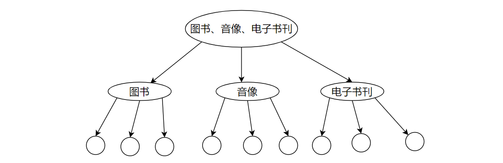
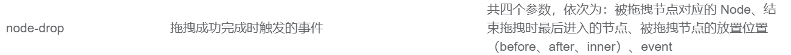

# Vue

## Gulimall

### 节点拖拽

> 实现节点拖拽

描述：


1、图书、音像、电子书刊属于一级分类，其下有两级分类，它可以与其它的一级目录互换位置，但不能拖拽到其它目录

2、电子书刊是二级分类，它可以与音像换位置，但不能到音像目录下

3、电子书是三级分类，它可以与其余的三级分类互换位置

思路：

1、先认识下深度，将三级目录看作一棵多叉树，叶子节点深度为1，如下图所示



2、接下来认识节点属性：allow-drop，它是一个函数类型

```vue
Function(draggingNode, dropNode, type)
```

draggingNode：正在拖拽的节点

dropNode：拖拽节点放置的目标节点

type：选择将拖拽节点放置在目标节点前面或者里面或者后面

3.1、考虑拖拽节点放置在目标节点里面的情况

3.1.1、要求拖拽节点所在深度 + 目标节点所在层级 <= 3，即可完成拖拽

```java
// 计算拖拽节点所在深度
1、遍历当前节点的所有子节点，找到最大层级
2、深度 = 最大层级 - 当前节点层级 + 1
```

3.2、考虑拖拽节点放置在目标节点前面或后面的情况

3.2.1、要求拖拽节点所在深度 + 目标节点父节点层级 <= 3，即可完成拖拽


> 节点拖拽后保存至数据库

需求：在前台拖拽节点后，保存拖拽后的节点信息至数据库，比如我将电子书拖拽到二级分类，等我再次访问时，电子书将显示在二级分类


思路：

**1、认识ElementUI中的事件：node-drop**



**2、考虑拖拽节点放置在目标节点里面的情况**

2.1、修改当前拖拽节点的父节点，你想想拖拽后除根节点外肯定有个父节点吧

2.2、修改当前拖拽节点的最新顺序，比如上图中三级目录中，顺序依次为0、1、2、3，如果电子书移动到电子书刊之前，那么二级目录对应的次序为：0、1

2.3、修改当前拖拽节点及其子节点的层级

2.4、将拖拽后的节点信息保存至数据库


### 商品服务

#### SPU与SKU

> 什么是SPU、SKU

SPU：描述了一组商品的特性，比如iphoneX、MI 8

SKU：是对SPU更为具体的描述，比如Mi 8 + 64G


#### 规格参数

表示SPU描述的商品特性，是固定的


#### 销售属性

表示SKU中不同的具体描述，如64G、金色等，是可变的


#### 总结

> 前端

1、同一个SPU下的不同SKU，它们共享商品介绍与规格参数，而且属性以三级分类的形式组织


2、规格参数中的部分属性可用于检索，比如cpu型号

3、规格参数是基本属性，它们具有自己的分组

4、属性名是确定的，但值是根据具体的商品决定的


> 数据库表

以上图中上市月份为例，对应表格pms_attr


还有一张表pms_attr_group对应属性分组，比如上市月份属于主体分组


这两张表靠一张中间表关联起来

现在有了属性及对应的分组，但是我们还需要知道是哪个商品的属性，因此需要一张表关联商品和对应的属性


### 报错信息

前台含有`pubsub`字样，则开启终端输入如下命令

```vue
npm install --save pubsub-js
```


