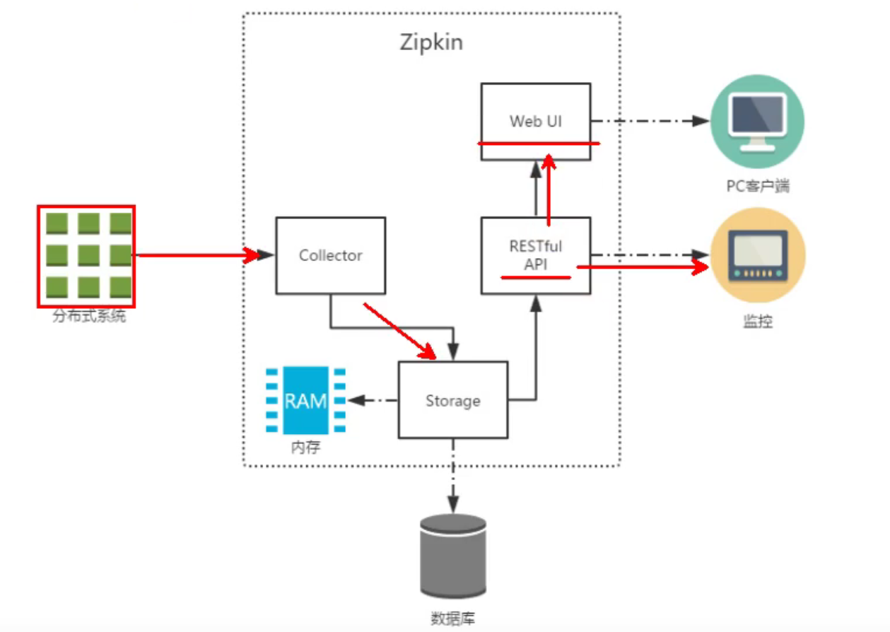
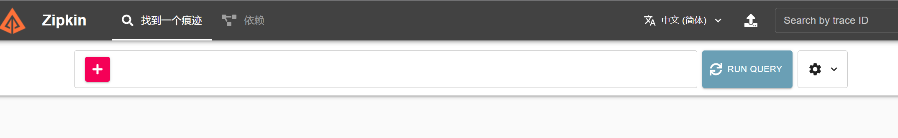

# Zipkin

## 概述

> 什么zipkin？

Zipkin是一款开源的分布式实时数据追踪系统，其主要功能是聚集来自各个异构系统的实时监控数据。


> 为什么要使用zipkin？

随着业务越来越复杂，系统也随之进行各种拆分，特别是随着微服务架构和容器技术的兴起，看似简单的一个应用，后台可能有几十个甚至几百个服务在支撑；一个前端的请求可能需要多次的服务调用最后才能完成；当请求变慢或者不可用时，我们无法得知是哪个后台服务引起的，这时就需要解决如何快速定位服务故障点，Zipkin分布式跟踪系统就能很好的解决这样的问题。


> 工作原理




## 使用

> 服务端部署

1、下载zipkin-server-exec类型的jar包https://github.com/openzipkin/zipkin

2、命令行界面启动jar包

3、访问 http://127.0.0.1:9411/




> 客户端部署

1、每个微服务的pom文件中添加依赖

```xml
<dependency>
    <groupId>org.springframework.cloud</groupId>
    <artifactId>spring-cloud-starter-zipkin</artifactId>
    <version>2.2.8.RELEASE</version>
</dependency>
```

2、application.yml配置

```yml
spring:
  zipkin:
    base-url: http://localhost:9411
  sleuth:
    sampler:
      percentage: 1.0
```


